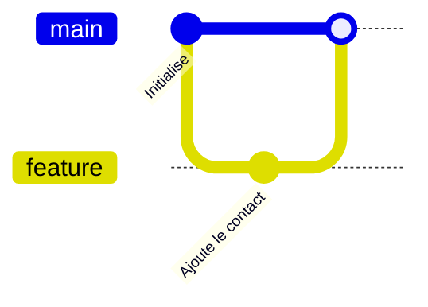

# Catalogue des formations : guide de l'auteur

Ce dossier contient **toutes les formations du portail**, écrites en Markdown. Il n'y a pas de code à écrire pour ajouter ou corriger une leçon : un fichier `.md`, éventuellement une image, et c'est tout. Au déploiement (et avec `pipenv run sync-catalog`), le portail compile ce dossier, valide chaque fichier et met la base de données à jour.

> **En bref** : une formation = un dossier. Une leçon = un fichier `NN-nom.md` avec un en-tête YAML, du texte, un **labo** (étapes vérifiées automatiquement dans un terminal simulé) et un **quiz**.

Sommaire : [arborescence](#1-arborescence) · [front matter](#2-front-matter) · [structure d'une leçon](#3-structure-pédagogique-dune-leçon) · [barème](#4-barème-durée-étapes-xp) · [syntaxe](#5-syntaxe) · [quiz](#6-le-quiz) · [labo](#7-le-labo) · [vérifications](#8-catalogue-des-vérifications-et-effets) · [rédaction](#9-règles-de-rédaction) · [relecture](#10-checklist-de-relecture) · [tester](#11-tester-ses-modifications) · [étendre](#12-ajouter-un-parcours-ou-un-moteur) · [limites](#13-limites-connues) · [parcours existants](#14-parcours-existants) · [environnements réels](#15-environnements-réels-dev-containers)

Un parcours complet à copier-coller se trouve dans [`_modele/`](_modele/) : il est entièrement commenté et il compile.

## 1. Arborescence

```text
catalogue/
├── README.md                 ← ce guide
├── catalogue.yml             ← index ordonné des parcours
├── _verifications.yml        ← vérifications et effets disponibles pour les labos
├── _modele/                  ← parcours modèle commenté (non publié, à copier)
└── git-basics/               ← un dossier par parcours : son nom est l'identifiant (slug) du parcours
    ├── parcours.md           ← présentation + front matter du parcours
    ├── 01-introduction.md    ← leçons : NN-nom.md, NN fixe l'ordre
    ├── 02-premier-commit.md
    ├── antiseche.md          ← (facultatif) tableau de référence des commandes
    ├── bac-a-sable.yml       ← (facultatif) scénarios de départ du bac à sable
    ├── examen.md             ← (facultatif mais recommandé) examen de validation : pool de questions (§16)
    ├── environnement/        ← (facultatif) environnement réel : devcontainer.json + Dockerfile (§15)
    └── images/               ← schémas et illustrations (SVG de préférence)
```

- **`catalogue.yml`** liste les parcours dans l'ordre d'affichage. Un dossier qui n'y figure pas n'est pas compilé.

  ```yaml
  parcours:
    - git-basics
    - docker-hello
  ```

- Les noms de dossiers et de fichiers sont en minuscules, sans accents ni espaces (`05-conflits.md`).
- Les fichiers dont le nom commence par `_` ne sont jamais des leçons.
- Les images du dossier `images/` sont servies sous `/static/catalogue/<parcours>/images/…`.

## 2. Front matter

Chaque fichier `parcours.md` et chaque leçon commence par un en-tête YAML entre deux lignes `---`.

> **Règle d'or : mets `titre` et `resume` entre guillemets.** En YAML, un texte contenant « : » (deux-points suivi d'un espace) ou commençant par `'`, `[`, `{`, `*`… est une erreur de syntaxe. Les guillemets doubles évitent ces pièges. Si le texte contient lui-même des guillemets doubles, échappe-les avec `\"`.

### Parcours (`parcours.md`)

| Champ | Obligatoire | Rôle |
| --- | :---: | --- |
| `titre` | oui | Nom du parcours. |
| `icone` | oui | Un emoji ; sert aussi de badge de fin de parcours. |
| `resume` | oui | Une phrase d'accroche. |
| `moteur` | non | `git` ou `docker` : moteur du terminal simulé. Absent = pas de labo. |
| `prerequis` | non | Liste de slugs de parcours à terminer avant (`[docker-hello]`). Tous doivent exister dans `catalogue.yml`. |
| `publie` | non | `true` par défaut. `false` = « bientôt disponible », **sans leçon**. Un parcours publié doit avoir au moins une leçon. |
| `couleur` | non | Couleur d'accent hexadécimale (`"#2496ED"`). |
| `banniere` | non | Chemin relatif d'une image 1200×400 (`images/banniere.svg`). |
| `environnement` | non | Dossier d'un [environnement réel](#15-environnements-réels-dev-containers) proposé dans toutes les leçons du parcours. |

Le corps du fichier est la **présentation du parcours** : public visé, objectifs, durée.

### Leçon (`NN-nom.md`)

| Champ | Obligatoire | Rôle |
| --- | :---: | --- |
| `id` | oui | Identifiant **stable** de la leçon (slug, unique dans le parcours). Il apparaît dans l'URL et sert à la **progression** et aux **badges** : ne le modifie jamais après publication. |
| `titre` | oui | Titre affiché. |
| `resume` | oui | Une phrase qui dit ce que l'on apprend. |
| `duree` | oui | Durée estimée en minutes, labo et quiz compris. |
| `objectifs` | non | Liste « À la fin, tu sauras… » (Markdown en ligne accepté). |
| `environnement` | non | Dossier d'un [environnement réel](#15-environnements-réels-dev-containers) pour cette leçon (remplace celui du parcours). |

```yaml
---
id: conflits
titre: "Résoudre un conflit"
resume: "Pas de panique : un conflit est juste Git qui te demande de trancher."
duree: 15
objectifs:
  - Reconnaître les marqueurs d'un conflit
  - Terminer une fusion avec `git add` et `git commit`
---
```

> **Renommer ou réordonner** : change le préfixe `NN-` du fichier, pas l'`id`. Les badges actuels s'appuient sur les identifiants `git-basics/premier-commit`, `git-basics/branches`, `git-basics/conflits`, `docker-hello/premier-conteneur`, `docker-advanced/dockerfile`, `docker-advanced/compose`, `python/fonctions-modules` et `python/mini-projet` (voir `formation/training/gamification.py`).

## 3. Structure pédagogique d'une leçon

Toutes les leçons suivent le même fil, pour que les apprenant·e·s s'y retrouvent :

1. **Accroche** (2-3 phrases) : un problème concret que la personne a déjà rencontré. Pas de titre.
2. **Concepts** (`## …`) : une seule idée par leçon, avec un schéma (figure ou Mermaid) dès qu'il y a de la structure à voir.
3. **Démonstration** : les commandes à essayer, dans des blocs ` ```shell run `, expliquées une par une.
4. **Piège ou bonne pratique** : un encart `:::warning` ou `:::tip` (un ou deux par leçon, pas plus).
5. **`## Entraîne-toi`** : le bloc `:::labo`, avec 3 à 6 étapes progressives.
6. **`## Vérifie tes acquis`** : 3 à 4 blocs `:::quiz`.

Les titres `## Entraîne-toi` et `## Vérifie tes acquis` sont une convention : garde-les à l'identique.

## 4. Barème : durée, étapes, XP

Les points sont calculés automatiquement (`formation/training/gamification.py`) à partir de ce que tu écris :

| Élément | XP |
| --- | ---: |
| Chaque étape de labo validée | 10 |
| Chaque bonne réponse de quiz (meilleur score) | 8 |
| Leçon terminée (labo complet **et** au moins 2/3 de bonnes réponses) | 50 |
| Parcours terminé (toutes les leçons) | 150 |

Repères pour une leçon de 15 minutes : **3 à 6 étapes** de labo, **3 à 4 questions**, soit environ 100 à 150 XP. Une leçon sans bloc `:::labo` est possible (leçon théorique) ; elle est alors terminée dès que le quiz est réussi.

## 5. Syntaxe

### Markdown standard

Titres `##` et `###` (le `#` est réservé au titre de la leçon, généré automatiquement), **gras**, *italique*, `code`, liens, listes à puces et numérotées, tableaux, citations. Une liste numérotée sert aux **étapes d'une procédure**.

### Encarts

```markdown
:::info
Une information utile.
:::

:::tip Un titre personnalisé
Une astuce. Le contenu est du Markdown.
:::
```

| Type | Titre par défaut | Quand l'utiliser |
| --- | --- | --- |
| `:::info` | À savoir | Un complément, un lien avec un autre outil de l'équipe. |
| `:::tip` | Astuce | Un raccourci, un réflexe de pro. |
| `:::warning` | Attention | Un piège fréquent, une confusion classique. |
| `:::danger` | Danger | Une action destructrice ou irréversible. |

Les directives ne s'imbriquent pas : pas de `:::info` dans un `:::tip`. En revanche, un bloc de code dans un encart est possible.

### Cartes

Des cartes pour comparer deux ou trois notions côte à côte. Chaque carte commence par un sous-titre `###`.

```markdown
:::cartes
### Image

Un modèle en lecture seule.

### Conteneur

Une instance en cours d'exécution.
:::
```

### Blocs de code

| Écriture | Résultat |
| --- | --- |
| ` ```shell run ` | Chaque ligne a un bouton **▶ Lancer** qui l'envoie au terminal du labo. Les lignes commençant par `#` sont des commentaires. |
| ` ```dockerfile file=Dockerfile ` | Affiche le fichier avec coloration et un bouton **Créer ce fichier dans le labo**. Le nom après `file=` est celui du fichier créé. |
| ` ```mermaid ` | Un schéma (voir ci-dessous). |
| ` ```console ` | Une sortie de commande, non exécutable. |
| ` ```python `, ` ```yaml `, ` ```text `… | Du code coloré, non exécutable. N'importe quel langage [Pygments](https://pygments.org/languages/) convient. |

Un bloc `shell run` ne doit contenir **que des commandes valides pour le moteur du parcours** (`git …` pour Git ; `docker …`, `curl …` pour Docker) et les petites commandes shell du simulateur (`echo`, `cat`, `ls`, `rm`, `touch`, `nano`).

### Images et figures

```markdown

```

- Le texte entre crochets est à la fois la **légende** et le **texte alternatif** : décris ce que montre le schéma (accessibilité).
- Le chemin est relatif au dossier du parcours.
- Nommage : `images/<sujet-en-minuscules>.svg`, une image par idée (`trois-zones.svg`, `image-conteneur.svg`). La bannière du parcours s'appelle `banniere.svg`.

**Style des schémas SVG** (pour une identité commune, claire en thème sombre comme en thème clair) :

- Panneau de fond sombre `#0b1220` avec bordure `#1e293b` et coins arrondis : le schéma est lisible quel que soit le thème de la page.
- Texte `#e2e8f0` (secondaire `#94a3b8`), police `Inter, system-ui, sans-serif`, taille ≥ 14 px à l'échelle d'affichage.
- Accent `#6366F1` pour ce qu'il faut regarder en premier (flèches, élément central) ; autres couleurs : `#1e293b` / `#334155` pour les cases, une couleur d'accent du parcours au plus.
- Pas de texte écrit dans une image bitmap : tout texte doit être du texte SVG.
- Accessibilité : `role="img"`, `<title>` et `<desc>` (une phrase qui décrit le schéma), `aria-labelledby`.
- Prévoir un `viewBox` (pas de largeur fixe) pour que l'image s'adapte à l'écran. Largeur de référence : 640 à 760.
- Pas de dégradés complexes ni de filtres : il doit rester lisible une fois réduit sur mobile.

Voir [`_modele/images/exemple.svg`](_modele/images/exemple.svg).

### Schémas Mermaid

Pour un schéma qui évolue souvent ou qui se décrit bien en texte (historique Git, diagramme de séquence, états d'un conteneur) :

````markdown

````

Mermaid propose `gitGraph`, `flowchart`, `sequenceDiagram`, `stateDiagram-v2`… ([documentation](https://mermaid.js.org/)). Un schéma Mermaid ne doit pas dépasser une dizaine de nœuds. Pour tout le reste (illustration, comparaison, architecture soignée), préfère un SVG.

## 6. Le quiz

Un bloc `:::quiz` = **une question**. Écris-en 3 ou 4 par leçon.

```markdown
:::quiz
Quand y a-t-il un conflit ?

- [ ] À chaque merge
- [x] Quand deux branches modifient la même zone d'un fichier
- [ ] Quand on oublie `git add`

> Si les modifications touchent des endroits différents, Git fusionne seul.
:::
```

Format exact :

1. La **question** d'abord (Markdown en ligne : `code`, **gras** autorisés).
2. Au moins **2 réponses** en liste `- [ ]` / `- [x]`. **Exactement une** est cochée `[x]`.
3. L'**explication** en citation (`>`), affichée après la réponse : elle explique pourquoi, même quand la personne a juste.
4. Place la bonne réponse à des positions variées d'une question à l'autre.

Les fausses réponses doivent être **plausibles** (confusions réelles), jamais absurdes.

## 7. Le labo

Le bloc `:::labo` décrit le terminal simulé de la leçon : l'état de départ, les étapes à réaliser et comment les vérifier automatiquement. **Un seul par leçon.** Son contenu est du **YAML** (les commentaires `#` sont permis).

### Champs

| Champ | Obligatoire | Rôle |
| --- | :---: | --- |
| `intro` | non | Texte d'introduction (Markdown) : la situation de départ. |
| `moteur` | non | `git` ou `docker` ; par défaut celui du parcours. `reel` : étapes vérifiées par le serveur dans un [environnement réel](#15-environnements-réels-dev-containers). |
| `environnement` | non | Dossier de l'environnement réel du labo (sinon celui de la leçon ou du parcours). |
| `fichiers` | non | État initial : `nom: contenu` (écris le contenu avec `\|`). |
| `commandes` | non | Commandes jouées en silence au démarrage, dans l'ordre (après les `fichiers`). |
| `serveur` | non | (git) Dépôts distants simulés : liste de `{url, commits: [{branche, message, fichiers, auteur}]}`. |
| `etapes` | oui | Liste d'étapes (voir ci-dessous), au moins une. |

### Une étape

| Champ | Obligatoire | Rôle |
| --- | :---: | --- |
| `texte` | oui | La consigne (Markdown en ligne). Cite les noms exacts utilisés dans le labo. |
| `indice` | non | Un coup de pouce, affiché à la demande. Souvent la commande attendue. |
| `verif` | oui | Une liste de [vérifications](#8-catalogue-des-vérifications-et-effets) : l'étape est validée quand **toutes** sont vraies. |
| `solution` | oui | Liste d'actions qui réalisent l'étape : une commande (texte) ou `{ecrire: {fichier: contenu}}`. Elle est **rejouée par la CI** pour prouver que le labo se termine, et affichée par « Voir la solution ». |
| `apres` | non | Numéros (à partir de 1) d'**étapes précédentes** à valider avant celle-ci. |
| `effet` | non | Un [effet](#effets) déclenché quand l'étape est validée. |

Principes :

- Une étape validée **le reste** : si l'apprenant·e annule ensuite son action (`git restore`, `docker rm`…), l'étape n'est pas dévalidée.
- Les vérifications sont évaluées après **chaque commande** et chaque enregistrement de fichier ; l'ordre de réalisation est libre, sauf si tu utilises `apres`.
- Utilise `apres` quand une vérification ne prend son sens qu'après une étape précédente (par exemple « lire les logs de `db` » après « démarrer `db` »).
- Écris les **expressions régulières** (`commande: '^git diff'`) entre guillemets simples ; elles suivent la syntaxe JavaScript. Échappe le point : `hello\.txt`.
- La `solution` doit couvrir **toute** l'étape, y compris les commandes intermédiaires.

### Exemple Git complet

```markdown
:::labo
intro: |
  Deux personnes ont modifié le titre de `index.html` : l'une dans `main`, l'autre dans `titre-demo`. Fusionne et tranche !
commandes:
  - git init
  - 'echo "<h1>Bienvenue</h1>" > index.html'
  - 'git add . && git commit -m "Initialise la page"'
  - git switch -c titre-demo
  - 'echo "<h1>Bienvenue chez Mentor</h1>" > index.html'
  - 'git commit -am "Titre version Mentor"'
  - git switch main
  - 'echo "<h1>Bienvenue sur le campus</h1>" > index.html'
  - 'git commit -am "Titre version Campus"'
etapes:
  - texte: 'Lance `git merge titre-demo` et constate le conflit'
    indice: git merge titre-demo
    verif:
      - conflit-en-cours: true
    solution:
      - git merge titre-demo
  - texte: 'Édite `index.html` : garde un seul titre, supprime tous les marqueurs'
    apres: [1]
    verif:
      - fichier-sans-marqueurs: index.html
    solution:
      - ecrire:
          index.html: |
            <h1>Bienvenue chez Mentor sur le campus</h1>
  - texte: 'Marque le conflit comme résolu avec `git add index.html`'
    apres: [2]
    verif:
      - aucun-conflit: true
      - fusion-en-cours: true
    solution:
      - git add index.html
  - texte: 'Termine la fusion avec `git commit -m "…"`'
    verif:
      - commit-de-fusion: true
    solution:
      - 'git commit -m "Fusionne titre-demo"'
:::
```

### Exemple Docker complet

```markdown
:::labo
intro: |
  Démarre nginx en arrière-plan, puis visite-le.
etapes:
  - texte: 'Démarre nginx détaché, nommé `web`, port `8080` → `80`'
    indice: docker run -d --name web -p 8080:80 nginx
    verif:
      - conteneur-actif: web
      - conteneur-port: [web, '8080:80']
    solution:
      - docker run -d --name web -p 8080:80 nginx
  - texte: 'Visite-le avec `curl localhost:8080`'
    apres: [1]
    verif:
      - commande: '^curl .*8080'
    solution:
      - curl localhost:8080
:::
```

### Écrire les arguments d'une vérification

```yaml
verif:
  - indexe: README.md                       # un argument
  - fusionne: [feature-contact, main]       # plusieurs arguments : une liste
  - fichier-dans-branche: [fix-typo, README.md, 'Bienvenue']   # le dernier argument est facultatif
  - depot-initialise: true                  # aucun argument : « true »
  - commande: '^git status'                 # regex entre guillemets simples
```

### Le terminal simulé

Le terminal reproduit les commandes les plus courantes de Git et Docker avec des sorties en français ou proches de la réalité, mais ce **n'est pas** Git ni Docker. Avant d'imposer une commande dans une consigne, vérifie qu'elle fonctionne dans le bac à sable du portail.

Un mini-shell est disponible : `ls`, `cat`, `echo "texte" > fichier` (`>>` pour ajouter), `touch`, `rm`, `mv`, `pwd`, `nano fichier` (ouvre l'éditeur intégré), `curl localhost:PORT` (Docker). Les fichiers sont à plat (pas d'arborescence de dossiers). `&&` enchaîne les commandes.

### Bac à sable (`bac-a-sable.yml`)

Scénarios de départ proposés dans le bac à sable du moteur du parcours :

```yaml
scenarios:
  projet:
    titre: Projet avec quelques commits   # nom affiché
    fichiers:                             # comme dans un labo
      README.md: |
        # Mon projet
    commandes:
      - git init
      - git add . && git commit -m "Initialise le projet"
    serveur: []                           # facultatif (git)
    indice: "Essaie : git log --oneline"  # facultatif
```

## 8. Catalogue des vérifications et effets

Source de vérité : [`_verifications.yml`](_verifications.yml) (le validateur Python et le moteur JavaScript s'y réfèrent). Une vérification inconnue ou mal paramétrée fait échouer la compilation avec un message qui indique le fichier et l'étape.

### Communes aux deux moteurs

| Nom | Arguments | Moteur | Rôle |
| --- | --- | --- | --- |
| `commande` | regex | tous | Une commande tapée correspond à l'expression régulière (testée sur chaque commande, début de ligne = `^`). |
| `commande-compte` | regex, minimum | tous | Au moins `minimum` commandes tapées correspondent à l'expression régulière. |
| `fichier-existe` | fichier | tous | Le fichier existe dans le dossier de travail. |
| `fichier-absent` | fichier | tous | Le fichier n'existe pas dans le dossier de travail. |
| `fichier-contient` | fichier, regex | tous | Le contenu du fichier correspond à l'expression régulière (mode multiligne). |
| `fichier-ne-contient-pas` | fichier, regex | tous | Le contenu du fichier ne correspond pas à l'expression régulière. |
| `fichier-modifie` | fichier | tous | Le contenu du fichier diffère de celui du début du labo. |

### Git

| Nom | Arguments | Moteur | Rôle |
| --- | --- | --- | --- |
| `depot-initialise` | — | git | `git init` a été exécuté. |
| `indexe` | fichier | git | Le fichier est dans l'index (staging). |
| `commits-au-moins` | nombre | git | L'historique de la branche courante contient au moins ce nombre de commits. |
| `commits-exactement` | nombre | git | L'historique de la branche courante contient exactement ce nombre de commits. |
| `fichier-dans-head` | fichier | git | Le fichier est dans le dernier commit. |
| `fichier-propre` | fichier | git | Le fichier du dossier de travail est identique à celui du dernier commit. |
| `sur-branche` | branche | git | La branche courante est celle-ci. |
| `branche-existe` | branche | git | La branche existe. |
| `branche-absente` | branche | git | La branche n'existe pas (ou plus). |
| `branche-en-avance` | branche, base | git | La branche a des commits que la base n'a pas. |
| `branche-egale` | branche, autre | git | Les deux branches pointent sur le même commit. |
| `fichier-dans-branche` | branche, fichier, [regex] | git | Le dernier commit de la branche contient le fichier (dont le contenu correspond à `regex` si précisé). |
| `fusionne` | source, cible | git | Tous les commits de `source` sont dans `cible`. |
| `conflit-en-cours` | — | git | Une fusion est en conflit (fichiers non fusionnés). |
| `aucun-conflit` | — | git | Plus aucun fichier en conflit. |
| `fusion-en-cours` | — | git | Une fusion est commencée mais pas encore validée. |
| `fichier-sans-marqueurs` | fichier | git | Le fichier ne contient plus de marqueurs de conflit (`<<<<<<<`, `=======`, `>>>>>>>`). |
| `commit-de-fusion` | — | git | Le dernier commit est un commit de fusion terminé (deux parents). |
| `remote-defini` | nom | git | Le dépôt distant est déclaré (`git remote add`). |
| `amont-defini` | branche, amont | git | La branche suit cette branche distante (ex. `origin/main`). |
| `serveur-a-la-pointe` | branche | git | La branche du serveur distant est au même commit que la branche locale. |
| `en-retard-sur-origin` | branche | git | Le serveur est connu (fetch) et a des commits que la branche locale n'a pas. |
| `dernier-auteur` | branche, auteur | git | Le dernier commit de la branche a été écrit par cette personne. |

### Docker

| Nom | Arguments | Moteur | Rôle |
| --- | --- | --- | --- |
| `session-fermee` | — | docker | L'apprenant n'est plus dans une session interactive de conteneur (il a tapé `exit`). |
| `image-presente` | image | docker | L'image (`nom` ou `nom:tag`) existe en local. |
| `conteneur-existe` | nom | docker | Le conteneur existe (quel que soit son état). |
| `conteneur-actif` | nom | docker | Le conteneur est en cours d'exécution. |
| `conteneur-arrete` | nom | docker | Le conteneur est arrêté. |
| `conteneur-absent` | nom | docker | Le conteneur n'existe pas (ou plus). |
| `conteneur-image` | image | docker | Au moins un conteneur a été créé à partir de cette image. |
| `aucun-conteneur-image` | image | docker | Aucun conteneur ne vient de cette image. |
| `conteneur-sorti-code` | nom, code | docker | Le conteneur s'est arrêté avec ce code de sortie. |
| `conteneur-port` | nom, ports | docker | Le conteneur publie ces ports (`hote:conteneur`, ex. `8080:80`). |
| `conteneur-reseau` | nom, reseau | docker | Le conteneur est rattaché à ce réseau. |
| `conteneur-bind` | nom | docker | Le conteneur monte un dossier de ta machine (bind mount). |
| `volume-existe` | nom | docker | Le volume existe. |
| `volume-absent` | nom | docker | Le volume n'existe pas (ou plus). |
| `volume-contient` | volume, fichier | docker | Le volume contient ce fichier. |
| `reseau-existe` | nom | docker | Le réseau existe. |
| `compose-conteneurs` | nombre | docker | Au moins ce nombre de conteneurs Compose existent (quel que soit leur état). |
| `compose-actifs` | nombre | docker | Au moins ce nombre de conteneurs Compose sont en cours d'exécution. |
| `compose-vide` | — | docker | Plus aucun conteneur Compose n'existe. |
| `compose-variable` | service, variable | docker | Le service du `compose.yml` définit cette variable d'environnement. |
| `registry-connecte` | registry | docker | Un `docker login` a été fait vers ce registry. |
| `image-poussee` | image | docker | L'image a été publiée avec `docker push`. |

### Environnement réel (moteur `reel`)

Évaluées **par le serveur**, dans le conteneur de l'apprenant·e (jamais par le navigateur). Les commandes sont lancées en non-root, avec un délai maximal, dans le dossier de travail ; les expressions régulières suivent la syntaxe **Python**.

| Nom | Arguments | Moteur | Rôle |
| --- | --- | --- | --- |
| `commande-reussit` | commande | reel | La commande (lancée par `sh -c` dans l'environnement) se termine avec le code 0. |
| `commande-echoue` | commande | reel | La commande se termine avec un code différent de 0. |
| `sortie-contient` | commande, regex | reel | La sortie standard de la commande (64 Kio au plus) correspond à l'expression régulière. |
| `fichier-existe-dans-env` | chemin | reel | Le fichier ou dossier existe (chemin relatif au dossier de travail). |
| `fichier-absent-dans-env` | chemin | reel | Le fichier ou dossier n'existe pas (ou plus). |
| `fichier-contient-dans-env` | chemin, regex | reel | Le contenu du fichier (64 premiers Kio) correspond à l'expression régulière. |

### Effets

Un **effet** (`effet:` sur une étape) modifie le monde simulé quand l'étape est validée. Il sert à mettre en scène un évènement extérieur (une coéquipière pousse du code).

| Nom | Arguments | Moteur | Rôle |
| --- | --- | --- | --- |
| `serveur-commit` | — | git | Un·e coéquipier·ère pousse un commit sur le serveur distant simulé. Arguments (dictionnaire) : `branche`, `message`, `fichiers` (dictionnaire fichier → contenu), `auteur` (facultatif). |
| `serveur-avance` | — | git | Simule l'acceptation d'une merge request : la branche `branche` du serveur avance (fast-forward) jusqu'au commit de la branche `vers`. |

Exemple :

```yaml
effet:
  serveur-commit:
    branche: main
    message: Ajoute la page de contact
    fichiers:
      contact.html: |
        <h1>Contact</h1>
    auteur: Camille
```

## 9. Règles de rédaction

- **Tutoiement** et ton accueillant, comme sur le site de l'équipe : « n'hésite pas », « tu es le·la bienvenu·e ». Pas de jargon sans définition.
- **Écriture inclusive** par le point médian quand c'est nécessaire (« développeur·se·s », « apprenant·e »), sans en abuser ; privilégie les tournures neutres (« la personne », « celles et ceux »).
- **Accents et typographie française obligatoires** : « À », « é », « ç », espaces avant `:`, `;`, `?`, `!`, guillemets « ». Jamais d'ASCII à la place (« ou » ≠ « où »).
- **Une idée par leçon.** Si tu as besoin de « et aussi », c'est une autre leçon.
- **Du concret de l'équipe** : prends tes exemples dans les projets réels (Vitrine, Adhésion, registry GitLab, Keycloak) plutôt que « foo/bar ».
- **Cohérence texte ↔ labo** : les noms de branches, conteneurs, fichiers et ports cités dans le cours sont **exactement** ceux du labo et des vérifications (`feature-contact`, `web`, `8080:80`). Un nom qui change d'une section à l'autre perd les débutant·e·s.
- **Une commande = une explication.** Ne montre pas une commande sans dire ce qu'elle fait ni ce qu'on doit observer.
- **Avertis avant de détruire** (`:::warning` / `:::danger`) quand une commande est irréversible.
- **Pas de sécurité dégradée en exemple** : jamais de vrais mots de passe, jamais de `--force` présenté comme normal.
- **Phrases courtes**, paragraphes de 4 lignes maximum, listes plutôt que pavés.
- **Pas de HTML brut** sauf nécessité ; il est repris tel quel (les contenus sont de confiance, relus en merge request).

## 10. Checklist de relecture

À cocher avant d'ouvrir une merge request (elle complète la *definition of done* du [guide de contribution](../CONTRIBUTING.md)) :

- [ ] Le front matter est complet, `titre` et `resume` sont entre guillemets, l'`id` est unique et stable.
- [ ] La leçon suit le fil : accroche → concepts → démonstration → piège → `## Entraîne-toi` → `## Vérifie tes acquis`.
- [ ] Une seule idée, durée réaliste (`duree`), 3 à 6 étapes de labo, 3 à 4 questions.
- [ ] Chaque schéma a un texte alternatif utile et respecte le style SVG (ou est un Mermaid de moins de 10 nœuds).
- [ ] Toutes les commandes des blocs `shell run` fonctionnent dans le bac à sable.
- [ ] Chaque étape a une `verif` et une `solution` ; les étapes dépendantes utilisent `apres`.
- [ ] Les noms du cours (branches, conteneurs, fichiers, ports) correspondent à ceux du labo.
- [ ] Chaque quiz a une seule bonne réponse, des distracteurs plausibles et une explication.
- [ ] Orthographe, accents, typographie, tutoiement et inclusivité relus.
- [ ] `pipenv run sync-catalog` passe sans erreur et `pipenv run build-catalogue && npm test` rejoue toutes les solutions.
- [ ] `pipenv run lint-catalogue` ne signale ni erreur ni avertissement (la CI le lance : [Le lint des formations](../doc/createurs/relecture-et-merge-request.md#le-lint-des-formations-ci) ; exceptions justifiées dans `catalogue/.lint.yml`).
- [ ] La leçon a été parcourue de bout en bout dans le portail (lecture, labo avec « Voir la solution », quiz).
- [ ] Environnement réel (s'il y en a un) : `devcontainer.json` accepté, `USER` final non-root, pas de `sudo`, étapes `moteur: reel` validées en rejouant leurs solutions dans l'environnement (§15).
- [ ] [`CHANGELOG.md`](../CHANGELOG.md) mis à jour (rubrique *Added* ou *Changed*).

## 11. Tester ses modifications

```shell
# Compile le catalogue, le valide et met la base à jour (message d'erreur localisé : fichier + ligne/étape)
pipenv run sync-catalog

# Compile le catalogue en JSON, puis rejoue la `solution` de CHAQUE étape de CHAQUE labo
pipenv run build-catalogue && npm test

# Voir le résultat dans le portail
docker compose up --build        # ou : python3 manage.py runserver
```

Erreurs fréquentes :

| Message | Cause |
| --- | --- |
| `front matter YAML invalide : mapping values are not allowed here` | Un `:` dans un `titre`/`resume` non entouré de guillemets. |
| `vérification inconnue` | Faute de frappe dans le nom ; la liste des noms valides est donnée dans le message. |
| `exactement une réponse doit être cochée` | Aucune ou plusieurs `[x]` dans un `:::quiz`. |
| `le bloc :::labo n'est jamais refermé` | Il manque le `:::` de fermeture. |
| `directive :::xxx inconnue` | Faute dans le nom d'une directive (`info`, `tip`, `warning`, `danger`, `cartes`, `labo`, `quiz`). |
| Échec du test Jest sur une leçon (étape non validée par sa solution) | La `solution` ne suffit pas à satisfaire la `verif` : complète-la ou corrige la `verif`. |

## 12. Ajouter un parcours ou un moteur

### Un parcours

1. Copie `_modele/` vers `catalogue/<slug>/` (le slug = nom du dossier : minuscules et tirets).
2. Renseigne `parcours.md` (moteur, prérequis, couleur, bannière), ajoute `images/banniere.svg`.
3. Écris les leçons `01-…`, `02-…`, l'`antiseche.md` et, si utile, le `bac-a-sable.yml`.
4. Ajoute le slug dans [`catalogue.yml`](catalogue.yml), à la position voulue.
5. Si le parcours doit offrir un badge de leçon particulier, ajoute-le dans `formation/training/gamification.py` (les badges « parcours terminé » sont automatiques).
6. Teste (section précédente), mets à jour le `CHANGELOG.md` et le tableau ci-dessous, ouvre la merge request.

Pour **annoncer** un parcours sans le publier : `publie: false` et aucune leçon ; il s'affiche « bientôt » dans le catalogue.

### Un moteur (autre outil à simuler)

Un moteur est un terminal simulé. Pour en ajouter un (par exemple Python ou `psql`) :

1. Écris la classe du moteur dans `static/js/` (elle étend `Sandbox` de `engine.js` : `main(cmd, args)`, `prompt()`, état exposé pour les vérifications), comme `docker-engine.js`.
2. Déclare ses vérifications et effets dans [`_verifications.yml`](_verifications.yml) avec `moteurs: [<moteur>]`, puis implémente-les dans `static/js/checks.js`.
3. Enregistre le moteur dans `ENGINES` (`formation/training/content.py`) et dans le chargeur de `lab-core.js`, puis ajoute son panneau d'état à l'interface du labo.
4. Écris des tests Jest du moteur et utilise `moteur: <nom>` dans un `parcours.md`.

## 13. Limites connues

- **Pas d'imbrication de directives** (`:::` dans `:::`) et **un seul `:::labo`** par leçon.
- Les `verif` d'une étape sont toutes combinées par un **ET** : il n'y a pas de OU. Découpe en deux étapes ou reformule la consigne.
- Une expression régulière est évaluée par JavaScript, pas par Python : n'utilise pas de syntaxe propre à Python (`(?P<nom>…)`).
- Les moteurs ne couvrent qu'un **sous-ensemble** de Git et de Docker (voir `git help` / `docker help` dans le terminal). Pas de dossiers, de `git rebase`, de `docker swarm`…
- Les schémas Mermaid sont chargés depuis un CDN : sans accès Internet, le code source du schéma est affiché à la place.
- Les images distantes (`https://…`) sont acceptées mais déconseillées : préfère des fichiers du dépôt.
- Les identifiants de leçon figurent dans `gamification.py` (badges) : un renommage demande d'y répercuter le changement et fait perdre la progression des personnes déjà inscrites.
- Le HTML brut est conservé tel quel : n'inclus jamais de contenu qui n'a pas été relu.

## 14. Parcours existants

| Parcours | Dossier | Moteur | Leçons | Prérequis | État |
| --- | --- | --- | :---: | --- | --- |
| Git basics | [`git-basics/`](git-basics/) | reel | 7 | — | Disponible, environnement réel (le bac à sable Git reste simulé) |
| Docker hello world | [`docker-hello/`](docker-hello/) | docker | 4 | — | Disponible |
| Docker advanced | [`docker-advanced/`](docker-advanced/) | docker | 5 | Docker hello world | Disponible |
| Python | [`python/`](python/) | reel | 6 | — | Disponible, environnement réel |
| Django | [`django/`](django/) | — | 0 | Python | Bientôt (plan prévisionnel) |
| OIDC avec Keycloak | [`oidc-keycloak/`](oidc-keycloak/) | — | 0 | Django | Bientôt (plan prévisionnel) |

## 15. Environnements réels (dev containers)

Pour certaines leçons, un terminal simulé ne suffit pas : on veut un **vrai** Linux, de vrais outils, son propre VS Code. Le portail sait prêter à chaque apprenant·e un **conteneur jetable**, défini par un *dev container* versionné dans le parcours. Conception, sécurité et exploitation : [doc/environnements.md](../doc/environnements.md).

> La fonctionnalité est **désactivée par défaut** (`ENVIRONMENTS_ENABLED=False`). Désactivée, une leçon qui propose un environnement « en plus » s'affiche comme avant ; une leçon dont le labo est `moteur: reel` affiche un avertissement à la place du labo.

### Deux usages

- **En plus du simulé** : la leçon garde son `:::labo` simulé et déclare `environnement:` dans son front matter (ou celui du parcours). Un onglet « Environnement réel » apparaît à côté du labo simulé.
- **À la place du simulé** : le `:::labo` déclare `moteur: reel`. Ses étapes sont vérifiées **par le serveur** dans le conteneur, avec les vérifications du tableau « Environnement réel » (§8). Le navigateur ne peut pas valider ces étapes lui-même.

### Le dossier de l'environnement

```text
catalogue/mon-parcours/
└── environnement/           ← le nom du dossier est la valeur de `environnement:` (minuscules, chiffres, tirets)
    ├── devcontainer.json    ← spécification Dev Containers (JSON avec commentaires), sous-ensemble sûr
    ├── Dockerfile
    └── …                    ← fichiers copiés par le Dockerfile (pas de lien symbolique, 5 Mio au plus)
```

Exemples complets et commentés : [`_modele/environnement/`](_modele/environnement/) (Debian + Git + SSH pour VS Code) et [`_modele/environnement-docker/`](_modele/environnement-docker/) (Docker dans Docker, qui exige le runtime Sysbox sur le serveur). Leçon d'exemple : [`_modele/02-environnement-reel.md`](_modele/02-environnement-reel.md).

```jsonc
{
    "name": "Debian avec Git",
    "build": { "dockerfile": "Dockerfile" },
    "containerUser": "apprenant",            // obligatoire, jamais root
    "workspaceFolder": "/workspace",
    "containerEnv": { "EDITOR": "nano" },
    "forwardPorts": [8000],                  // redirigés vers le poste via VS Code (1024 à 65535)
    "postCreateCommand": "git config --global init.defaultBranch main",
    "hostRequirements": { "cpus": 1, "memory": "512mb" },
    "customizations": { "vscode": { "extensions": ["eamodio.gitlens"] } }
}
```

Champs acceptés : `name`, `image` **ou** `build` (`dockerfile`, `context`, `args`, `target`), `containerUser`/`remoteUser`, `containerEnv`/`remoteEnv`, `forwardPorts`, `portsAttributes` (`label`), `postCreateCommand`, `postStartCommand`, `workspaceFolder`, `hostRequirements` (`cpus`, `memory`, `storage`, plafonnés par le serveur), `customizations.vscode` (`extensions`, `settings`), `customizations.mentor.dockerInDocker` et `customizations.mentor.vscodeWeb` (`false` pour ne pas proposer VS Code dans le navigateur). **Tout autre champ fait échouer la compilation**, avec le fichier et le champ dans le message ; les champs dangereux (`privileged`, `capAdd`, `securityOpt`, `mounts`, `runArgs`, `appPort`, `initializeCommand`, `features`…) sont refusés « pour des raisons de sécurité ».

### Règles du Dockerfile

- Image de base de la **liste blanche** du serveur (Debian, Ubuntu, Python, Node, Alpine…), **avec un tag** (`debian:trixie-slim`).
- La **dernière** instruction `USER` de l'étape finale est l'utilisateur non-root déclaré (uid **1000**). Jamais `USER root` en dernier.
- Interdits : `sudo`, `doas`, `setcap`, `chmod u+s`/`4755`, `ADD https://…`, `VOLUME`, `ONBUILD`, `# syntax=`, `RUN --network=host`, `RUN --security=insecure`, les secrets de build.
- Le dossier personnel et le dossier de travail sont **vides au démarrage** (mémoire, effacés à l'arrêt) : ce qui doit s'y trouver va dans `/etc/skel` ou est créé par `postCreateCommand`.
- Pour VS Code, installe `openssh-server` (il est lancé à la demande, sans root ni port ouvert).

Le serveur ajoute ensuite sa propre couche de durcissement (retrait de tous les bits setuid/setgid, suppression de `su`, échec si `sudo` est présent) et lance le conteneur sans privilège, sans capacité, sans réseau par défaut, avec un système de fichiers en lecture seule.

**VS Code dans le navigateur** : si le portail l'active (`ENVIRONMENTS_VSCODE_WEB`), il ajoute aussi, avant le durcissement, une couche VS Code (code-server) et l'extension « Mentor », qui affiche la leçon et les étapes du labo dans VS Code. L'image doit contenir `python3` et reposer sur une distribution glibc (Debian, Ubuntu, `python:…-slim`) ; sinon, écris `"customizations": { "mentor": { "vscodeWeb": false } }`. Les étiquettes d'image `mentor.environment.*` et `app.mentor*` sont réservées au portail. Détails : [doc/environnements.md §12](../doc/environnements.md#12-vs-code-web).

### Un labo réel

```markdown
:::labo
moteur: reel
fichiers:                       # créés dans le dossier de travail au démarrage
  notes.txt: |
    Mes notes.
commandes:                      # lancées au démarrage (non-root, dans le conteneur)
  - git init depot
etapes:
  - texte: 'Crée `README.md` dans `depot`'
    verif:
      - fichier-contient-dans-env: [depot/README.md, '^# ']
    solution:
      - "echo '# Projet' > depot/README.md"
:::
```

Différences avec un labo simulé : pas de `serveur` ni d'`effet` ; seules les vérifications « Environnement réel » sont permises ; la `solution` est affichée et peut être envoyée au terminal, mais elle n'est **pas** rejouée par Jest (le test d'intégration `ENVIRONMENTS_IT=1 pytest -m docker` rejoue celles du modèle dans un vrai conteneur).

### Tester

```shell
pipenv run sync-catalog                  # valide aussi devcontainer.json et Dockerfile
python3 manage.py build_environments     # construit et durcit les images (démon Docker dédié configuré)
```

## 16. Examen de validation (`examen.md`)

Chaque parcours publié peut proposer un **examen de validation** : un pool de questions dont le serveur en tire quelques-unes au hasard. Réussir l'examen **valide tout le parcours sans passer par les labos ni les quiz de leçon**. C'est un raccourci pour les personnes qui maîtrisent déjà le sujet ; les leçons restent la voie normale. Le fichier est facultatif, mais **tout parcours publié devrait en avoir un**.

### Format

`catalogue/<parcours>/examen.md` : un front matter, une introduction (les règles) et le pool de questions, écrites avec **le même bloc `:::quiz`** que les leçons (§6).

```markdown
---
titre: "Examen de validation — Git basics"
tirage: 12        # nombre de questions tirées au sort à chaque tentative
seuil: 80         # pourcentage de bonnes réponses pour réussir (1 à 100)
duree: 20         # durée en minutes (1 à 240), chronométrée par le serveur
melange: true     # facultatif, true par défaut : mélange les questions ET les réponses
---

Règles de l'examen, en Markdown (public visé, ce qu'on attend de toi…).

:::quiz
Que fait `git restore --staged fichier` ?

- [ ] Il supprime le fichier du disque
- [x] Il retire le fichier de l'index sans toucher à son contenu
- [ ] Il annule le dernier commit

> `--staged` agit sur l'index, pas sur le dossier de travail.
:::

(… une dizaine, voire plusieurs dizaines d'autres blocs `:::quiz` …)
```

Le compilateur vérifie : les 4 champs du front matter (entiers dans les bornes), un pool **au moins égal à `tirage`** (erreur sinon), des questions **toutes différentes**, une seule bonne réponse par question, **aucun `:::labo`**. Il émet un avertissement si le pool fait moins de **2 fois** `tirage` (idéal : **3 fois**). Les erreurs indiquent le fichier et la ligne.

Chaque question reçoit un **identifiant stable** (empreinte de son énoncé) : tu peux ajouter, retirer ou réordonner des questions sans casser les tentatives en cours. Modifier l'énoncé d'une question en crée une nouvelle. Un identifiant de leçon `examen` est **réservé** (URL `/parcours/<parcours>/examen/`).

### Bien rédiger un pool

- **Couvre toutes les leçons** du parcours, en proportion de leur importance : quelqu'un qui réussit doit réellement connaître le parcours.
- **Mélange les difficultés** : questions de compréhension, de mise en situation (« tu vois ce message d'erreur, que fais-tu ? »), de lecture de sortie de commande.
- **Ne recopie pas les quiz de leçon** : reformule ou prends d'autres angles, sinon on valide en mémorisant des réponses.
- Des **distracteurs plausibles** (confusions réelles, erreurs fréquentes), jamais absurdes. Place la bonne réponse à des positions variées.
- Une **explication précise** par question : elle est montrée dans la correction détaillée, que l'on ait juste ou non.
- Vise **3 fois plus de questions que le tirage** : plus le pool est large, moins une tentative ressemble à la précédente.
- Une question = une idée testée, **sans piège de formulation**.

### Barème et règles du jeu

- **Seuil** : 80 % est un bon point de départ (12 questions → 10 bonnes réponses). En dessous de 70 %, l'examen valide trop facilement ; au-dessus de 90 %, une seule faute d'inattention suffit à échouer.
- **Durée** : compte environ **1 à 1,5 minute par question**.
- Une **réponse absente** compte comme fausse. Tant qu'il n'a pas soumis, le candidat peut **revoir et modifier** ses réponses.
- Après un **échec ou une expiration**, un délai de réessai s'applique (`EXAM_COOLDOWN_MINUTES`, 10 min par défaut) ; le pool est retiré au sort, les questions changent.
- **Récompenses** : le parcours est validé (leçons terminées, déblocage des parcours qui en dépendent, badge de parcours), l'examen donne **`XP_EXAM`** (100 XP, une seule fois, et seulement si le parcours n'était pas déjà terminé normalement), les **badges de leçon** du parcours (Premier commit, Dockerfile master…) et le badge « Validé·e par examen ». Les badges de **pratique** (Premier pas, Sans faute, Régulier·e) ne sont pas donnés : ils récompensent un labo, un quiz parfait ou une série de jours réellement faits.

### Anti-triche

Le serveur tire et mélange questions et réponses, **ne renvoie jamais les bonnes réponses ni les explications avant la soumission** (le navigateur ne reçoit que des textes, jamais l'indication « correct »), tient le chronomètre, note, et limite les tentatives. Une soumission après l'échéance (30 s de tolérance réseau) est refusée : la tentative est close en échec et le délai de réessai s'applique. Le contenu des questions reste public dans le dépôt Git du catalogue : l'examen vérifie des connaissances, pas une surveillance.

### Tester

```shell
pipenv run sync-catalog        # compile et valide examen.md (avertissements : pool trop petit)
pipenv run test                # tests du format, du tirage, de la notation, du verrouillage…
```

Un parcours modèle commenté se trouve dans `catalogue/_modele/examen.md`.

## Pour aller plus loin

Pages complémentaires, orientées tâches, dans [`doc/createurs/`](../doc/createurs/) (aussi lisibles dans le portail, rubrique Aide) :

| Page | Pour… |
| --- | --- |
| [Écris ta première leçon en 30 minutes](../doc/createurs/premiere-lecon.md) | un tutoriel pas à pas, de la copie du modèle au rendu |
| [Aide-mémoire de la syntaxe](../doc/createurs/aide-memoire.md) | toute la syntaxe sur une page |
| [Écrire un bon labo](../doc/createurs/ecrire-un-bon-labo.md) | la pédagogie des labos, avec trois exemples commentés |
| [Quiz de leçon et examen de validation](../doc/createurs/quiz-et-examen.md) | de bonnes questions et un bon pool |
| [Images et schémas](../doc/createurs/images-et-schemas.md) | SVG au style du portail, Mermaid, poids des fichiers |
| [Erreurs de compilation](../doc/createurs/erreurs-de-compilation.md) | comprendre chaque message d'erreur |
| [Relecture et merge request](../doc/createurs/relecture-et-merge-request.md) | checklists et conventions de commit |
| [Ajouter un parcours ou un moteur](../doc/createurs/ajouter-un-parcours-ou-un-moteur.md) | de bout en bout, jusqu'à un nouveau simulateur |
| [Environnements réels pour auteur·e·s](../doc/createurs/environnements-reels-pour-auteurs.md) | quand et comment utiliser un vrai conteneur |
