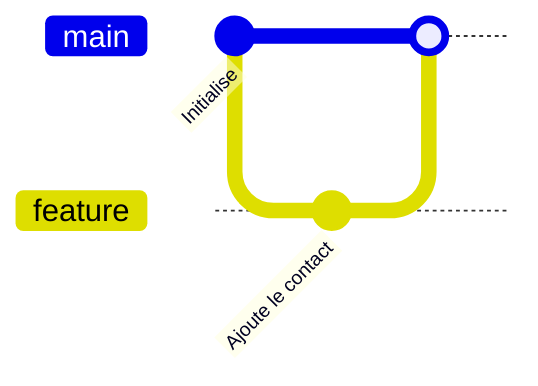

# Course catalogue: authoring guide

This folder holds **every course of the portal**, written in Markdown. Adding or fixing a lesson needs no code: a `.md` file, sometimes an image. The compiler (`crates/mentor-content`) reads this folder, validates every file and stops at the first error, naming the file and the line or step.

> **In short**: a course is a folder. A lesson is an `NN-name.md` file with a YAML front matter, some text, one **lab** (steps the server verifies in the learner's own environment) and a **quiz**.

The **format** is in English (file names, keys, directive and check names). The **content** is in the authors' language: French for the courses shipped here, which is why the examples below are in French.

A complete, commented course to copy is in [`_template/`](_template/). It is not listed in `catalogue.yml`, so the build does not compile it: check what you copy from it.

Contents: [layout](#1-layout) · [front matter](#2-front-matter) · [lesson structure](#3-structure-of-a-lesson) · [XP scale](#4-time-steps-and-xp) · [syntax](#5-syntax) · [quiz](#6-quizzes) · [labs](#7-labs) · [environments](#8-environments) · [exam](#9-validation-exam-exammd) · [writing rules](#10-writing-rules) · [review](#11-review-checklist) · [testing](#12-testing-your-changes) · [new course](#13-adding-a-course) · [limits](#14-known-limits) · [existing courses](#15-existing-courses) · [training paths](#16-training-paths-pathsyml)

## 1. Layout

```text
catalogue/
├── README.md                 ← this guide
├── catalogue.yml             ← ordered index of the courses
├── paths.yml                 ← (optional) training paths: courses arranged towards a goal (§16)
├── mentor.yml                ← the same list, as the manifest of a course package (see below)
├── _checks.yml               ← checks available to lab steps
├── _template/                ← commented model course (not compiled, to copy)
└── git-basics/               ← one folder per course: its name is the course identifier (slug)
    ├── course.md             ← front matter and presentation of the course
    ├── 01-introduction.md    ← lessons: NN-name.md, NN sets the order
    ├── 02-premier-commit.md
    ├── cheatsheet.md         ← (optional) reference tables of commands
    ├── exam.md               ← (optional, recommended) validation exam: a pool of questions (§9)
    ├── environnement/        ← environment the labs run in: devcontainer.json + Dockerfile (§8)
    └── images/               ← diagrams and illustrations (SVG preferably)
```

- **`catalogue.yml`** lists the courses in display order, under the key `courses`. A folder that is not listed is not compiled.

  ```yaml
  courses:
    - git-basics
    - docker-hello
  ```

- **`mentor.yml`** makes this folder a **course package**, the form in which courses are distributed as Git repositories ([`doc/course-packages.md`](../doc/course-packages.md)). It repeats the course list: until `catalogue.yml` is removed, **add a course to both**; a test fails when they differ. A package of your own needs only `mentor.yml` and its course folders: no `catalogue.yml`, no `_checks.yml`.
- Folder and file names are lower case, without accents or spaces (`05-conflits.md`). In a package, names may only hold letters, digits, `.`, `_` and `-`.
- Only files named `NN-name.md` (digits, a hyphen, a name) are lessons.
- Images are served under `/static/catalogue/<course>/images/…`.

## 2. Front matter

`course.md`, every lesson and `exam.md` start with a YAML block between two `---` lines; the opening `---` must be the very first line of the file.

> **Quote `title` and `summary`.** In YAML, text containing `: ` (colon, space) or starting with `'`, `[`, `{`, `*`… is a syntax error. Double quotes avoid these traps; escape a double quote inside them with `\"`.

Keys the compiler does not know are ignored without a message: check your spelling.

### Course (`course.md`)

| Key | Required | Role |
| --- | :---: | --- |
| `title` | yes | Name of the course. |
| `icon` | yes | An emoji; also the end-of-course badge. |
| `summary` | yes | One catchy sentence. |
| `environment` | no | Folder of the [environment](#8-environments) used by the labs of every lesson. |
| `requires` | no | List of course slugs to complete first (`[docker-hello]`). Each must be listed in `catalogue.yml`. |
| `published` | no | `true` by default. `false` announces a course as "coming soon". A published course needs at least one lesson. |
| `color` | no | Hexadecimal accent colour (`"#2496ED"`). |
| `banner` | no | Relative path of a 1200×400 image (`images/banniere.svg`). |

The body of the file is the **presentation of the course**: audience, objectives, duration.

### Lesson (`NN-name.md`)

| Key | Required | Role |
| --- | :---: | --- |
| `id` | yes | **Stable** identifier of the lesson, unique in the course. It appears in the URL and keys **progress**: never change it once published. `exam` is reserved. |
| `title` | yes | Displayed title. |
| `summary` | yes | One sentence saying what is learnt. |
| `minutes` | yes | Estimated duration, a whole number of minutes, lab and quiz included. |
| `objectives` | no | List of "by the end, you will be able to…" (inline Markdown accepted). |
| `environment` | no | Environment folder for this lesson; it replaces the course's (`false` removes it). |

```yaml
---
id: conflits
title: "Résoudre un conflit"
summary: "Pas de panique : un conflit est juste Git qui te demande de trancher."
minutes: 15
objectives:
  - Reconnaître les marqueurs d'un conflit
  - Terminer une fusion avec `git add` et `git commit`
---
```

> **To rename or reorder a lesson**, change the `NN-` prefix of the file, never the `id`.

## 3. Structure of a lesson

Every lesson follows the same thread, so learners find their way:

1. **Hook** (2-3 sentences): a concrete problem the person has already met. No heading.
2. **Concepts** (`## …`): one idea per lesson, with a diagram (figure or Mermaid) as soon as there is structure to see.
3. **Demonstration**: the commands to try, in ` ```shell run ` blocks, explained one by one.
4. **Pitfall or good practice**: a `:::warning` or `:::tip` callout (one or two per lesson, no more).
5. **`## Entraîne-toi`**: the `:::lab` block, with 3 to 6 progressive steps.
6. **`## Vérifie tes acquis`**: 3 to 4 `:::quiz` blocks.

The headings `## Entraîne-toi` and `## Vérifie tes acquis` are a convention of the French courses: keep them identical.

## 4. Time, steps and XP

Points are computed from what you write (`crates/mentor-core/src/gamification.rs`):

| Item | XP |
| --- | ---: |
| Each validated lab step | 10 |
| Each correct quiz answer (best score) | 8 |
| Lesson completed (lab done **and** at least 2/3 of correct answers) | 50 |
| Course completed (every lesson) | 150 |
| Course validated through its exam | 100 |

For a 15-minute lesson: **3 to 6 lab steps** and **3 to 4 questions**, about 100 to 150 XP. A lesson without a `:::lab` block is allowed (theory lesson); it is completed as soon as its quiz is passed.

## 5. Syntax

### Standard Markdown

Headings `##` and `###` (`#` is the lesson title, generated), **bold**, *italics*, `code`, links, bullet and numbered lists, tables, quotes. A numbered list is for the **steps of a procedure**.

**Author HTML is filtered.** Text formatting, links, images and tables survive (`<kbd>`, `<details>`…); scripts, event handlers, forms, frames, `style` and `class` are removed, and links keep only `http`, `https`, `mailto` and relative addresses. A removed tag vanishes and its text stays, so **text meant as code must be written as code**: write `` `docker logs <nom>` ``, not docker logs &lt;nom&gt; in plain text, or `<nom>` disappears. This applies everywhere, including quiz answers and lab hints.

### Callouts

```markdown
:::info
Une information utile.
:::

:::tip Un titre personnalisé
Une astuce. Le contenu est du Markdown.
:::
```

| Type | Default title | When to use it |
| --- | --- | --- |
| `:::info` | À savoir | A complement, a link with another tool of the team. |
| `:::tip` | Astuce | A shortcut, a professional reflex. |
| `:::warning` | Attention | A frequent pitfall, a classic confusion. |
| `:::danger` | Danger | A destructive or irreversible action. |

Directives do not nest (no `:::info` inside a `:::tip`), but a code block inside a callout is fine. A directive is closed by a line holding only `:::`.

### Cards

Cards compare two or three notions side by side. Each card starts with a `###` sub-heading (at least one is required).

```markdown
:::cards
### Image

Un modèle en lecture seule.

### Conteneur

Une instance en cours d'exécution.
:::
```

### Code blocks

| Written | Result |
| --- | --- |
| ` ```shell run ` | Each line gets a **▶ Lancer** button that sends it to the lab terminal. Lines starting with `#` are comments; empty lines are dropped. |
| ` ```dockerfile file=Dockerfile ` | Shows the file with a **Créer ce fichier dans le labo** button. The name after `file=` is the file created; it is required. |
| ` ```mermaid ` | A diagram (see below). |
| ` ```console `, ` ```python `, ` ```yaml `, ` ```text `… | Code shown as is, not runnable. The language is kept as an attribute; there is no server-side highlighting. |

A `shell run` block must contain only commands that work **in the lesson's environment**, with the tools its image installs and without network (§8).

### Images and figures

```markdown

```

- An image alone on its line becomes a figure. The text between brackets is both the **caption** and the **alternative text**: describe what the diagram shows. Markdown is not interpreted in a caption.
- The path is relative to the course folder and **must be under `images/`**: it is the only folder of a course that the server gives out (the rest holds lab solutions and exam answers), and the compiler refuses a picture referenced elsewhere. Accepted formats: SVG, PNG, JPEG, GIF, WebP, AVIF. A picture is served with scripts disabled.
- Naming: `images/<subject-in-lower-case>.svg`, one image per idea. The course banner is `banniere.svg`.

**Style of SVG diagrams** (a common identity, readable on dark and light themes):

- Dark background panel `#0b1220`, border `#1e293b`, rounded corners.
- Text `#e2e8f0` (secondary `#94a3b8`), font `Inter, system-ui, sans-serif`, at least 14 px at display size.
- Accent `#6366F1` for what to look at first; boxes in `#1e293b` / `#334155`; one course accent colour at most.
- All text is SVG text, never a bitmap. No complex gradients or filters: it must stay readable on a phone.
- Accessibility: `role="img"`, `<title>` and `<desc>`, `aria-labelledby`.
- A `viewBox` and no fixed width. Reference width: 640 to 760.

See [`_template/images/exemple.svg`](_template/images/exemple.svg).

### Mermaid diagrams

For a diagram that changes often or reads well as text (Git history, sequence, states):

````markdown

````

Keep a Mermaid diagram under about ten nodes. For anything else (illustration, comparison, polished architecture), prefer an SVG.

## 6. Quizzes

One `:::quiz` block is **one question**. Write 3 or 4 per lesson.

```markdown
:::quiz
Quand y a-t-il un conflit ?

- [ ] À chaque merge
- [x] Quand deux branches modifient la même zone d'un fichier
- [ ] Quand on oublie `git add`

> Si les modifications touchent des endroits différents, Git fusionne seul.
:::
```

1. The **question** first (inline Markdown).
2. At least **2 answers** as a `- [ ]` / `- [x]` list. **Exactly one** is ticked.
3. The **explanation** as a quote (`>`), shown after answering: it says why, even when the answer was right.

Wrong answers must be **plausible** (real confusions), never absurd. Vary the position of the right answer from one question to the next.

## 7. Labs

A `:::lab` block describes the practical exercise of a lesson: the starting state, the steps to carry out and how the server verifies them. Labs run **in the course's real environment** (§8): each learner gets their own, types real commands, and the server checks the result there. There are no simulated terminals. **One lab per lesson at most.** Its content is **YAML** (`#` comments allowed).

### Keys

| Key | Required | Role |
| --- | :---: | --- |
| `engine` | no | Only `real` is accepted, and it says nothing any more: every lab is real. Existing labs carry the line; it can stay. |
| `intro` | no | Introduction (Markdown): the starting situation. |
| `environment` | no | Environment folder of this lab (otherwise the lesson's, then the course's). A lab without any environment is an error. |
| `files` | no | Files written in the working folder at start: `name: content` (write the content with `\|`). Names are plain relative paths (letters, digits, `.`, `_`, `-`, `/`; no `..`); contents are text. |
| `commands` | no | Commands run silently at start, in order, after `files`. A list of texts. |
| `steps` | yes | List of steps, at least one. |

### A step

| Key | Required | Role |
| --- | :---: | --- |
| `text` | yes | The instruction (inline Markdown). Quote the exact names used in the lab. |
| `hint` | no | A nudge shown on demand. Prefer a clue to the answer itself. |
| `checks` | yes | A list of [checks](#checks): the step is validated when **all** of them hold. |
| `solution` | yes | Actions that carry out the step: a command (text) or `{write: {file: content}}`. Shown by "Voir la solution". |
| `after` | no | Numbers (from 1) of **earlier** steps to validate before this one. |

### Checks

Declared in [`_checks.yml`](_checks.yml). The server runs them inside the learner's environment, as the learner's non-root user, in the working folder. An unknown check or a wrong number of arguments fails the compilation, naming the file and the step.

| Name | Arguments | Holds when |
| --- | --- | --- |
| `command-succeeds` | command | The command (run by `sh -c`) exits with code 0. |
| `command-fails` | command | The command exits with a non-zero code. |
| `output-contains` | command, regex | The standard output of the command (64 KiB at most) matches the regular expression. |
| `env-file-exists` | path | The file or folder exists (path relative to the working folder). |
| `env-file-absent` | path | The file or folder does not exist (any more). |
| `env-file-contains` | path, regex | The content of the file (first 64 KiB) matches the regular expression. |

```yaml
checks:
  - env-file-exists: projet/.git                              # one argument
  - env-file-contains: [projet/README.md, '^# Projet']        # several arguments: a list
  - command-succeeds: 'git -C projet rev-parse HEAD'          # quote commands and regular expressions
```

Arguments are text (or numbers). Write regular expressions between **single quotes** and escape the dot (`hello\.txt`). Stay within the syntax common to all engines (`^`, `$`, `\b`, classes, `(?m)` for multi-line): no look-around, no back-references.

### Writing checks that mean something

- **A check observes; it never changes anything.** It may run many times, at any moment: no file written, no container started, no commit. Redirect noise to `/dev/null` rather than to a file.
- **A check must not hold before the learner has acted.** Negative checks are the trap: "the container `vieux` is gone" is also true when Docker is not answering. Prove the tool works first:

  ```yaml
  - command-succeeds: 'docker info > /dev/null && ! docker container inspect vieux > /dev/null 2>&1'
  ```

  Likewise `env-file-absent` and `command-fails` alone hold on an empty working folder: pair them with a positive check or with `after`.
- **A check must still hold once the learner has moved on.** Learners often do two steps before asking for a verification. "`README.md` is staged" becomes false after the commit; "`README.md` is tracked" (`git ls-files --error-unmatch README.md`) stays true.
- **Observation steps leave no trace**: `docker ps`, `git log` or `curl` change nothing a check could see, and the server does not read what was typed. Ask the learner to **save the output to a file**, and check the file:

  ```yaml
  - text: "Vérifie qu'il tourne avec `docker ps`, puis garde la liste : `docker ps > conteneurs.txt`"
    after: [2]
    checks:
      - env-file-contains: [conteneurs.txt, '\bweb$']
    solution:
      - docker ps
      - docker ps > conteneurs.txt
  ```

- Checks of a step are combined with **AND**; there is no OR. Split into two steps or rephrase.
- Use `after` when a check only makes sense once an earlier step is done ("read the logs of `db`" after "start `db`").
- The `solution` must cover the **whole** step, intermediate commands included, and be enough to pass its checks.

### Complete example

```markdown
:::lab
engine: real
intro: |
  Le dépôt est initialisé et contient un fichier non suivi. Fais-en un historique !
files:
  notes.txt: |
    Mes notes.
commands:
  - git init -q
  - 'echo "<h1>Bienvenue</h1>" > index.html'
steps:
  - text: "Ajoute `index.html` à l'index avec `git add`"
    hint: "La commande prend le nom du fichier."
    checks:
      - command-succeeds: 'git ls-files --error-unmatch index.html'
    solution:
      - git add index.html
  - text: 'Crée ton premier commit avec `git commit -m "…"`'
    after: [1]
    checks:
      - command-succeeds: 'git cat-file -e HEAD:index.html'
    solution:
      - "git commit -m \"Ajoute la page d'accueil\""
  - text: "Enregistre l'historique : `git log --oneline > historique.txt`"
    after: [2]
    checks:
      - env-file-contains: [historique.txt, 'Ajoute']
    solution:
      - git log --oneline > historique.txt
:::
```

More examples: [`_template/01-exemple.md`](_template/01-exemple.md), [`git-basics/`](git-basics/), [`docker-hello/`](docker-hello/), [`python/`](python/).

## 8. Environments

An environment is a folder of the course holding a `devcontainer.json` and its `Dockerfile`. The platform builds an image from it and gives **each learner their own Firecracker microVM** started from that image: a real Linux, real tools, thrown away at the end of the session.

```text
catalogue/my-course/
└── environnement/           ← the folder name is the value of `environment:`
    ├── devcontainer.json    ← Dev Containers specification (JSON with comments)
    ├── Dockerfile
    └── …                    ← files copied by the Dockerfile
```

Declare it once in `course.md` (`environment: environnement`); a lesson or a lab can name another folder. Commented models: [`_template/environnement/`](_template/environnement/) (Debian and Git) and [`_template/environnement-docker/`](_template/environnement-docker/) (Docker).

> **What v2 checks today**: only that the folder named by `environment` contains a `devcontainer.json`. The specification and the `Dockerfile` are **not validated yet**, and building or running an environment is not wired in v2 (§12). The rules below are those every existing environment follows; keep to them so yours works when the execution plane arrives.

### No network at run time

**The network exists only while the image is built.** In a running environment there is no Internet and no package registry: `apt install`, `pip install`, `npm install`, `git clone https://…` and `docker pull` from Docker Hub all fail. Therefore:

- install every tool and dependency in the `Dockerfile`, with pinned versions;
- copy exercise files into the image (`COPY exercices /opt/exercices`) and let each lab copy what it needs into the working folder with `commands`;
- replace remote services with local stand-ins prepared at build time (`git-basics` redirects its GitLab URL to a local bare repository; `terraform` and `web-javascript` ship local package mirrors).

### `devcontainer.json`

```jsonc
{
    "name": "Debian avec Git",
    "build": { "dockerfile": "Dockerfile", "context": "." },
    "containerUser": "apprenant",            // never root
    "remoteUser": "apprenant",
    "workspaceFolder": "/workspace",
    "containerEnv": { "EDITOR": "nano" },
    "hostRequirements": { "cpus": 1, "memory": "512mb", "storage": "256mb" }
}
```

Existing environments use only these keys, and nothing else is known to be supported: `name`, `build` (`dockerfile`, `context`), `containerUser`, `remoteUser`, `workspaceFolder`, `containerEnv`, `forwardPorts`, `portsAttributes`, `postCreateCommand`, `postStartCommand`, `hostRequirements` (`cpus`, `memory`, `storage`), `customizations.vscode` (`extensions`, `settings`) and `customizations.mentor` (`dockerInDocker`, `vscodeWeb`).

### Dockerfile rules

- A base image **with a pinned tag** (`debian:trixie-slim`, `python:3.13.7-slim-bookworm`).
- The **last** `USER` instruction is the declared non-root user, uid **1000**. Never end as root.
- No `sudo`, no setuid binaries, no `VOLUME`.
- The working folder (`/workspace`) starts **empty** and is erased when the environment stops: what a lab needs there comes from its `files` and `commands`.
- An untrusted author's `Dockerfile` is built in a disposable build microVM: put no secret in it.

The image is started as a microVM, and three things make that fail without a message. The compiler reads the `Dockerfile` and warns about each (`mentor package-check` prints the warnings):

- **An init, or no systemd at all.** `openssh-server` brings systemd without `/sbin/init`; such an image never boots. Install `systemd-sysv` with it.
- **`curl`**, which the platform uses inside the guest to open a session.
- **A working folder that belongs to the learner**: nothing is mounted on it, so give it away in the image, just before the final `USER`: `RUN chown apprenant:apprenant /workspace`.

### Docker courses

A course that teaches Docker needs a Docker daemon. Set `customizations.mentor.dockerInDocker: true` in `devcontainer.json`: the platform then runs an ordinary Docker daemon **inside the learner's microVM**. The image does not start it; the learner (uid 1000) reaches it through the `docker` group:

```dockerfile
RUN useradd --create-home --uid 1000 --user-group --groups docker --shell /bin/bash apprenant
```

The reference environment also carries what the execution plane needs today, each explained in its `Dockerfile`: an alias account `vscode` with the learner's uid in the `docker` group, the legacy iptables back end, and a setting that makes Docker do without the iptables `raw` table (the guest kernel has neither `nf_tables` nor that table). Copy them with the rest.

Since there is no network at run time, images come from a **local read-only registry mirror filled at build time**. The reference is [`docker-hello/environnement/`](docker-hello/environnement/):

| File | Role |
| --- | --- |
| `images.txt` | The images to serve, one `source  served-name` pair per line (`nginx:1.29-alpine  nginx:latest`): the source is pinned, the served name is what learners type. |
| `remplir-miroir.sh` | Run by the `Dockerfile` at build: copies those images from Docker Hub into the mirror's storage. |
| `miroir.yml` | Configuration of the local registry, read-only, on `127.0.0.1:5001`. |
| `daemon.json` | Tells the Docker daemon to look for Docker Hub images in the mirror first. |
| `mentor-docker` | `postStartCommand`: starts the mirror and waits until Docker answers. |

`docker run nginx` and `docker pull alpine` then behave as usual. An image missing from `images.txt` cannot be pulled: list every image the lessons, the lab `commands` and the solutions use.

## 9. Validation exam (`exam.md`)

A course can offer a **validation exam**: a pool of questions from which the server draws a few at random. Passing it **validates the whole course without going through labs or lesson quizzes**. It is a shortcut for people who already master the subject; lessons remain the normal way. The file is optional, but **every published course should have one**.

### Format

A front matter, an introduction (the rules) and the pool, written with **the same `:::quiz` block** as lessons (§6).

```markdown
---
title: "Examen de validation — Git basics"
draw: 12          # questions drawn at each attempt (1 to 100)
pass_mark: 80     # percentage of correct answers required (1 to 100)
minutes: 20       # duration in minutes (1 to 240), timed by the server
shuffle: true     # optional, true by default: shuffles questions and answers
---

Règles de l'examen, en Markdown (public visé, ce qu'on attend de toi…).

:::quiz
Que fait `git restore --staged fichier` ?

- [ ] Il supprime le fichier du disque
- [x] Il retire le fichier de l'index sans toucher à son contenu
- [ ] Il annule le dernier commit

> `--staged` agit sur l'index, pas sur le dossier de travail.
:::
```

The compiler checks the four required keys (integers within bounds), a pool **at least as large as `draw`**, questions that are **all different**, one right answer per question, and **no `:::lab`**. It records a warning when the pool is smaller than **twice** `draw` (ideal: **three times**).

Each question gets a **stable identifier**, a digest of its wording: adding, removing or reordering questions is safe; rewording a question creates a new one.

### Writing a good pool

- **Cover every lesson**, in proportion to its importance: someone who passes must really know the course.
- **Mix difficulties**: understanding, situations ("you see this error message, what do you do?"), reading command output.
- **Do not copy lesson quizzes**: rephrase or take another angle, otherwise memorising answers is enough.
- **Plausible distractors**, a **precise explanation** per question, right answers at varied positions.
- One question tests one idea, **without trick wording**.

### Scale and rules

- **Pass mark**: 80 % is a good start (12 questions → 10 correct). Under 70 % the exam validates too easily; above 90 % one slip is enough to fail.
- **Duration**: about **1 to 1.5 minutes per question**.
- The server draws, shuffles, times and grades. A submission more than 30 seconds after the deadline is refused; after a failure, a new attempt has to wait 10 minutes and draws again.
- **Reward**: the lessons of the course are marked completed, and the exam gives 100 XP.
- The questions are public in the catalogue repository: the exam verifies knowledge, it is not a proctored test.

## 10. Writing rules

These apply to the French courses shipped here.

- **Informal `tu`** and a welcoming tone: « n'hésite pas », « tu es le·la bienvenu·e ». No jargon without a definition.
- **Inclusive forms** with the middle dot when needed (« apprenant·e », « développeur·se·s »), without excess; prefer neutral turns (« la personne », « celles et ceux »).
- **Accents and French typography are mandatory**: « À », « é », « ç », a space before `:`, `;`, `?`, `!`, guillemets « ». Never ASCII instead (« ou » ≠ « où »).
- **One idea per lesson.** If you need "and also", it is another lesson.
- **Concrete examples from the team's projects** rather than "foo/bar".
- **Text and lab agree**: branch, container, file and port names in the lesson are **exactly** those of the lab and its checks (`feature-contact`, `web`, `8080:80`).
- **One command, one explanation**: say what it does and what to observe.
- **Warn before destroying** (`:::warning` / `:::danger`) when a command is irreversible.
- **No degraded security as an example**: never a real password, never `--force` presented as normal.
- **Short sentences**, paragraphs of 4 lines at most, lists rather than walls of text.
- **No raw HTML** unless needed; most of it is filtered anyway (§5).

## 11. Review checklist

- [ ] The front matter is complete, `title` and `summary` are quoted, the `id` is unique and stable.
- [ ] The lesson follows the thread: hook → concepts → demonstration → pitfall → `## Entraîne-toi` → `## Vérifie tes acquis`.
- [ ] One idea, a realistic `minutes`, 3 to 6 lab steps, 3 to 4 questions.
- [ ] Each diagram has a useful alternative text and follows the SVG style (or is a Mermaid of under ten nodes).
- [ ] Every command of the `shell run` blocks, lab `commands` and solutions works in the environment, **without network**.
- [ ] Each step has `checks` and a `solution`; no check has a side effect, none holds before the learner acts, each still holds after the following steps; dependent steps use `after`.
- [ ] Observation steps ask for the output to be saved to a file.
- [ ] Names in the lesson (branches, containers, files, ports) match those of the lab.
- [ ] Each quiz has one right answer, plausible distractors and an explanation.
- [ ] Anything meant as code is written as code (no bare `<…>` in text).
- [ ] Spelling, accents, typography, `tu` and inclusive forms proof-read.
- [ ] Environment: non-root final `USER` with uid 1000, no `sudo`, pinned versions, everything installed at build; for Docker, every image used is in `images.txt`.
- [ ] `cargo test -p mentor-content` compiles the catalogue without error, and the lesson was read from start to end in the portal.

## 12. Testing your changes

```shell
# Compile the whole catalogue: an error names the file and the line or step
cargo test -p mentor-content

# Validate a course package (this folder, or a repository of your own): manifest, files, courses
cargo run -p mentor-cli -- package-check catalogue

# Read the result in the portal (needs a PostgreSQL database and a tenant: see ../README.md)
cargo run -p mentor-web -- --dev-login
```

`cargo test -p mentor-content` runs the conformance test, which compiles `catalogue/` and also compares it with a reference exported from v1 (`conformance/`); see `crates/mentor-content/tests/conformance.rs` for what that comparison covers. `mentor-web` compiles the catalogue when it starts and refuses to start on an error.

**Not available in v2 yet**: building an environment image, starting an environment, running a lab and replaying its solutions. The lesson page shows the text and the quiz, and says that the lab is not available. Until the execution plane is wired, a lab can only be proof-read: nothing proves that a `solution` passes its `checks`. The catalogue linter of v1 is not ported either (`.lint.yml` is unused).

Common errors:

| Message | Cause |
| --- | --- |
| `invalid YAML front matter: mapping values are not allowed…` | A `: ` in an unquoted `title` or `summary`. |
| `required field(s) missing from the front matter: …` | A required key is absent or empty. |
| `unknown check … Available: …` | A typo in a check name; the valid names are listed. |
| `… expects N argument(s) …` | Wrong number of arguments for a check. |
| `a lab requires an environment` | No `environment` in the lab, the lesson or `course.md`. |
| `engine no longer exists`, `… belonged to simulated labs` | A v1 leftover: the course-level `engine`, a `sandbox.yml` file, `server` or `effect` in a lab. Remove it. |
| `real environment not found: devcontainer.json is missing` | The folder named by `environment` does not exist or has no `devcontainer.json`. |
| `exactly one answer must be ticked [x]` | None or several `[x]` in a `:::quiz`. |
| `the :::lab block is never closed by :::` | The closing `:::` is missing. |
| `unknown directive :::xxx` | A typo in a directive name (`info`, `tip`, `warning`, `danger`, `cards`, `lab`, `quiz`). |
| `after must reference earlier step numbers` | `after` names the step itself, a later step or 0. |

## 13. Adding a course

1. Copy `_template/` to `catalogue/<slug>/` (the slug is the folder name: lower case and hyphens).
2. Fill in `course.md` (prerequisites, colour, banner, environment) and add `images/banniere.svg`.
3. Keep one environment folder, adapt its `Dockerfile` (delete `environnement-docker/` unless the course teaches Docker).
4. Write the lessons `01-…`, `02-…`, the `cheatsheet.md` and the `exam.md`.
5. Add the slug to [`catalogue.yml`](catalogue.yml) and to [`mentor.yml`](mentor.yml), at the wanted position.
6. Test (§12), update the table of §15, open the pull request.

To **announce** a course without publishing it: `published: false` and no lesson.

## 14. Known limits

- **No nested directives** and **one `:::lab` per lesson**. A lab only belongs in a lesson: not in `course.md`, `cheatsheet.md` or `exam.md`.
- Checks of a step are combined with **AND** only.
- **No network at run time** in an environment (§8).
- **Unknown front matter or lab keys are ignored silently**: a misspelt optional key has no effect and raises no error.
- Mermaid is loaded from `static/vendor/mermaid/`, which the repository does not ship: without it, the source of the diagram is shown instead.
- Code blocks are not highlighted on the server.
- Remote images (`https://…`) are accepted but discouraged: prefer files of the repository.
- Changing a lesson `id` loses the progress of the learners who had started it.

## 15. Existing courses

Every lab runs in the course's `environnement/` folder unless noted.

| Course | Folder | Lessons | Requires | Status |
| --- | --- | :---: | --- | --- |
| Git basics | [`git-basics/`](git-basics/) | 7 | — | Published |
| Docker hello world | [`docker-hello/`](docker-hello/) | 4 | — | Published; Docker environment with a local registry mirror |
| Docker advanced | [`docker-advanced/`](docker-advanced/) | 5 | docker-hello | Published |
| Python | [`python/`](python/) | 6 | — | Published |
| Django | [`django/`](django/) | 0 | python | Coming soon (`published: false`) |
| OIDC avec Keycloak | [`oidc-keycloak/`](oidc-keycloak/) | 0 | django | Coming soon (`published: false`) |
| CI/CD avec GitLab | [`ci-gitlab/`](ci-gitlab/) | 7 | git-basics | Published |
| Linux et shell | [`linux-shell/`](linux-shell/) | 6 | — | Published |
| SQL et PostgreSQL | [`sql-postgresql/`](sql-postgresql/) | 6 | — | Published |
| HTML, CSS et JavaScript | [`web-javascript/`](web-javascript/) | 6 | — | Published |
| TypeScript | [`typescript/`](typescript/) | 6 | web-javascript | Published |
| React et Next.js | [`react-nextjs/`](react-nextjs/) | 7 | typescript | Published |
| Angular | [`angular/`](angular/) | 7 | typescript | Published |
| API REST avec Django REST framework | [`django-rest/`](django-rest/) | 7 | django | Published |
| Maintenir du code hérité | [`maintenance-legacy/`](maintenance-legacy/) | 6 | django | Published |
| Kubernetes et Helm | [`kubernetes-helm/`](kubernetes-helm/) | 6 | docker-advanced | Published |
| Terraform | [`terraform/`](terraform/) | 6 | kubernetes-helm | Published |
| Sauvegardes et stockage objet | [`sauvegardes-s3/`](sauvegardes-s3/) | 6 | docker-advanced | Published |
| Go | [`go/`](go/) | 7 | — | Published |
| AWS : les bases du cloud (Cloud Practitioner) | [`aws-cloud-practitioner/`](aws-cloud-practitioner/) | 12 | — | Published; AWS CLI against a local emulator (MiniStack), prepares for CLF-C02 |
| AWS : concevoir des architectures (Solutions Architect Associate) | [`aws-solutions-architect-associate/`](aws-solutions-architect-associate/) | 12 | aws-cloud-practitioner | Published; same environment, prepares for SAA-C03 |
| AWS : architectures d'entreprise (Solutions Architect Professional) | [`aws-solutions-architect-professional/`](aws-solutions-architect-professional/) | 10 | aws-solutions-architect-associate | Published; same environment, 9 labs and one theory lesson, prepares for SAP-C02 |

## 16. Training paths (`paths.yml`)

A **training path** arranges existing courses towards a goal: "to work on the infrastructure, follow these courses, in this order". It holds no content of its own and changes nothing to what a course requires. The portal lists the paths, draws each one as a map (courses in order, prerequisite links between them, the learner's state on every course) and shows on a course page the paths it belongs to.

> The French interface calls a path « cursus », because « parcours » already names a course there. Write titles and summaries accordingly: « ce cursus », never « ce parcours », for a path.

Paths are declared in one file, `paths.yml`, at the root of the catalogue. They are not in `catalogue.yml` (that index is being replaced by the package manifest, which accepts no other key) nor in one file each (a path is ten lines, and they are easier to keep coherent side by side). The file is optional: without it the portal shows no path.

```yaml
paths:
  - id: devops-infrastructure
    title: "DevOps et infrastructure"
    icon: "☸️"
    summary: "Du terminal au cluster : conteneurs, pipelines, Kubernetes, Terraform et sauvegardes."
    color: "#326CE5"
    stages:
      - title: "Fondamentaux"
        courses:
          - linux-shell
          - git-basics
          - docker-hello
      - title: "Industrialiser"
        courses:
          - ci-gitlab
          - docker-advanced
      - title: "Pour aller plus loin"
        courses:
          - course: kubernetes-helm
            optional: true
```

### A path

| Key | Required | Role |
| --- | :---: | --- |
| `id` | yes | **Stable** identifier, unique among paths: lower-case words separated by hyphens. It appears in the URL (`/paths/<id>/`). |
| `title` | yes | Name of the path. |
| `icon` | yes | An emoji. |
| `summary` | yes | One sentence: where the path leads. |
| `color` | no | Hexadecimal accent colour, quoted (`"#326CE5"`). Text is written in white over it: pick a colour dark enough. |
| `stages` | one of the two | Groups of courses, in order (see below). |
| `courses` | one of the two | A plain list of courses, for a short path that needs no group. |

A path has either `stages` or `courses`, never both. Prefer `stages` from five courses on: on a wide screen each stage is a column of the map, while a plain list puts every course in a column of its own.

### A stage

| Key | Required | Role |
| --- | :---: | --- |
| `title` | yes | Name of the stage (« Fondamentaux », « Spécialisation »). Keep it short: it heads a column. |
| `courses` | yes | The courses of the stage, at least one, in the order to follow them. |

### A course of a path

A course is named by its folder (`docker-hello`). To mark it **optional**, write it as a mapping:

```yaml
courses:
  - docker-advanced
  - course: sauvegardes-s3
    optional: true
```

An optional course is shown on the map with the mention « En option », and is **not needed to complete the path**. A path is completed when every other course of it is; nothing is awarded for it (no XP, no badge) beyond what its courses give.

A course may belong to several paths. A course that is not published yet (`published: false`) may be listed: it is announced on the map as « Bientôt disponible », and the path cannot be completed until it is published, unless it is optional.

### Rules the compiler enforces

`paths.yml` is checked strictly when the catalogue is loaded; unlike front matter, **an unknown key is an error**.

- **A path is self-contained.** Every prerequisite (`requires`) of a course of the path must be in the path too, **earlier**: in a previous stage, or above it in the same stage. Someone who follows the path from its first course to its last never meets a lock they cannot open from inside it, and every prerequisite link can be drawn. To include `typescript`, list `web-javascript` before it.
- A course that is needed to complete the path cannot require a course that is optional in it.
- A course appears once in a path. At least one course is not optional.
- Courses are those of the catalogue; `color` is hexadecimal; `id` is unique.

| Message | Cause |
| --- | --- |
| `path #2: unknown key …` | A misspelt key; the known ones are listed. |
| ``path `x`: unknown course `y` `` | `y` is not a course folder of the catalogue. |
| ``path `x`: the course `y` is listed twice`` | The same course in two places of the path. |
| ``path `x`: `a` requires `b`, which is not in the path`` | Add `b` to the path, before `a`. |
| ``path `x`: `a` requires `b`, which comes after it`` | Move `b` above `a`, or to an earlier stage. |
| ``path `x`: `a` is needed to complete the path but requires `b`, which is optional in it`` | Make `b` required, or `a` optional. |
| ``path `x`: every course is optional`` | Nothing would complete the path. |
| ``path `x`: give either `stages` or `courses`, not both`` | Choose one form. |

### Drawing a readable map

The map draws one arrow per prerequisite between two courses of the path, and nothing else: order alone draws no arrow.

- Inside a stage, order the courses so that arrows do not cross: put next to each other the courses that lead to the same place.
- Keep a stage to **four courses at most** and a path to **four or five stages**: beyond that the map scrolls sideways on a desktop screen.
- Test with `cargo test -p mentor-content` (the paths of this folder are validated by `tests/paths.rs`), then look at `/paths/<id>/` in the portal, on a wide window and on a narrow one.

### Existing paths

| Path | Id | Courses |
| --- | --- | --- |
| Socle commun | `socle-commun` | linux-shell, git-basics, docker-hello, sql-postgresql |
| Développement frontend | `developpement-frontend` | web-javascript, typescript, git-basics → react-nextjs, angular → ci-gitlab (optional) |
| Backend Python et Django | `backend-python` | python, sql-postgresql, git-basics → django, django-rest, maintenance-legacy → oidc-keycloak (optional) |
| DevOps et infrastructure | `devops-infrastructure` | linux-shell, git-basics, docker-hello → ci-gitlab, docker-advanced → kubernetes-helm, terraform, sauvegardes-s3 |
