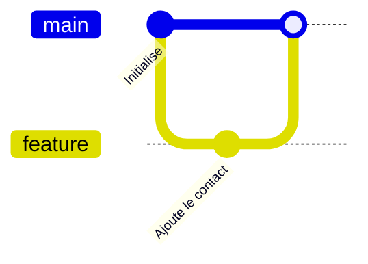

---
# ── Front matter d'une leçon ─────────────────────────────────────────────────
id: exemple                     # obligatoire. Identifiant STABLE (ne le change jamais : progression et badges s'y réfèrent)
titre: "Leçon exemple"           # obligatoire. Entre guillemets.
resume: "Ce que l'on apprend, en une phrase."   # obligatoire. Entre guillemets (surtout s'il contient un « : »).
duree: 10                       # obligatoire : minutes, labo et quiz compris
objectifs:                      # facultatif : « À la fin de cette leçon, tu sauras… » (Markdown en ligne accepté)
  - Expliquer ce qu'est un `commit`
  - Lancer ta première commande dans le terminal du labo
---

<!-- Un nom de fichier = NN-nom.md : NN fixe l'ordre des leçons dans le parcours. -->

Commence par une **accroche** : un problème concret que l'apprenant·e a déjà rencontré (« Tu as déjà nommé un fichier `rapport_final_v2_VRAI_final.docx` ? »).

## Les concepts

Du Markdown standard : **gras**, *italique*, `code en ligne`, [liens](https://gitlab.example.org/equipe), listes, tableaux.

| Zone | Rôle |
| --- | --- |
| Dossier de travail | Tes fichiers |
| Index | Ce qui sera dans le prochain commit |
| Dépôt | L'historique |

1. Une liste numérotée sert aux **étapes** d'une procédure.
2. Une liste à puces sert aux **énumérations**.

### Figure

<!-- Le texte alternatif (entre crochets) sert de légende ET d'alternative textuelle. Chemin relatif au dossier du parcours. -->


### Schéma Mermaid



## Démonstration : des commandes à lancer

Chaque ligne d'un bloc `shell run` a son bouton **▶ Lancer** qui l'envoie au terminal du labo. Les lignes qui commencent par `#` sont des commentaires affichés tels quels.

```shell run
# Initialise un dépôt, puis regarde où tu en es
git init
git status
```

Un fichier à créer dans le labo (bouton « Créer ce fichier dans le labo ») :

```yaml file=compose.yml
services:
  web:
    image: nginx
```

Une sortie de commande, à titre d'illustration (non exécutable) :

```console
$ git status
Sur la branche main
rien à valider
```

## Encarts

:::info
Une information utile. Titre par défaut : « À savoir ».
:::

:::tip Un titre personnalisé
Une astuce qui fait gagner du temps. Le contenu est du Markdown : `code`, **gras**, listes…
:::

:::warning
Un piège fréquent ou une manipulation irréversible.
:::

:::danger
À réserver aux actions réellement destructrices (suppression de données, historique réécrit sur une branche partagée).
:::

:::cartes
### Première idée

Une carte = un sous-titre `###` et un court texte.

### Deuxième idée

Trois cartes maximum, pour comparer des notions côte à côte.
:::

## Entraîne-toi

<!-- Un seul bloc :::labo par leçon. Son contenu est du YAML. Les commentaires `#` sont permis. -->

:::labo
# Texte d'introduction (Markdown). Raconte la situation de départ.
intro: |
  Le dossier contient un `README.md`. Initialise un dépôt et fais ton premier commit.

# État initial : fichiers du dossier de travail (nom: contenu)…
fichiers:
  README.md: |
    # Mon projet

# …puis commandes jouées en silence au démarrage (dans l'ordre).
commandes:
  - git init

# (git) Dépôts distants simulés, avec leurs commits. Facultatif.
serveur:
  - url: git@gitlab.example.org:equipe/exemple.git
    commits:
      - branche: main
        message: Initialise l'exemple
        fichiers:
          LISEZMOI.md: |
            Bienvenue !
        auteur: Camille

etapes:
  # Chaque étape : texte (obligatoire), indice, verif (obligatoire), solution (obligatoire), apres, effet
  - texte: Ajoute `README.md` à l'index avec `git add`
    indice: git add README.md
    verif:                      # toutes les vérifications doivent être vraies
      - indexe: README.md
    solution:                   # rejouée par la CI et affichable par « Voir la solution »
      - git add README.md

  - texte: Crée ton premier commit avec `git commit -m "…"`
    indice: 'git commit -m "Ajoute le README"'
    apres: [1]                  # numéros (à partir de 1) d'étapes à valider avant celle-ci
    verif:
      - commits-au-moins: 1
      - fichier-dans-head: README.md
    solution:
      - 'git commit -m "Ajoute le README"'

  - texte: Modifie `README.md` (clique sur le fichier), puis lance `git diff`
    verif:
      - commande: '^git diff'   # expression régulière : met-la entre guillemets simples
      - fichier-modifie: README.md
    solution:
      - ecrire:                 # action « écrire un fichier » (simule l'éditeur)
          README.md: |
            # Mon projet
            Une ligne de plus.
      - git diff

  - texte: Camille a poussé un commit, récupère-le avec `git fetch`
    apres: [2]
    verif:
      - commande: '^git fetch'
    solution:
      - git remote add origin git@gitlab.example.org:equipe/exemple.git
      - git fetch
    effet:                      # déclenché quand l'étape est validée
      serveur-commit:
        branche: main
        message: Ajoute une page
        fichiers:
          page.html: |
            <h1>Page</h1>
        auteur: Camille
:::

## Vérifie tes acquis

<!-- Un bloc :::quiz par question : exactement une réponse cochée [x], une explication en citation (>). 3 à 4 questions. -->

:::quiz
À quoi sert `git add` ?

- [ ] À envoyer les fichiers sur GitLab
- [x] À placer des modifications dans l'index, en vue du prochain commit
- [ ] À créer une branche

> `add` prépare le commit ; rien n'est enregistré dans l'historique tant que tu n'as pas lancé `commit`.
:::

:::quiz
Que contient le dossier caché `.git` ?

- [x] Tout l'historique du projet
- [ ] Uniquement les fichiers ignorés
- [ ] Les mots de passe de GitLab

> Supprime-le et tu perds l'historique (mais pas tes fichiers actuels).
:::

:::quiz
Un bon message de commit est…

- [ ] `fix`
- [x] Court, à l'impératif, et dit ce que fait le commit
- [ ] Un roman de 20 lignes

> Dans six mois, il te dira précisément ce que le commit faisait.
:::
