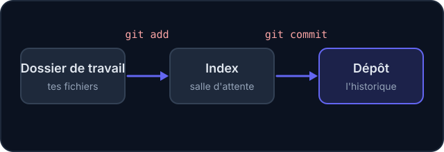
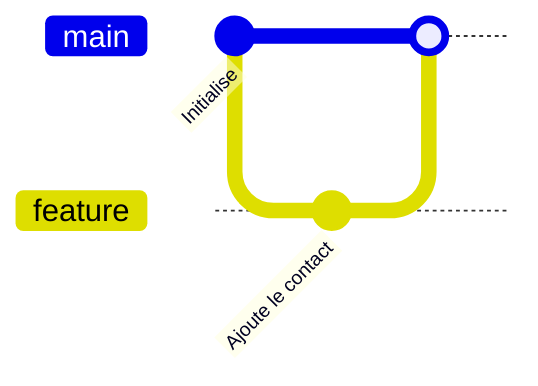

---
# ── Front matter of a lesson ─────────────────────────────────────────────────
id: exemple                     # required. STABLE identifier (never change it: progress and badges refer to it)
title: "Leçon exemple"           # required. Quoted.
summary: "Ce que l'on apprend, en une phrase."  # required. Quoted (above all when it contains a ": ").
minutes: 10                     # required: whole minutes, lab and quiz included
objectives:                     # optional: "by the end of this lesson, you will be able to…" (inline Markdown accepted)
  - Expliquer ce qu'est un `commit`
  - Lancer ta première commande dans le terminal du labo
---

<!-- A lesson file is named NN-name.md: NN sets the order of the lessons in the course. -->

Commence par une **accroche** : un problème concret que l'apprenant·e a déjà rencontré (« Tu as déjà nommé un fichier `rapport_final_v2_VRAI_final.docx` ? »).

## Les concepts

Du Markdown standard : **gras**, *italique*, `code en ligne`, [liens](https://gitlab.example.org/equipe), listes, tableaux.

| Zone | Rôle |
| --- | --- |
| Dossier de travail | Tes fichiers |
| Index | Ce qui sera dans le prochain commit |
| Dépôt | L'historique |

1. Une liste numérotée sert aux **étapes** d'une procédure.
2. Une liste à puces sert aux **énumérations**.

### Figure

<!-- The text between brackets is both the caption AND the alternative text. The path is relative to the course folder. -->



### Schéma Mermaid



## Démonstration : des commandes à lancer

Chaque ligne d'un bloc `shell run` a son bouton **▶ Lancer** qui l'envoie au terminal du labo. Les lignes qui commencent par `#` sont des commentaires affichés tels quels.

```shell run
# Initialise un dépôt, puis regarde où tu en es
git init
git status
```

Un fichier à créer dans le labo (bouton « Créer ce fichier dans le labo ») :

```yaml file=compose.yml
services:
  web:
    image: nginx
```

Une sortie de commande, à titre d'illustration (non exécutable) :

```console
$ git status
Sur la branche main
rien à valider
```

## Encarts

:::info
Une information utile. Titre par défaut : « À savoir ».
:::

:::tip Un titre personnalisé
Une astuce qui fait gagner du temps. Le contenu est du Markdown : `code`, **gras**, listes…
:::

:::warning
Un piège fréquent ou une manipulation irréversible.
:::

:::danger
À réserver aux actions réellement destructrices (suppression de données, historique réécrit sur une branche partagée).
:::

:::cards
### Première idée

Une carte = un sous-titre `###` et un court texte.

### Deuxième idée

Trois cartes maximum, pour comparer des notions côte à côte.
:::

## Entraîne-toi

<!-- One :::lab block per lesson at most. Its content is YAML; `#` comments are allowed.
     It runs in the environment declared by `environment:` (here in course.md). -->

:::lab
engine: real
# Introduction (Markdown): the starting situation.
intro: |
  Ton dossier de travail contient un `README.md`, dans un dépôt Git tout neuf. Fais ton premier commit.

# Initial state: files written in the working folder (name: content)…
files:
  README.md: |
    # Mon projet

# …then commands run silently when the lab starts, in order.
commands:
  - git init -q

steps:
  # A step: text (required), hint, checks (required), solution (required), after.
  - text: Ajoute `README.md` à l'index avec `git add`
    hint: git add README.md
    checks:                     # every check must hold; the server runs them in the learner's environment
      - command-succeeds: 'git ls-files --error-unmatch README.md'   # still true once the file is committed
    solution:                   # shown by "Voir la solution"; it must be enough to pass the checks
      - git add README.md

  - text: Crée ton premier commit avec `git commit -m "…"`
    hint: 'git commit -m "Ajoute le README"'
    after: [1]                  # numbers (from 1) of the steps to validate before this one
    checks:
      - command-succeeds: 'git cat-file -e HEAD:README.md'
    solution:
      - 'git commit -m "Ajoute le README"'

  # A step that only OBSERVES leaves no trace a check could see: ask the learner to save the output to a file.
  - text: 'Ajoute une ligne à `README.md`, regarde la différence avec `git diff`, puis garde-la : `git diff > changements.txt`'
    hint: "Ouvre `README.md` avec `nano`, ajoute une ligne et enregistre. `git diff` montre alors ce qui a changé."
    after: [2]
    checks:
      - env-file-contains: [changements.txt, '(?m)^\+[^+]']   # a regular expression: write it between single quotes
    solution:
      - write:                  # the "write a file" action (what the learner does in the editor)
          README.md: |
            # Mon projet
            Une ligne de plus.
      - git diff
      - git diff > changements.txt
:::

## Vérifie tes acquis

<!-- One :::quiz block per question: exactly one answer ticked [x], an explanation as a quote (>). 3 to 4 questions. -->

:::quiz
À quoi sert `git add` ?

- [ ] À envoyer les fichiers sur GitLab
- [x] À placer des modifications dans l'index, en vue du prochain commit
- [ ] À créer une branche

> `add` prépare le commit ; rien n'est enregistré dans l'historique tant que tu n'as pas lancé `commit`.
:::

:::quiz
Que contient le dossier caché `.git` ?

- [x] Tout l'historique du projet
- [ ] Uniquement les fichiers ignorés
- [ ] Les mots de passe de GitLab

> Supprime-le et tu perds l'historique (mais pas tes fichiers actuels).
:::

:::quiz
Un bon message de commit est…

- [ ] `fix`
- [x] Court, à l'impératif, et dit ce que fait le commit
- [ ] Un roman de 20 lignes

> Dans six mois, il te dira précisément ce que le commit faisait.
:::
