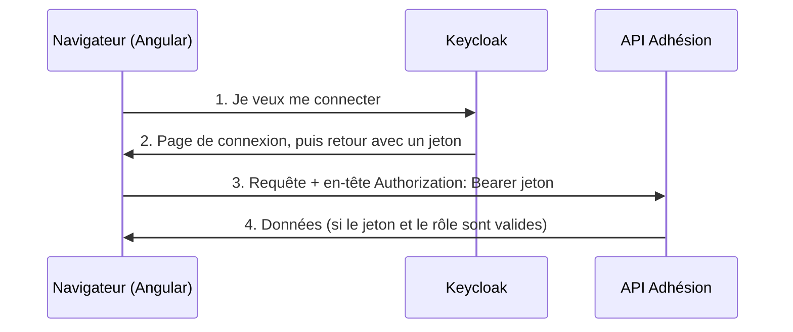

Les données des adhérent·e·s ne doivent pas être lisibles par n'importe qui. Il faut donc savoir **qui** utilise l'application (c'est l'authentification) et **ce qu'elle ou il a le droit de faire** (c'est l'autorisation). Dans l'équipe, cette tâche est confiée à un serveur dédié : **Keycloak**, un logiciel libre de gestion des identités.

## L'idée : on ne gère pas les mots de passe soi-même

Imagine un festival. À l'entrée, un guichet vérifie ta pièce d'identité et te remet un **bracelet**. Ensuite, chaque scène se contente de regarder ton bracelet : elle ne te redemande pas ta pièce d'identité.

- **Keycloak** est le guichet : un serveur d'identité qui connaît les comptes, vérifie les mots de passe et affiche la page de connexion.
- Le **jeton** (*token*) est le bracelet : un texte signé par Keycloak qui dit qui tu es et quels **rôles** tu as (par exemple `staff`).
- L'**API d'Adhésion** est la scène : elle contrôle le jeton à chaque requête.
- L'application Angular est le programme qui tourne **dans ton navigateur** : elle demande le bracelet puis le montre à l'API.



Dans le dépôt, le fichier `README.md` précise qu'un compte doit avoir au minimum le rôle `staff` de `adhesion-api` pour se connecter.

## Brancher Keycloak : provideKeycloak

La bibliothèque `keycloak-js` parle à Keycloak ; `keycloak-angular` l'intègre à Angular. Adhésion les configure dans les `providers` d'`AppModule`. Voici l'essentiel, ligne à ligne :

```ts
provideKeycloak({
  config: {
    url: environment.keycloak_url,
    realm: environment.keycloak_realm,
    clientId: environment.keycloak_client_id,
  },
  initOptions: {
    onLoad: 'check-sso',
    checkLoginIframe: true,
    flow: 'standard',
    silentCheckSsoRedirectUri: window.location.origin + '/assets/silent-check-sso.html',
  },
  features: [
    withAutoRefreshToken({
      onInactivityTimeout: 'logout',
      sessionTimeout: 60 * 60 * 1000,
    }),
  ],
}),
```

- `url` : l'adresse du serveur Keycloak.
- `realm` : un « royaume », c'est-à-dire un espace de comptes isolé (dans le `Dockerfile` du dépôt, la recette qui fabrique le conteneur de l'application, expliquée à la leçon 7 : `exemple`).
- `clientId` : le nom sous lequel cette application est déclarée dans Keycloak.
- `onLoad: 'check-sso'` : au démarrage, vérifier **discrètement** si tu es déjà connecté·e (sans afficher la page de connexion). *SSO* veut dire *Single Sign-On*, « connexion unique » : une seule connexion vaut pour plusieurs applications. `silentCheckSsoRedirectUri` désigne la petite page utilisée pour cette vérification en arrière-plan.
- `checkLoginIframe: true` : Keycloak surveille ta session grâce à une *iframe*, c'est-à-dire une page web invisible intégrée dans la page affichée. Si tu te déconnectes depuis une autre application, l'application l'apprend.
- `flow: 'standard'` : le déroulé classique « redirection vers Keycloak puis retour » (appelé *Authorization Code*, « code d'autorisation »).
- `withAutoRefreshToken` : un jeton expire vite. Cette option le renouvelle automatiquement, et déconnecte après 60 minutes (`60 * 60 * 1000` ms) d'inactivité.

Les valeurs viennent de `environment`. Dans le dépôt, `environment.prod.ts` contient des **marqueurs** comme `'__KEYCLOAK_URL__'`, remplacés au démarrage du conteneur (voir la leçon 7).

## Protéger une page : la garde

Le **routeur** d'Angular associe une adresse (`/members`) au composant à afficher ; ces associations s'appellent des **routes**. Une **garde** (*guard*) est une fonction que le routeur appelle avant d'afficher une page. Si elle répond `true`, la page s'affiche ; sinon la navigation est refusée.

Dans `app-routing.module.ts`, la route racine d'Adhésion applique la garde à toutes ses pages enfants et indique le rôle exigé :

```ts
const routes: Routes = [
  {
    path: '',
    canActivate: [AuthGuard],
    data: { roles: ['staff'] },
    children: [
      { path: '', component: HomeComponent },
      { path: 'members', component: ListComponent, canActivate: [AuthGuard] },
      // …
    ],
  },
];
```

- `canActivate` liste les gardes à franchir.
- `data` transporte une information libre que la garde pourra lire (ici les rôles).
- `children` : tout ce qui est dessous est protégé par la garde de la route parente.

La garde (`users/auth-guard.service.ts`) s'appuie sur `createAuthGuard` de `keycloak-angular`. Sa logique, simplifiée :

```ts
async isAccessAllowed(route, state, authData): Promise<boolean | UrlTree> {
  if (!authData.authenticated) {
    await inject(Keycloak).login({ redirectUri: window.location.origin + state.url });
  }
  const hasRole = (role: string) =>
    authData.grantedRoles.resourceRoles['adhesion-api'].includes(role);

  const requiredRoles: string[] = route.data.roles;
  if (!(requiredRoles instanceof Array) || requiredRoles.length === 0) {
    return true;
  }
  return requiredRoles.every((role) => hasRole(role));
}
```

1. Si la personne n'est pas connectée, on la renvoie vers la page de connexion de Keycloak, avec l'adresse de la page demandée pour y revenir ensuite.
2. `hasRole` regarde si le rôle figure dans les rôles de l'application `adhesion-api`.
3. Sans rôle exigé par la route, l'accès est libre ; sinon la personne doit avoir **tous** les rôles demandés.

Le type `Promise<boolean | UrlTree>` annonce que la fonction rendra, plus tard (`async`), `true` ou `false`, ou bien une `UrlTree` : une adresse vers laquelle rediriger la personne.

:::warning Cacher une page n'est pas la protéger
Une garde côté navigateur améliore le confort (on n'affiche pas un écran qui ne marcherait pas). Mais n'importe qui peut modifier le code JavaScript de son navigateur : **la vraie protection est celle de l'API**, qui refuse toute requête sans le bon jeton et le bon rôle.
:::

## Signer les appels : l'intercepteur

Pour que l'API reconnaisse l'utilisateur, chaque requête doit porter le jeton dans l'en-tête `Authorization: Bearer <jeton>`. Plutôt que de l'ajouter à la main dans chaque service, on utilise un **intercepteur** : une fonction par laquelle passent toutes les requêtes de `HttpClient`.

Un en-tête HTTP est une information jointe à une requête, et `Bearer` (« porteur ») signifie « celui qui présente ce jeton est cette personne ». Adhésion en déclare un dans `provideHttpClient(withInterceptors([...]))`. Voici le principe, avec deux améliorations :

```ts
import { HttpInterceptorFn } from '@angular/common/http';
import { inject } from '@angular/core';
import Keycloak from 'keycloak-js';
import { environment } from '../environments/environment';

export const jetonInterceptor: HttpInterceptorFn = (req, next) => {
  if (!req.url.startsWith(environment.adhesion_api_url)) {
    return next(req); // autre serveur : on ne lui montre pas notre jeton
  }
  const jeton = inject(Keycloak).token;
  const requeteSignee = req.clone({ setHeaders: { Authorization: `Bearer ${jeton}` } });
  return next(requeteSignee);
};
```

- `req.clone(...)` : une requête est immuable (on ne la modifie pas), on en fabrique une copie avec l'en-tête en plus.
- `next(...)` passe la requête au maillon suivant, jusqu'à l'envoi réel.
- `if (!req.url.startsWith(environment.adhesion_api_url))` regarde l'adresse visée (`req.url`) : si elle ne commence pas par celle de l'API d'Adhésion, la requête repart telle quelle (`return next(req)`), sans jeton.
- `inject(Keycloak).token` demande à Angular l'objet Keycloak (leçon 2) et lit le jeton de la personne connectée.
- ``Bearer ${jeton}`` fabrique le texte `Bearer ` suivi du jeton (les accents graves permettent d'y insérer une valeur avec `${…}`).

:::warning Ce que fait le code actuel d'Adhésion, et pourquoi ne pas le copier
L'intercepteur du dépôt ajoute le jeton à **toutes** les requêtes, quelle que soit leur destination, et écrit le jeton dans la console du navigateur (`console.log('Request at', req.url, 'with token', token)`). Un jeton est l'équivalent d'un mot de passe temporaire : il ne doit ni être envoyé à un serveur tiers, ni apparaître dans des journaux. L'exemple ci-dessus corrige ces deux points ; si tu contribues à ce fichier, propose la correction à l'équipe.
:::

## Entraîne-toi

:::lab
engine: real
intro: |
  Il n'y a pas de serveur Keycloak dans ce conteneur (pas de réseau) : tu travailles sur le code **autour** de Keycloak, avec des tests qui utilisent un faux Keycloak. Le projet de `/workspace` contient l'intercepteur de jeton **tel qu'il est dans Adhésion, défauts compris**, une fonction de contrôle des rôles à écrire, les routes à protéger et la configuration `provideKeycloak`. Ne modifie pas les fichiers `*.spec.ts` (`tester` remet de toute façon les tests d'origine dans une copie : les modifier ne servirait à rien).
commands:
  - cp -R /opt/exercices/06-keycloak/. .
  - /opt/angular/preparer
steps:
  - text: >-
      Lance `tester jeton.interceptor` : le test `journaux` échoue, parce que `src/app/jeton.interceptor.ts` écrit le jeton dans la console avec `console.log`. Supprime cette ligne : un jeton est un mot de passe temporaire, il ne doit apparaître dans aucun journal. Vérifie avec `tester jeton.interceptor -t journaux`.
    hint: >-
      Supprime la ligne `console.log('Request at', …)` ; garde la ligne `req.clone` qui ajoute l'en-tête `Authorization`.
    checks:
      - command-succeeds: tester jeton.interceptor -t journaux
      - command-succeeds: contient -v src/app/jeton.interceptor.ts 'console\.log'
    solution:
      - write:
          src/app/jeton.interceptor.ts: |
            import { HttpInterceptorFn } from '@angular/common/http';
            import { inject } from '@angular/core';
            import Keycloak from 'keycloak-js';

            export const jetonInterceptor: HttpInterceptorFn = (req, next) => {
              const token = inject(Keycloak).token;
              const requeteSignee = req.clone({ setHeaders: { Authorization: `Bearer ${token}` } });
              return next(requeteSignee);
            };
  - text: >-
      Dans le même fichier, n'envoie le jeton qu'à l'API d'Adhésion : au début de l'intercepteur, si `req.url` ne commence pas par `environment.adhesion_api_url`, renvoie `next(req)` sans rien ajouter. Importe `environment` depuis `./environment`. Vérifie avec `tester jeton.interceptor`.
    hint: >-
      `if (!req.url.startsWith(environment.adhesion_api_url)) { return next(req); }` : la requête repart telle quelle, sans en-tête.
    after: [1]
    checks:
      - command-succeeds: tester jeton.interceptor
      - command-succeeds: contient src/app/jeton.interceptor.ts 'environment\.adhesion_api_url'
    solution:
      - write:
          src/app/jeton.interceptor.ts: |
            import { HttpInterceptorFn } from '@angular/common/http';
            import { inject } from '@angular/core';
            import Keycloak from 'keycloak-js';
            import { environment } from './environment';

            export const jetonInterceptor: HttpInterceptorFn = (req, next) => {
              if (!req.url.startsWith(environment.adhesion_api_url)) {
                return next(req);
              }
              const token = inject(Keycloak).token;
              const requeteSignee = req.clone({ setHeaders: { Authorization: `Bearer ${token}` } });
              return next(requeteSignee);
            };
  - text: >-
      Dans `src/app/acces.ts`, écris `accesAutorise(rolesExiges, rolesAccordes)` : si `rolesExiges` n'est pas un tableau (`instanceof Array`) ou s'il est vide, l'accès est libre (`true`) ; sinon la personne doit avoir **tous** les rôles exigés (`every` + `includes`). Vérifie avec `tester acces`.
    hint: >-
      `if (!(rolesExiges instanceof Array) || rolesExiges.length === 0) { return true; }` puis `return rolesExiges.every((role) => rolesAccordes.includes(role));`
    after: [2]
    checks:
      - command-succeeds: tester acces
      - command-succeeds: contient src/app/acces.ts '\.every\s*\('
    solution:
      - write:
          src/app/acces.ts: |
            export function accesAutorise(rolesExiges: unknown, rolesAccordes: string[]): boolean {
              if (!(rolesExiges instanceof Array) || rolesExiges.length === 0) {
                return true;
              }
              return rolesExiges.every((role) => rolesAccordes.includes(role));
            }
  - text: >-
      Dans `src/app/routes.ts`, protège la route racine (`path: ''`) : ajoute `canActivate: [authGuard]` (la garde est déjà écrite dans `garde.ts`, importe-la) et `data: { roles: ['staff'] }`. Les routes enfants sont protégées par héritage. Vérifie avec `tester routes`.
    hint: >-
      Les deux nouvelles propriétés se placent à côté de `path` et `children`, dans l'objet de la route racine.
    after: [3]
    checks:
      - command-succeeds: tester routes
      - command-succeeds: contient src/app/routes.ts 'canActivate\s*:\s*\[\s*authGuard\s*\]'
    solution:
      - write:
          src/app/routes.ts: |
            import { Routes } from '@angular/router';
            import { authGuard } from './garde';
            import { AccueilComponent, ListeMembresComponent } from './pages';

            export const routes: Routes = [
              {
                path: '',
                canActivate: [authGuard],
                data: { roles: ['staff'] },
                children: [
                  { path: '', component: AccueilComponent },
                  { path: 'members', component: ListeMembresComponent },
                ],
              },
            ];
  - text: >-
      Dans `src/app/keycloak.config.ts`, remplis la configuration : `configKeycloak` prend `url`, `realm` et `clientId` dans `environment` (`keycloak_url`, `keycloak_realm`, `keycloak_client_id`), et `optionsInit` vaut `onLoad: 'check-sso'`, `flow: 'standard'` et `silentCheckSsoRedirectUri: window.location.origin + '/assets/silent-check-sso.html'`. Puis lance `tester` (tout doit être vert) et `ngc -p tsconfig.json --noEmit` (le projet doit compiler en mode strict).
    hint: >-
      Les noms des clés viennent de la leçon : `url: environment.keycloak_url`, `realm: environment.keycloak_realm`, `clientId: environment.keycloak_client_id`.
    after: [4]
    checks:
      - command-succeeds: tester keycloak.config
      - command-succeeds: tester
      - command-succeeds: tester --compile-seul
      - command-succeeds: contient src/app/keycloak.config.ts 'check-sso'
    solution:
      - write:
          src/app/keycloak.config.ts: |-
            import { provideKeycloak } from 'keycloak-angular';
            import { KeycloakConfig, KeycloakInitOptions } from 'keycloak-js';
            import { environment } from './environment';

            export const configKeycloak: KeycloakConfig = {
              url: environment.keycloak_url,
              realm: environment.keycloak_realm,
              clientId: environment.keycloak_client_id,
            };

            export const optionsInit: KeycloakInitOptions = {
              onLoad: 'check-sso',
              flow: 'standard',
              silentCheckSsoRedirectUri: window.location.origin + '/assets/silent-check-sso.html',
            };

            export const fournisseursKeycloak = provideKeycloak({ config: configKeycloak, initOptions: optionsInit });
:::

## Vérifie tes acquis

:::quiz
Quel est le rôle de Keycloak dans l'architecture d'Adhésion ?

- [ ] Il stocke la liste des adhérent·e·s
- [ ] Il héberge les fichiers HTML et JavaScript de l'application
- [x] Il authentifie les personnes et délivre les jetons qui prouvent leur identité et leurs rôles
- [ ] Il convertit les réponses de l'API en JSON

> Keycloak est le serveur d'identité. Les adhérent·e·s sont dans la base de l'API, et les fichiers de l'application sont servis par nginx (un serveur web : leçon 7).
:::

:::quiz
À quoi sert `canActivate: [AuthGuard]` sur une route ?

- [ ] À activer le mode sombre de la page
- [x] À exécuter la garde avant d'afficher la page, qui peut refuser la navigation
- [ ] À charger la page en tâche de fond
- [ ] À obliger l'API à vérifier le jeton

> La garde protège le confort de navigation côté navigateur. Le contrôle de sécurité réel reste celui de l'API.
:::

:::quiz
Pourquoi un intercepteur est-il pratique pour l'authentification ?

- [ ] Il chiffre le mot de passe avant l'envoi
- [ ] Il garde les réponses en cache
- [x] Il ajoute l'en-tête `Authorization` à toutes les requêtes en un seul endroit
- [ ] Il remplace le besoin d'un serveur Keycloak

> Sans intercepteur, chaque service devrait ajouter le jeton lui-même, au risque d'un oubli.
:::

:::quiz
Un intercepteur envoie le jeton à toutes les adresses, y compris celles d'un site tiers. Quel est le risque ?

- [ ] Aucun, un jeton est une donnée publique
- [x] Le site tiers reçoit un jeton valable et peut s'en servir pour se faire passer pour la personne
- [ ] Les requêtes deviennent plus lentes
- [ ] Le navigateur refuse d'afficher la page

> Un jeton se traite comme un mot de passe temporaire. On ne l'ajoute qu'aux requêtes destinées à l'API qui l'attend.
:::
