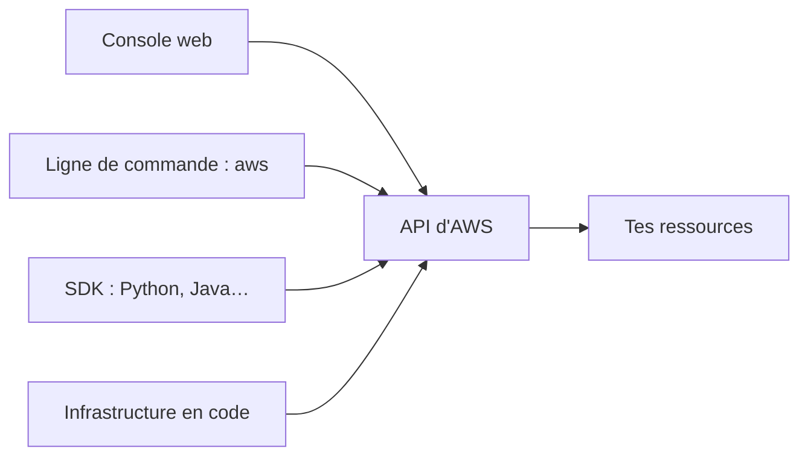

Ton association veut mettre en ligne un site pour sa collecte annuelle. Faut-il acheter un serveur, attendre sa livraison, l'installer dans un local… pour un pic de visites qui dure trois semaines ? Le **cloud** répond à cette question : tu loues ce dont tu as besoin, quand tu en as besoin, et tu le rends ensuite.

## Ce que le cloud change

Le *cloud computing* est la mise à disposition de ressources informatiques (calcul, stockage, bases de données…) **à la demande**, par Internet, avec un paiement **à l'usage**. AWS résume ce que cela change en six avantages :

| Avantage (formulation d'AWS) | Ce que cela veut dire |
| --- | --- |
| *Trade fixed expense for variable expense* | Tu remplaces un gros achat de matériel (dépense fixe) par une facture qui suit ta consommation (dépense variable). |
| *Benefit from massive economies of scale* | AWS achète pour des centaines de milliers de clients : son coût unitaire, donc ton prix, est plus bas que le tien. |
| *Stop guessing capacity* | Plus besoin de deviner la capacité des années à l'avance : tu ajustes à la hausse comme à la baisse. |
| *Increase speed and agility* | Une ressource est disponible en quelques minutes : tu peux essayer, te tromper, recommencer. |
| *Stop spending money running and maintaining data centers* | Tu ne gères plus de salle, d'électricité ni de matériel : tu te concentres sur ton projet. |
| *Go global in minutes* | Tu peux déployer près de tes utilisateur·rice·s, partout dans le monde, en quelques minutes. |

Trois mots reviennent souvent à l'examen :

- **Élasticité** : la capacité suit la demande, automatiquement, dans les deux sens.
- **Haute disponibilité** : le service reste accessible même quand un composant tombe en panne.
- **Agilité** : tu livres et tu expérimentes plus vite, parce que l'infrastructure n'est plus un frein.

## Trois modèles de déploiement

:::cards
### Cloud

Tout tourne chez le fournisseur. C'est le modèle des applications créées aujourd'hui.

### Hybride

Une partie reste dans tes locaux, une partie est dans le cloud, et les deux sont reliées. Fréquent pendant une migration.

### Sur site

Tout tourne dans tes locaux (*on-premises*), parfois avec des outils de virtualisation : on parle alors de « cloud privé ».
:::

## Quatre façons de parler à AWS

Tout ce que fait AWS passe par des **API** : des requêtes réseau du type « crée ce bucket » ou « liste mes serveurs ». Tu peux les envoyer de quatre façons.



| Moyen | Pour quoi faire |
| --- | --- |
| **Console** (*AWS Management Console*) | Explorer, apprendre, faire une action ponctuelle à la souris. |
| **Ligne de commande** (*AWS CLI*) | Automatiser dans un script, travailler vite au clavier. C'est l'outil de ces labos. |
| **SDK** (kits de développement) | Appeler AWS depuis ton programme : `boto3` pour Python, par exemple. |
| **Infrastructure en code** (*IaC*) | Décrire toute une infrastructure dans un fichier et la recréer à l'identique : AWS CloudFormation (leçon 11). |

Une opération ponctuelle peut se faire à la console. Dès qu'elle doit être **répétée** ou **relue par quelqu'un d'autre**, écris-la : script ou infrastructure en code.

## Ton labo : un émulateur local

Dans ces labos, la commande `aws` est la vraie, mais elle ne s'adresse pas à Amazon : elle parle à **MiniStack**, un émulateur qui tourne dans ton environnement. Commence par demander qui tu es :

```shell run
aws sts get-caller-identity
```

La réponse est un document **JSON** (un format texte fait de clés et de valeurs entre accolades). Tu y lis ton compte fictif, `000000000000`, et ton identité : `root`, l'utilisateur racine. Sur un vrai compte, on **n'utilise pas** l'utilisateur racine au quotidien (leçon 4) ; ici, il te sert de compte administrateur de labo.

```shell run
aws configure list
aws s3 ls
```

`aws configure list` montre d'où viennent tes réglages : une clé d'accès factice (`test`) et la région `eu-west-3` (Paris), fournies par des variables d'environnement. `aws s3 ls` liste tes **buckets**, les conteneurs dans lesquels le service de stockage **Amazon S3** range les fichiers : la liste est vide pour l'instant.

Une commande `aws` se lit toujours de la même façon : `aws <service> <opération> [options]`.

:::warning Ce qui diffère du vrai AWS
- Sur le vrai AWS, un nom de bucket est **unique au monde** : `asso-premiers-pas` y est peut-être déjà pris. Dans le labo, tu es seul·e.
- La console web n'existe pas dans le labo : tout se fait en ligne de commande.
- Rien n'est facturé ici. Sur un vrai compte, **chaque ressource créée peut coûter** : prends l'habitude de supprimer ce dont tu n'as plus besoin.
:::

## Entraîne-toi

Tu vas créer ton premier bucket, y déposer un fichier, puis relire son contenu de deux façons : avec la ligne de commande et avec un petit programme Python qui utilise le SDK `boto3`. Le programme `lister.py` est déjà dans ton dossier de travail :

```python
import boto3

for bucket in boto3.client("s3").list_buckets()["Buckets"]:
    print(bucket["Name"])
```

Il appelle l'opération `ListBuckets`, exactement comme `aws s3 ls` : la ligne de commande et le SDK envoient les mêmes requêtes à la même API.

:::lab
engine: real
intro: |
  L'émulateur AWS tourne dans ton environnement. Ton dossier de travail contient `bonjour.txt` et `lister.py`. Les étapes sont vérifiées par le serveur du portail sur l'état de l'émulateur et sur les fichiers que tu produis.
files:
  bonjour.txt: |
    Bonjour depuis le labo AWS de l'association.
  lister.py: |
    import boto3

    for bucket in boto3.client("s3").list_buckets()["Buckets"]:
        print(bucket["Name"])
commands:
  - demarrer-aws
steps:
  - text: "Demande à AWS qui tu es et garde la réponse : `aws sts get-caller-identity > identite.json`"
    hint: "Le signe > envoie la sortie de la commande dans un fichier."
    checks:
      - env-file-contains: [identite.json, '"Account": "000000000000"']
    solution:
      - aws sts get-caller-identity > identite.json
  - text: "Crée le bucket `asso-premiers-pas` avec `aws s3 mb`"
    hint: "mb veut dire « make bucket ». L'adresse d'un bucket s'écrit s3://nom-du-bucket."
    checks:
      - command-succeeds: 'aws s3api head-bucket --bucket asso-premiers-pas'
    solution:
      - aws s3 mb s3://asso-premiers-pas
  - text: "Dépose le fichier `bonjour.txt` dans ce bucket avec `aws s3 cp`"
    hint: "`aws s3 cp <fichier local> s3://<bucket>/<nom de l'objet>`"
    after: [2]
    checks:
      - command-succeeds: 'aws s3api head-object --bucket asso-premiers-pas --key bonjour.txt'
    solution:
      - aws s3 cp bonjour.txt s3://asso-premiers-pas/bonjour.txt
  - text: "Liste le contenu du bucket et garde le résultat : `aws s3 ls s3://asso-premiers-pas > contenu.txt`"
    after: [3]
    checks:
      - env-file-contains: [contenu.txt, 'bonjour\.txt']
    solution:
      - aws s3 ls s3://asso-premiers-pas > contenu.txt
  - text: "Fais la même demande avec le SDK Python : lance `python3 lister.py > buckets.txt`"
    hint: "Le programme affiche le nom de chaque bucket ; tu dois y retrouver le tien."
    after: [2]
    checks:
      - env-file-contains: [buckets.txt, '^asso-premiers-pas$']
    solution:
      - python3 lister.py > buckets.txt
:::

## Vérifie tes acquis

:::quiz
Une association remplace l'achat de trois serveurs par des ressources louées à l'heure. Quel avantage du cloud illustre-t-elle d'abord ?

- [ ] Le déploiement mondial en quelques minutes
- [x] L'échange d'une dépense fixe contre une dépense variable
- [ ] La haute disponibilité
- [ ] Le chiffrement des données

> Elle ne paie plus un investissement de départ, mais ce qu'elle consomme : une dépense fixe devient variable.
:::

:::quiz
Tu dois créer chaque semaine le même ensemble de ressources, à l'identique, et faire relire les changements par une collègue. Quel moyen d'accès choisis-tu ?

- [ ] La console web, parce qu'elle montre tout
- [ ] Un appel téléphonique au support AWS
- [x] L'infrastructure en code
- [ ] Un SDK appelé à la main depuis un interpréteur

> Un processus répétable et relisible s'écrit dans un fichier : c'est le rôle de l'infrastructure en code (ou, pour une suite de commandes simples, d'un script).
:::

:::quiz
Qu'est-ce que l'élasticité ?

- [x] La capacité qui s'ajuste à la demande, à la hausse comme à la baisse
- [ ] Le fait de garder des serveurs de secours allumés en permanence
- [ ] La possibilité de payer un an à l'avance
- [ ] Le fait de répartir une application sur plusieurs continents

> L'élasticité suit la demande dans les deux sens. Des secours allumés en permanence relèvent de la disponibilité, pas de l'élasticité.
:::

:::quiz
Une entreprise garde sa base de données dans ses locaux et place son site web sur AWS, les deux étant reliés. Quel est ce modèle de déploiement ?

- [ ] Cloud
- [ ] Sur site
- [ ] Multi-région
- [x] Hybride

> Le modèle hybride relie des ressources sur site et des ressources dans le cloud.
:::
