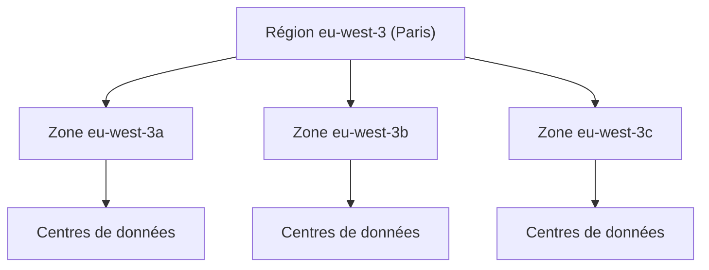

Un incendie détruit le centre de données où tourne ton site : que se passe-t-il ? Si tout était au même endroit, le site disparaît. AWS est construit pour que tu puisses éviter ce scénario, à condition de savoir **où** tu places tes ressources.

## Trois niveaux de géographie



- Une **région** (*Region*) est un lieu géographique où AWS exploite plusieurs zones de disponibilité : `eu-west-3` est Paris, `eu-west-1` l'Irlande, `us-east-1` la Virginie du Nord. Les régions sont **isolées** les unes des autres : une ressource créée à Paris n'existe pas en Irlande.
- Une **zone de disponibilité** (*Availability Zone*, ou AZ) regroupe un ou plusieurs centres de données dotés de leur propre alimentation électrique, de leur propre réseau et de leur propre connectivité. Les zones d'une même région sont distantes de plusieurs kilomètres (jusqu'à une centaine, selon AWS) pour ne pas subir la même panne, mais assez proches pour communiquer en quelques millisecondes. **Elles ne partagent pas de point de défaillance unique.**
- Un **point de présence** (*edge location*) est un petit site, proche des internautes, qui ne fait pas tourner tes serveurs : il sert de relais. Amazon CloudFront y garde des copies de tes pages et de tes images, et Amazon Route 53 y répond aux requêtes DNS. Il y en a beaucoup plus que de régions.

## Plusieurs zones : la haute disponibilité

Une application placée dans **une seule** zone s'arrête si cette zone est indisponible. La même application répartie sur **deux zones ou plus** continue de fonctionner : c'est la façon normale d'obtenir la **haute disponibilité** sur AWS.

Certains services le font pour toi. Amazon S3 Standard, par exemple, range chaque objet dans au moins trois zones sans que tu aies rien à configurer. Pour d'autres, comme les serveurs Amazon EC2, c'est à toi de répartir tes instances.

## Plusieurs régions : quatre raisons

Répartir sur plusieurs régions est plus coûteux et plus complexe. On le fait pour l'une de ces raisons :

| Raison | Exemple |
| --- | --- |
| **Reprise après sinistre** | Une copie des données dans une autre région survit à la perte de toute une région. |
| **Continuité d'activité** | Le service reste ouvert même si une région entière est injoignable. |
| **Faible latence** | Des utilisateur·rice·s au Japon sont servi·e·s depuis Tokyo plutôt que depuis Paris. |
| **Souveraineté des données** | Une loi impose que certaines données restent dans un pays donné. |

Pour **choisir** une région, on regarde dans l'ordre : les obligations légales, la proximité des utilisateur·rice·s, la disponibilité du service voulu (tous les services n'existent pas partout) et le prix (il varie d'une région à l'autre).

:::tip Régional, global ou zonal ?
La plupart des services sont **régionaux** : tu choisis la région de chaque ressource. Quelques-uns sont **globaux** et n'ont pas de région : IAM (les comptes et les droits), Route 53, CloudFront. D'autres ressources vivent dans **une zone** précise : une instance EC2, un volume de disque EBS.
:::

## Choisir la région dans une commande

Dans le labo, ta région par défaut est `eu-west-3`. Tu peux le vérifier, puis lister les zones de cette région :

```shell run
echo $AWS_DEFAULT_REGION
aws ec2 describe-availability-zones --query 'AvailabilityZones[].ZoneName' --output text
```

- `echo $AWS_DEFAULT_REGION` affiche la variable d'environnement dans laquelle le labo a rangé ta région par défaut.
- `--query` extrait une partie de la réponse (ici le nom de chaque zone) ; `--output text` l'affiche en texte simple plutôt qu'en JSON.

Pour agir dans une autre région, ajoute `--region` à **n'importe quelle** commande :

```shell run
aws ec2 describe-availability-zones --region eu-west-1 --query 'AvailabilityZones[].ZoneName' --output text
```

Chaque ressource a un identifiant unique, son **ARN** (*Amazon Resource Name*), qui contient sa région et son compte : `arn:aws:sns:eu-west-3:000000000000:alertes` est le sujet `alertes` du service SNS, à Paris, dans le compte `000000000000`.

:::warning Ce qui diffère du vrai AWS
L'émulateur connaît les noms des régions et sépare bien les ressources par région, mais tout tourne sur la même machine : tu ne mesureras ici ni latence, ni panne de zone.
:::

## Entraîne-toi

Tu vas constater par toi-même qu'une région est isolée : un sujet de notification créé à Paris n'existe pas en Irlande, et deux sujets de même nom peuvent coexister dans deux régions. **Amazon SNS** est un service de notification (leçon 10) ; un « sujet » (*topic*) y est simplement un canal nommé.

:::lab
engine: real
intro: |
  L'émulateur AWS tourne dans ton environnement, avec `eu-west-3` (Paris) comme région par défaut. Tu crées des ressources dans deux régions et tu observes qu'elles sont indépendantes.
commands:
  - demarrer-aws
steps:
  - text: "Garde la liste des zones de disponibilité de ta région : `aws ec2 describe-availability-zones --query 'AvailabilityZones[].ZoneName' --output text > zones.txt`"
    checks:
      - env-file-contains: [zones.txt, 'eu-west-3a']
    solution:
      - "aws ec2 describe-availability-zones --query 'AvailabilityZones[].ZoneName' --output text > zones.txt"
  - text: "Crée le sujet SNS `alertes` dans ta région par défaut avec `aws sns create-topic`"
    hint: "aws sns create-topic --name alertes"
    checks:
      - output-contains:
          - "aws sns list-topics --query 'Topics[].TopicArn' --output text"
          - 'arn:aws:sns:eu-west-3:000000000000:alertes'
    solution:
      - aws sns create-topic --name alertes
  - text: "Crée un second sujet `alertes`, cette fois en Irlande (`eu-west-1`)"
    hint: "Ajoute --region eu-west-1 à la commande précédente."
    checks:
      - output-contains:
          - "aws sns list-topics --region eu-west-1 --query 'Topics[].TopicArn' --output text"
          - 'arn:aws:sns:eu-west-1:000000000000:alertes'
    solution:
      - aws sns create-topic --name alertes --region eu-west-1
  - text: "Garde la liste des sujets de chaque région dans `paris.txt` et `irlande.txt` (commande `aws sns list-topics`, avec et sans `--region eu-west-1`)"
    hint: "aws sns list-topics --output text > paris.txt, puis la même avec --region eu-west-1 vers irlande.txt"
    after: [2, 3]
    checks:
      - env-file-contains: [paris.txt, 'sns:eu-west-3:']
      - env-file-contains: [irlande.txt, 'sns:eu-west-1:']
      - command-fails: 'grep -q "sns:eu-west-1:" paris.txt'
    solution:
      - aws sns list-topics --output text > paris.txt
      - aws sns list-topics --region eu-west-1 --output text > irlande.txt
  - text: "Crée le bucket `asso-copie-irlande` en Irlande, puis garde son emplacement : `aws s3api get-bucket-location --bucket asso-copie-irlande > emplacement.json`"
    hint: "aws s3 mb s3://asso-copie-irlande --region eu-west-1"
    checks:
      - env-file-contains: [emplacement.json, 'eu-west-1']
      - output-contains:
          - 'aws s3api get-bucket-location --bucket asso-copie-irlande --output text'
          - 'eu-west-1'
    solution:
      - aws s3 mb s3://asso-copie-irlande --region eu-west-1
      - aws s3api get-bucket-location --bucket asso-copie-irlande > emplacement.json
:::

## Vérifie tes acquis

:::quiz
Qu'est-ce qu'une zone de disponibilité ?

- [ ] Un pays dans lequel AWS a le droit de vendre ses services
- [x] Un ou plusieurs centres de données d'une région, avec leur propre alimentation et leur propre réseau
- [ ] Un petit site qui garde des copies de pages web près des internautes
- [ ] Un groupe de régions voisines

> Une zone regroupe un ou plusieurs centres de données isolés des autres zones de la région. Le site qui garde des copies près des internautes est un point de présence.
:::

:::quiz
Ton application tourne sur deux serveurs dans la même zone de disponibilité. Quelle évolution améliore le plus sa disponibilité, au moindre effort ?

- [ ] Doubler la taille des deux serveurs
- [ ] Déplacer les deux serveurs dans une autre région
- [x] Placer les deux serveurs dans deux zones différentes de la même région
- [ ] Ajouter un point de présence

> Deux zones ne partagent pas de point de défaillance unique : la panne d'une zone laisse un serveur en service. Changer de région sans répartir ne règle rien.
:::

:::quiz
Une loi impose que les dossiers médicaux restent en France. Quel critère dicte le choix de la région ?

- [x] La souveraineté des données
- [ ] La latence
- [ ] Le prix
- [ ] Le nombre de points de présence

> Une obligation légale de localisation passe avant tous les autres critères.
:::

:::quiz
Quel service utilise les points de présence pour rapprocher un contenu des internautes ?

- [ ] Amazon EC2
- [ ] AWS IAM
- [ ] Amazon EBS
- [x] Amazon CloudFront

> CloudFront est le réseau de diffusion de contenu d'AWS : il garde des copies dans les points de présence.
:::
