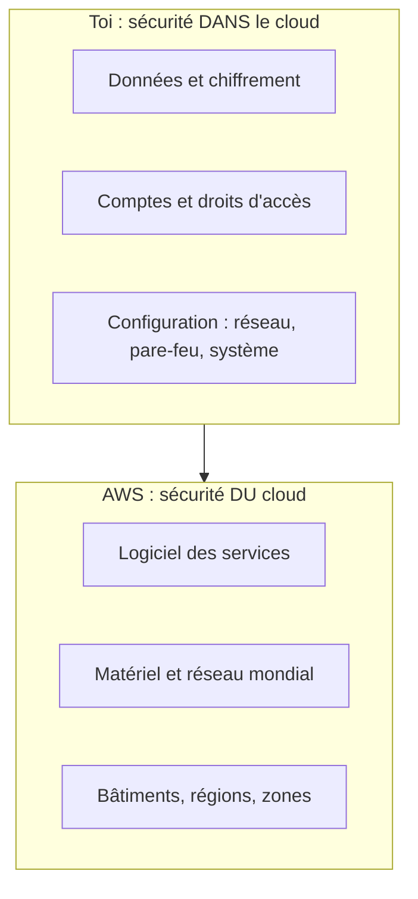

« Nos données sont chez AWS, donc elles sont en sécurité. » Cette phrase est à moitié vraie, et l'autre moitié a causé de nombreuses fuites de données. AWS sécurise ses centres de données ; il ne décide pas à ta place de qui a le droit de lire tes fichiers.

## Deux moitiés d'une même sécurité

AWS appelle ce partage le **modèle de responsabilité partagée** (*shared responsibility model*) :

- **AWS est responsable de la sécurité *du* cloud** : les bâtiments, le matériel, le réseau, et le logiciel qui fait tourner les services.
- **Tu es responsable de la sécurité *dans* le cloud** : tes données, les droits d'accès que tu accordes, la configuration de tes ressources.



## La frontière bouge selon le service

Plus un service est **géré** par AWS, plus AWS en fait, et moins il te reste à sécuriser. Trois exemples à connaître :

| Tâche | Amazon EC2 (serveur virtuel) | Amazon RDS (base de données gérée) | AWS Lambda (fonction sans serveur) |
| --- | --- | --- | --- |
| Sécurité physique, matériel | AWS | AWS | AWS |
| Mises à jour du système d'exploitation | **Toi** | AWS | AWS |
| Mises à jour du moteur (base de données, environnement d'exécution) | **Toi** | AWS | AWS |
| Règles de pare-feu, exposition au réseau | **Toi** | **Toi** | **Toi** (qui peut appeler la fonction) |
| Ton code et tes données | **Toi** | **Toi** | **Toi** |
| Comptes et droits d'accès (IAM) | **Toi** | **Toi** | **Toi** |

Deux lignes ne changent **jamais** de colonne : tes **données** et tes **droits d'accès** sont toujours de ta responsabilité, quel que soit le service.

## Ce qui est partagé

Certaines responsabilités existent des deux côtés, chacun pour sa couche :

- **Les correctifs** : AWS corrige l'infrastructure ; tu corriges le système et les applications de tes instances EC2.
- **La configuration** : AWS configure ses équipements ; tu configures tes systèmes, tes bases et tes applications.
- **La sensibilisation et la formation** : AWS forme son personnel ; tu formes le tien.

## Chiffrer : au repos et en transit

Le chiffrement rend une donnée illisible sans la bonne clé. Il y en a deux sortes, et l'examen attend que tu les distingues :

- **au repos** (*at rest*) : la donnée est chiffrée là où elle est stockée (un objet S3, un disque, une base) ;
- **en transit** (*in transit*) : la donnée est chiffrée pendant qu'elle voyage sur le réseau, grâce à TLS (le « s » de `https`).

AWS fournit les outils ; **décider** de les utiliser et **gérer les clés** fait partie de ta moitié. Amazon S3 chiffre aujourd'hui automatiquement tout nouvel objet avec des clés qu'il gère lui-même (on note ce mode SSE-S3) ; tu peux exiger à la place une clé du service **AWS KMS** (leçon 5), que tu contrôles et dont chaque usage est journalisé.

## Ta part du contrat sur un bucket

Voici trois réglages qui relèvent de toi sur un bucket S3. Dans le labo, le bucket `asso-adherents` existe déjà ; tu peux regarder son état de départ :

```shell run
aws s3api get-bucket-encryption --bucket asso-adherents
aws s3api get-bucket-versioning --bucket asso-adherents
aws s3api get-public-access-block --bucket asso-adherents
```

1. Le chiffrement par défaut vaut `AES256` : c'est SSE-S3.
2. La deuxième commande ne répond rien : le **versionnage** (garder les anciennes versions d'un objet) n'est pas activé.
3. La troisième échoue : aucun **blocage de l'accès public** n'est configuré sur ce bucket d'émulateur.

:::warning Ce qui diffère du vrai AWS
Sur le vrai AWS, un bucket neuf n'autorise aucun accès public et les quatre réglages de blocage de l'accès public y sont activés dès la création. L'émulateur, lui, ne les pose pas tout seul : c'est l'occasion de les appliquer toi-même. Il enregistre ces réglages mais ne simule pas d'internautes anonymes : tu ne pourras pas « tester » un accès public ici.
:::

Le blocage de l'accès public est fait de quatre interrupteurs. Activés tous les quatre, ils garantissent qu'aucune erreur de configuration ne rendra le bucket public :

```bash
aws s3api put-public-access-block --bucket asso-adherents \
  --public-access-block-configuration BlockPublicAcls=true,IgnorePublicAcls=true,BlockPublicPolicy=true,RestrictPublicBuckets=true
```

Le `\` en fin de ligne dit seulement au terminal que la commande continue à la ligne suivante.

## Entraîne-toi

Le bucket `asso-adherents` contient le fichier des adhérent·e·s : des données personnelles. AWS garantit que ses disques ne seront pas volés ; à toi de régler qui peut lire ce bucket, comment il est chiffré, et ce qui se passe si quelqu'un écrase le fichier.

:::lab
engine: real
intro: |
  Le bucket `asso-adherents` existe et contient `adherents.csv` (données fictives). Tu appliques trois protections qui relèvent du client dans le modèle de responsabilité partagée, puis tu vérifies que le versionnage te protège d'un écrasement.
files:
  adherents.csv: |
    id,prenom,ville
    1,Léa,Lyon
    2,Karim,Lille
commands:
  - demarrer-aws
  - 'aws s3api head-bucket --bucket asso-adherents 2>/dev/null || aws s3 mb s3://asso-adherents'
  - 'aws s3api head-object --bucket asso-adherents --key adherents.csv >/dev/null 2>&1 || aws s3 cp adherents.csv s3://asso-adherents/adherents.csv'
steps:
  - text: "Active les **quatre** réglages de blocage de l'accès public sur `asso-adherents` avec `aws s3api put-public-access-block`"
    hint: "La commande complète est dans la leçon : les quatre réglages valent true."
    checks:
      - output-contains:
          - "aws s3api get-public-access-block --bucket asso-adherents --query 'PublicAccessBlockConfiguration.[BlockPublicAcls,IgnorePublicAcls,BlockPublicPolicy,RestrictPublicBuckets]' --output text"
          - '^True\s+True\s+True\s+True$'
    solution:
      - aws s3api put-public-access-block --bucket asso-adherents --public-access-block-configuration BlockPublicAcls=true,IgnorePublicAcls=true,BlockPublicPolicy=true,RestrictPublicBuckets=true
  - text: "Exige un chiffrement au repos par une clé KMS : `aws s3api put-bucket-encryption` avec l'algorithme `aws:kms`"
    hint: "--server-side-encryption-configuration '{\"Rules\":[{\"ApplyServerSideEncryptionByDefault\":{\"SSEAlgorithm\":\"aws:kms\"}}]}'"
    checks:
      - output-contains:
          - "aws s3api get-bucket-encryption --bucket asso-adherents --query 'ServerSideEncryptionConfiguration.Rules[0].ApplyServerSideEncryptionByDefault.SSEAlgorithm' --output text"
          - '^aws:kms$'
    solution:
      - "aws s3api put-bucket-encryption --bucket asso-adherents --server-side-encryption-configuration '{\"Rules\":[{\"ApplyServerSideEncryptionByDefault\":{\"SSEAlgorithm\":\"aws:kms\"}}]}'"
  - text: "Active le versionnage du bucket avec `aws s3api put-bucket-versioning`"
    hint: "aws s3api put-bucket-versioning --bucket asso-adherents --versioning-configuration Status=Enabled"
    checks:
      - output-contains:
          - "aws s3api get-bucket-versioning --bucket asso-adherents --query Status --output text"
          - '^Enabled$'
    solution:
      - aws s3api put-bucket-versioning --bucket asso-adherents --versioning-configuration Status=Enabled
  - text: "Simule une erreur : ajoute une ligne à `adherents.csv` et renvoie-le dans le bucket. Garde ensuite la liste des versions : `aws s3api list-object-versions --bucket asso-adherents --prefix adherents.csv > versions.json`"
    hint: "echo '3,Erreur,Nulle part' >> adherents.csv, puis aws s3 cp adherents.csv s3://asso-adherents/adherents.csv"
    after: [3]
    checks:
      - output-contains:
          - "aws s3api list-object-versions --bucket asso-adherents --prefix adherents.csv --query 'length(Versions)' --output text"
          - '^[2-9]'
      - env-file-contains: [versions.json, '"IsLatest": false']
    solution:
      - "echo '3,Erreur,Nulle part' >> adherents.csv"
      - aws s3 cp adherents.csv s3://asso-adherents/adherents.csv
      - aws s3api list-object-versions --bucket asso-adherents --prefix adherents.csv > versions.json
:::

## Vérifie tes acquis

:::quiz
Dans le modèle de responsabilité partagée, de quoi AWS est-il responsable ?

- [ ] Du choix des personnes autorisées à lire tes fichiers
- [ ] Des mises à jour du système d'exploitation de tes instances EC2
- [x] De la sécurité physique des centres de données et du matériel
- [ ] Du chiffrement de tes données avant leur envoi

> AWS assure la sécurité « du » cloud : bâtiments, matériel, réseau, logiciel des services. Le reste relève du client.
:::

:::quiz
Tu remplaces une base PostgreSQL installée sur une instance EC2 par Amazon RDS. Quelle responsabilité passe de toi à AWS ?

- [x] Appliquer les mises à jour du système d'exploitation et du moteur de base de données
- [ ] Décider quels comptes peuvent se connecter à la base
- [ ] Classer et protéger les données stockées dans la base
- [ ] Régler les règles de pare-feu qui exposent la base

> Avec un service géré, AWS prend en charge le système et le moteur. Les données, les accès et l'exposition réseau restent à toi.
:::

:::quiz
Lequel de ces éléments est une responsabilité **partagée** entre AWS et le client ?

- [ ] La destruction des disques durs en fin de vie
- [ ] Le contrôle d'accès aux bâtiments
- [ ] Le contenu des fichiers déposés dans S3
- [x] L'application des correctifs de sécurité

> Chacun corrige sa couche : AWS l'infrastructure, le client ses systèmes et ses applications. Il en va de même pour la configuration et la formation.
:::

:::quiz
Un objet S3 est chiffré sur le disque, puis téléchargé en `https`. De quels chiffrements parle-t-on, dans l'ordre ?

- [ ] En transit, puis au repos
- [x] Au repos, puis en transit
- [ ] Au repos dans les deux cas
- [ ] En transit dans les deux cas

> Sur le disque, la donnée est « au repos » ; pendant le téléchargement, elle est « en transit », protégée par TLS.
:::
