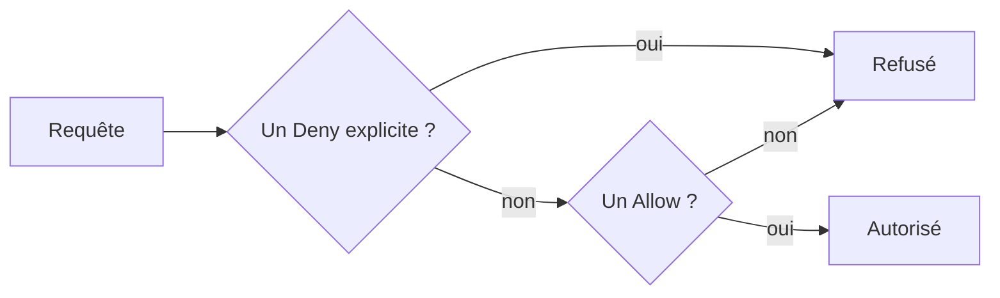

Une bénévole doit pouvoir consulter les comptes de l'association, rangés dans un bucket. Lui prêter ton mot de passe d'administrateur serait le plus rapide… et le plus dangereux : elle pourrait tout supprimer, et personne ne saurait qui a fait quoi. **AWS IAM** (*Identity and Access Management*) existe pour donner à chacun·e un accès personnel, limité à ce dont il ou elle a besoin.

## L'utilisateur racine

L'adresse électronique qui a servi à ouvrir un compte AWS en est l'**utilisateur racine** (*root user*). Il peut **tout** faire, et ses droits ne peuvent pas être limités. La règle est simple :

- on **ne l'utilise pas** pour le travail quotidien ;
- on le protège par un mot de passe solide et une **authentification multifacteur** (MFA : un second facteur, comme un code à usage unique, en plus du mot de passe) ;
- on **ne lui crée pas de clé d'accès**.

Il reste indispensable pour quelques opérations rares, par exemple : changer l'adresse électronique ou le mot de passe du compte racine, fermer un compte autonome, rétablir les droits du dernier administrateur IAM qui se serait retiré les siens, ou activer l'accès d'IAM à la console de facturation.

:::warning Dans le labo, tu es l'utilisateur racine
L'émulateur te connecte comme `root` du compte fictif `000000000000`, avec une clé factice (`test`). C'est pratique pour apprendre, et c'est exactement ce qu'il ne faut **pas** faire sur un vrai compte. La première chose à créer sur un vrai compte est un accès d'administration distinct de la racine.
:::

## Les quatre briques d'IAM

:::cards
### Utilisateur

Une identité durable pour **une** personne ou **une** application, avec ses propres identifiants : mot de passe pour la console, **clé d'accès** pour la ligne de commande et les SDK.

### Groupe

Un ensemble d'utilisateurs. On donne les droits au groupe, pas à chaque personne : ajouter quelqu'un au groupe suffit.

### Rôle

Une identité **sans identifiants permanents**, que l'on « endosse » pour un temps limité. Un service AWS, une application ou une personne d'un autre compte peut endosser un rôle.
:::

La quatrième brique est la **politique** (*policy*) : un document JSON qui autorise ou interdit des actions. Sans politique, une identité n'a **aucun** droit.

```json
{
  "Version": "2012-10-17",
  "Statement": [
    {
      "Effect": "Allow",
      "Action": ["s3:GetObject"],
      "Resource": ["arn:aws:s3:::asso-comptes/*"]
    },
    {
      "Effect": "Allow",
      "Action": ["s3:ListBucket"],
      "Resource": ["arn:aws:s3:::asso-comptes"]
    }
  ]
}
```

- `"Version": "2012-10-17"` : la version du langage des politiques. On la recopie telle quelle.
- `"Statement"` : la liste des règles. Il y en a deux ici.
- `"Effect"` : `Allow` autorise, `Deny` interdit.
- `"Action"` : les opérations concernées, sous la forme `service:Opération`.
- `"Resource"` : les ressources visées, désignées par leur ARN. `asso-comptes/*` désigne **les objets** du bucket ; `asso-comptes` désigne **le bucket lui-même**. Lire un objet porte sur les objets, lister porte sur le bucket : d'où les deux règles.

Cette politique applique le **principe du moindre privilège** : n'accorder que les droits nécessaires à la tâche, rien de plus.

## Comment AWS décide



Trois règles à retenir : tout est **refusé par défaut** ; un `Allow` autorise ; un `Deny` explicite **l'emporte toujours** sur un `Allow`.

AWS fournit des politiques toutes faites, les **politiques gérées par AWS** (*AWS managed policies*), comme `ReadOnlyAccess`. Celles que tu écris sont des politiques **gérées par le client**. Tu peux lister quelques politiques d'AWS :

```shell run
aws iam list-policies --scope AWS --max-items 5 --query 'Policies[].PolicyName'
```

## Clés d'accès et profils

Pour la ligne de commande, un utilisateur s'identifie avec une **clé d'accès** : un identifiant (`AKIA…`) et une clé secrète. La clé secrète n'est montrée **qu'une fois**, à la création.

L'AWS CLI range les identifiants dans des **profils**. `aws configure --profile lea` te demande la clé, la clé secrète, la région et le format de sortie, et les enregistre sous le nom `lea`. Ensuite, `--profile lea` ajouté à une commande l'exécute **en tant que** Léa :

```bash
aws sts get-caller-identity --profile lea
```

:::danger Une clé secrète est un mot de passe
Ne l'écris jamais dans un dépôt Git, un ticket ou une messagerie. Pour des personnes, AWS recommande d'ailleurs d'éviter les clés durables et d'utiliser des identifiants temporaires, fournis par **AWS IAM Identity Center** (une connexion unique pour tous tes comptes AWS, qui peut s'appuyer sur l'annuaire de ton organisation : on parle alors d'identité **fédérée**). Dans le labo, la clé de Léa est fictive et disparaît avec l'environnement.
:::

## Entraîne-toi

Tu crées le groupe `benevoles`, tu lui donnes le droit de **lire** le bucket `asso-comptes`, puis tu crées l'utilisatrice `lea` et tu agis en son nom. Dans ce labo, l'émulateur **applique réellement** les politiques IAM : Léa pourra lire, et sera refusée dès qu'elle tentera d'écrire.

Crée d'abord le fichier de la politique (le bouton ci-dessous l'écrit dans ton dossier de travail) :

```json file=lecture-comptes.json
{
  "Version": "2012-10-17",
  "Statement": [
    {
      "Effect": "Allow",
      "Action": ["s3:GetObject"],
      "Resource": ["arn:aws:s3:::asso-comptes/*"]
    },
    {
      "Effect": "Allow",
      "Action": ["s3:ListBucket"],
      "Resource": ["arn:aws:s3:::asso-comptes"]
    }
  ]
}
```

Pour enregistrer la clé de Léa dans un profil sans la recopier à la main, tu peux la lire dans le fichier JSON avec `jq`, un outil qui extrait une valeur d'un document JSON :

```bash
aws iam create-access-key --user-name lea > cle-lea.json
aws configure set aws_access_key_id "$(jq -r .AccessKey.AccessKeyId cle-lea.json)" --profile lea
aws configure set aws_secret_access_key "$(jq -r .AccessKey.SecretAccessKey cle-lea.json)" --profile lea
```

:::lab
engine: real
intro: |
  Le bucket `asso-comptes` existe et contient `bilan.txt`. Tu es l'utilisateur racine du compte fictif. Tu construis un accès en lecture seule pour une bénévole, puis tu vérifies ses limites. L'émulateur évalue vraiment les politiques IAM.
files:
  bilan.txt: |
    Bilan fictif : recettes 1200, dépenses 950.
commands:
  - demarrer-aws
  - 'aws s3api head-bucket --bucket asso-comptes 2>/dev/null || aws s3 mb s3://asso-comptes'
  - aws s3 cp bilan.txt s3://asso-comptes/bilan.txt
steps:
  - text: "Crée le groupe `benevoles` avec `aws iam create-group`"
    hint: "aws iam create-group --group-name benevoles"
    checks:
      - command-succeeds: 'aws iam get-group --group-name benevoles'
    solution:
      - aws iam create-group --group-name benevoles
  - text: "Écris `lecture-comptes.json` (la politique de la leçon), puis enregistre-la dans IAM sous le nom `lecture-comptes` avec `aws iam create-policy`"
    hint: "aws iam create-policy --policy-name lecture-comptes --policy-document file://lecture-comptes.json"
    checks:
      - command-succeeds: 'aws iam get-policy --policy-arn arn:aws:iam::000000000000:policy/lecture-comptes'
      - env-file-contains: [lecture-comptes.json, 'arn:aws:s3:::asso-comptes/\*']
      - command-fails: 'grep -q "s3:\*" lecture-comptes.json'
    solution:
      - write:
          lecture-comptes.json: |
            {
              "Version": "2012-10-17",
              "Statement": [
                {
                  "Effect": "Allow",
                  "Action": ["s3:GetObject"],
                  "Resource": ["arn:aws:s3:::asso-comptes/*"]
                },
                {
                  "Effect": "Allow",
                  "Action": ["s3:ListBucket"],
                  "Resource": ["arn:aws:s3:::asso-comptes"]
                }
              ]
            }
      - aws iam create-policy --policy-name lecture-comptes --policy-document file://lecture-comptes.json
  - text: "Rattache la politique au groupe `benevoles` avec `aws iam attach-group-policy` (son ARN est `arn:aws:iam::000000000000:policy/lecture-comptes`)"
    after: [1, 2]
    checks:
      - output-contains:
          - "aws iam list-attached-group-policies --group-name benevoles --query 'AttachedPolicies[].PolicyName' --output text"
          - 'lecture-comptes'
    solution:
      - aws iam attach-group-policy --group-name benevoles --policy-arn arn:aws:iam::000000000000:policy/lecture-comptes
  - text: "Crée l'utilisatrice `lea` et ajoute-la au groupe `benevoles` (`aws iam create-user`, puis `aws iam add-user-to-group`)"
    after: [1]
    checks:
      - output-contains:
          - "aws iam get-group --group-name benevoles --query 'Users[].UserName' --output text"
          - '\blea\b'
    solution:
      - aws iam create-user --user-name lea
      - aws iam add-user-to-group --user-name lea --group-name benevoles
  - text: "Crée une clé d'accès pour `lea` et enregistre-la dans le profil `lea` de l'AWS CLI (voir les trois commandes de la leçon)"
    hint: "Vérifie ensuite avec : aws sts get-caller-identity --profile lea"
    after: [4]
    checks:
      - output-contains:
          - 'aws sts get-caller-identity --profile lea --query Arn --output text'
          - 'user/lea$'
    solution:
      - aws iam create-access-key --user-name lea > cle-lea.json
      - 'aws configure set aws_access_key_id "$(jq -r .AccessKey.AccessKeyId cle-lea.json)" --profile lea'
      - 'aws configure set aws_secret_access_key "$(jq -r .AccessKey.SecretAccessKey cle-lea.json)" --profile lea'
  - text: "En tant que Léa (`--profile lea`), télécharge `bilan.txt` sous le nom `lu.txt`, puis tente d'envoyer `lu.txt` dans le bucket sous le nom `pirate.txt` en gardant l'erreur dans `refus.txt`"
    hint: "Pour garder un message d'erreur : ajoute 2> refus.txt à la fin de la commande."
    after: [3, 5]
    checks:
      - env-file-contains: [lu.txt, 'Bilan fictif']
      - env-file-contains: [refus.txt, 'AccessDenied']
      - command-succeeds: 'aws s3api head-object --bucket asso-comptes --key bilan.txt > /dev/null && ! aws s3api head-object --bucket asso-comptes --key pirate.txt > /dev/null 2>&1'
    solution:
      - aws s3 cp s3://asso-comptes/bilan.txt lu.txt --profile lea
      - 'aws s3 cp lu.txt s3://asso-comptes/pirate.txt --profile lea 2> refus.txt || true'
:::

## Vérifie tes acquis

:::quiz
Quelle est la bonne façon de traiter l'utilisateur racine d'un compte AWS ?

- [ ] S'en servir chaque jour, puisqu'il a tous les droits
- [ ] Lui créer une clé d'accès pour les scripts d'administration
- [x] Le protéger par une MFA et ne s'en servir que pour les rares tâches qui l'exigent
- [ ] Le supprimer une fois les premiers utilisateurs IAM créés

> L'utilisateur racine ne peut être ni limité ni supprimé : on le protège (mot de passe solide, MFA, pas de clé d'accès) et on ne l'utilise que pour les tâches qui l'exigent.
:::

:::quiz
Cinq bénévoles ont besoin des mêmes droits de lecture. Quelle organisation est la plus simple à maintenir ?

- [ ] Recopier la politique sur chacun des cinq utilisateurs
- [x] Rattacher la politique à un groupe et y placer les cinq utilisateurs
- [ ] Partager une même clé d'accès entre les cinq personnes
- [ ] Donner à chacun la politique `AdministratorAccess`

> Les droits se donnent au groupe : un départ ou une arrivée se règle en modifiant la composition du groupe. Partager une clé empêche de savoir qui a fait quoi.
:::

:::quiz
Une identité reçoit une politique qui autorise `s3:*` et une autre qui interdit (`Deny`) `s3:DeleteObject`. Peut-elle supprimer un objet ?

- [ ] Oui, car l'autorisation est la plus large
- [ ] Oui, si l'autorisation a été rattachée en dernier
- [ ] Cela dépend de la région
- [x] Non, un `Deny` explicite l'emporte toujours

> L'ordre de rattachement ne compte pas : une interdiction explicite gagne sur toute autorisation.
:::

:::quiz
Une application qui tourne sur AWS doit lire un bucket. Que lui donnes-tu, de préférence ?

- [x] Un rôle IAM, qui lui fournit des identifiants temporaires
- [ ] La clé d'accès de l'utilisateur racine
- [ ] Le mot de passe d'un administrateur
- [ ] Un groupe IAM

> Un rôle évite de stocker une clé durable : le service obtient des identifiants temporaires, renouvelés automatiquement. Un groupe ne contient que des utilisateurs.
:::
