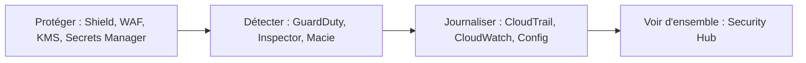

Un matin, la base de données de l'association a disparu. Qui l'a supprimée ? Depuis où ? Et le mot de passe de cette base, était-il écrit en clair dans un fichier ? Pour répondre, il faut avoir pensé **avant** à trois choses : protéger les secrets, tenir un journal, et savoir où regarder.

## Qui répond à quelle question ?

L'examen ne te demande pas de configurer ces services, mais de **reconnaître** lequel convient. Retiens la question à laquelle chacun répond.

### Journaliser et surveiller

| Service | La question à laquelle il répond |
| --- | --- |
| **AWS CloudTrail** | *Qui a fait quoi, quand et depuis où ?* Il enregistre les appels aux API d'AWS. L'historique des 90 derniers jours d'événements de gestion est disponible sans rien configurer ; pour garder plus longtemps, on crée un *trail* qui écrit dans un bucket S3. |
| **Amazon CloudWatch** | *Comment se portent mes ressources ?* Mesures (processeur, erreurs…), journaux applicatifs, et **alarmes** quand un seuil est franchi. |
| **AWS Config** | *Comment cette ressource était-elle configurée, et respecte-t-elle mes règles ?* Il garde l'historique des configurations et les évalue. |

### Détecter

| Service | Ce qu'il fait |
| --- | --- |
| **Amazon GuardDuty** | Détection de **menaces** : il analyse en continu des journaux (événements CloudTrail, journaux de flux réseau, requêtes DNS) et signale les comportements suspects. |
| **Amazon Inspector** | Recherche de **vulnérabilités** logicielles et d'expositions réseau involontaires sur les instances EC2, les images de conteneurs et les fonctions Lambda. |
| **Amazon Macie** | Découverte de **données sensibles** (données personnelles, par exemple) dans les buckets S3. |
| **AWS Security Hub** | **Vue d'ensemble** : il regroupe les alertes des autres services et vérifie les bonnes pratiques de sécurité. |
| **AWS Trusted Advisor** | Des **recommandations** automatiques, dont des contrôles de sécurité (leçon 12). |

### Protéger

| Service | Ce qu'il fait |
| --- | --- |
| **AWS Shield** | Protection contre les attaques par déni de service (DDoS). *Shield Standard* protège tous les clients automatiquement, sans supplément ; *Shield Advanced* est une offre payante plus poussée. |
| **AWS WAF** | Pare-feu **applicatif web** : il filtre les requêtes HTTP malveillantes (injection SQL, par exemple). |
| **AWS Firewall Manager** | Gestion centralisée des règles de pare-feu sur plusieurs comptes. |
| **AWS KMS** | Création et contrôle des **clés de chiffrement**. |
| **AWS Secrets Manager** | Stockage des **secrets** (mots de passe, clés d'API) avec **rotation** automatique possible. |
| **AWS Systems Manager Parameter Store** | Stockage de **paramètres** de configuration, chiffrés ou non. |



## Prouver la conformité

Ton organisation doit parfois **prouver** qu'elle respecte une norme (ISO 27001, PCI DSS pour les paiements par carte…). Deux choses à savoir :

- **AWS Artifact** est le portail où tu télécharges à la demande les rapports d'audit et de conformité d'AWS (rapports SOC, certifications ISO…), et où tu gères certains accords avec AWS.
- Les obligations varient selon le **pays** et le **secteur**, et tous les services n'ont pas les mêmes attestations. La conformité d'AWS couvre **sa** moitié du modèle de responsabilité partagée ; la tienne reste à démontrer.

Pour t'informer, AWS publie un *Security Center*, un *Security Blog* et un *Knowledge Center* (des réponses aux questions fréquentes). Des produits de sécurité d'éditeurs tiers sont vendus sur **AWS Marketplace**.

## Trois gestes concrets

Un secret ne s'écrit pas dans le code. On le range dans Secrets Manager, et l'application le demande au moment où elle en a besoin :

```bash
aws secretsmanager create-secret --name asso/bdd --secret-string 'mot-de-passe-factice-42'
aws secretsmanager get-secret-value --secret-id asso/bdd --query SecretString --output text
```

Une clé KMS se crée en une commande. On lui donne ensuite un **alias**, un nom lisible qui commence toujours par `alias/` :

```bash
aws kms create-key --description "Donnees de l'association"
aws kms create-alias --alias-name alias/asso-donnees --target-key-id <identifiant de la clé>
```

La **rotation** remplace régulièrement le matériel cryptographique d'une clé sans que tu aies à modifier tes applications. Activée, elle a lieu chaque année par défaut. L'opération attend l'**identifiant** de la clé, pas son alias :

```bash
aws kms enable-key-rotation --key-id <identifiant de la clé>
```

Enfin, CloudTrail répond à « qui a fait quoi ». Tu peux lister les derniers événements de ton labo :

```shell run
aws cloudtrail lookup-events --max-results 5 --query 'Events[].[EventTime,EventName,Username]' --output text
```

:::warning Ce qui diffère du vrai AWS
- GuardDuty, Inspector, Macie, Security Hub, Shield, Artifact et Trusted Advisor ne sont **pas émulés** : ils se découvrent par la lecture.
- Le CloudTrail de l'émulateur garde seulement les 2 000 derniers appels en mémoire, et nomme mal les événements de quelques services (tu verras parfois `POST.iam` au lieu du nom de l'opération). Sur le vrai AWS, un événement peut aussi mettre quelques minutes à apparaître.
- Le KMS de l'émulateur imite l'API, pas la solidité cryptographique d'un vrai service de clés.
:::

:::tip Secrets Manager ou Parameter Store ?
Un **secret** qui doit changer régulièrement (mot de passe de base de données) va dans Secrets Manager, qui sait organiser sa rotation. Un simple **réglage** (une adresse, un nom de file) va dans Parameter Store.
:::

## Entraîne-toi

Tu ranges le mot de passe (fictif) de la base de l'association, tu crées une clé de chiffrement avec rotation, tu enregistres un paramètre de configuration, puis tu retrouves dans CloudTrail la trace de ce que tu viens de faire.

Pour retrouver l'identifiant d'une clé à partir de son alias :

```bash
aws kms describe-key --key-id alias/asso-donnees --query KeyMetadata.KeyId --output text
```

:::lab
engine: real
intro: |
  Tu es l'utilisateur racine du compte fictif. Toutes les valeurs manipulées sont factices. Les étapes sont vérifiées sur l'état de l'émulateur.
commands:
  - demarrer-aws
steps:
  - text: "Range le secret `asso/bdd` dans Secrets Manager, avec la valeur factice `mot-de-passe-factice-42`"
    hint: "aws secretsmanager create-secret --name asso/bdd --secret-string 'mot-de-passe-factice-42'"
    checks:
      - output-contains:
          - 'aws secretsmanager get-secret-value --secret-id asso/bdd --query SecretString --output text'
          - '^mot-de-passe-factice-42$'
    solution:
      - "aws secretsmanager create-secret --name asso/bdd --secret-string 'mot-de-passe-factice-42'"
  - text: "Crée une clé KMS et donne-lui l'alias `alias/asso-donnees`"
    hint: "aws kms create-key affiche l'identifiant (KeyId) à passer à aws kms create-alias --target-key-id."
    checks:
      - output-contains:
          - 'aws kms describe-key --key-id alias/asso-donnees --query KeyMetadata.KeyState --output text'
          - '^Enabled$'
    solution:
      - 'aws kms create-alias --alias-name alias/asso-donnees --target-key-id "$(aws kms create-key --description "Donnees de l association" --query KeyMetadata.KeyId --output text)"'
  - text: "Active la rotation automatique de cette clé avec `aws kms enable-key-rotation`"
    hint: "Il faut l'identifiant de la clé : aws kms describe-key --key-id alias/asso-donnees --query KeyMetadata.KeyId --output text"
    after: [2]
    checks:
      - output-contains:
          - 'aws kms get-key-rotation-status --key-id "$(aws kms describe-key --key-id alias/asso-donnees --query KeyMetadata.KeyId --output text)" --query KeyRotationEnabled --output text'
          - '^True$'
    solution:
      - 'aws kms enable-key-rotation --key-id "$(aws kms describe-key --key-id alias/asso-donnees --query KeyMetadata.KeyId --output text)"'
  - text: "Enregistre le paramètre `/asso/site/domaine` de type `String`, avec la valeur `asso.example`, dans Parameter Store (`aws ssm put-parameter`)"
    hint: "aws ssm put-parameter --name /asso/site/domaine --value asso.example --type String"
    checks:
      - output-contains:
          - 'aws ssm get-parameter --name /asso/site/domaine --query Parameter.Value --output text'
          - '^asso\.example$'
    solution:
      - aws ssm put-parameter --name /asso/site/domaine --value asso.example --type String
  - text: "Retrouve dans CloudTrail la création du secret et garde l'événement : `aws cloudtrail lookup-events --lookup-attributes AttributeKey=EventName,AttributeValue=CreateSecret > audit.json`"
    after: [1]
    checks:
      - env-file-contains: [audit.json, '"EventName": "CreateSecret"']
      - env-file-contains: [audit.json, 'secretsmanager\.amazonaws\.com']
    solution:
      - aws cloudtrail lookup-events --lookup-attributes AttributeKey=EventName,AttributeValue=CreateSecret > audit.json
:::

## Vérifie tes acquis

:::quiz
Une ressource a été supprimée hier. Quel service te dit **qui** a lancé la suppression ?

- [ ] Amazon CloudWatch
- [x] AWS CloudTrail
- [ ] Amazon Inspector
- [ ] AWS Artifact

> CloudTrail enregistre les appels aux API : l'identité, l'heure, l'adresse d'origine. CloudWatch mesure la santé des ressources, il ne dit pas qui a agi.
:::

:::quiz
Ton auditrice demande le rapport SOC 2 d'AWS. Où le trouves-tu ?

- [ ] Dans AWS Config
- [ ] Dans AWS Trusted Advisor
- [ ] Dans Amazon GuardDuty
- [x] Dans AWS Artifact

> AWS Artifact donne accès à la demande aux rapports d'audit et de conformité d'AWS.
:::

:::quiz
Quel service détecte qu'une instance EC2 communique avec une adresse connue pour être malveillante ?

- [x] Amazon GuardDuty
- [ ] Amazon Macie
- [ ] AWS KMS
- [ ] AWS Shield

> GuardDuty analyse les journaux (réseau, DNS, CloudTrail) pour repérer des menaces. Macie cherche des données sensibles dans S3 ; Shield protège des attaques par déni de service.
:::

:::quiz
Une application a besoin du mot de passe d'une base, qui doit changer tous les 30 jours sans intervention. Où le ranger ?

- [ ] Dans une variable écrite dans le code source
- [ ] Dans un fichier du bucket S3 de l'application
- [x] Dans AWS Secrets Manager, avec la rotation activée
- [ ] Dans une étiquette (tag) de l'instance

> Secrets Manager stocke le secret, contrôle qui le lit et sait organiser sa rotation automatique.
:::
