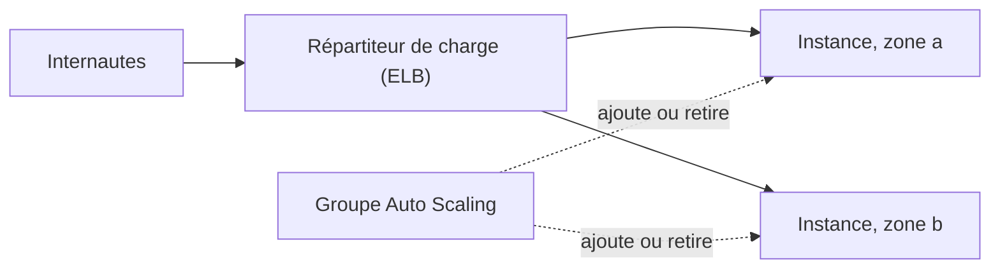

Le site de la collecte reçoit dix visites par heure en temps normal, et dix mille le soir du lancement. Un seul gros serveur allumé toute l'année coûterait cher pour rien ; un petit serveur s'effondrerait le jour J. Les services de **calcul** d'AWS se distinguent justement par ce que tu dois gérer toi-même… et par leur façon de suivre la demande.

## Trois niveaux de prise en charge

:::cards
### Amazon EC2

Des **serveurs virtuels**, appelés instances. Tu choisis le système, tu l'installes, tu le mets à jour. Contrôle maximal, travail maximal.

### Conteneurs

Ton application et ses dépendances dans une image. **Amazon ECS** (l'orchestrateur d'AWS) ou **Amazon EKS** (Kubernetes géré) les font tourner ; **AWS Fargate** les exécute sans que tu gères de serveur.

### AWS Lambda

Tu fournis une **fonction** ; AWS l'exécute à chaque événement et tu paies à l'appel et à la durée. Aucun serveur à gérer : c'est le calcul « sans serveur » (*serverless*).
:::

D'autres noms à reconnaître : **AWS Elastic Beanstalk** déploie une application web en créant pour toi les instances, le répartiteur de charge et la mise à l'échelle ; **Amazon Lightsail** propose des serveurs simples à prix fixe ; **AWS Batch** exécute des traitements par lots.

| Besoin | Bon candidat |
| --- | --- |
| Un logiciel ancien qui exige un système précis, ou un contrôle complet du serveur | EC2 |
| Une application déjà en conteneurs, sans serveur à administrer | ECS ou EKS, avec Fargate |
| Un traitement court déclenché par un événement (un fichier arrive, une requête HTTP…) | Lambda |

Une fonction Lambda s'exécute au maximum **15 minutes** : au-delà, il faut un autre service.

## Les familles d'instances EC2

Le nom d'un type d'instance, comme `t3.micro`, se lit : une **famille** (`t`), une **génération** (`3`) et une **taille** (`micro`). Les familles sont regroupées par usage :

| Catégorie | Pour quoi faire |
| --- | --- |
| Usage général (*general purpose*) | Un équilibre entre processeur, mémoire et réseau : sites web, petites bases. |
| Optimisé pour le calcul (*compute optimized*) | Beaucoup de processeur : traitement par lots, encodage vidéo, serveurs de jeu. |
| Optimisé pour la mémoire (*memory optimized*) | Grosses bases de données en mémoire, analyse de gros volumes. |
| Optimisé pour le stockage (*storage optimized*) | Lectures et écritures très intensives sur des disques locaux. |
| Calcul accéléré (*accelerated computing*) | Cartes graphiques ou accélérateurs : apprentissage automatique, rendu 3D. |
| Calcul haute performance (*HPC*) | Simulations scientifiques à grande échelle. |

Une instance se crée à partir d'une **AMI** (*Amazon Machine Image*), le modèle qui contient le système d'exploitation.

## L'élasticité : Auto Scaling et répartiteur de charge



- Un **groupe Auto Scaling** ajoute des instances quand la charge monte et en retire quand elle baisse : c'est lui qui apporte l'**élasticité**. Il remplace aussi une instance en panne.
- Un **répartiteur de charge** (*Elastic Load Balancing*) distribue les requêtes entre les instances saines, sur plusieurs zones de disponibilité : c'est lui qui apporte la **haute disponibilité** et offre une adresse d'entrée unique.

## Lancer une instance

Dans le labo, liste les images disponibles, puis lance une instance à partir de l'une d'elles :

```shell run
aws ec2 describe-images --owners amazon --query 'Images[].[ImageId,Name]' --output text
```

```bash
aws ec2 run-instances --image-id <identifiant de l'AMI> --instance-type t3.micro \
  --tag-specifications 'ResourceType=instance,Tags=[{Key=Name,Value=web-1}]'
```

- `--image-id` : l'AMI à utiliser ; `--instance-type` : la taille de la machine.
- `--tag-specifications` pose une **étiquette** (*tag*) `Name=web-1` : c'est ainsi qu'on donne un nom à une instance.

Une instance **arrêtée** (*stopped*) garde son disque et peut redémarrer ; une instance **résiliée** (*terminated*) est supprimée.

:::warning Ce qui diffère du vrai AWS
Dans l'émulateur, une instance EC2 est une **fiche** : aucun serveur ne démarre, tu ne peux pas t'y connecter, et l'émulateur accepte même un type d'instance qui n'existe pas. Sur le vrai AWS, une instance lancée est **facturée** tant qu'elle tourne. Les fonctions Lambda du labo, elles, s'exécutent vraiment, dans un processus Python local.
:::

## Déployer une fonction Lambda

Une fonction Python tient en quelques lignes. AWS appelle la fonction désignée, ici `handler`, avec l'**événement** reçu :

```python
def handler(event, context):
    prenom = event.get("prenom", "toi")
    print("Demande reçue pour", prenom)
    return {"message": "Bonjour " + prenom}
```

On l'envoie sous forme d'archive ZIP, en précisant l'environnement d'exécution, le point d'entrée (`fichier.fonction`) et le **rôle** IAM que la fonction endossera :

```bash
zip fonction.zip bonjour.py
aws lambda create-function --function-name bonjour --runtime python3.13 \
  --handler bonjour.handler --zip-file fileb://fonction.zip \
  --role arn:aws:iam::000000000000:role/role-lambda-labo
```

On l'appelle avec `invoke`, en lui passant un événement JSON ; la réponse est écrite dans un fichier :

```bash
aws lambda invoke --function-name bonjour --cli-binary-format raw-in-base64-out \
  --payload '{"prenom": "Karim"}' reponse.json
```

Ce que la fonction affiche avec `print` part dans **Amazon CloudWatch Logs**, dans le groupe de journaux `/aws/lambda/bonjour`.

:::tip Un rôle, pas une clé
La fonction ne contient aucun identifiant : elle reçoit des identifiants temporaires grâce à son rôle. C'est le moyen normal de donner des droits à du code qui tourne sur AWS.
:::

## Entraîne-toi

Tu lances une instance pour le site, tu l'arrêtes, puis tu déploies la fonction `bonjour` et tu lis son journal. Le fichier `bonjour.py` et le rôle `role-lambda-labo` sont déjà prêts.

:::lab
engine: real
intro: |
  Ton dossier de travail contient `bonjour.py`. Le rôle IAM `role-lambda-labo`, que la fonction endossera, existe déjà. Les étapes sont vérifiées sur l'état de l'émulateur.
files:
  bonjour.py: |
    def handler(event, context):
        prenom = event.get("prenom", "toi")
        print("Demande reçue pour", prenom)
        return {"message": "Bonjour " + prenom}
  confiance-lambda.json: |
    {
      "Version": "2012-10-17",
      "Statement": [
        {
          "Effect": "Allow",
          "Principal": {"Service": "lambda.amazonaws.com"},
          "Action": "sts:AssumeRole"
        }
      ]
    }
commands:
  - demarrer-aws
  - 'aws iam get-role --role-name role-lambda-labo >/dev/null 2>&1 || aws iam create-role --role-name role-lambda-labo --assume-role-policy-document file://confiance-lambda.json'
steps:
  - text: "Lance une instance de type `t3.micro` portant l'étiquette `Name=web-1`, à partir d'une AMI listée par `aws ec2 describe-images --owners amazon`"
    hint: "La commande aws ec2 run-instances de la leçon, avec l'identifiant d'AMI que tu as relevé."
    checks:
      - output-contains:
          - "aws ec2 describe-instances --filters Name=tag:Name,Values=web-1 --query 'Reservations[].Instances[].InstanceType' --output text"
          - '\bt3\.micro\b'
    solution:
      - "aws ec2 run-instances --image-id \"$(aws ec2 describe-images --owners amazon --query 'Images[0].ImageId' --output text)\" --instance-type t3.micro --tag-specifications 'ResourceType=instance,Tags=[{Key=Name,Value=web-1}]'"
  - text: "Arrête l'instance `web-1` avec `aws ec2 stop-instances` (sans la résilier)"
    hint: "Retrouve son identifiant : aws ec2 describe-instances --filters Name=tag:Name,Values=web-1 --query 'Reservations[].Instances[].InstanceId' --output text"
    after: [1]
    checks:
      - output-contains:
          - "aws ec2 describe-instances --filters Name=tag:Name,Values=web-1 --query 'Reservations[].Instances[].State.Name' --output text"
          - '\bstopped\b'
    solution:
      - "aws ec2 stop-instances --instance-ids \"$(aws ec2 describe-instances --filters Name=tag:Name,Values=web-1 --query 'Reservations[].Instances[].InstanceId' --output text)\""
  - text: "Crée l'archive `fonction.zip` à partir de `bonjour.py`, puis la fonction Lambda `bonjour` (environnement `python3.13`, point d'entrée `bonjour.handler`, rôle `role-lambda-labo`)"
    hint: "Les deux commandes sont dans la section « Déployer une fonction Lambda »."
    checks:
      - output-contains:
          - 'aws lambda get-function --function-name bonjour --query Configuration.Handler --output text'
          - '^bonjour\.handler$'
    solution:
      - zip fonction.zip bonjour.py
      - aws lambda create-function --function-name bonjour --runtime python3.13 --handler bonjour.handler --zip-file fileb://fonction.zip --role arn:aws:iam::000000000000:role/role-lambda-labo
  - text: "Appelle la fonction avec l'événement `{\"prenom\": \"Karim\"}` et garde la réponse dans `reponse.json`"
    hint: "aws lambda invoke … --payload '{\"prenom\": \"Karim\"}' reponse.json (n'oublie pas --cli-binary-format raw-in-base64-out)"
    after: [3]
    checks:
      - env-file-contains: [reponse.json, 'Bonjour Karim']
    solution:
      - "aws lambda invoke --function-name bonjour --cli-binary-format raw-in-base64-out --payload '{\"prenom\": \"Karim\"}' reponse.json"
  - text: "Lis le journal de la fonction et garde-le : `aws logs filter-log-events --log-group-name /aws/lambda/bonjour --query 'events[].message' --output text > journal.txt`"
    after: [4]
    checks:
      - env-file-contains: [journal.txt, 'Demande reçue pour Karim']
      - env-file-contains: [journal.txt, 'REPORT RequestId']
    solution:
      - "aws logs filter-log-events --log-group-name /aws/lambda/bonjour --query 'events[].message' --output text > journal.txt"
:::

## Vérifie tes acquis

:::quiz
Chaque fois qu'une photo arrive dans un bucket, il faut en créer une miniature : un traitement de deux secondes, quelques centaines de fois par jour. Quel service de calcul convient le mieux ?

- [ ] Une instance EC2 optimisée pour le stockage, allumée en permanence
- [ ] Un cluster Amazon EKS
- [x] Une fonction AWS Lambda
- [ ] AWS Batch sur des instances dédiées

> Un traitement court, déclenché par un événement et irrégulier : Lambda s'exécute à la demande et ne coûte rien entre deux photos.
:::

:::quiz
Qu'apporte un groupe Auto Scaling ?

- [ ] Une adresse d'entrée unique pour plusieurs instances
- [ ] Le chiffrement des disques des instances
- [ ] Une réduction de prix en échange d'un engagement d'un an
- [x] L'élasticité : le nombre d'instances suit la charge

> Auto Scaling ajoute et retire des instances selon la demande. L'adresse d'entrée unique est le rôle du répartiteur de charge.
:::

:::quiz
Quelle catégorie d'instances choisir pour entraîner un modèle d'apprentissage automatique sur cartes graphiques ?

- [ ] Optimisé pour le stockage
- [x] Calcul accéléré
- [ ] Usage général
- [ ] Optimisé pour la mémoire

> Les instances de calcul accéléré embarquent des cartes graphiques ou d'autres accélérateurs matériels.
:::

:::quiz
Ton équipe veut exécuter des conteneurs sans administrer le moindre serveur. Quelle association répond à ce besoin ?

- [ ] Amazon EC2 avec Docker installé à la main
- [ ] AWS Lambda avec un groupe Auto Scaling
- [ ] Amazon Lightsail
- [x] Amazon ECS avec AWS Fargate

> Fargate exécute les conteneurs d'ECS (ou d'EKS) sans instance à gérer. Avec EC2, le serveur reste à ta charge.
:::
