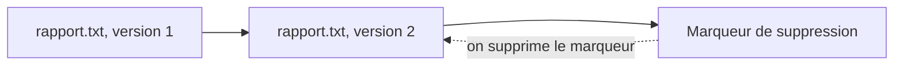

L'association garde dix ans de photos d'événements. On les regarde beaucoup la première semaine, presque jamais ensuite, mais il faut les conserver. Les stocker toutes au même tarif « accès immédiat » revient à payer une place de parking en centre-ville pour une voiture qui ne roule plus.

## Trois formes de stockage

| Forme | Service | Image mentale | Usage typique |
| --- | --- | --- | --- |
| **Objet** | Amazon S3 | Un entrepôt de fichiers accessibles par une adresse | Photos, sauvegardes, sites statiques, données à analyser |
| **Bloc** | Amazon EBS | Un disque dur branché à **une** instance EC2 | Disque système, base de données sur EC2 |
| **Fichier** | Amazon EFS, Amazon FSx | Un dossier partagé en réseau entre **plusieurs** machines | Fichiers communs à plusieurs serveurs |

Quelques précisions utiles à l'examen :

- Un volume **EBS** vit dans **une** zone de disponibilité et persiste indépendamment de l'instance. On le sauvegarde par des **instantanés** (*snapshots*).
- Le **stockage d'instance** (*instance store*) est un disque physiquement attaché à la machine hôte : très rapide, mais **éphémère**. Son contenu est perdu si l'instance est arrêtée ou résiliée.
- **Amazon EFS** est un système de fichiers partagé pour Linux, qui grandit tout seul. **Amazon FSx** propose des systèmes de fichiers gérés d'autres familles, dont Windows File Server et Lustre.
- **AWS Storage Gateway** relie tes locaux au stockage d'AWS : tes applications sur site voient des partages de fichiers, des volumes ou des bandes virtuelles, dont les données sont en réalité dans le cloud.
- **AWS Backup** centralise les plans de sauvegarde de plusieurs services (EBS, RDS, DynamoDB, EFS…) au même endroit.

## Amazon S3 en trois mots

Un **bucket** contient des **objets** ; chaque objet a une **clé** (son nom, par exemple `2026/gala/photo-1.jpg`). Il n'y a pas de vrais dossiers : les `/` font simplement partie de la clé. S3 est conçu pour une durabilité de 99,999999999 % (« onze 9 ») : perdre un objet par défaillance matérielle y est extrêmement improbable. Cela ne te protège pas d'une **suppression par erreur** : c'est le rôle du versionnage.

## Les classes de stockage S3

Chaque objet a une **classe de stockage**. Plus l'accès est rare, moins le stockage coûte… mais plus la lecture coûte ou tarde.

| Classe | Pour quelles données | Accès | Durée minimale facturée |
| --- | --- | --- | --- |
| **S3 Standard** | Consultées souvent | Millisecondes | Aucune |
| **S3 Intelligent-Tiering** | Fréquence d'accès inconnue ou changeante : S3 déplace seul les objets | Millisecondes | Aucune |
| **S3 Standard-IA** (*Infrequent Access*) | Consultées rarement, mais à récupérer vite | Millisecondes | 30 jours |
| **S3 One Zone-IA** | Comme Standard-IA, mais dans **une seule** zone : pour des données que l'on sait recréer | Millisecondes | 30 jours |
| **S3 Glacier Instant Retrieval** | Archives consultées quelques fois par an, à récupérer immédiatement | Millisecondes | 90 jours |
| **S3 Glacier Flexible Retrieval** | Sauvegardes et archives rarement lues | Minutes ou heures | 90 jours |
| **S3 Glacier Deep Archive** | Archives très rarement lues, au prix le plus bas | Heures | 180 jours |

Deux pièges classiques :

- les classes « IA » et Glacier facturent la **récupération** des données, et une **durée minimale** : y placer des objets que l'on supprime au bout d'une semaine coûte plus cher que S3 Standard ;
- seules **One Zone-IA** et **S3 Express One Zone** (une classe très haute performance) gardent les données dans une seule zone. Toutes les autres les répartissent sur au moins trois.

Dans les commandes, les classes portent un nom technique : `STANDARD_IA`, `ONEZONE_IA`, `INTELLIGENT_TIERING`, `GLACIER_IR`, `GLACIER` (Flexible Retrieval) et `DEEP_ARCHIVE`.

## Le versionnage

Quand le **versionnage** est activé sur un bucket, écraser un objet crée une nouvelle version, et le supprimer ajoute seulement un **marqueur de suppression** : les anciennes versions restent là.



Supprimer **le marqueur** fait réapparaître la dernière version. Les versions se listent avec `aws s3api list-object-versions` :

```bash
aws s3api list-object-versions --bucket asso-archives --prefix rapport.txt
aws s3api delete-object --bucket asso-archives --key rapport.txt --version-id <VersionId du marqueur>
```

`s3api` est la partie de l'AWS CLI qui correspond une à une aux opérations de l'API S3 ; `aws s3` (sans `api`) regroupe des commandes plus pratiques pour copier et lister.

## Le cycle de vie

Une **règle de cycle de vie** (*lifecycle rule*) déplace automatiquement les objets vers une classe moins chère quand ils vieillissent, puis les supprime. Voici une règle pour les journaux de l'association : archivage au bout de 90 jours, suppression au bout d'un an.

```json
{
  "Rules": [
    {
      "ID": "archiver-les-journaux",
      "Status": "Enabled",
      "Filter": {"Prefix": "journaux/"},
      "Transitions": [{"Days": 90, "StorageClass": "GLACIER"}],
      "Expiration": {"Days": 365}
    }
  ]
}
```

- `Filter` : la règle ne concerne que les objets dont la clé commence par `journaux/`.
- `Transitions` : après 90 jours, passage en S3 Glacier Flexible Retrieval.
- `Expiration` : après 365 jours, suppression.

Dans le labo, tu peux à tout moment regarder où en est le bucket :

```shell run
aws s3 ls s3://asso-archives --recursive
aws s3api get-bucket-versioning --bucket asso-archives
```

La seconde commande ne répond rien tant que le versionnage n'a jamais été activé.

:::warning Ce qui diffère du vrai AWS
L'émulateur **enregistre** les classes de stockage et les règles de cycle de vie, mais il n'attend pas 90 jours pour toi : aucun objet ne changera de classe ni n'expirera pendant le labo, et aucun prix n'est calculé. Il accepte aussi des règles qu'AWS refuserait (une classe inconnue, par exemple).
:::

:::tip Pour les très gros transferts
Envoyer des dizaines de téraoctets par Internet peut prendre des semaines. **AWS DataSync** automatise et accélère les transferts en ligne. La famille **AWS Snow** (des appareils de stockage expédiés par transporteur) a longtemps servi aux transferts hors ligne ; à la date de rédaction, la documentation d'AWS indique que Snowball Edge n'est plus proposé aux nouveaux clients. Tu peux encore croiser ces noms dans d'anciens supports de révision.
:::

## Entraîne-toi

Tu protèges le bucket `asso-archives` contre les erreurs humaines, tu répares une suppression accidentelle, puis tu fais baisser le coût des données froides.

Crée le fichier de la règle de cycle de vie :

```json file=cycle.json
{
  "Rules": [
    {
      "ID": "archiver-les-journaux",
      "Status": "Enabled",
      "Filter": {"Prefix": "journaux/"},
      "Transitions": [{"Days": 90, "StorageClass": "GLACIER"}],
      "Expiration": {"Days": 365}
    }
  ]
}
```

:::lab
engine: real
intro: |
  Le bucket `asso-archives` existe et il est vide. Ton dossier de travail contient `rapport.txt` et `photo.txt`. Les étapes sont vérifiées sur l'état du bucket.
files:
  rapport.txt: |
    Rapport d'activité (fictif), première rédaction.
  photo.txt: |
    (contenu fictif d'une photo du gala)
commands:
  - demarrer-aws
  - 'aws s3api head-bucket --bucket asso-archives 2>/dev/null || aws s3 mb s3://asso-archives'
steps:
  - text: "Active le versionnage du bucket `asso-archives`"
    hint: "aws s3api put-bucket-versioning --bucket asso-archives --versioning-configuration Status=Enabled"
    checks:
      - output-contains:
          - 'aws s3api get-bucket-versioning --bucket asso-archives --query Status --output text'
          - '^Enabled$'
    solution:
      - aws s3api put-bucket-versioning --bucket asso-archives --versioning-configuration Status=Enabled
  - text: "Envoie `rapport.txt` dans le bucket, ajoute une ligne au fichier, puis envoie-le de nouveau : le bucket doit en garder deux versions"
    hint: "aws s3 cp rapport.txt s3://asso-archives/rapport.txt ; echo 'Relu par le bureau.' >> rapport.txt ; puis la même copie."
    after: [1]
    checks:
      - output-contains:
          - "aws s3api list-object-versions --bucket asso-archives --prefix rapport.txt --query 'length(Versions)' --output text"
          - '^[2-9]'
    solution:
      - aws s3 cp rapport.txt s3://asso-archives/rapport.txt
      - "echo 'Relu par le bureau.' >> rapport.txt"
      - aws s3 cp rapport.txt s3://asso-archives/rapport.txt
  - text: "Supprime `rapport.txt` du bucket « par erreur » (`aws s3 rm`), puis garde la liste des versions : `aws s3api list-object-versions --bucket asso-archives --prefix rapport.txt > versions.json`"
    after: [2]
    checks:
      - env-file-contains: [versions.json, '"DeleteMarkers"']
    solution:
      - aws s3 rm s3://asso-archives/rapport.txt
      - aws s3api list-object-versions --bucket asso-archives --prefix rapport.txt > versions.json
  - text: "Répare l'erreur : supprime le **marqueur de suppression** (son `VersionId` est dans `versions.json`) pour faire réapparaître `rapport.txt`"
    hint: "`aws s3api delete-object --bucket asso-archives --key rapport.txt --version-id <VersionId lu dans la partie DeleteMarkers>`"
    after: [3]
    checks:
      - command-succeeds: 'aws s3api head-object --bucket asso-archives --key rapport.txt'
      - output-contains:
          - "aws s3api list-object-versions --bucket asso-archives --prefix rapport.txt --query 'length(DeleteMarkers || `[]`)' --output text"
          - '^0$'
    solution:
      - "aws s3api delete-object --bucket asso-archives --key rapport.txt --version-id \"$(aws s3api list-object-versions --bucket asso-archives --prefix rapport.txt --query 'DeleteMarkers[0].VersionId' --output text)\""
  - text: "Envoie `photo.txt` sous la clé `photos/photo.txt`, directement dans la classe `STANDARD_IA` (option `--storage-class`)"
    hint: "aws s3 cp photo.txt s3://asso-archives/photos/photo.txt --storage-class STANDARD_IA"
    checks:
      - output-contains:
          - 'aws s3api head-object --bucket asso-archives --key photos/photo.txt --query StorageClass --output text'
          - '^STANDARD_IA$'
    solution:
      - aws s3 cp photo.txt s3://asso-archives/photos/photo.txt --storage-class STANDARD_IA
  - text: "Écris `cycle.json` (la règle de la leçon) et applique-la au bucket avec `aws s3api put-bucket-lifecycle-configuration`"
    hint: "aws s3api put-bucket-lifecycle-configuration --bucket asso-archives --lifecycle-configuration file://cycle.json"
    checks:
      - output-contains:
          - "aws s3api get-bucket-lifecycle-configuration --bucket asso-archives --query 'Rules[0].[Filter.Prefix,Transitions[0].StorageClass,Expiration.Days]' --output text"
          - '^journaux/\s+GLACIER\s+365$'
    solution:
      - write:
          cycle.json: |
            {
              "Rules": [
                {
                  "ID": "archiver-les-journaux",
                  "Status": "Enabled",
                  "Filter": {"Prefix": "journaux/"},
                  "Transitions": [{"Days": 90, "StorageClass": "GLACIER"}],
                  "Expiration": {"Days": 365}
                }
              ]
            }
      - aws s3api put-bucket-lifecycle-configuration --bucket asso-archives --lifecycle-configuration file://cycle.json
:::

## Vérifie tes acquis

:::quiz
Des sauvegardes mensuelles doivent être conservées sept ans. On ne les relit presque jamais, et attendre quelques heures pour en récupérer une est acceptable. Quelle classe coûte le moins cher ?

- [ ] S3 Standard
- [ ] S3 Standard-IA
- [ ] S3 Glacier Instant Retrieval
- [x] S3 Glacier Deep Archive

> Deep Archive est la classe la moins chère, en échange d'une récupération en heures et d'une durée minimale de 180 jours : c'est le profil d'une archive légale.
:::

:::quiz
Deux instances EC2 Linux, dans deux zones de disponibilité, doivent lire et écrire les mêmes fichiers en même temps. Quel service choisir ?

- [ ] Un volume Amazon EBS
- [x] Amazon EFS
- [ ] Le stockage d'instance
- [ ] S3 Glacier Flexible Retrieval

> EFS est un système de fichiers partagé, accessible depuis plusieurs zones. Un volume EBS vit dans une seule zone et se branche à une instance.
:::

:::quiz
Le versionnage est activé. Quelqu'un supprime un objet avec `aws s3 rm`. Que s'est-il passé ?

- [ ] Toutes les versions de l'objet ont été effacées
- [ ] L'objet a été déplacé dans S3 Glacier
- [x] Un marqueur de suppression a été ajouté ; les versions existent toujours
- [ ] La commande a été refusée

> Une suppression simple ajoute un marqueur. Retirer ce marqueur fait réapparaître la dernière version.
:::

:::quiz
Tu ignores à quelle fréquence tes objets seront lus, et tu ne veux pas t'en occuper. Quelle classe est faite pour cela ?

- [ ] S3 One Zone-IA
- [ ] S3 Standard-IA
- [x] S3 Intelligent-Tiering
- [ ] S3 Glacier Flexible Retrieval

> Intelligent-Tiering observe les accès et déplace seul chaque objet vers le niveau le plus économique.
:::
