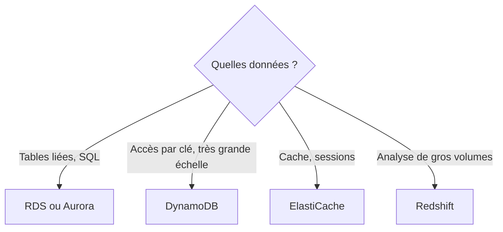

La liste des adhérent·e·s tient aujourd'hui dans un tableur partagé. Deux personnes l'ont modifié en même temps, et une colonne a disparu. Il est temps de passer à une base de données ; reste à choisir laquelle, et surtout **qui** va l'administrer.

## Gérée ou installée par toi ?

Tu peux toujours installer une base de données sur une instance EC2. Tu gardes alors tout le contrôle… et tout le travail : installation, mises à jour, sauvegardes, bascule en cas de panne.

Avec une **base gérée**, AWS se charge de ce travail d'exploitation. Tu choisis la taille, tu crées tes tables et tu gères tes données et tes accès (leçon 3).

| Tu veux… | Choisis |
| --- | --- |
| Un réglage très particulier du système, ou un moteur qu'AWS ne propose pas | Une base sur EC2 |
| Te concentrer sur tes données, avec sauvegardes et correctifs automatiques | Une base gérée |

## Les grandes familles

:::cards
### Relationnelle

Des tables liées entre elles, interrogées en SQL. **Amazon RDS** gère pour toi PostgreSQL, MySQL, MariaDB, Oracle, SQL Server ou Db2. **Amazon Aurora** est le moteur relationnel conçu par AWS, compatible avec MySQL et PostgreSQL.

### NoSQL clé-valeur

**Amazon DynamoDB** : des éléments retrouvés par leur clé, sans serveur à gérer, avec des temps de réponse de quelques millisecondes à n'importe quelle échelle.

### En mémoire

**Amazon ElastiCache** (moteurs Valkey, Redis OSS ou Memcached) : des données gardées en mémoire vive, pour un **cache** ou des sessions à très faible latence.
:::

Deux options de RDS reviennent sans cesse :

- **Multi-AZ** : une copie de secours, tenue à jour dans une autre zone de disponibilité, prend le relais en cas de panne. C'est de la **disponibilité**.
- **Réplicas en lecture** (*read replicas*) : des copies sur lesquelles on envoie les requêtes de lecture pour soulager la base principale. C'est de la **performance**.

D'autres bases spécialisées existent, à reconnaître par leur usage : **Amazon Redshift** (entrepôt de données pour l'analyse), **Amazon Neptune** (graphes), **Amazon DocumentDB** (documents, compatible MongoDB).



## Migrer une base

- **AWS DMS** (*Database Migration Service*) copie les données d'une base vers une autre, y compris entre moteurs différents, pendant que la base d'origine reste en service.
- **AWS SCT** (*Schema Conversion Tool*) convertit le **schéma** (les tables, les types, les procédures) quand on change de moteur, par exemple d'Oracle vers PostgreSQL.

## DynamoDB en pratique

Une **table** DynamoDB contient des **éléments** (*items*). Chaque élément a une **clé primaire** qui l'identifie ; les autres attributs sont libres et peuvent différer d'un élément à l'autre. Créer une table demande donc seulement de décrire sa clé :

```bash
aws dynamodb create-table --table-name adherents \
  --attribute-definitions AttributeName=id,AttributeType=S \
  --key-schema AttributeName=id,KeyType=HASH \
  --billing-mode PAY_PER_REQUEST
```

- `--attribute-definitions` : l'attribut `id` est une chaîne de caractères (`S` pour *string*).
- `--key-schema` : `id` est la clé de partition (`HASH`) de la table.
- `--billing-mode PAY_PER_REQUEST` : facturation **à la demande**, à la requête, sans capacité à réserver.

Un élément s'écrit en JSON, en précisant le type de chaque valeur (`S` pour une chaîne, `N` pour un nombre) :

```json
{
  "id": {"S": "a1"},
  "prenom": {"S": "Léa"},
  "ville": {"S": "Lyon"}
}
```

On l'écrit avec `put-item`, on le relit par sa clé avec `get-item` :

```bash
aws dynamodb put-item --table-name adherents --item file://lea.json
aws dynamodb get-item --table-name adherents --key '{"id": {"S": "a1"}}'
```

`scan` parcourt **toute** la table : pratique pour compter sur une petite table, coûteux sur une grande.

Dans le labo, liste les tables du compte, puis regarde l'un des éléments que tu vas écrire :

```shell run
aws dynamodb list-tables
cat lea.json
```

:::warning Ce qui diffère du vrai AWS
L'émulateur exécute réellement les opérations DynamoDB, en mémoire. Pour RDS, Aurora et ElastiCache, il n'enregistre qu'une **fiche** : `aws rds create-db-instance` y répond « disponible » sans qu'aucune base ne démarre (il faudrait Docker, absent de cet environnement). C'est pourquoi le labo porte sur DynamoDB.
:::

:::tip Lire par la clé
DynamoDB est rapide parce qu'on y retrouve un élément **par sa clé**. Si tu as besoin de jointures et de requêtes variées sur plusieurs tables, c'est le signe qu'une base relationnelle convient mieux.
:::

## Entraîne-toi

Tu remplaces le tableur par une table DynamoDB : tu la crées, tu y inscris deux adhérent·e·s, tu relis une fiche par sa clé et tu comptes les éléments.

:::lab
engine: real
intro: |
  Ton dossier de travail contient `lea.json` et `karim.json`, deux éléments au format DynamoDB. Les étapes sont vérifiées sur l'état de la table.
files:
  lea.json: |
    {
      "id": {"S": "a1"},
      "prenom": {"S": "Léa"},
      "ville": {"S": "Lyon"}
    }
  karim.json: |
    {
      "id": {"S": "a2"},
      "prenom": {"S": "Karim"},
      "ville": {"S": "Lille"},
      "cotisation": {"N": "25"}
    }
commands:
  - demarrer-aws
steps:
  - text: "Crée la table `adherents`, de clé de partition `id` (chaîne), facturée à la demande"
    hint: "La commande aws dynamodb create-table de la leçon."
    checks:
      - output-contains:
          - "aws dynamodb describe-table --table-name adherents --query 'Table.[TableStatus,KeySchema[0].AttributeName,BillingModeSummary.BillingMode]' --output text"
          - '^ACTIVE\s+id\s+PAY_PER_REQUEST$'
    solution:
      - aws dynamodb create-table --table-name adherents --attribute-definitions AttributeName=id,AttributeType=S --key-schema AttributeName=id,KeyType=HASH --billing-mode PAY_PER_REQUEST
  - text: "Inscris les deux adhérent·e·s : `aws dynamodb put-item` avec `lea.json`, puis avec `karim.json`"
    hint: "aws dynamodb put-item --table-name adherents --item file://lea.json"
    after: [1]
    checks:
      - output-contains:
          - 'aws dynamodb scan --table-name adherents --select COUNT --query Count --output text'
          - '^2$'
    solution:
      - aws dynamodb put-item --table-name adherents --item file://lea.json
      - aws dynamodb put-item --table-name adherents --item file://karim.json
  - text: "Relis la fiche de clé `a2` avec `aws dynamodb get-item` et garde-la dans `fiche.json`"
    hint: "aws dynamodb get-item --table-name adherents --key '{\"id\": {\"S\": \"a2\"}}' > fiche.json"
    after: [2]
    checks:
      - env-file-contains: [fiche.json, '"Karim"']
      - env-file-contains: [fiche.json, '"cotisation"']
    solution:
      - "aws dynamodb get-item --table-name adherents --key '{\"id\": {\"S\": \"a2\"}}' > fiche.json"
  - text: "Léa déménage : remplace `Lyon` par `Nantes` dans `lea.json`, puis renvoie l'élément avec `put-item` (même clé : l'élément est remplacé)"
    hint: "Modifie le fichier avec nano lea.json, ou : sed -i 's/Lyon/Nantes/' lea.json"
    after: [2]
    checks:
      - output-contains:
          - "aws dynamodb get-item --table-name adherents --key '{\"id\": {\"S\": \"a1\"}}' --query Item.ville.S --output text"
          - '^Nantes$'
      - output-contains:
          - 'aws dynamodb scan --table-name adherents --select COUNT --query Count --output text'
          - '^2$'
    solution:
      - "sed -i 's/Lyon/Nantes/' lea.json"
      - aws dynamodb put-item --table-name adherents --item file://lea.json
:::

## Vérifie tes acquis

:::quiz
Une équipe veut une base PostgreSQL sans avoir à gérer les mises à jour du système ni les sauvegardes. Que choisir ?

- [ ] PostgreSQL installé sur une instance EC2
- [x] Amazon RDS pour PostgreSQL
- [ ] Amazon DynamoDB
- [ ] Amazon ElastiCache

> RDS est le service géré pour les moteurs relationnels, dont PostgreSQL. DynamoDB n'est pas relationnel ; sur EC2, tout le travail d'exploitation te revient.
:::

:::quiz
À quoi sert l'option Multi-AZ d'Amazon RDS ?

- [ ] À accélérer les requêtes de lecture
- [ ] À chiffrer la base de données
- [ ] À répartir les données entre plusieurs régions
- [x] À garder une copie de secours dans une autre zone, qui prend le relais en cas de panne

> Multi-AZ est une option de disponibilité. Pour soulager les lectures, on ajoute des réplicas en lecture.
:::

:::quiz
Les pages du site se chargent lentement parce que la même requête coûteuse est rejouée des milliers de fois. Quel service ajoute un cache en mémoire ?

- [ ] Amazon Redshift
- [ ] AWS DMS
- [x] Amazon ElastiCache
- [ ] Amazon Neptune

> ElastiCache garde en mémoire vive les résultats fréquemment demandés. Redshift est un entrepôt de données pour l'analyse.
:::

:::quiz
Une entreprise passe d'Oracle à Aurora PostgreSQL. Quel outil convertit le schéma de la base d'un moteur à l'autre ?

- [x] AWS Schema Conversion Tool (SCT)
- [ ] AWS Backup
- [ ] Amazon EFS
- [ ] AWS Storage Gateway

> SCT convertit le schéma entre deux moteurs différents ; DMS déplace ensuite les données.
:::
