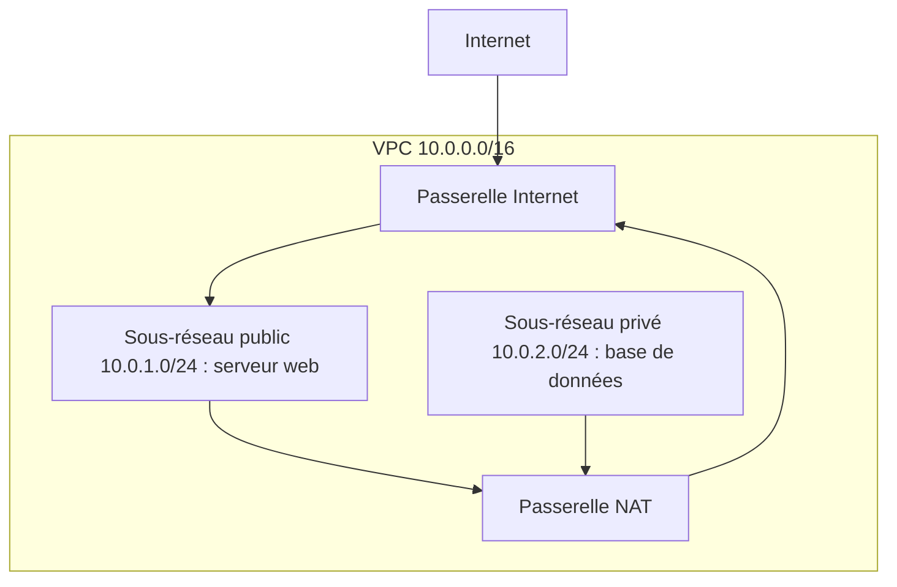

Tu lances un serveur web et une base de données. Le premier doit être joignable par tout Internet ; la seconde ne doit l'être par personne d'autre que le serveur web. Sur AWS, cette séparation ne se fait pas avec des câbles, mais avec un **VPC** et quelques règles.

## Un VPC et ses composants

Un **VPC** (*Virtual Private Cloud*) est ton réseau privé, isolé, dans une région. Tu en choisis la plage d'adresses, notée en **CIDR** : `10.0.0.0/16` désigne les adresses de `10.0.0.0` à `10.0.255.255`.



| Composant | Rôle |
| --- | --- |
| **Sous-réseau** (*subnet*) | Une tranche du VPC, située dans **une** zone de disponibilité. |
| **Passerelle Internet** (*internet gateway*) | La porte entre le VPC et Internet, dans les deux sens. |
| **Table de routage** (*route table*) | Les règles qui disent où envoyer le trafic d'un sous-réseau. |
| **Passerelle NAT** (*NAT gateway*) | Permet aux machines d'un sous-réseau privé de **sortir** vers Internet (mises à jour…) sans être joignables depuis l'extérieur. |

Ce qui rend un sous-réseau **public**, c'est sa table de routage : elle contient une route vers la passerelle Internet. Un sous-réseau **privé** n'en a pas.

## Deux pare-feu, deux niveaux

| | Groupe de sécurité (*security group*) | Liste de contrôle d'accès réseau (*network ACL*) |
| --- | --- | --- |
| S'applique à | Une ressource (une instance, par exemple) | Un sous-réseau entier |
| Règles | Seulement des **autorisations** | Autorisations **et interdictions**, numérotées, évaluées dans l'ordre |
| Mémoire | **Avec état** (*stateful*) : la réponse à une requête autorisée passe toujours | **Sans état** (*stateless*) : il faut autoriser l'aller **et** le retour |
| Par défaut (créé par toi) | Rien n'entre, tout sort | Tout est refusé tant que tu n'ajoutes pas de règle |

Retiens : le groupe de sécurité est le pare-feu du quotidien, au plus près de la ressource ; la liste de contrôle d'accès est un second filet, utile pour **interdire** une adresse sur tout un sous-réseau.

## Au-delà du VPC

| Service | Rôle |
| --- | --- |
| **Amazon Route 53** | Le service **DNS** d'AWS : il traduit `asso.example` en adresse IP, enregistre des noms de domaine, surveille la santé de tes points d'entrée et oriente le trafic en conséquence. |
| **Amazon CloudFront** | Réseau de diffusion de contenu : il sert tes pages depuis les points de présence, près des internautes. |
| **AWS Global Accelerator** | Fait entrer le trafic sur le réseau mondial d'AWS au plus près de l'utilisateur·rice, pour améliorer la performance et la disponibilité d'applications réparties sur plusieurs régions. |
| **Amazon API Gateway** | Publie et protège des API HTTP devant tes applications ou tes fonctions Lambda. |

Pour relier tes **locaux** à AWS, deux options à ne pas confondre :

- **AWS Site-to-Site VPN** : un tunnel **chiffré** qui passe par Internet. Rapide à mettre en place, débit et latence variables.
- **AWS Direct Connect** : une liaison **privée et dédiée** entre tes locaux et AWS, qui ne passe pas par Internet. Plus longue à installer, plus stable et plus prévisible.

## Construire un VPC en ligne de commande

Les ressources réseau se désignent par des identifiants générés (`vpc-0a1b…`). Pour ne pas les recopier à la main, garde-les dans des **variables** du terminal : `VPC=$(…)` range dans `VPC` ce que la commande entre parenthèses affiche.

```bash
VPC=$(aws ec2 create-vpc --cidr-block 10.0.0.0/16 \
  --tag-specifications 'ResourceType=vpc,Tags=[{Key=Name,Value=asso}]' \
  --query Vpc.VpcId --output text)
echo $VPC
```

Le sous-réseau se crée dans ce VPC, dans une zone précise ; la passerelle Internet se crée puis s'**attache** au VPC :

```bash
SOUS_RESEAU=$(aws ec2 create-subnet --vpc-id $VPC --cidr-block 10.0.1.0/24 --availability-zone eu-west-3a \
  --tag-specifications 'ResourceType=subnet,Tags=[{Key=Name,Value=public-a}]' \
  --query Subnet.SubnetId --output text)
PASSERELLE=$(aws ec2 create-internet-gateway --query InternetGateway.InternetGatewayId --output text)
aws ec2 attach-internet-gateway --internet-gateway-id $PASSERELLE --vpc-id $VPC
```

Il reste à dire au sous-réseau d'envoyer vers la passerelle tout ce qui n'est pas local. `0.0.0.0/0` signifie « toutes les adresses » :

```bash
TABLE=$(aws ec2 create-route-table --vpc-id $VPC --query RouteTable.RouteTableId --output text)
aws ec2 create-route --route-table-id $TABLE --destination-cidr-block 0.0.0.0/0 --gateway-id $PASSERELLE
aws ec2 associate-route-table --route-table-id $TABLE --subnet-id $SOUS_RESEAU
```

Enfin, un groupe de sécurité qui laisse entrer le HTTPS (port 443) depuis partout :

```bash
GROUPE=$(aws ec2 create-security-group --group-name web --description "Site web" --vpc-id $VPC \
  --query GroupId --output text)
aws ec2 authorize-security-group-ingress --group-id $GROUPE --protocol tcp --port 443 --cidr 0.0.0.0/0
```

Si tu perds une variable (nouveau terminal), retrouve l'identifiant par son étiquette :

```shell run
aws ec2 describe-vpcs --query 'Vpcs[].[VpcId,CidrBlock,IsDefault]' --output text
```

:::warning Ce qui diffère du vrai AWS
Dans l'émulateur, aucun paquet ne circule : un VPC est une description, et tu ne peux pas « tester » qu'un port est ouvert. L'émulateur est aussi plus tolérant : il accepte par exemple deux sous-réseaux dont les plages se chevauchent, ce qu'AWS refuse. Sur le vrai AWS, enfin, certaines ressources réseau sont **facturées à l'heure** même sans trafic (une passerelle NAT, par exemple).
:::

:::tip N'ouvre que le nécessaire
`0.0.0.0/0` sur le port 443 d'un site public est normal. La même règle sur le port d'administration (SSH, 22) ou sur celui d'une base de données est une erreur classique : limite ces ports à une adresse ou à un autre groupe de sécurité.
:::

## Entraîne-toi

Tu construis le réseau du site de l'association : un VPC, un sous-réseau public relié à Internet et le groupe de sécurité du serveur web. Les commandes sont celles de la section précédente ; garde tes identifiants dans des variables.

:::lab
engine: real
intro: |
  Tu pars d'un compte sans réseau à toi (seul le VPC par défaut existe). Les étapes sont vérifiées sur les ressources de l'émulateur, retrouvées par leurs étiquettes : respecte bien les noms `asso`, `public-a` et `web`.
commands:
  - demarrer-aws
steps:
  - text: "Crée un VPC `10.0.0.0/16` portant l'étiquette `Name=asso`"
    checks:
      - output-contains:
          - "aws ec2 describe-vpcs --filters Name=tag:Name,Values=asso --query 'Vpcs[].CidrBlock' --output text"
          - '^10\.0\.0\.0/16$'
    solution:
      - "aws ec2 create-vpc --cidr-block 10.0.0.0/16 --tag-specifications 'ResourceType=vpc,Tags=[{Key=Name,Value=asso}]'"
  - text: "Dans ce VPC, crée le sous-réseau `10.0.1.0/24` dans la zone `eu-west-3a`, avec l'étiquette `Name=public-a`"
    after: [1]
    checks:
      - output-contains:
          - "aws ec2 describe-subnets --filters Name=tag:Name,Values=public-a Name=vpc-id,Values=\"$(aws ec2 describe-vpcs --filters Name=tag:Name,Values=asso --query 'Vpcs[0].VpcId' --output text)\" --query 'Subnets[].[CidrBlock,AvailabilityZone]' --output text"
          - '^10\.0\.1\.0/24\s+eu-west-3a$'
    solution:
      - "aws ec2 create-subnet --vpc-id \"$(aws ec2 describe-vpcs --filters Name=tag:Name,Values=asso --query 'Vpcs[0].VpcId' --output text)\" --cidr-block 10.0.1.0/24 --availability-zone eu-west-3a --tag-specifications 'ResourceType=subnet,Tags=[{Key=Name,Value=public-a}]'"
  - text: "Crée une passerelle Internet et attache-la au VPC `asso`"
    after: [1]
    checks:
      - output-contains:
          - "aws ec2 describe-internet-gateways --filters Name=attachment.vpc-id,Values=\"$(aws ec2 describe-vpcs --filters Name=tag:Name,Values=asso --query 'Vpcs[0].VpcId' --output text)\" --query 'length(InternetGateways)' --output text"
          - '^1$'
    solution:
      - "aws ec2 attach-internet-gateway --internet-gateway-id \"$(aws ec2 create-internet-gateway --query InternetGateway.InternetGatewayId --output text)\" --vpc-id \"$(aws ec2 describe-vpcs --filters Name=tag:Name,Values=asso --query 'Vpcs[0].VpcId' --output text)\""
  - text: "Rends le sous-réseau public : crée une table de routage dans le VPC, ajoute-lui la route `0.0.0.0/0` vers la passerelle Internet, et associe-la au sous-réseau `public-a`"
    hint: "Trois commandes : aws ec2 create-route-table, aws ec2 create-route, aws ec2 associate-route-table."
    after: [2, 3]
    checks:
      - output-contains:
          - "aws ec2 describe-route-tables --filters Name=association.subnet-id,Values=\"$(aws ec2 describe-subnets --filters Name=tag:Name,Values=public-a --query 'Subnets[0].SubnetId' --output text)\" --query 'RouteTables[].Routes[].[DestinationCidrBlock,GatewayId]' --output text"
          - '^0\.0\.0\.0/0\s+igw-'
    solution:
      - "V=$(aws ec2 describe-vpcs --filters Name=tag:Name,Values=asso --query 'Vpcs[0].VpcId' --output text); T=$(aws ec2 create-route-table --vpc-id $V --query RouteTable.RouteTableId --output text); aws ec2 create-route --route-table-id $T --destination-cidr-block 0.0.0.0/0 --gateway-id $(aws ec2 describe-internet-gateways --filters Name=attachment.vpc-id,Values=$V --query 'InternetGateways[0].InternetGatewayId' --output text) && aws ec2 associate-route-table --route-table-id $T --subnet-id $(aws ec2 describe-subnets --filters Name=tag:Name,Values=public-a --query 'Subnets[0].SubnetId' --output text)"
  - text: "Crée dans le VPC le groupe de sécurité `web` et autorise l'entrée du port TCP 443 depuis `0.0.0.0/0`"
    after: [1]
    checks:
      - output-contains:
          - "aws ec2 describe-security-groups --filters Name=group-name,Values=web Name=vpc-id,Values=\"$(aws ec2 describe-vpcs --filters Name=tag:Name,Values=asso --query 'Vpcs[0].VpcId' --output text)\" --query 'SecurityGroups[].IpPermissions[].[FromPort,ToPort,IpRanges[0].CidrIp]' --output text"
          - '^443\s+443\s+0\.0\.0\.0/0$'
    solution:
      - "aws ec2 authorize-security-group-ingress --group-id \"$(aws ec2 create-security-group --group-name web --description 'Site web' --vpc-id \"$(aws ec2 describe-vpcs --filters Name=tag:Name,Values=asso --query 'Vpcs[0].VpcId' --output text)\" --query GroupId --output text)\" --protocol tcp --port 443 --cidr 0.0.0.0/0"
:::

## Vérifie tes acquis

:::quiz
Qu'est-ce qui fait d'un sous-réseau un sous-réseau **public** ?

- [ ] Son nom contient le mot « public »
- [ ] Il est placé dans la première zone de disponibilité de la région
- [x] Sa table de routage contient une route vers une passerelle Internet
- [ ] Un groupe de sécurité y autorise le port 443

> C'est la route vers la passerelle Internet qui rend un sous-réseau public. Le nom et les groupes de sécurité n'y changent rien.
:::

:::quiz
Tu veux interdire une adresse IP malveillante sur tout un sous-réseau. Quel outil le permet ?

- [ ] Un groupe de sécurité
- [x] Une liste de contrôle d'accès réseau (network ACL)
- [ ] Une passerelle NAT
- [ ] Une table de routage

> Seule la liste de contrôle d'accès réseau accepte des règles d'interdiction. Un groupe de sécurité ne contient que des autorisations.
:::

:::quiz
Les serveurs d'un sous-réseau privé doivent télécharger des mises à jour sur Internet, sans être joignables de l'extérieur. Que leur faut-il ?

- [ ] Une passerelle Internet attachée à chaque serveur
- [ ] AWS Direct Connect
- [ ] Amazon CloudFront
- [x] Une passerelle NAT placée dans un sous-réseau public

> La passerelle NAT laisse sortir le trafic du sous-réseau privé et bloque les connexions entrantes.
:::

:::quiz
Une entreprise veut une liaison privée et stable entre son centre de données et AWS, qui ne passe pas par Internet. Quel service répond à ce besoin ?

- [x] AWS Direct Connect
- [ ] AWS Site-to-Site VPN
- [ ] Amazon Route 53
- [ ] Une passerelle Internet

> Direct Connect est une liaison dédiée. Un VPN chiffre le trafic, mais l'achemine par Internet.
:::
