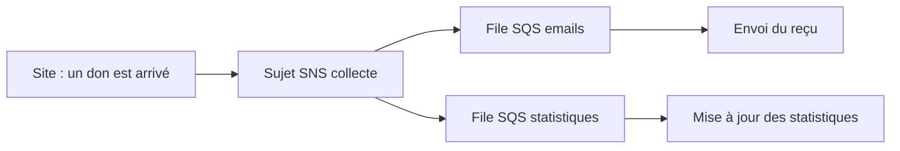

Quand un don arrive, il faut envoyer un reçu par courriel **et** mettre à jour les statistiques. Si le site appelle lui-même ces deux traitements et que l'un est en panne, le don échoue. Mieux vaut que le site annonce simplement « un don est arrivé », et que chaque traitement s'en occupe de son côté : c'est le **découplage**.

## Trois services pour faire circuler des messages

:::cards
### Amazon SQS

Une **file d'attente**. Un producteur y dépose des messages ; un consommateur vient les chercher quand il est prêt. Si le consommateur est en panne, les messages l'attendent.

### Amazon SNS

Un **sujet** de publication. Un message publié est **poussé** aussitôt à tous les abonnés : files SQS, fonctions Lambda, adresses électroniques, SMS…

### Amazon EventBridge

Un **bus d'événements** avec des règles : « quand tel événement se produit, ou tous les lundis à 9 h, déclenche telle cible ». Il reçoit aussi les événements des services AWS eux-mêmes.
:::

| Besoin | Service |
| --- | --- |
| Absorber un pic et traiter à son rythme | SQS |
| Prévenir plusieurs destinataires d'un même fait, envoyer une alerte | SNS |
| Réagir à des événements selon leur contenu, ou planifier une tâche | EventBridge |
| Enchaîner plusieurs étapes avec des conditions et des reprises | AWS Step Functions |

Le montage de ce labo s'appelle la **diffusion en éventail** (*fan-out*) : un sujet SNS, plusieurs files SQS abonnées.



## Analyser des données

| Service | Ce qu'il fait |
| --- | --- |
| **Amazon Athena** | Interroge en SQL des fichiers rangés dans S3, sans serveur à gérer. |
| **Amazon Kinesis** | Collecte et traite des flux de données en temps réel (clics, capteurs, journaux). |
| **AWS Glue** | Prépare et transforme les données (on parle d'ETL : extraire, transformer, charger) et tient un catalogue de ce qu'elles contiennent. |
| **Amazon Redshift** | Entrepôt de données pour l'analyse de très gros volumes. |
| **Amazon EMR** | Grappes de calcul pour les outils de traitement massif comme Apache Spark. |
| **Amazon OpenSearch Service** | Recherche plein texte et analyse de journaux. |
| **Amazon Quick Sight** | Tableaux de bord et graphiques pour les équipes métier. |

## Intelligence artificielle

L'examen attend que tu associes un service à **une tâche**, sans savoir le configurer.

| Tâche | Service |
| --- | --- |
| Construire, entraîner et déployer ses propres modèles | **Amazon SageMaker AI** |
| Créer un agent conversationnel (voix ou texte) | **Amazon Lex** |
| Transformer un texte en parole | **Amazon Polly** |
| Transformer une parole en texte | **Amazon Transcribe** |
| Traduire un texte | **Amazon Translate** |
| Analyser des images et des vidéos | **Amazon Rekognition** |
| Extraire le texte et les champs de documents numérisés | **Amazon Textract** |
| Comprendre un texte : sentiments, entités, langue | **Amazon Comprehend** |
| Un assistant d'IA générative pour le travail et le développement | **Amazon Q** |

## Les autres familles à reconnaître

- **Pour développer et déployer** : **AWS CodeBuild** compile et teste le code ; **AWS CodePipeline** enchaîne les étapes d'une livraison continue ; **AWS X-Ray** suit une requête à travers les composants d'une application pour trouver où elle ralentit ou échoue.
- **Postes de travail** : **Amazon WorkSpaces** fournit des bureaux virtuels complets ; **Amazon AppStream 2.0** diffuse une application précise vers un navigateur ; **Amazon WorkSpaces Secure Browser** donne un accès protégé à des sites internes depuis un navigateur.
- **Applications métier** : **Amazon Connect** est un centre de contacts (accueil téléphonique) dans le cloud ; **Amazon SES** envoie des courriels en nombre.
- **Web et mobile** : **AWS Amplify** aide à construire et héberger des applications web et mobiles.
- **Objets connectés** : **AWS IoT Core** connecte et gère des appareils.

## Publier et recevoir en pratique

Un sujet se crée par son nom, et renvoie son ARN. S'abonner demande l'ARN du sujet et celui de la file :

```bash
aws sns create-topic --name collecte
aws sns subscribe --topic-arn arn:aws:sns:eu-west-3:000000000000:collecte \
  --protocol sqs --notification-endpoint arn:aws:sqs:eu-west-3:000000000000:emails
aws sns publish --topic-arn arn:aws:sns:eu-west-3:000000000000:collecte --message "Don de 50 euros"
```

Une file se désigne, elle, par son **adresse** (*queue URL*). On la demande à SQS, puis on lit un message :

```bash
aws sqs get-queue-url --queue-name emails --query QueueUrl --output text
aws sqs receive-message --queue-url <adresse de la file>
```

Lire un message ne le supprime pas : il devient invisible un court moment (30 secondes par défaut), le temps que le consommateur le traite puis le **supprime**. S'il ne le fait pas, le message réapparaît : rien n'est perdu si le traitement échoue.

Dans le labo, les deux files existent déjà. Tu peux les voir :

```shell run
aws sqs list-queues --query QueueUrls --output text
```

:::warning Ce qui diffère du vrai AWS
L'émulateur exécute réellement SQS, SNS et EventBridge. Comme sur le vrai AWS, une file doit **autoriser** le sujet à lui écrire, par une politique attachée à la file : le labo l'a déjà posée pour toi. En revanche, SNS n'envoie ici ni courriel ni SMS, une règle planifiée ne se déclenche pas à l'heure dite, et les services d'analyse et d'IA cités plus haut ne sont pas émulés (ou seulement leur façade).
:::

:::tip File ou sujet ?
Une file SQS garde le message jusqu'à ce qu'**un** consommateur le traite. Un sujet SNS le remet tout de suite à **tous** ses abonnés et ne garde rien. Les associer donne le meilleur des deux.
:::

## Entraîne-toi

Tu montes la diffusion en éventail de la collecte : un sujet, deux files abonnées, un message publié, puis lu depuis l'une des files. Tu ajoutes enfin une règle EventBridge planifiée pour un rappel hebdomadaire.

:::lab
engine: real
intro: |
  Les files SQS `emails` et `statistiques` existent déjà et autorisent le futur sujet `collecte` à leur écrire. Les étapes sont vérifiées sur l'état de l'émulateur et sur le fichier que tu produis.
files:
  file-emails.json: |
    {"Policy": "{\"Version\":\"2012-10-17\",\"Statement\":[{\"Effect\":\"Allow\",\"Principal\":{\"Service\":\"sns.amazonaws.com\"},\"Action\":\"sqs:SendMessage\",\"Resource\":\"arn:aws:sqs:eu-west-3:000000000000:emails\",\"Condition\":{\"ArnEquals\":{\"aws:SourceArn\":\"arn:aws:sns:eu-west-3:000000000000:collecte\"}}}]}"}
  file-statistiques.json: |
    {"Policy": "{\"Version\":\"2012-10-17\",\"Statement\":[{\"Effect\":\"Allow\",\"Principal\":{\"Service\":\"sns.amazonaws.com\"},\"Action\":\"sqs:SendMessage\",\"Resource\":\"arn:aws:sqs:eu-west-3:000000000000:statistiques\",\"Condition\":{\"ArnEquals\":{\"aws:SourceArn\":\"arn:aws:sns:eu-west-3:000000000000:collecte\"}}}]}"}
commands:
  - demarrer-aws
  - aws sqs create-queue --queue-name emails --attributes file://file-emails.json
  - aws sqs create-queue --queue-name statistiques --attributes file://file-statistiques.json
steps:
  - text: "Crée le sujet SNS `collecte`"
    checks:
      - output-contains:
          - "aws sns list-topics --query 'Topics[].TopicArn' --output text"
          - 'arn:aws:sns:eu-west-3:000000000000:collecte'
    solution:
      - aws sns create-topic --name collecte
  - text: "Abonne les deux files au sujet (`aws sns subscribe`, protocole `sqs`). Leurs ARN sont `arn:aws:sqs:eu-west-3:000000000000:emails` et `arn:aws:sqs:eu-west-3:000000000000:statistiques`"
    after: [1]
    checks:
      - output-contains:
          - "aws sns list-subscriptions-by-topic --topic-arn arn:aws:sns:eu-west-3:000000000000:collecte --query 'Subscriptions[].Endpoint' --output text"
          - ':emails\b'
      - output-contains:
          - "aws sns list-subscriptions-by-topic --topic-arn arn:aws:sns:eu-west-3:000000000000:collecte --query 'Subscriptions[].Endpoint' --output text"
          - ':statistiques\b'
    solution:
      - aws sns subscribe --topic-arn arn:aws:sns:eu-west-3:000000000000:collecte --protocol sqs --notification-endpoint arn:aws:sqs:eu-west-3:000000000000:emails
      - aws sns subscribe --topic-arn arn:aws:sns:eu-west-3:000000000000:collecte --protocol sqs --notification-endpoint arn:aws:sqs:eu-west-3:000000000000:statistiques
  - text: "Publie le message `Don de 50 euros` sur le sujet `collecte` : chaque file doit en recevoir une copie"
    after: [2]
    checks:
      - output-contains:
          - "aws sqs get-queue-attributes --queue-url \"$(aws sqs get-queue-url --queue-name emails --query QueueUrl --output text)\" --attribute-names ApproximateNumberOfMessages ApproximateNumberOfMessagesNotVisible --query 'Attributes.*' --output text"
          - '[1-9]'
      - output-contains:
          - "aws sqs get-queue-attributes --queue-url \"$(aws sqs get-queue-url --queue-name statistiques --query QueueUrl --output text)\" --attribute-names ApproximateNumberOfMessages ApproximateNumberOfMessagesNotVisible --query 'Attributes.*' --output text"
          - '[1-9]'
    solution:
      - 'aws sns publish --topic-arn arn:aws:sns:eu-west-3:000000000000:collecte --message "Don de 50 euros"'
  - text: "Lis le message arrivé dans la file `emails` avec `aws sqs receive-message` et garde la réponse dans `recu.json`"
    hint: "Demande d'abord l'adresse de la file : aws sqs get-queue-url --queue-name emails --query QueueUrl --output text"
    after: [3]
    checks:
      - env-file-contains: [recu.json, 'Don de 50 euros']
    solution:
      - 'aws sqs receive-message --queue-url "$(aws sqs get-queue-url --queue-name emails --query QueueUrl --output text)" > recu.json'
  - text: "Crée la règle EventBridge `rappel-hebdo`, planifiée chaque lundi à 9 h UTC : expression `cron(0 9 ? * MON *)`"
    hint: "aws events put-rule --name rappel-hebdo --schedule-expression 'cron(0 9 ? * MON *)'"
    checks:
      - output-contains:
          - 'aws events describe-rule --name rappel-hebdo --query ScheduleExpression --output text'
          - '^cron\(0 9 \? \* MON \*\)$'
    solution:
      - "aws events put-rule --name rappel-hebdo --schedule-expression 'cron(0 9 ? * MON *)'"
:::

## Vérifie tes acquis

:::quiz
Un site reçoit des commandes par rafales ; le service de facturation, lui, ne peut en traiter que dix par seconde. Quel service placer entre les deux ?

- [ ] Amazon SNS
- [ ] Amazon Athena
- [x] Amazon SQS
- [ ] Amazon Polly

> Une file d'attente absorbe la rafale : les commandes attendent, et la facturation les traite à son rythme.
:::

:::quiz
Lorsqu'un don arrive, trois applications différentes doivent être prévenues en même temps. Quel service le fait le plus directement ?

- [x] Amazon SNS, avec trois abonnés au même sujet
- [ ] Amazon SQS, avec une seule file lue par les trois
- [ ] AWS X-Ray
- [ ] Amazon Kinesis

> Un sujet SNS remet chaque message à tous ses abonnés. Avec une seule file SQS, chaque message ne serait traité que par un des trois lecteurs.
:::

:::quiz
Une équipe veut interroger en SQL des fichiers CSV déjà rangés dans S3, sans installer de serveur. Quel service ?

- [ ] Amazon Redshift
- [ ] Amazon Kinesis
- [ ] AWS Glue
- [x] Amazon Athena

> Athena exécute des requêtes SQL directement sur les données de S3, sans infrastructure à gérer.
:::

:::quiz
Quel service transforme l'enregistrement audio d'une réunion en texte ?

- [ ] Amazon Polly
- [x] Amazon Transcribe
- [ ] Amazon Translate
- [ ] Amazon Rekognition

> Transcribe convertit la parole en texte ; Polly fait l'inverse.
:::
