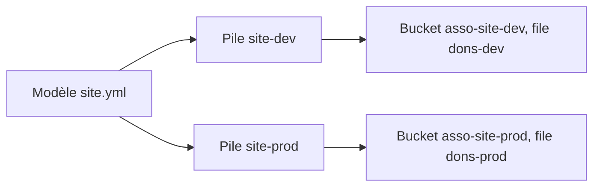

« Ça marche sur le serveur de Karim, mais personne ne sait plus comment il a été installé. » Une infrastructure montée à la main finit toujours ainsi. AWS propose une méthode pour juger une architecture, une autre pour organiser une migration, et un outil pour que l'infrastructure soit **écrite** plutôt que racontée.

## Le Well-Architected Framework

Le *AWS Well-Architected Framework* est un ensemble de bonnes pratiques pour concevoir et évaluer une architecture. Il s'organise en **six piliers** :

| Pilier | La question qu'il pose |
| --- | --- |
| **Excellence opérationnelle** (*operational excellence*) | Sait-on exploiter, surveiller et améliorer le système ? Les changements sont-ils automatisés, petits et réversibles ? |
| **Sécurité** (*security*) | Les données, les systèmes et les accès sont-ils protégés ? Sait-on tracer qui fait quoi ? |
| **Fiabilité** (*reliability*) | Le système fait-il ce qu'on attend de lui, et se rétablit-il seul après une panne ? |
| **Efficacité des performances** (*performance efficiency*) | Utilise-t-on les bonnes ressources, et suit-on l'évolution des besoins ? |
| **Optimisation des coûts** (*cost optimization*) | Paie-t-on seulement ce qui est utile ? |
| **Développement durable** (*sustainability*) | Réduit-on l'impact environnemental de la charge de travail ? |

Pour les distinguer à l'examen, cherche le mot clé du scénario : « sauvegarde, reprise, panne » renvoie à la fiabilité ; « chiffrement, droits, journal » à la sécurité ; « automatiser, surveiller, procédures » à l'excellence opérationnelle ; « type d'instance adapté, latence » à la performance ; « ressources inutilisées, engagement » aux coûts ; « consommation d'énergie » au développement durable.

L'outil **AWS Well-Architected Tool** permet de passer une architecture en revue, pilier par pilier.

## Migrer : les 7 R

Pour chaque application à migrer, on choisit une **stratégie**. AWS en décrit sept, les « 7 R » :

| Stratégie | En clair |
| --- | --- |
| *Retire* (retirer) | L'application ne sert plus : on l'éteint. |
| *Retain* (conserver) | On la laisse où elle est, pour l'instant ou pour de bon. |
| *Rehost* (réhéberger, *lift and shift*) | On la déplace telle quelle, sans la modifier. |
| *Relocate* (relocaliser) | On déplace un ensemble de serveurs vers la version cloud de la même plateforme, sans rien réécrire. |
| *Repurchase* (racheter, *drop and shop*) | On la remplace par un produit du marché, souvent en mode SaaS. |
| *Replatform* (replateformer, *lift, tinker, and shift*) | On la déplace avec quelques optimisations : passer une base à Amazon RDS, par exemple. |
| *Refactor* (réarchitecturer) | On la repense pour tirer parti du cloud. La plus coûteuse, et la plus payante à long terme. |

Des services accompagnent ce parcours : **AWS Migration Hub** suit l'avancement, **AWS Application Discovery Service** inventorie l'existant, **AWS Application Migration Service** réhéberge des serveurs, **AWS DMS** migre les bases de données.

## Le Cloud Adoption Framework

Migrer n'est pas qu'une affaire de technique. Le *AWS Cloud Adoption Framework* (AWS CAF) regroupe ce qu'une organisation doit savoir faire en **six perspectives** : Métier (*Business*), Personnes (*People*), Gouvernance (*Governance*), Plateforme (*Platform*), Sécurité (*Security*) et Opérations (*Operations*).

Les bénéfices attendus, tels que le guide d'examen les cite : réduction du risque métier, amélioration des performances environnementales, sociales et de gouvernance (ESG), croissance du chiffre d'affaires et gain d'efficacité opérationnelle.

## L'économie du cloud

- **Coûts fixes et coûts variables** : sur site, tu paies le matériel, le local, l'électricité et le personnel, que les serveurs soient utilisés ou non. Dans le cloud, la facture suit l'usage.
- **Économies d'échelle** : AWS achète en très grande quantité et répercute une partie de ce gain sur ses prix.
- **Juste dimensionnement** (*rightsizing*) : choisir la taille de ressource qui correspond au besoin réel, et la revoir régulièrement. Une instance deux fois trop grosse coûte deux fois trop cher.
- **Licences** : certaines offres incluent la licence du logiciel dans leur prix ; d'autres te laissent apporter la tienne, c'est le modèle **BYOL** (*Bring Your Own License*).
- **Automatisation** : ce qui est automatisé coûte moins de temps humain, se répète sans erreur et peut être éteint quand il ne sert pas.

## L'infrastructure en code : AWS CloudFormation

Avec **AWS CloudFormation**, tu décris tes ressources dans un fichier, le **modèle** (*template*). CloudFormation crée, modifie ou supprime les ressources pour que la réalité corresponde au fichier. L'ensemble des ressources créées à partir d'un modèle s'appelle une **pile** (*stack*).



Voici le modèle du labo, écrit en **YAML** (un format texte où l'indentation marque l'imbrication) :

```yaml
AWSTemplateFormatVersion: "2010-09-09"
Description: Stockage et file d'attente du site de l'association
Parameters:
  Environnement:
    Type: String
    Default: dev
Resources:
  Seau:
    Type: AWS::S3::Bucket
    DeletionPolicy: Retain
    Properties:
      BucketName: !Sub "asso-site-${Environnement}"
      VersioningConfiguration:
        Status: Enabled
  FileDons:
    Type: AWS::SQS::Queue
    Properties:
      QueueName: !Sub "dons-${Environnement}"
Outputs:
  NomDuSeau:
    Value: !Ref Seau
```

- `Parameters` : une valeur que l'on choisit au déploiement. Ici `Environnement`, qui vaut `dev` si on ne dit rien.
- `Resources` : les ressources à créer. Chacune a un nom dans le modèle (`Seau`), un type (`AWS::S3::Bucket`) et des propriétés.
- `!Sub "asso-site-${Environnement}"` remplace `${Environnement}` par la valeur du paramètre : le même modèle produit `asso-site-dev` ou `asso-site-prod`.
- `DeletionPolicy: Retain` : si l'on supprime la pile, ce bucket est **conservé**. Sans cette ligne, supprimer la pile supprime la ressource.
- `Outputs` : des valeurs que la pile affiche une fois créée.

Trois commandes suffisent : vérifier le modèle, le déployer, supprimer la pile.

```bash
aws cloudformation validate-template --template-body file://site.yml
aws cloudformation deploy --stack-name site-dev --template-file site.yml
aws cloudformation delete-stack --stack-name site-dev
```

Dans le labo, le modèle est déjà dans ton dossier de travail, et aucune pile n'existe encore :

```shell run
cat site.yml
aws cloudformation list-stacks --query 'StackSummaries[].[StackName,StackStatus]' --output text
```

:::danger Supprimer une pile supprime ses ressources
`delete-stack` détruit tout ce que la pile a créé, données comprises, sauf les ressources marquées `DeletionPolicy: Retain`. Relis le nom de la pile avant de valider.
:::

:::warning Ce qui diffère du vrai AWS
L'émulateur exécute réellement les modèles pour les types de ressources qu'il connaît, et crée les ressources dans les services émulés. Le vrai CloudFormation est plus lent (une pile prend de quelques secondes à plusieurs minutes) et vérifie davantage de choses.
:::

## Entraîne-toi

Le fichier `site.yml` est dans ton dossier de travail. Tu le valides, tu en tires un environnement de développement, puis un environnement de production strictement identique, et tu supprimes celui de développement.

:::lab
engine: real
intro: |
  Ton dossier de travail contient le modèle `site.yml` présenté dans la leçon. Les étapes sont vérifiées sur les piles et les ressources de l'émulateur.
files:
  site.yml: |
    AWSTemplateFormatVersion: "2010-09-09"
    Description: Stockage et file d'attente du site de l'association
    Parameters:
      Environnement:
        Type: String
        Default: dev
    Resources:
      Seau:
        Type: AWS::S3::Bucket
        DeletionPolicy: Retain
        Properties:
          BucketName: !Sub "asso-site-${Environnement}"
          VersioningConfiguration:
            Status: Enabled
      FileDons:
        Type: AWS::SQS::Queue
        Properties:
          QueueName: !Sub "dons-${Environnement}"
    Outputs:
      NomDuSeau:
        Value: !Ref Seau
commands:
  - demarrer-aws
steps:
  - text: "Vérifie le modèle et garde la réponse : `aws cloudformation validate-template --template-body file://site.yml > validation.json`"
    checks:
      - env-file-contains: [validation.json, '"ParameterKey": "Environnement"']
    solution:
      - aws cloudformation validate-template --template-body file://site.yml > validation.json
  - text: "Déploie la pile `site-dev` à partir de `site.yml` avec `aws cloudformation deploy`"
    hint: "aws cloudformation deploy --stack-name site-dev --template-file site.yml"
    checks:
      - output-contains:
          - 'aws s3api get-bucket-versioning --bucket asso-site-dev --query Status --output text'
          - '^Enabled$'
    solution:
      - aws cloudformation deploy --stack-name site-dev --template-file site.yml
  - text: "Regarde ce que la pile a créé et garde la liste : `aws cloudformation describe-stack-resources --stack-name site-dev --query 'StackResources[].[ResourceType,PhysicalResourceId]' --output text > ressources.txt`"
    after: [2]
    checks:
      - env-file-contains: [ressources.txt, 'AWS::S3::Bucket\s+asso-site-dev']
      - env-file-contains: [ressources.txt, 'AWS::SQS::Queue']
    solution:
      - "aws cloudformation describe-stack-resources --stack-name site-dev --query 'StackResources[].[ResourceType,PhysicalResourceId]' --output text > ressources.txt"
  - text: "Déploie le **même** modèle dans une seconde pile, `site-prod`, en donnant la valeur `prod` au paramètre `Environnement` (option `--parameter-overrides Environnement=prod`)"
    checks:
      - output-contains:
          - "aws cloudformation describe-stacks --stack-name site-prod --query 'Stacks[0].[StackStatus,Outputs[0].OutputValue]' --output text"
          - '^(CREATE|UPDATE)_COMPLETE\s+asso-site-prod$'
      - command-succeeds: 'aws sqs get-queue-url --queue-name dons-prod'
    solution:
      - aws cloudformation deploy --stack-name site-prod --template-file site.yml --parameter-overrides Environnement=prod
  - text: "L'environnement de développement ne sert plus : supprime la pile `site-dev`. Sa file disparaît ; son bucket, protégé par `DeletionPolicy: Retain`, reste"
    hint: "aws cloudformation delete-stack --stack-name site-dev"
    after: [3, 4]
    checks:
      - command-succeeds: 'aws s3api head-bucket --bucket asso-site-dev && aws sqs get-queue-url --queue-name dons-prod > /dev/null && ! aws cloudformation describe-stacks --stack-name site-dev > /dev/null 2>&1'
      - command-fails: 'aws sqs get-queue-url --queue-name dons-dev'
    solution:
      - aws cloudformation delete-stack --stack-name site-dev
:::

## Vérifie tes acquis

:::quiz
Une revue d'architecture constate qu'aucune sauvegarde n'est testée et que le service ne redémarre pas seul après une panne. Quel pilier du Well-Architected Framework est concerné ?

- [ ] Efficacité des performances
- [ ] Optimisation des coûts
- [x] Fiabilité
- [ ] Développement durable

> La fiabilité couvre la capacité à fonctionner comme prévu et à se rétablir après une défaillance.
:::

:::quiz
Une entreprise déplace sa base Oracle, installée sur un serveur, vers Amazon RDS pour Oracle, sans modifier l'application. De quelle stratégie de migration s'agit-il ?

- [ ] Rehost
- [x] Replatform
- [ ] Refactor
- [ ] Retire

> Le replatform déplace l'application en y apportant quelques optimisations, comme le passage à un service géré. Un rehost l'aurait copiée telle quelle sur une instance EC2.
:::

:::quiz
Après trois mois de mesures, une équipe remplace ses instances, utilisées à 10 %, par des instances deux fois plus petites. Comment s'appelle cette pratique ?

- [ ] Le modèle BYOL
- [ ] L'économie d'échelle
- [ ] La haute disponibilité
- [x] Le juste dimensionnement (rightsizing)

> Le juste dimensionnement adapte la taille des ressources au besoin réellement mesuré.
:::

:::quiz
Dans un modèle CloudFormation, un bucket porte `DeletionPolicy: Retain`. Que se passe-t-il quand on supprime la pile ?

- [ ] La suppression de la pile est refusée
- [ ] Le bucket et son contenu sont supprimés
- [x] Le bucket est conservé ; les autres ressources de la pile sont supprimées
- [ ] Le bucket est déplacé dans une autre région

> `Retain` demande à CloudFormation de laisser la ressource en place quand la pile disparaît.
:::
