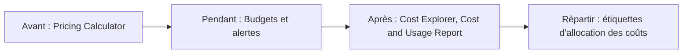

La trésorière de l'association ouvre la facture du mois : trois fois le montant prévu. Personne ne sait quel projet a dépensé quoi, ni depuis quand. Sur AWS, la facture se **prévoit**, se **surveille** et se **répartit**, à condition d'avoir mis en place quelques outils avant la mauvaise surprise.

## Les trois moteurs de la facture

Presque tout ce qu'AWS facture se ramène à trois choses : le **calcul** (durée et taille des ressources qui tournent), le **stockage** (volume conservé, selon la classe) et le **transfert de données**. Pour ce dernier, retiens ces règles générales :

- les données qui **entrent** dans AWS depuis Internet ne sont pas facturées ;
- les données qui **sortent** vers Internet le sont, au-delà d'une franchise mensuelle ;
- un transfert **entre deux régions** est facturé, à la sortie de la région d'origine ;
- à l'intérieur d'une région, certains transferts sont gratuits et d'autres non : le détail dépend du service.

## Acheter du calcul : sept options

| Option | Principe | Pour quel usage |
| --- | --- | --- |
| **À la demande** (*On-Demand*) | Paiement à la seconde, sans engagement | Charge imprévisible, essais, courte durée |
| **Savings Plans** | Engagement sur un montant dépensé par heure, pendant 1 ou 3 ans ; jusqu'à 72 % de réduction | Usage régulier, avec de la souplesse sur le type de ressource |
| **Instances réservées** (*Reserved Instances*) | Engagement sur une configuration précise d'instance, pendant 1 ou 3 ans | Usage régulier et stable d'un type d'instance connu |
| **Instances Spot** | Capacité inutilisée d'AWS, jusqu'à 90 % moins chère ; AWS peut la reprendre avec un préavis de deux minutes | Traitements qui supportent l'interruption : calculs par lots, tests |
| **Hôtes dédiés** (*Dedicated Hosts*) | Un serveur physique entièrement pour toi | Licences liées au matériel (par processeur ou par cœur), exigences réglementaires |
| **Instances dédiées** (*Dedicated Instances*) | Des instances sur du matériel qui ne sert qu'à un seul client | Isolation matérielle, sans gérer l'hôte |
| **Réservations de capacité** (*Capacity Reservations*) | Capacité garantie dans une zone de disponibilité, sans réduction de prix | Être certain·e de pouvoir lancer des instances à un moment critique |

Trois précisions que l'examen aime vérifier :

- Les Savings Plans de calcul (*Compute Savings Plans*) s'appliquent quels que soient la famille d'instances, la taille, le système ou la région, et couvrent aussi AWS Fargate et AWS Lambda. AWS les recommande aujourd'hui plutôt que les instances réservées.
- Une instance réservée *Standard* offre la réduction la plus forte ; une *Convertible* peut être échangée contre une autre configuration.
- Dans une organisation AWS, la réduction d'une instance réservée ou d'un Savings Plan acheté par un compte peut profiter aux **autres comptes** de l'organisation.

Le stockage a ses propres niveaux de prix : ce sont les classes de stockage S3 (leçon 7).

## Prévoir, surveiller, répartir



| Outil | À quoi il sert |
| --- | --- |
| **AWS Pricing Calculator** | Estimer le coût d'une architecture **avant** de la construire. |
| **AWS Budgets** | Fixer un budget (de coût ou d'usage) et recevoir une **alerte** quand un seuil est atteint ou prévu. |
| **AWS Cost Explorer** | Visualiser les dépenses passées (jusqu'à 13 mois), les filtrer par service ou par étiquette, et obtenir une prévision. |
| **AWS Cost and Usage Report** | Le rapport le plus détaillé, livré dans un bucket S3, pour une analyse fine. |
| **Étiquettes d'allocation des coûts** (*cost allocation tags*) | Des étiquettes (`projet=site`) posées sur les ressources, puis **activées** dans la console de facturation, pour ventiler la facture par projet ou par équipe. |

Il existe deux sortes d'étiquettes d'allocation : celles **générées par AWS** (comme `aws:createdBy`) et celles **définies par l'utilisateur**. Dans les deux cas, une étiquette n'apparaît dans les rapports de coûts qu'une fois activée.

## Plusieurs comptes : AWS Organizations

**AWS Organizations** regroupe plusieurs comptes AWS sous un compte de gestion. Côté facturation, cela apporte la **facturation consolidée** :

- **une seule facture** pour tous les comptes ;
- l'usage de tous les comptes est **additionné**, ce qui fait atteindre plus vite les paliers de prix dégressifs ;
- les réductions des instances réservées et des Savings Plans sont **partagées**.

## Le support

| Offre | L'essentiel |
| --- | --- |
| **Basic** | Incluse pour tous : questions de compte et de facturation, documentation, forums, quelques contrôles de Trusted Advisor. Pas d'assistance technique sur dossier. |
| **AWS Business Support+** | Assistance technique 24 h/24 par téléphone, web et messagerie, contrôles complets de Trusted Advisor, aide contextuelle par IA. Offre minimale recommandée par AWS pour la production. |
| **AWS Enterprise Support** | Tout ce qui précède, plus un·e responsable technique de compte attitré·e (*Technical Account Manager*, TAM) et des délais de réponse plus courts sur les incidents critiques. |
| **AWS Unified Operations** | L'offre la plus complète, pour les charges de travail les plus critiques : équipe désignée, revues d'architecture, accompagnement des événements majeurs. |

:::info Les noms des offres ont changé
Jusqu'en 2025, les offres payantes s'appelaient *Developer*, *Business*, *Enterprise On-Ramp* et *Enterprise*. D'après la documentation d'AWS consultée le 6 octobre 2026, *Developer* et *Business* ne sont plus proposées aux nouveaux clients, et ces deux offres ainsi qu'*Enterprise On-Ramp* seront arrêtées le 1er janvier 2027. Le guide d'examen actuel cite Basic, Business Support+, Enterprise Support et Unified Operations ; d'anciens supports de révision parlent encore des anciens noms.
:::

D'autres ressources d'aide à connaître :

- **AWS Trusted Advisor** compare ton compte aux bonnes pratiques dans six catégories : optimisation des coûts, performance, sécurité, tolérance aux pannes, limites de service et excellence opérationnelle.
- **AWS Health Dashboard** t'informe des incidents et des maintenances qui touchent **tes** ressources ; l'API AWS Health permet d'automatiser ce suivi.
- **AWS re:Post** (questions et réponses de la communauté), le **Knowledge Center** et **AWS Prescriptive Guidance** (guides et modèles éprouvés) complètent la documentation.
- Le **réseau de partenaires AWS** réunit des intégrateurs et des éditeurs de logiciels ; **AWS Marketplace** est le catalogue où acheter leurs produits. **AWS Professional Services** et les architectes de solutions d'AWS accompagnent les projets.
- L'équipe **AWS Trust & Safety** reçoit les signalements d'**abus** : une ressource AWS qui envoie du courrier indésirable ou attaque ton site, par exemple.

## Étiqueter et budgéter en pratique

Poser des étiquettes sur un bucket, puis retrouver toutes les ressources d'un projet :

```bash
aws s3api put-bucket-tagging --bucket asso-site-web \
  --tagging 'TagSet=[{Key=projet,Value=site},{Key=environnement,Value=prod}]'
aws resourcegroupstaggingapi get-resources --tag-filters Key=projet,Values=site
```

Un budget se décrit dans un fichier JSON : un nom, un montant, une période, un type.

```json
{
  "BudgetName": "mensuel",
  "BudgetLimit": {"Amount": "50", "Unit": "USD"},
  "TimeUnit": "MONTHLY",
  "BudgetType": "COST"
}
```

```bash
aws budgets create-budget --account-id 000000000000 --budget file://budget.json
```

Un budget ne sert que s'il **prévient** quelqu'un. On lui ajoute une notification : ici, un courriel quand la dépense réelle dépasse 80 % du montant.

```bash
aws budgets create-notification --account-id 000000000000 --budget-name mensuel \
  --notification NotificationType=ACTUAL,ComparisonOperator=GREATER_THAN,Threshold=80,ThresholdType=PERCENTAGE \
  --subscribers SubscriptionType=EMAIL,Address=tresoriere@asso.example
```

Les commandes de budget demandent le numéro de ton compte. Dans le labo, tu le retrouves ainsi, et tu peux lister les budgets existants (aucun pour l'instant) :

```shell run
aws sts get-caller-identity --query Account --output text
aws budgets describe-budgets --account-id 000000000000
```

:::warning Ce qui diffère du vrai AWS
L'émulateur ne facture rien et **ne calcule aucun coût** : il enregistre ton budget et ta notification, mais aucune alerte ne partira, et ni Cost Explorer, ni le Pricing Calculator, ni les offres de support n'y existent. Sur un vrai compte, une alerte de budget **prévient** ; elle n'arrête pas les ressources. À la date de rédaction, un nouveau compte AWS reçoit des crédits de découverte et peut choisir une formule gratuite limitée dans le temps : lis les conditions en vigueur avant de t'y fier.
:::

:::tip Le premier réflexe sur un vrai compte
Crée un budget avec une alerte **avant** de lancer ta première ressource, et supprime ce que tu n'utilises plus. La plupart des mauvaises surprises viennent de ressources oubliées.
:::

## Entraîne-toi

Tu mets en place ce qui a manqué à la trésorière : des étiquettes pour savoir quel projet dépense, un budget mensuel et une alerte.

Crée le fichier du budget :

```json file=budget.json
{
  "BudgetName": "mensuel",
  "BudgetLimit": {"Amount": "50", "Unit": "USD"},
  "TimeUnit": "MONTHLY",
  "BudgetType": "COST"
}
```

:::lab
engine: real
intro: |
  Le bucket `asso-site-web` existe déjà, sans étiquette. Ton compte fictif porte le numéro `000000000000`. Les étapes sont vérifiées sur l'état de l'émulateur.
commands:
  - demarrer-aws
  - 'aws s3api head-bucket --bucket asso-site-web 2>/dev/null || aws s3 mb s3://asso-site-web'
steps:
  - text: "Pose sur le bucket `asso-site-web` les étiquettes `projet=site` et `environnement=prod`"
    hint: "aws s3api put-bucket-tagging, avec le TagSet donné dans la leçon."
    checks:
      - output-contains:
          - 'aws s3api get-bucket-tagging --bucket asso-site-web --output text'
          - 'projet\s+site'
      - output-contains:
          - 'aws s3api get-bucket-tagging --bucket asso-site-web --output text'
          - 'environnement\s+prod'
    solution:
      - "aws s3api put-bucket-tagging --bucket asso-site-web --tagging 'TagSet=[{Key=projet,Value=site},{Key=environnement,Value=prod}]'"
  - text: "Retrouve toutes les ressources du projet et garde la réponse : `aws resourcegroupstaggingapi get-resources --tag-filters Key=projet,Values=site > ressources-site.json`"
    after: [1]
    checks:
      - env-file-contains: [ressources-site.json, 'arn:aws:s3:::asso-site-web']
    solution:
      - aws resourcegroupstaggingapi get-resources --tag-filters Key=projet,Values=site > ressources-site.json
  - text: "Écris `budget.json` (le budget de la leçon), puis crée le budget `mensuel` avec `aws budgets create-budget`"
    hint: "aws budgets create-budget --account-id 000000000000 --budget file://budget.json"
    checks:
      - output-contains:
          - "aws budgets describe-budget --account-id 000000000000 --budget-name mensuel --query 'Budget.[BudgetLimit.Amount,BudgetLimit.Unit,TimeUnit,BudgetType]' --output text"
          - '^50(\.0+)?\s+USD\s+MONTHLY\s+COST$'
    solution:
      - write:
          budget.json: |
            {
              "BudgetName": "mensuel",
              "BudgetLimit": {"Amount": "50", "Unit": "USD"},
              "TimeUnit": "MONTHLY",
              "BudgetType": "COST"
            }
      - aws budgets create-budget --account-id 000000000000 --budget file://budget.json
  - text: "Ajoute au budget une notification par courriel à `tresoriere@asso.example` quand la dépense **réelle** dépasse **80 %** du montant"
    hint: "La commande aws budgets create-notification de la leçon."
    after: [3]
    checks:
      - output-contains:
          - "aws budgets describe-notifications-for-budget --account-id 000000000000 --budget-name mensuel --query 'Notifications[].[NotificationType,ComparisonOperator,Threshold,ThresholdType]' --output text"
          - '^ACTUAL\s+GREATER_THAN\s+80(\.0+)?\s+PERCENTAGE$'
      - output-contains:
          - "aws budgets describe-subscribers-for-notification --account-id 000000000000 --budget-name mensuel --notification NotificationType=ACTUAL,ComparisonOperator=GREATER_THAN,Threshold=80,ThresholdType=PERCENTAGE --query 'Subscribers[].Address' --output text"
          - 'tresoriere@asso\.example'
    solution:
      - aws budgets create-notification --account-id 000000000000 --budget-name mensuel --notification NotificationType=ACTUAL,ComparisonOperator=GREATER_THAN,Threshold=80,ThresholdType=PERCENTAGE --subscribers SubscriptionType=EMAIL,Address=tresoriere@asso.example
:::

## Vérifie tes acquis

:::quiz
Un calcul scientifique tourne six heures chaque nuit et peut être interrompu puis relancé sans dommage. Quelle option d'achat coûte le moins cher ?

- [ ] À la demande
- [ ] Hôtes dédiés
- [x] Instances Spot
- [ ] Réservations de capacité

> Les instances Spot offrent la plus forte réduction, en échange d'une interruption possible : parfait pour un traitement qui la supporte.
:::

:::quiz
Tu veux être prévenu·e par courriel dès que la dépense du mois dépasse 80 % du montant prévu. Quel outil utilises-tu ?

- [ ] AWS Pricing Calculator
- [x] AWS Budgets
- [ ] AWS Cost and Usage Report
- [ ] AWS Artifact

> AWS Budgets surveille un budget et déclenche des alertes. Le Pricing Calculator estime un coût avant de construire.
:::

:::quiz
Une entreprise a dix comptes AWS réunis dans une organisation. Que lui apporte la facturation consolidée ?

- [ ] Un support Enterprise gratuit pour tous les comptes
- [ ] La suppression des frais de transfert de données sortant
- [ ] Une clé d'accès commune aux dix comptes
- [x] Une seule facture, et un usage additionné pour les prix dégressifs et les réductions

> La facturation consolidée produit une facture unique et cumule l'usage de tous les comptes pour les paliers de prix et le partage des réductions.
:::

:::quiz
Quelle offre de support inclut un·e responsable technique de compte attitré·e (TAM) ?

- [ ] Basic
- [ ] AWS Business Support+
- [x] AWS Enterprise Support
- [ ] Aucune : le TAM est un service d'AWS Marketplace

> Le TAM attitré arrive avec Enterprise Support. Business Support+ donne accès à l'assistance technique 24 h/24, sans TAM.
:::
