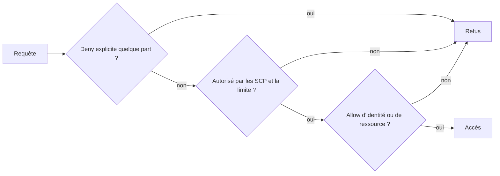
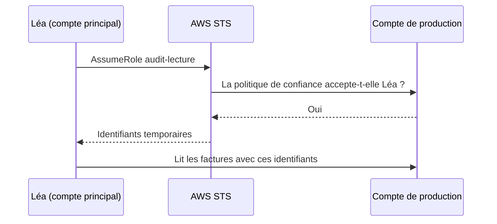

L'auditrice de l'association doit lire les factures rangées dans le compte AWS de **production**, mais elle travaille depuis le compte **principal**. Lui créer un second utilisateur dans le compte de production ? Elle aurait deux mots de passe, deux clés, et personne ne penserait à les supprimer à son départ. La réponse d'AWS tient en un mot : un **rôle**.

## Cinq types de politiques, une seule décision

| Type | Attachée à | Ce qu'elle fait |
| --- | --- | --- |
| **Politique d'identité** | Un utilisateur, un groupe, un rôle | Accorde (ou interdit) des actions à cette identité. |
| **Politique de ressource** | Une ressource : bucket S3, file SQS, clé KMS… | Dit **qui** (`Principal`) peut agir sur cette ressource, y compris depuis un autre compte. |
| **Limite d'autorisations** (*permissions boundary*) | Un utilisateur ou un rôle | Fixe un **plafond** : l'identité ne peut jamais dépasser ce que la limite autorise. Elle n'accorde rien. |
| **Politique de contrôle des services** (SCP) | Un compte ou une unité d'organisation, dans AWS Organizations | Fixe un plafond pour **tout un compte**. Elle n'accorde rien. |
| **Politique de session** | Une session temporaire | Restreint encore une session obtenue en endossant un rôle. |



À retenir : un `Deny` explicite gagne toujours ; les SCP et les limites d'autorisations **plafonnent** sans jamais accorder ; il faut en plus un `Allow`.

## Les rôles et AWS STS

Un **rôle** n'a ni mot de passe ni clé. Il a deux politiques :

- une **politique de confiance** (*trust policy*) : **qui** a le droit d'endosser le rôle ;
- une ou plusieurs **politiques d'autorisations** : ce que le rôle permet de faire.

Endosser un rôle, c'est appeler l'opération `AssumeRole` du service **AWS STS** (*Security Token Service*), qui renvoie des identifiants **temporaires** (une heure par défaut). Trois usages à reconnaître :

| Qui endosse | Exemple |
| --- | --- |
| Un **service AWS** | Une instance EC2 (par un profil d'instance) ou une fonction Lambda lit un bucket sans clé stockée. |
| Une identité d'un **autre compte** | L'auditrice du compte principal lit le compte de production. |
| Une identité **fédérée** | Une salariée connectée par l'annuaire de l'entreprise (SAML, OIDC). |

### L'accès inter-comptes



Il faut **deux** accords, un de chaque côté :

1. dans le compte de production, la politique de confiance du rôle désigne le compte principal ;
2. dans le compte principal, une politique d'identité autorise Léa à appeler `sts:AssumeRole` sur ce rôle.

Voici la politique de confiance. `arn:aws:iam::000000000000:root` désigne **le compte** `000000000000` dans son ensemble : c'est ensuite ce compte qui choisit lesquelles de ses identités ont le droit d'endosser le rôle.

```json
{
  "Version": "2012-10-17",
  "Statement": [
    {
      "Effect": "Allow",
      "Principal": {"AWS": "arn:aws:iam::000000000000:root"},
      "Action": "sts:AssumeRole"
    }
  ]
}
```

:::tip Un prestataire extérieur ? Ajoute un identifiant externe
Quand tu ouvres un rôle à un **tiers** (un outil de supervision, par exemple), ajoute à la politique de confiance une condition sur `sts:ExternalId`. Le tiers doit fournir cette valeur à chaque appel : cela empêche un autre de ses clients de lui faire endosser **ton** rôle à sa place (le problème dit de l'« adjoint désorienté », *confused deputy*).
:::

## Identités : laquelle pour qui ?

| Besoin | Solution |
| --- | --- |
| Les salarié·e·s accèdent à plusieurs comptes AWS | **AWS IAM Identity Center**, relié à l'annuaire de l'entreprise |
| Une application qui tourne sur AWS | Un **rôle** IAM (jamais une clé stockée) |
| Les client·e·s d'une application web ou mobile s'inscrivent et se connectent | **Amazon Cognito** |
| Un annuaire Active Directory dans AWS | **AWS Directory Service** |
| Un cas isolé sans autre choix (un outil ancien, hors AWS) | Un utilisateur IAM avec une clé d'accès, renouvelée régulièrement |

## Plusieurs comptes : les garde-fous

Séparer les environnements dans des **comptes** distincts (production, test, journalisation…) est la meilleure isolation qu'offre AWS. **AWS Organizations** les regroupe en **unités d'organisation** (OU) et permet d'y appliquer des SCP.

Une SCP typique interdit à tout un ensemble de comptes de sortir de régions autorisées, ou de désactiver CloudTrail. Trois faits sur les SCP :

- elles **n'accordent aucune autorisation** : elles délimitent ce que les politiques IAM du compte peuvent accorder ;
- elles s'appliquent à **toutes** les identités des comptes membres, y compris leur utilisateur racine ;
- elles **ne s'appliquent pas** au compte de gestion de l'organisation.

**AWS Control Tower** met en place un environnement multi-comptes prêt à l'emploi (une *landing zone*) : comptes de journalisation et d'audit, garde-fous préconfigurés, création de comptes conformes.

## Les politiques de ressource

Certaines ressources portent leur propre politique. Elle sert dans deux cas :

- donner un accès **direct** à une identité d'un autre compte, sans rôle à endosser (un bucket partagé, par exemple) ;
- autoriser un **service** à écrire dans la ressource (S3 ou SNS qui dépose des messages dans une file SQS).

Dans un même compte, il suffit qu'une politique d'identité **ou** une politique de ressource autorise. Entre deux comptes, il faut que les **deux** côtés autorisent.

:::warning Ce qui diffère du vrai AWS
L'émulateur évalue réellement les politiques d'identité, les politiques de confiance et `sts:AssumeRole`, y compris entre deux comptes fictifs : c'est ce que tu vas vérifier. Il a aussi des écarts à connaître :

- il **n'applique pas** les politiques de bucket S3, les SCP ni les limites d'autorisations (il les enregistre, ou les ignore) ;
- dans un même compte, il exige une politique d'identité pour `sts:AssumeRole` même quand la politique de confiance nomme directement l'utilisateur, ce que le vrai AWS n'exige pas ;
- un « compte » y est simplement une clé d'accès à douze chiffres : `111111111111` te connecte comme utilisateur racine du compte fictif de ce numéro.
:::

## Entraîne-toi

Deux comptes fictifs sont prêts. Dans le compte **principal** `000000000000`, l'utilisatrice `lea` existe et son profil `lea` est configuré ; elle n'a encore aucun droit. Dans le compte de **production** `111111111111`, le bucket `prod-factures` contient une facture. Le profil `prod` te donne la main sur ce compte.

Tu vois les deux comptes ainsi :

```shell run
aws sts get-caller-identity --query Account --output text
aws sts get-caller-identity --profile prod --query Account --output text
aws sts get-caller-identity --profile lea --query Arn --output text
```

Tu vas créer dans la production le rôle `audit-lecture`, autoriser Léa à l'endosser, puis vérifier qu'elle lit les factures sans pouvoir les supprimer. Crée les deux documents :

```json file=confiance.json
{
  "Version": "2012-10-17",
  "Statement": [
    {
      "Effect": "Allow",
      "Principal": {"AWS": "arn:aws:iam::000000000000:root"},
      "Action": "sts:AssumeRole"
    }
  ]
}
```

```json file=endosser.json
{
  "Version": "2012-10-17",
  "Statement": [
    {
      "Effect": "Allow",
      "Action": "sts:AssumeRole",
      "Resource": "arn:aws:iam::111111111111:role/audit-lecture"
    }
  ]
}
```

Un profil de l'AWS CLI peut endosser un rôle tout seul : on lui indique le rôle (`role_arn`) et le profil dont les identifiants servent à l'endosser (`source_profile`).

```bash
aws configure set role_arn arn:aws:iam::111111111111:role/audit-lecture --profile audit
aws configure set source_profile lea --profile audit
```

:::lab
engine: real
intro: |
  Compte principal `000000000000` (ton identité par défaut, et le profil `lea`) ; compte de production `111111111111` (profil `prod`). Le bucket `prod-factures` appartient à la production. L'émulateur évalue réellement les politiques IAM et les endossements de rôle.
files:
  facture-001.txt: |
    Facture fictive 001 : hébergement, 42 euros.
commands:
  - demarrer-aws
  - aws configure set aws_access_key_id 111111111111 --profile prod
  - aws configure set aws_secret_access_key test --profile prod
  - 'aws s3api head-bucket --bucket prod-factures --profile prod 2>/dev/null || aws s3 mb s3://prod-factures --profile prod'
  - aws s3 cp facture-001.txt s3://prod-factures/facture-001.txt --profile prod
  - 'aws iam get-user --user-name lea >/dev/null 2>&1 || aws iam create-user --user-name lea'
  - 'aws sts get-caller-identity --profile lea >/dev/null 2>&1 || { aws iam create-access-key --user-name lea > "$HOME/cle-lea.json" && aws configure set aws_access_key_id "$(jq -r .AccessKey.AccessKeyId "$HOME/cle-lea.json")" --profile lea && aws configure set aws_secret_access_key "$(jq -r .AccessKey.SecretAccessKey "$HOME/cle-lea.json")" --profile lea && rm "$HOME/cle-lea.json"; }'
steps:
  - text: "Dans le compte de **production** (`--profile prod`), crée le rôle `audit-lecture` avec la politique de confiance `confiance.json`"
    hint: "aws iam create-role --role-name audit-lecture --assume-role-policy-document file://confiance.json --profile prod"
    checks:
      - output-contains:
          - "aws iam get-role --role-name audit-lecture --profile prod --query 'Role.AssumeRolePolicyDocument.Statement[0].Principal.AWS' --output text"
          - '000000000000'
    solution:
      - write:
          confiance.json: |
            {
              "Version": "2012-10-17",
              "Statement": [
                {
                  "Effect": "Allow",
                  "Principal": {"AWS": "arn:aws:iam::000000000000:root"},
                  "Action": "sts:AssumeRole"
                }
              ]
            }
      - aws iam create-role --role-name audit-lecture --assume-role-policy-document file://confiance.json --profile prod
  - text: "Toujours en production, rattache au rôle la politique gérée par AWS `ReadOnlyAccess` (ARN `arn:aws:iam::aws:policy/ReadOnlyAccess`)"
    hint: "aws iam attach-role-policy --role-name audit-lecture --policy-arn arn:aws:iam::aws:policy/ReadOnlyAccess --profile prod"
    after: [1]
    checks:
      - output-contains:
          - "aws iam list-attached-role-policies --role-name audit-lecture --profile prod --query 'AttachedPolicies[].PolicyName' --output text"
          - '\bReadOnlyAccess\b'
    solution:
      - aws iam attach-role-policy --role-name audit-lecture --policy-arn arn:aws:iam::aws:policy/ReadOnlyAccess --profile prod
  - text: "Dans le compte **principal**, autorise `lea` à endosser ce rôle : ajoute-lui la politique `endosser-audit`, à partir de `endosser.json`, avec `aws iam put-user-policy`"
    hint: "aws iam put-user-policy --user-name lea --policy-name endosser-audit --policy-document file://endosser.json"
    checks:
      - output-contains:
          - "aws iam get-user-policy --user-name lea --policy-name endosser-audit --query 'PolicyDocument.Statement[0].[Action,Resource]' --output text"
          - 'sts:AssumeRole\s+arn:aws:iam::111111111111:role/audit-lecture'
    solution:
      - write:
          endosser.json: |
            {
              "Version": "2012-10-17",
              "Statement": [
                {
                  "Effect": "Allow",
                  "Action": "sts:AssumeRole",
                  "Resource": "arn:aws:iam::111111111111:role/audit-lecture"
                }
              ]
            }
      - aws iam put-user-policy --user-name lea --policy-name endosser-audit --policy-document file://endosser.json
  - text: "Configure le profil `audit` (rôle `audit-lecture`, profil source `lea`), puis garde l'identité obtenue : `aws sts get-caller-identity --profile audit > identite-audit.json`"
    after: [2, 3]
    checks:
      - output-contains:
          - 'aws sts get-caller-identity --profile audit --query Arn --output text'
          - '^arn:aws:sts::111111111111:assumed-role/audit-lecture/'
      - env-file-contains: [identite-audit.json, 'assumed-role/audit-lecture']
    solution:
      - aws configure set role_arn arn:aws:iam::111111111111:role/audit-lecture --profile audit
      - aws configure set source_profile lea --profile audit
      - aws sts get-caller-identity --profile audit > identite-audit.json
  - text: "Avec le profil `audit`, liste le bucket `prod-factures` dans `factures.txt`, puis tente de supprimer `facture-001.txt` en gardant l'erreur dans `refus.txt`"
    hint: "aws s3 ls s3://prod-factures --profile audit > factures.txt ; puis aws s3 rm … --profile audit 2> refus.txt"
    after: [4]
    checks:
      - env-file-contains: [factures.txt, 'facture-001\.txt']
      - env-file-contains: [refus.txt, 'AccessDenied']
      - command-succeeds: 'aws s3api head-object --bucket prod-factures --key facture-001.txt --profile prod'
    solution:
      - aws s3 ls s3://prod-factures --profile audit > factures.txt
      - 'aws s3 rm s3://prod-factures/facture-001.txt --profile audit 2> refus.txt || true'
:::

## Vérifie tes acquis

:::quiz
Une identité du compte A doit lire une table DynamoDB du compte B au moyen d'un rôle du compte B. Qu'est-ce qui est nécessaire ?

- [ ] Seulement une politique de confiance sur le rôle, dans le compte B
- [ ] Seulement une politique d'identité dans le compte A
- [x] Une politique de confiance dans le compte B **et** une autorisation `sts:AssumeRole` dans le compte A
- [ ] Une clé d'accès de l'utilisateur racine du compte B

> Entre deux comptes, les deux côtés doivent consentir : le rôle fait confiance au compte A, et le compte A autorise son identité à endosser le rôle.
:::

:::quiz
Une SCP rattachée à une unité d'organisation interdit toutes les actions hors des régions européennes. Un administrateur d'un compte membre a la politique `AdministratorAccess`. Peut-il lancer une instance à Tokyo ?

- [ ] Oui, `AdministratorAccess` autorise tout
- [x] Non : la SCP plafonne ce que les politiques IAM du compte peuvent accorder
- [ ] Oui, car une SCP ne s'applique qu'à l'utilisateur racine
- [ ] Non, mais seulement jusqu'à ce qu'il endosse un rôle du compte

> Une SCP délimite le maximum possible dans les comptes membres, pour toutes leurs identités. Aucun `Allow` du compte ne peut la dépasser.
:::

:::quiz
Une application mobile de l'association doit permettre à ses adhérent·e·s de créer un compte et de se connecter. Quel service gère ces identités ?

- [ ] AWS IAM Identity Center
- [ ] Des utilisateurs IAM, un par adhérent·e
- [ ] AWS Directory Service
- [x] Amazon Cognito

> Cognito gère l'inscription et la connexion des utilisateur·rice·s d'une application. Identity Center s'adresse au personnel qui accède aux comptes AWS.
:::

:::quiz
Un éditeur de supervision demande un rôle dans ton compte, qu'il endossera depuis le sien. Quelle précaution limite le risque qu'un autre de ses clients accède à tes données par son intermédiaire ?

- [ ] Donner au rôle la politique `ReadOnlyAccess`
- [ ] Créer le rôle dans une autre région
- [x] Exiger un identifiant externe (`sts:ExternalId`) dans la politique de confiance
- [ ] Lui fournir une clé d'accès plutôt qu'un rôle

> L'identifiant externe, propre à ta relation avec l'éditeur, protège contre le problème de l'adjoint désorienté.
:::
