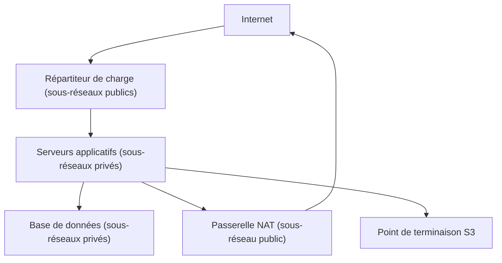
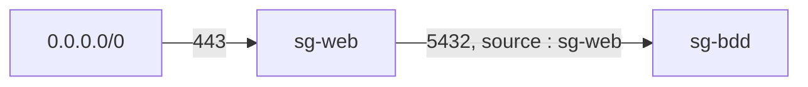

La base de données de la boutique en ligne a été trouvée par un robot qui balayait Internet : elle était dans le même sous-réseau public que le serveur web, « pour aller plus vite ». Une architecture sûre commence par une règle simple : **seul ce qui doit être joignable depuis Internet est placé dans un sous-réseau public**.

## L'architecture à niveaux



| Niveau | Sous-réseau | Route par défaut | Contient |
| --- | --- | --- | --- |
| Public | Public | Passerelle Internet | Répartiteur de charge, passerelle NAT, éventuel bastion |
| Application | Privé | Passerelle NAT | Instances, conteneurs |
| Données | Privé | Aucune, ou passerelle NAT | Bases de données, caches |

Chaque niveau est **dupliqué dans au moins deux zones de disponibilité** : un sous-réseau vit dans une seule zone, donc la haute disponibilité demande un sous-réseau par zone et par niveau. Pense aussi à l'adressage : AWS réserve **cinq adresses** dans chaque sous-réseau, et la plage d'un VPC se choisit pour ne pas chevaucher celles des réseaux auxquels il sera relié un jour.

## Sortir sans être joignable

Une instance privée a parfois besoin de sortir (mises à jour, API externes). Trois moyens, à ne pas confondre :

| Moyen | Pour atteindre | Coût et remarques |
| --- | --- | --- |
| **Passerelle NAT** | Internet | Service géré, facturé à l'heure **et** au volume traité. Elle vit dans **une** zone : pour la haute disponibilité, une par zone. |
| **Point de terminaison de passerelle** (*gateway endpoint*) | Amazon S3 et Amazon DynamoDB uniquement | Une entrée dans la table de routage. **Gratuit.** Le trafic reste sur le réseau d'AWS. |
| **Point de terminaison d'interface** (*interface endpoint*, AWS PrivateLink) | La plupart des autres services AWS, ou un service d'un autre VPC | Une interface réseau privée dans ton sous-réseau, facturée à l'heure et au volume. |

Un réflexe d'architecte : si des instances privées échangent beaucoup avec S3 en passant par une passerelle NAT, un point de terminaison de passerelle supprime ce coût de NAT **et** garde le trafic hors d'Internet.

## Deux pare-feu, et comment les utiliser

Tu connais la différence entre le **groupe de sécurité** (au niveau de la ressource, avec état, autorisations seulement) et la **liste de contrôle d'accès réseau** (au niveau du sous-réseau, sans état, autorisations et interdictions). En conception, le geste clé est le **chaînage** des groupes de sécurité : la règle d'entrée de la base n'autorise pas une plage d'adresses, mais **le groupe de sécurité des serveurs applicatifs**.



Ainsi, toute instance qui porte `sg-web` peut parler à la base, où qu'elle soit et quelle que soit son adresse ; aucune autre ne le peut. Ajouter un serveur ne demande aucune modification de règle.

## Protéger les entrées

| Menace | Réponse |
| --- | --- |
| Attaque par déni de service (DDoS) | **AWS Shield** (Standard, automatique ; Advanced pour une protection renforcée), en s'appuyant sur CloudFront et les répartiteurs de charge pour absorber le trafic |
| Injection SQL, scripts intersites, robots | **AWS WAF**, attaché à CloudFront, à un Application Load Balancer ou à API Gateway |
| Accès d'administration | Pas de port 22 ouvert au monde : **AWS Systems Manager Session Manager**, ou un bastion limité à quelques adresses |
| Secrets en clair dans la configuration | **AWS Secrets Manager** ou Parameter Store, lus au démarrage par un rôle |

Pour relier tes **locaux** au VPC : un **VPN site à site** (chiffré, par Internet, rapide à établir) ou **AWS Direct Connect** (liaison dédiée, débit stable, mais non chiffrée par défaut : on y ajoute un VPN si le chiffrement est exigé).

## Construire le niveau privé

Dans le labo, le VPC `boutique` existe déjà avec son niveau public. Regarde ce qui est en place :

```shell run
aws ec2 describe-subnets --filters Name=tag:Name,Values=public-a --query 'Subnets[].[SubnetId,CidrBlock,AvailabilityZone]' --output text
aws ec2 describe-security-groups --filters Name=group-name,Values=sg-web --query 'SecurityGroups[].[GroupId,GroupName]' --output text
```

Une passerelle NAT a besoin d'une adresse publique fixe (une **adresse IP élastique**) et se place dans un sous-réseau **public** :

```bash
ADRESSE=$(aws ec2 allocate-address --domain vpc --query AllocationId --output text)
aws ec2 create-nat-gateway --subnet-id <id de public-a> --allocation-id $ADRESSE \
  --tag-specifications 'ResourceType=natgateway,Tags=[{Key=Name,Value=nat-a}]'
```

La table de routage du niveau privé envoie le trafic par défaut vers cette passerelle (`--nat-gateway-id`, là où le niveau public utilise `--gateway-id`). La règle chaînée d'un groupe de sécurité s'écrit avec `--source-group` au lieu de `--cidr` :

```bash
aws ec2 authorize-security-group-ingress --group-id <id de sg-bdd> \
  --protocol tcp --port 5432 --source-group <id de sg-web>
```

Enfin, le point de terminaison de passerelle pour S3 se rattache à une table de routage :

```bash
aws ec2 create-vpc-endpoint --vpc-id <id du VPC> \
  --service-name com.amazonaws.eu-west-3.s3 --route-table-ids <id de la table privée>
```

:::warning Ce qui diffère du vrai AWS
Tout ceci est une **description** dans l'émulateur : aucune machine, aucun paquet. Tu ne peux donc pas constater qu'une instance privée sort bien par la passerelle NAT. L'émulateur ne vérifie pas non plus la cohérence des plages d'adresses. Sur le vrai AWS, une passerelle NAT met une à deux minutes à devenir disponible, et **coûte dès sa création** : c'est l'une des ressources les plus souvent oubliées.
:::

:::tip Une passerelle NAT par zone… ou pas
Une seule passerelle NAT partagée coûte moins cher, mais si sa zone tombe, les instances privées des autres zones perdent leur sortie (et leur trafic vers elle traverse les zones, ce qui est facturé). En production, on en place une par zone ; en test, une seule suffit souvent.
:::

## Entraîne-toi

Tu complètes le VPC `boutique` : un sous-réseau privé qui sort par une passerelle NAT, un groupe de sécurité de base de données qui n'accepte que les serveurs web, et un point de terminaison pour S3.

:::lab
engine: real
intro: |
  Le VPC `boutique` (`10.0.0.0/16`) existe avec son niveau public : sous-réseau `public-a` (`10.0.1.0/24`, zone `eu-west-3a`), passerelle Internet, table de routage publique et groupe de sécurité `sg-web` (port 443 ouvert). Les étapes retrouvent tes ressources par leurs étiquettes et leurs noms : respecte `prive-a`, `prive` et `sg-bdd`.
files:
  labo/preparer.sh: |
    #!/bin/sh
    # Prépare le niveau public du VPC « boutique » (rejouable : ne recrée rien de ce qui existe).
    set -e
    v=$(aws ec2 describe-vpcs --filters Name=tag:Name,Values=boutique --query 'Vpcs[0].VpcId' --output text)
    if [ "$v" = "None" ]; then
        v=$(aws ec2 create-vpc --cidr-block 10.0.0.0/16 --tag-specifications 'ResourceType=vpc,Tags=[{Key=Name,Value=boutique}]' --query Vpc.VpcId --output text)
        s=$(aws ec2 create-subnet --vpc-id "$v" --cidr-block 10.0.1.0/24 --availability-zone eu-west-3a --tag-specifications 'ResourceType=subnet,Tags=[{Key=Name,Value=public-a}]' --query Subnet.SubnetId --output text)
        g=$(aws ec2 create-internet-gateway --query InternetGateway.InternetGatewayId --output text)
        aws ec2 attach-internet-gateway --internet-gateway-id "$g" --vpc-id "$v"
        t=$(aws ec2 create-route-table --vpc-id "$v" --tag-specifications 'ResourceType=route-table,Tags=[{Key=Name,Value=public}]' --query RouteTable.RouteTableId --output text)
        aws ec2 create-route --route-table-id "$t" --destination-cidr-block 0.0.0.0/0 --gateway-id "$g" > /dev/null
        aws ec2 associate-route-table --route-table-id "$t" --subnet-id "$s" > /dev/null
        w=$(aws ec2 create-security-group --group-name sg-web --description "Serveurs web" --vpc-id "$v" --query GroupId --output text)
        aws ec2 authorize-security-group-ingress --group-id "$w" --protocol tcp --port 443 --cidr 0.0.0.0/0 > /dev/null
    fi
commands:
  - demarrer-aws
  - sh labo/preparer.sh
steps:
  - text: "Dans le VPC `boutique`, crée le sous-réseau privé `10.0.11.0/24`, zone `eu-west-3a`, étiqueté `Name=prive-a`"
    hint: "Retrouve l'identifiant du VPC : aws ec2 describe-vpcs --filters Name=tag:Name,Values=boutique --query 'Vpcs[0].VpcId' --output text"
    checks:
      - output-contains:
          - "aws ec2 describe-subnets --filters Name=tag:Name,Values=prive-a Name=vpc-id,Values=\"$(aws ec2 describe-vpcs --filters Name=tag:Name,Values=boutique --query 'Vpcs[0].VpcId' --output text)\" --query 'Subnets[].[CidrBlock,AvailabilityZone]' --output text"
          - '^10\.0\.11\.0/24\s+eu-west-3a$'
    solution:
      - "aws ec2 create-subnet --vpc-id \"$(aws ec2 describe-vpcs --filters Name=tag:Name,Values=boutique --query 'Vpcs[0].VpcId' --output text)\" --cidr-block 10.0.11.0/24 --availability-zone eu-west-3a --tag-specifications 'ResourceType=subnet,Tags=[{Key=Name,Value=prive-a}]'"
  - text: "Alloue une adresse IP élastique et crée une passerelle NAT dans le sous-réseau **public** `public-a`"
    hint: "aws ec2 allocate-address --domain vpc, puis aws ec2 create-nat-gateway --subnet-id … --allocation-id …"
    checks:
      - output-contains:
          - "aws ec2 describe-nat-gateways --filter Name=subnet-id,Values=\"$(aws ec2 describe-subnets --filters Name=tag:Name,Values=public-a --query 'Subnets[0].SubnetId' --output text)\" --query 'NatGateways[].State' --output text"
          - '\bavailable\b'
    solution:
      - "aws ec2 create-nat-gateway --subnet-id \"$(aws ec2 describe-subnets --filters Name=tag:Name,Values=public-a --query 'Subnets[0].SubnetId' --output text)\" --allocation-id \"$(aws ec2 allocate-address --domain vpc --query AllocationId --output text)\" --tag-specifications 'ResourceType=natgateway,Tags=[{Key=Name,Value=nat-a}]'"
  - text: "Crée une table de routage étiquetée `Name=prive`, donne-lui la route `0.0.0.0/0` vers la passerelle NAT, et associe-la au sous-réseau `prive-a`"
    hint: "`aws ec2 create-route … --nat-gateway-id <id de la passerelle NAT>` (et non `--gateway-id`)"
    after: [1, 2]
    checks:
      - output-contains:
          - "aws ec2 describe-route-tables --filters Name=tag:Name,Values=prive Name=association.subnet-id,Values=\"$(aws ec2 describe-subnets --filters Name=tag:Name,Values=prive-a --query 'Subnets[0].SubnetId' --output text)\" --query 'RouteTables[].Routes[].[DestinationCidrBlock,NatGatewayId]' --output text"
          - '^0\.0\.0\.0/0\s+nat-'
    solution:
      - "V=$(aws ec2 describe-vpcs --filters Name=tag:Name,Values=boutique --query 'Vpcs[0].VpcId' --output text); T=$(aws ec2 create-route-table --vpc-id $V --tag-specifications 'ResourceType=route-table,Tags=[{Key=Name,Value=prive}]' --query RouteTable.RouteTableId --output text); N=$(aws ec2 describe-nat-gateways --filter Name=vpc-id,Values=$V --query 'NatGateways[0].NatGatewayId' --output text); aws ec2 create-route --route-table-id $T --destination-cidr-block 0.0.0.0/0 --nat-gateway-id $N && aws ec2 associate-route-table --route-table-id $T --subnet-id $(aws ec2 describe-subnets --filters Name=tag:Name,Values=prive-a --query 'Subnets[0].SubnetId' --output text)"
  - text: "Crée le groupe de sécurité `sg-bdd` dans le VPC et autorise le port TCP 5432 **uniquement** depuis le groupe `sg-web` (aucune plage d'adresses)"
    hint: "`aws ec2 authorize-security-group-ingress … --protocol tcp --port 5432 --source-group <id de sg-web>`"
    checks:
      - command-succeeds: "test \"$(aws ec2 describe-security-groups --filters Name=group-name,Values=sg-bdd --query 'SecurityGroups[0].IpPermissions[?FromPort==`5432`].UserIdGroupPairs[0].GroupId | [0]' --output text)\" = \"$(aws ec2 describe-security-groups --filters Name=group-name,Values=sg-web --query 'SecurityGroups[0].GroupId' --output text)\""
      - output-contains:
          - "aws ec2 describe-security-groups --filters Name=group-name,Values=sg-bdd --query 'length(SecurityGroups[0].IpPermissions[].IpRanges[])' --output text"
          - '^0$'
    solution:
      - "V=$(aws ec2 describe-vpcs --filters Name=tag:Name,Values=boutique --query 'Vpcs[0].VpcId' --output text); B=$(aws ec2 create-security-group --group-name sg-bdd --description 'Base de donnees' --vpc-id $V --query GroupId --output text); aws ec2 authorize-security-group-ingress --group-id $B --protocol tcp --port 5432 --source-group $(aws ec2 describe-security-groups --filters Name=group-name,Values=sg-web --query 'SecurityGroups[0].GroupId' --output text)"
  - text: "Crée un point de terminaison de passerelle pour S3 (`com.amazonaws.eu-west-3.s3`) dans le VPC, rattaché à la table de routage `prive`"
    after: [3]
    checks:
      - command-succeeds: "test \"$(aws ec2 describe-vpc-endpoints --filters Name=service-name,Values=com.amazonaws.eu-west-3.s3 Name=vpc-endpoint-type,Values=Gateway --query 'VpcEndpoints[0].RouteTableIds[0]' --output text)\" = \"$(aws ec2 describe-route-tables --filters Name=tag:Name,Values=prive --query 'RouteTables[0].RouteTableId' --output text)\""
      - output-contains:
          - "aws ec2 describe-vpc-endpoints --filters Name=service-name,Values=com.amazonaws.eu-west-3.s3 --query 'VpcEndpoints[].VpcEndpointType' --output text"
          - '\bGateway\b'
    solution:
      - "aws ec2 create-vpc-endpoint --vpc-id \"$(aws ec2 describe-vpcs --filters Name=tag:Name,Values=boutique --query 'Vpcs[0].VpcId' --output text)\" --service-name com.amazonaws.eu-west-3.s3 --route-table-ids \"$(aws ec2 describe-route-tables --filters Name=tag:Name,Values=prive --query 'RouteTables[0].RouteTableId' --output text)\""
:::

## Vérifie tes acquis

:::quiz
Des instances d'un sous-réseau privé envoient chaque nuit des centaines de gigaoctets vers Amazon S3 en passant par une passerelle NAT. Comment réduire le coût sans exposer les instances ?

- [ ] Déplacer les instances dans un sous-réseau public
- [ ] Ajouter une seconde passerelle NAT
- [x] Créer un point de terminaison de passerelle pour S3 dans le VPC
- [ ] Remplacer la passerelle NAT par un VPN

> Le point de terminaison de passerelle pour S3 est gratuit et garde le trafic sur le réseau d'AWS : le volume ne passe plus par la passerelle NAT, facturée au gigaoctet.
:::

:::quiz
Le niveau applicatif s'adapte automatiquement : ses instances changent d'adresse en permanence. Comment autoriser ces instances, et elles seules, à joindre la base de données ?

- [ ] Autoriser toute la plage du VPC sur le port de la base
- [x] Autoriser, dans le groupe de sécurité de la base, le groupe de sécurité du niveau applicatif comme source
- [ ] Ajouter une règle d'interdiction dans la liste de contrôle d'accès du sous-réseau
- [ ] Donner une adresse IP élastique à chaque instance

> Référencer un groupe de sécurité comme source suit les instances, quelles que soient leurs adresses, et n'ouvre la base à rien d'autre.
:::

:::quiz
Une application privée doit appeler AWS Secrets Manager sans que le trafic passe par Internet ni par une passerelle NAT. Que faut-il ?

- [ ] Un point de terminaison de passerelle
- [ ] Une passerelle Internet
- [ ] AWS Direct Connect
- [x] Un point de terminaison d'interface (AWS PrivateLink)

> Les points de terminaison de passerelle n'existent que pour S3 et DynamoDB. Pour les autres services, on utilise un point de terminaison d'interface.
:::

:::quiz
Une entreprise veut une haute disponibilité de la sortie Internet de ses sous-réseaux privés répartis sur trois zones. Quelle conception retenir ?

- [ ] Une passerelle NAT unique dans la première zone
- [ ] Une passerelle Internet par zone
- [x] Une passerelle NAT dans chaque zone, avec une table de routage privée par zone
- [ ] Un point de terminaison de passerelle par zone

> Une passerelle NAT vit dans une seule zone. Une par zone, avec des routes qui restent dans la zone, évite qu'une panne de zone coupe la sortie des autres.
:::
