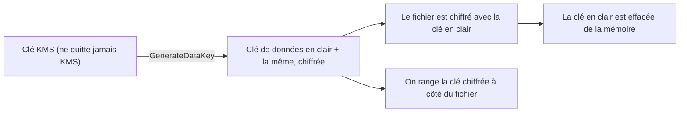

Un audit pose trois questions sur les factures de l'association : sont-elles chiffrées ? **Qui** peut utiliser la clé, et chaque usage est-il tracé ? Peut-on prouver qu'aucune n'a été modifiée depuis son dépôt ? « Elles sont sur S3 » ne répond à aucune des trois.

## Chiffrer au repos : qui tient la clé ?

Pour S3, le choix porte sur le **contrôle** de la clé, pas sur la solidité du chiffrement :

| Mode | Qui gère la clé | Ce que tu y gagnes |
| --- | --- | --- |
| **SSE-S3** | Amazon S3, entièrement | Rien à faire : c'est le chiffrement appliqué par défaut à tout nouvel objet. |
| **SSE-KMS** | AWS KMS, avec une clé que tu peux contrôler | Une **politique de clé** dit qui peut l'utiliser ; chaque usage est tracé dans CloudTrail ; rotation au choix. |
| **DSSE-KMS** | AWS KMS | Deux couches de chiffrement, pour certaines exigences réglementaires. |
| **SSE-C** | Toi : tu fournis la clé à chaque requête | S3 ne conserve pas la clé. Rare ; désactivé par défaut sur les nouveaux buckets depuis 2026. |
| **Chiffrement côté client** | Toi, avant l'envoi | AWS ne voit jamais la donnée en clair. |

Dans KMS, on distingue trois sortes de clés :

- les clés **détenues par AWS** (*AWS owned*), invisibles pour toi ;
- les clés **gérées par AWS** (*AWS managed*), visibles dans ton compte sous un alias de la forme `aws/s3`, mais dont tu ne règles ni la politique ni le cycle de vie ;
- les clés **gérées par le client** (*customer managed*), que tu crées : tu en écris la politique, tu décides de la rotation, et tu peux les désactiver. Elles sont facturées.

Dès qu'un scénario exige de **contrôler qui utilise la clé**, de la **partager avec un autre compte** ou d'**auditer chaque usage**, la réponse est une clé gérée par le client.

## Le chiffrement d'enveloppe

KMS ne chiffre directement que de petites données (4 096 octets au plus). Pour un gros fichier, on utilise une **clé de données** :



Pour déchiffrer, on envoie la clé de données chiffrée à KMS, qui la rend en clair si l'appelant y est autorisé. La clé KMS, elle, **ne sort jamais** du service. C'est ce que font S3, EBS ou RDS pour toi quand tu actives SSE-KMS.

## La politique de clé

Toute clé KMS a une **politique de clé**, une politique de ressource. C'est **elle** qui décide en dernier ressort : sans elle, aucune politique IAM ne donne accès à la clé. La politique par défaut délègue au compte, ce qui laisse les politiques IAM du compte accorder l'accès :

```shell run
aws kms list-aliases --query 'Aliases[].AliasName' --output text
```

Deux conséquences d'architecture :

- pour qu'un **autre compte** utilise ta clé (lire un instantané chiffré partagé, par exemple), il faut l'y autoriser dans la politique de clé **et** dans une politique IAM de son côté ;
- un objet chiffré en SSE-KMS exige **deux** droits pour être lu : `s3:GetObject` sur l'objet et `kms:Decrypt` sur la clé.

## Chiffrer en transit

- **AWS Certificate Manager (ACM)** émet et **renouvelle automatiquement** les certificats TLS publics utilisés par un répartiteur de charge, CloudFront ou API Gateway.
- Pour **refuser** tout accès non chiffré à un bucket, on ajoute à sa politique un `Deny` conditionné par `aws:SecureTransport` :

```json
{
  "Version": "2012-10-17",
  "Statement": [
    {
      "Sid": "RefuserSansTLS",
      "Effect": "Deny",
      "Principal": "*",
      "Action": "s3:*",
      "Resource": ["arn:aws:s3:::asso-factures", "arn:aws:s3:::asso-factures/*"],
      "Condition": {"Bool": {"aws:SecureTransport": "false"}}
    }
  ]
}
```

La règle se lit : « interdire toute action S3, à tout le monde, sur ce bucket et ses objets, **quand** la requête n'utilise pas TLS ».

## Empêcher la suppression et la modification

| Outil | Protège contre | À savoir |
| --- | --- | --- |
| **Versionnage** | L'écrasement et la suppression par erreur | Les anciennes versions restent, et sont facturées. |
| **Suppression MFA** (*MFA Delete*) | La suppression définitive d'une version | Exige un code MFA ; activable par l'utilisateur racine du compte. |
| **Verrouillage d'objets** (*S3 Object Lock*) | Toute modification ou suppression pendant une durée fixée (modèle WORM : écrire une fois, lire plusieurs) | Exige le versionnage. Mode *gouvernance* : certains droits spéciaux peuvent lever le verrou. Mode *conformité* : **personne** ne le peut, pas même l'utilisateur racine, avant l'échéance. |
| **Réplication** vers un autre bucket | La perte d'une région, ou d'un compte | Asynchrone ; exige le versionnage des deux côtés (leçon 7). |
| **AWS Backup** | La perte de données de plusieurs services | Plans centralisés, copies vers une autre région ou un autre compte, coffres verrouillables. |

Pour les **secrets** d'une application (mots de passe de base, clés d'API), utilise **AWS Secrets Manager**, qui sait les faire tourner automatiquement ; les certificats, eux, se renouvellent avec ACM.

:::warning Ce qui diffère du vrai AWS
- Le KMS de l'émulateur imite l'API : il chiffre et déchiffre réellement tes octets, mais ce n'est pas un module cryptographique certifié.
- L'émulateur **enregistre** la politique d'un bucket sans l'appliquer, et il parle en `http` : la règle `aws:SecureTransport` que tu vas poser y est sans effet. Sur le vrai AWS, elle bloquerait toute requête non chiffrée.
- Le verrouillage d'objets, lui, est bien appliqué par l'émulateur.
:::

:::tip Pour reconnaître la bonne réponse
« Le moins d'effort d'exploitation » → SSE-S3. « Contrôler et auditer l'usage de la clé » → SSE-KMS avec une clé gérée par le client. « AWS ne doit jamais voir la donnée en clair » → chiffrement côté client. « Impossible à supprimer pendant sept ans, même par un administrateur » → verrouillage d'objets en mode conformité.
:::

## Entraîne-toi

Tu réponds à l'audit : une clé KMS que tu contrôles, un bucket chiffré par défaut avec cette clé, une politique qui impose TLS, puis le chiffrement d'un petit secret directement avec KMS.

Les commandes utiles :

```bash
aws kms create-key --description "Factures de l'association" --query KeyMetadata.KeyId --output text
aws kms create-alias --alias-name alias/factures --target-key-id <identifiant>
aws kms enable-key-rotation --key-id <identifiant>
```

Le chiffrement par défaut d'un bucket se décrit en JSON. `BucketKeyEnabled` réduit le nombre d'appels à KMS, donc le coût :

```json file=chiffrement.json
{
  "Rules": [
    {
      "ApplyServerSideEncryptionByDefault": {
        "SSEAlgorithm": "aws:kms",
        "KMSMasterKeyID": "alias/factures"
      },
      "BucketKeyEnabled": true
    }
  ]
}
```

```json file=politique-tls.json
{
  "Version": "2012-10-17",
  "Statement": [
    {
      "Sid": "RefuserSansTLS",
      "Effect": "Deny",
      "Principal": "*",
      "Action": "s3:*",
      "Resource": ["arn:aws:s3:::asso-factures", "arn:aws:s3:::asso-factures/*"],
      "Condition": {"Bool": {"aws:SecureTransport": "false"}}
    }
  ]
}
```

Pour chiffrer un petit fichier directement avec KMS, puis le déchiffrer. KMS renvoie le résultat encodé en base64 : `base64 -d` le remet en octets.

```bash
aws kms encrypt --key-id alias/factures --plaintext fileb://iban.txt \
  --query CiphertextBlob --output text | base64 -d > iban.chiffre
aws kms decrypt --ciphertext-blob fileb://iban.chiffre \
  --query Plaintext --output text | base64 -d > iban.dechiffre
```

:::lab
engine: real
intro: |
  Le bucket `asso-factures` existe, sans réglage particulier. Ton dossier de travail contient `facture-2026-001.txt` et `iban.txt` (valeurs fictives). Les étapes sont vérifiées sur l'état de l'émulateur et sur tes fichiers.
files:
  facture-2026-001.txt: |
    Facture fictive 2026-001 : impression d'affiches, 120 euros.
  iban.txt: |
    FR76 0000 0000 0000 0000 0000 000 (IBAN fictif)
commands:
  - demarrer-aws
  - 'aws s3api head-bucket --bucket asso-factures 2>/dev/null || aws s3 mb s3://asso-factures'
steps:
  - text: "Crée une clé KMS, donne-lui l'alias `alias/factures` et active sa rotation automatique"
    checks:
      - output-contains:
          - 'aws kms describe-key --key-id alias/factures --query KeyMetadata.KeyState --output text'
          - '^Enabled$'
      - output-contains:
          - 'aws kms get-key-rotation-status --key-id "$(aws kms describe-key --key-id alias/factures --query KeyMetadata.KeyId --output text)" --query KeyRotationEnabled --output text'
          - '^True$'
    solution:
      - 'K=$(aws kms create-key --description "Factures de l association" --query KeyMetadata.KeyId --output text) && aws kms create-alias --alias-name alias/factures --target-key-id $K && aws kms enable-key-rotation --key-id $K'
  - text: "Écris `chiffrement.json` et fais de cette clé le chiffrement par défaut du bucket `asso-factures` (`aws s3api put-bucket-encryption`)"
    hint: "aws s3api put-bucket-encryption --bucket asso-factures --server-side-encryption-configuration file://chiffrement.json"
    after: [1]
    checks:
      - output-contains:
          - "aws s3api get-bucket-encryption --bucket asso-factures --query 'ServerSideEncryptionConfiguration.Rules[0].[ApplyServerSideEncryptionByDefault.SSEAlgorithm,ApplyServerSideEncryptionByDefault.KMSMasterKeyID,BucketKeyEnabled]' --output text"
          - '^aws:kms\s+(alias/factures|arn:aws:kms:\S+|[0-9a-f-]{36})\s+True$'
    solution:
      - write:
          chiffrement.json: |
            {
              "Rules": [
                {
                  "ApplyServerSideEncryptionByDefault": {
                    "SSEAlgorithm": "aws:kms",
                    "KMSMasterKeyID": "alias/factures"
                  },
                  "BucketKeyEnabled": true
                }
              ]
            }
      - aws s3api put-bucket-encryption --bucket asso-factures --server-side-encryption-configuration file://chiffrement.json
  - text: "Envoie `facture-2026-001.txt` dans le bucket, puis garde ses métadonnées : `aws s3api head-object --bucket asso-factures --key facture-2026-001.txt > objet.json`"
    after: [2]
    checks:
      - output-contains:
          - 'aws s3api head-object --bucket asso-factures --key facture-2026-001.txt --query ServerSideEncryption --output text'
          - '^aws:kms$'
      - env-file-contains: [objet.json, '"ServerSideEncryption": "aws:kms"']
    solution:
      - aws s3 cp facture-2026-001.txt s3://asso-factures/facture-2026-001.txt
      - aws s3api head-object --bucket asso-factures --key facture-2026-001.txt > objet.json
  - text: "Écris `politique-tls.json` et applique-la au bucket avec `aws s3api put-bucket-policy`"
    hint: "aws s3api put-bucket-policy --bucket asso-factures --policy file://politique-tls.json"
    checks:
      - output-contains:
          - 'aws s3api get-bucket-policy --bucket asso-factures --query Policy --output text'
          - '"Effect":\s*"Deny"'
      - output-contains:
          - 'aws s3api get-bucket-policy --bucket asso-factures --query Policy --output text'
          - '"aws:SecureTransport":\s*"false"'
    solution:
      - write:
          politique-tls.json: |
            {
              "Version": "2012-10-17",
              "Statement": [
                {
                  "Sid": "RefuserSansTLS",
                  "Effect": "Deny",
                  "Principal": "*",
                  "Action": "s3:*",
                  "Resource": ["arn:aws:s3:::asso-factures", "arn:aws:s3:::asso-factures/*"],
                  "Condition": {"Bool": {"aws:SecureTransport": "false"}}
                }
              ]
            }
      - aws s3api put-bucket-policy --bucket asso-factures --policy file://politique-tls.json
  - text: "Chiffre `iban.txt` avec la clé `alias/factures` dans `iban.chiffre`, puis déchiffre `iban.chiffre` dans `iban.dechiffre` (commandes de la leçon)"
    after: [1]
    checks:
      - command-succeeds: 'test -s iban.chiffre && cmp -s iban.txt iban.dechiffre'
      - command-fails: 'grep -q "FR76" iban.chiffre'
    solution:
      - 'aws kms encrypt --key-id alias/factures --plaintext fileb://iban.txt --query CiphertextBlob --output text | base64 -d > iban.chiffre'
      - 'aws kms decrypt --ciphertext-blob fileb://iban.chiffre --query Plaintext --output text | base64 -d > iban.dechiffre'
:::

## Vérifie tes acquis

:::quiz
Une équipe de sécurité exige de pouvoir révoquer à tout moment l'accès aux données d'un bucket et de retrouver chaque utilisation de la clé de chiffrement. Quel mode retenir ?

- [ ] SSE-S3
- [x] SSE-KMS avec une clé gérée par le client
- [ ] Aucun chiffrement, mais un bucket privé
- [ ] SSE-KMS avec la clé gérée par AWS `aws/s3`

> Une clé gérée par le client a sa propre politique, peut être désactivée, et chacun de ses usages apparaît dans CloudTrail. On ne peut pas modifier la politique d'une clé gérée par AWS.
:::

:::quiz
Des contrats doivent rester impossibles à modifier ou à supprimer pendant dix ans, y compris par les administrateurs du compte. Que mets-tu en place ?

- [ ] Le versionnage seul
- [ ] Une politique de bucket qui interdit `s3:DeleteObject`
- [ ] Le verrouillage d'objets en mode gouvernance
- [x] Le verrouillage d'objets en mode conformité

> En mode conformité, personne ne peut lever le verrou avant l'échéance. Une politique de bucket peut être modifiée par un administrateur ; le mode gouvernance peut être contourné avec des droits spéciaux.
:::

:::quiz
Une application lit un objet chiffré en SSE-KMS et reçoit une erreur d'accès, alors que son rôle autorise bien `s3:GetObject`. Quelle est la cause la plus probable ?

- [ ] Le bucket n'est pas versionné
- [ ] L'objet est dans la classe S3 Standard-IA
- [x] Le rôle n'a pas le droit `kms:Decrypt` sur la clé
- [ ] Le certificat ACM a expiré

> Lire un objet chiffré avec une clé KMS demande le droit sur l'objet et le droit de déchiffrer avec la clé.
:::

:::quiz
Pourquoi les services AWS utilisent-ils le chiffrement d'enveloppe plutôt que de chiffrer directement les données avec la clé KMS ?

- [ ] Parce qu'une clé KMS ne peut servir qu'une fois
- [x] Parce que KMS ne chiffre directement que de petites données, et que la clé KMS ne doit pas quitter le service
- [ ] Parce que le chiffrement d'enveloppe dispense de politique de clé
- [ ] Parce qu'il est obligatoire pour le chiffrement en transit

> KMS chiffre une clé de données ; c'est cette clé de données qui chiffre le fichier, localement. La clé KMS reste protégée dans le service.
:::
