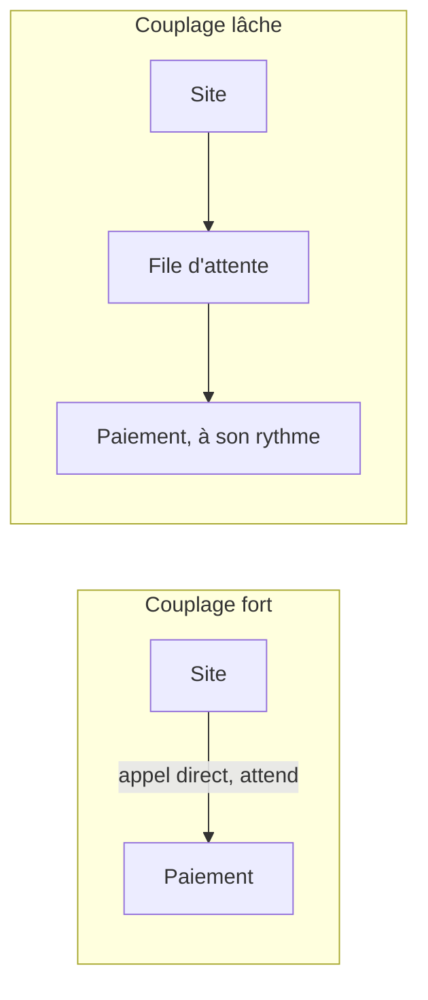

Le service de paiement de la boutique répond en deux secondes un soir de forte affluence. Le site, qui l'appelle directement et attend la réponse, ralentit à son tour, puis tombe. Un composant lent a suffi à tout arrêter : les deux étaient **fortement couplés**. Le rôle de l'architecte est de casser cette chaîne.

## Couplage fort, couplage lâche



Avec une file entre les deux, le site dépose la commande et répond aussitôt. Si le paiement ralentit ou s'arrête, les commandes **attendent** au lieu d'échouer, et chaque côté peut **grandir indépendamment** : on ajoute des consommateurs quand la file s'allonge.

Deux notions accompagnent ce principe :

- **Mise à l'échelle horizontale** (ajouter des machines) plutôt que **verticale** (grossir une machine) : elle n'a pas de plafond et supporte la perte d'une machine.
- **Composants sans état** (*stateless*) : un serveur qui ne garde rien en mémoire entre deux requêtes peut être remplacé ou multiplié librement. L'état va dans une base, un cache ou S3.

## Amazon SQS en détail

| Réglage | Rôle | Valeurs |
| --- | --- | --- |
| **Délai de visibilité** (*visibility timeout*) | Durée pendant laquelle un message reçu est caché aux autres consommateurs, le temps de le traiter | 30 secondes par défaut, 12 heures au plus |
| **Durée de rétention** | Temps de conservation d'un message non supprimé | 4 jours par défaut, 14 jours au plus |
| **Attente longue** (*long polling*) | Le consommateur attend l'arrivée d'un message au lieu d'interroger à vide : moins d'appels, moins de coût | Jusqu'à 20 secondes |
| **File à retardement** (*delay queue*) | Un message reste invisible un moment après son envoi | Jusqu'à 15 minutes |
| **Taille d'un message** | | 1 Mio au plus ; au-delà, on range la charge dans S3 et on envoie sa référence |

Le délai de visibilité doit **dépasser** le temps de traitement. Trop court, un second consommateur reçoit le message pendant que le premier travaille encore, et le traitement est fait deux fois.

### Standard ou FIFO ?

| | File standard | File FIFO |
| --- | --- | --- |
| Ordre | Au mieux, non garanti | Strict, par **groupe de messages** |
| Livraison | Au moins une fois : un doublon est possible | Traitement exactement une fois, grâce à la déduplication (fenêtre de 5 minutes) |
| Débit | Presque illimité | Limité (quelques milliers de messages par seconde avec des lots) |
| Nom | Libre | Doit se terminer par `.fifo` |

Choisis FIFO quand l'**ordre** ou l'**absence de doublon** est une exigence métier (opérations bancaires sur un même compte). Sinon, une file standard et un traitement **idempotent** (rejouer un message ne change rien) conviennent et montent bien plus haut en débit.

### La file de rebut

Un message mal formé fera échouer le consommateur à chaque tentative, indéfiniment. Une **file de rebut** (*dead-letter queue*, DLQ) règle ce cas : la file principale porte une **politique de réacheminement** (*redrive policy*) qui dit « après N réceptions sans suppression, déplace le message dans telle file ».

```json
{
  "VisibilityTimeout": "30",
  "RedrivePolicy": "{\"deadLetterTargetArn\":\"arn:aws:sqs:eu-west-3:000000000000:commandes-rebut\",\"maxReceiveCount\":\"2\"}"
}
```

`RedrivePolicy` est elle-même un document JSON, écrit sous forme de texte : d'où les guillemets précédés d'une barre oblique inverse. La file de rebut se surveille par une alarme : un message qui y arrive est un problème à examiner.

## Choisir le bon service de messagerie

| Besoin | Service |
| --- | --- |
| Un producteur, un groupe de consommateurs qui se partagent le travail | **Amazon SQS** |
| Un message, plusieurs destinataires indépendants | **Amazon SNS**, souvent vers plusieurs files SQS (diffusion en éventail). Une **politique de filtrage** permet à chaque abonné de ne recevoir que certains messages |
| Router des événements selon leur contenu, entre services AWS, applications et logiciels en SaaS ; planifier | **Amazon EventBridge** |
| Un flux continu à fort débit, relu par plusieurs applications, avec rejeu possible | **Amazon Kinesis Data Streams** (leçon 11) |
| Enchaîner des étapes avec branches, reprises et attentes | **AWS Step Functions** : flux *Standard* (jusqu'à un an, exactement une fois) ou *Express* (cinq minutes au plus, fort volume) |
| Exposer une API devant des fonctions ou des services, avec limitation de débit et cache | **Amazon API Gateway** |

## SQS en ligne de commande

Dans le labo, crée une file d'essai, envoie-lui un message et relis-le :

```shell run
aws sqs create-queue --queue-name essai
aws sqs send-message --queue-url http://127.0.0.1:4566/000000000000/essai --message-body "bonjour"
aws sqs receive-message --queue-url http://127.0.0.1:4566/000000000000/essai --visibility-timeout 0
```

- L'adresse d'une file a la forme `<point d'accès>/<compte>/<nom>` ; sur le vrai AWS, elle commence par `https://sqs.<région>.amazonaws.com/`.
- `--visibility-timeout 0` rend le message de nouveau visible **tout de suite** : utile ici pour simuler un consommateur qui échoue sans attendre 30 secondes.
- La réponse contient un `ReceiptHandle` : c'est lui qu'on passe à `aws sqs delete-message` une fois le traitement réussi.

:::warning Ce qui diffère du vrai AWS
L'émulateur exécute réellement SQS : visibilité, compteur de réceptions, file de rebut et déduplication FIFO se comportent comme attendu. Il ne reproduit ni les limites de débit, ni le caractère « au mieux » de l'ordre d'une file standard (ici, l'ordre est toujours respecté), ni les doublons occasionnels d'une file standard.
:::

:::tip Lire l'énoncé
« Les commandes ne doivent jamais être perdues si le traitement est indisponible » → une file. « Plusieurs systèmes doivent réagir au même fait » → un sujet SNS ou un bus EventBridge. « Dans l'ordre exact, sans doublon » → FIFO. « Les messages en échec bloquent la file » → une file de rebut.
:::

## Entraîne-toi

Tu montes la file des commandes de la boutique avec sa file de rebut, tu provoques l'échec répété d'un message pour le voir partir au rebut, puis tu crées une file FIFO pour les paiements et tu constates la déduplication.

```json file=attributs-commandes.json
{
  "VisibilityTimeout": "30",
  "RedrivePolicy": "{\"deadLetterTargetArn\":\"arn:aws:sqs:eu-west-3:000000000000:commandes-rebut\",\"maxReceiveCount\":\"2\"}"
}
```

:::lab
engine: real
intro: |
  Aucune file n'existe encore (à part celle que tu aurais créée en suivant la démonstration). L'adresse d'une file du labo est `http://127.0.0.1:4566/000000000000/<nom>`. Les étapes sont vérifiées sur l'état des files.
commands:
  - demarrer-aws
steps:
  - text: "Crée la file de rebut `commandes-rebut`"
    checks:
      - command-succeeds: 'aws sqs get-queue-url --queue-name commandes-rebut'
    solution:
      - aws sqs create-queue --queue-name commandes-rebut
  - text: "Écris `attributs-commandes.json`, puis crée la file `commandes` avec ces attributs : après **2** réceptions sans suppression, un message part dans `commandes-rebut`"
    hint: "aws sqs create-queue --queue-name commandes --attributes file://attributs-commandes.json"
    after: [1]
    checks:
      - output-contains:
          - 'aws sqs get-queue-attributes --queue-url http://127.0.0.1:4566/000000000000/commandes --attribute-names RedrivePolicy --query Attributes.RedrivePolicy --output text'
          - 'commandes-rebut'
      - output-contains:
          - 'aws sqs get-queue-attributes --queue-url http://127.0.0.1:4566/000000000000/commandes --attribute-names RedrivePolicy --query Attributes.RedrivePolicy --output text'
          - '"maxReceiveCount":\s*"?2"?'
    solution:
      - write:
          attributs-commandes.json: |
            {
              "VisibilityTimeout": "30",
              "RedrivePolicy": "{\"deadLetterTargetArn\":\"arn:aws:sqs:eu-west-3:000000000000:commandes-rebut\",\"maxReceiveCount\":\"2\"}"
            }
      - aws sqs create-queue --queue-name commandes --attributes file://attributs-commandes.json
  - text: "Envoie le message `commande-42` dans `commandes`, puis simule un consommateur défaillant : reçois-le **trois fois** de suite avec `--visibility-timeout 0`, sans jamais le supprimer. À la troisième tentative, il part au rebut"
    hint: "aws sqs receive-message --queue-url http://127.0.0.1:4566/000000000000/commandes --visibility-timeout 0 (trois fois)"
    after: [2]
    checks:
      - output-contains:
          - "aws sqs get-queue-attributes --queue-url http://127.0.0.1:4566/000000000000/commandes-rebut --attribute-names ApproximateNumberOfMessages ApproximateNumberOfMessagesNotVisible --query 'Attributes.*' --output text"
          - '[1-9]'
    solution:
      - aws sqs send-message --queue-url http://127.0.0.1:4566/000000000000/commandes --message-body commande-42
      - aws sqs receive-message --queue-url http://127.0.0.1:4566/000000000000/commandes --visibility-timeout 0
      - aws sqs receive-message --queue-url http://127.0.0.1:4566/000000000000/commandes --visibility-timeout 0
      - aws sqs receive-message --queue-url http://127.0.0.1:4566/000000000000/commandes --visibility-timeout 0
  - text: "Examine le message fautif : lis la file de rebut et garde la réponse dans `rebut.json`"
    hint: "aws sqs receive-message --queue-url http://127.0.0.1:4566/000000000000/commandes-rebut --visibility-timeout 0 > rebut.json"
    after: [3]
    checks:
      - env-file-contains: [rebut.json, '"Body": "commande-42"']
    solution:
      - aws sqs receive-message --queue-url http://127.0.0.1:4566/000000000000/commandes-rebut --visibility-timeout 0 > rebut.json
  - text: "Crée la file FIFO `paiements.fifo` avec la déduplication par contenu (`FifoQueue=true,ContentBasedDeduplication=true`), envoie-lui **deux fois** le message `paiement-7` (groupe `client-7`), puis garde ses attributs : `aws sqs get-queue-attributes --queue-url http://127.0.0.1:4566/000000000000/paiements.fifo --attribute-names All > fifo.json`"
    hint: "aws sqs send-message --queue-url …/paiements.fifo --message-body paiement-7 --message-group-id client-7"
    checks:
      - output-contains:
          - "aws sqs get-queue-attributes --queue-url http://127.0.0.1:4566/000000000000/paiements.fifo --attribute-names All --query 'Attributes.[FifoQueue,ContentBasedDeduplication]' --output text"
          - '^true\s+true$'
      - env-file-contains: [fifo.json, '"ApproximateNumberOfMessages": "1"']
    solution:
      - aws sqs create-queue --queue-name paiements.fifo --attributes FifoQueue=true,ContentBasedDeduplication=true
      - aws sqs send-message --queue-url http://127.0.0.1:4566/000000000000/paiements.fifo --message-body paiement-7 --message-group-id client-7
      - aws sqs send-message --queue-url http://127.0.0.1:4566/000000000000/paiements.fifo --message-body paiement-7 --message-group-id client-7
      - aws sqs get-queue-attributes --queue-url http://127.0.0.1:4566/000000000000/paiements.fifo --attribute-names All > fifo.json
:::

## Vérifie tes acquis

:::quiz
Un traitement d'images prend jusqu'à cinq minutes par message. Des images sont traitées deux fois. Quel réglage de la file SQS corriger en premier ?

- [ ] La durée de rétention, à porter à 14 jours
- [x] Le délai de visibilité, à porter au-delà de cinq minutes
- [ ] L'attente longue, à porter à 20 secondes
- [ ] La taille maximale des messages

> Avec un délai de visibilité inférieur au temps de traitement, le message redevient visible pendant qu'il est encore traité, et un autre consommateur le reprend.
:::

:::quiz
Des virements sur un même compte bancaire doivent être appliqués dans l'ordre exact de leur émission, sans doublon. Quel choix répond à cette exigence ?

- [ ] Une file SQS standard avec une file de rebut
- [ ] Un sujet SNS standard avec trois abonnés
- [x] Une file SQS FIFO, avec le numéro de compte comme identifiant de groupe
- [ ] Une file à retardement de 15 minutes

> Une file FIFO garantit l'ordre au sein d'un groupe de messages et écarte les doublons. Utiliser le compte comme groupe garde l'ordre par compte tout en traitant plusieurs comptes en parallèle.
:::

:::quiz
Quand une commande est validée, la facturation, l'entrepôt et le service de fidélité doivent chacun la traiter, à leur rythme, sans se gêner. Quelle architecture convient ?

- [ ] Une seule file SQS lue par les trois services
- [ ] Trois appels directs depuis le site, l'un après l'autre
- [ ] Un flux Step Functions Express par commande
- [x] Un sujet SNS auquel sont abonnées trois files SQS, une par service

> La diffusion en éventail remet une copie à chaque service, dans sa propre file. Avec une file unique, chaque message n'irait qu'à un seul des trois.
:::

:::quiz
Quelques messages mal formés font échouer le consommateur en boucle et retardent tous les autres. Que mets-tu en place ?

- [ ] Un délai de visibilité de 12 heures
- [x] Une file de rebut, avec un nombre maximal de réceptions sur la file principale
- [ ] Une durée de rétention d'une minute
- [ ] Une file FIFO à la place de la file standard

> Après le nombre de réceptions fixé, le message fautif est déplacé dans la file de rebut : il ne bloque plus les autres et peut être examiné.
:::
