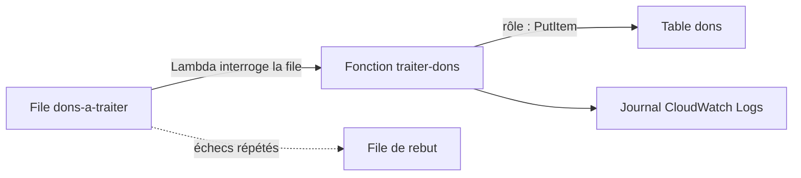

Chaque don déposé dans une file doit être inscrit dans la base. Faut-il un serveur allumé jour et nuit pour quelques centaines de dons par mois, puis dix serveurs le soir du gala ? Avec une architecture **sans serveur**, le calcul apparaît quand un message arrive et disparaît ensuite : tu ne conçois plus des machines, mais des **événements** et des **droits**.

## Trois modes d'appel, trois comportements en cas d'erreur

| Mode | Qui appelle | En cas d'erreur |
| --- | --- | --- |
| **Synchrone** | API Gateway, un répartiteur de charge, `aws lambda invoke` | L'erreur revient à l'appelant, qui décide de réessayer. |
| **Asynchrone** | S3, SNS, EventBridge | Lambda met l'événement en attente et réessaie **deux fois** ; on peut ensuite l'envoyer vers une file de rebut ou une *destination*. |
| **Par interrogation** (*event source mapping*) | Lambda lit lui-même une file SQS, un flux Kinesis ou DynamoDB | Pour SQS : le lot non traité redevient visible après le délai de visibilité ; la file de rebut se règle **sur la file**. |



Dans tous les cas, une fonction peut être appelée **plusieurs fois** pour le même événement : son traitement doit être **idempotent**. Ici, écrire deux fois le même don, sous la même clé, donne le même résultat.

## Les réglages qui comptent

| Réglage | Ce qu'il change |
| --- | --- |
| **Mémoire** (128 Mo à 10 240 Mo) | La puissance de calcul est allouée **en proportion** de la mémoire : plus de mémoire, c'est aussi plus de processeur. Une fonction lente va parfois plus vite, pour moins cher, avec davantage de mémoire. |
| **Durée maximale** (*timeout*, 15 minutes au plus) | Au-delà, l'exécution est interrompue. Pour une file SQS, le délai de visibilité de la file doit dépasser cette durée. |
| **Concurrence réservée** | Un nombre d'exécutions simultanées **garanti et plafonné** pour la fonction. Sert aussi à protéger une ressource en aval (une base qui n'accepte que peu de connexions). Sans surcoût. |
| **Concurrence provisionnée** | Des environnements **déjà initialisés**, pour supprimer la latence du démarrage à froid. Facturée. |

Un **démarrage à froid** (*cold start*) est le temps d'initialisation d'un nouvel environnement d'exécution. Il gêne les API interactives, peu les traitements asynchrones.

## Le rôle d'exécution

Une fonction agit avec un **rôle d'exécution** qu'elle endosse à chaque appel. Le moindre privilège y est simple à appliquer, parce qu'une fonction fait peu de choses. Pour `traiter-dons` : lire la file, écrire dans la table, écrire son journal.

```json
{
  "Version": "2012-10-17",
  "Statement": [
    {
      "Effect": "Allow",
      "Action": ["sqs:ReceiveMessage", "sqs:DeleteMessage", "sqs:GetQueueAttributes"],
      "Resource": "arn:aws:sqs:eu-west-3:000000000000:dons-a-traiter"
    },
    {
      "Effect": "Allow",
      "Action": "dynamodb:PutItem",
      "Resource": "arn:aws:dynamodb:eu-west-3:000000000000:table/dons"
    },
    {
      "Effect": "Allow",
      "Action": ["logs:CreateLogGroup", "logs:CreateLogStream", "logs:PutLogEvents"],
      "Resource": "*"
    }
  ]
}
```

- La première règle est ce dont Lambda a besoin pour **interroger** la file et supprimer les messages traités.
- La deuxième n'autorise qu'**une** action sur **une** table : la fonction ne peut ni lire, ni supprimer, ni toucher une autre table.
- La troisième permet d'écrire le journal.

## Lambda, Fargate ou des instances ?

| Situation | Choix |
| --- | --- |
| Traitement court, déclenché par des événements, charge irrégulière | **Lambda** |
| Conteneur existant, traitement de plus de 15 minutes, ou besoin d'un environnement complet, sans gérer de serveur | **ECS ou EKS avec Fargate** |
| Charge constante et prévisible, logiciel qui exige le contrôle du système | **Instances EC2** (souvent moins chères à charge pleine) |
| Enchaînement de plusieurs fonctions avec conditions et reprises | **Step Functions** pour orchestrer |

## La fonction du labo

```python
import json
import boto3

table = boto3.resource("dynamodb").Table("dons")


def handler(event, context):
    for record in event["Records"]:
        don = json.loads(record["body"])
        table.put_item(Item={"id": don["id"], "montant": don["montant"]})
        print("Don enregistré :", don["id"])
    return {"traites": len(event["Records"])}
```

- Lambda remet les messages par **lots** : `event["Records"]` en contient un ou plusieurs.
- `record["body"]` est le texte du message SQS ; ici, du JSON.
- La connexion à DynamoDB est créée **hors** de `handler` : elle est réutilisée d'un appel à l'autre tant que l'environnement reste chaud.

On relie la file à la fonction par un **mappage de source d'événements** :

```bash
aws lambda create-event-source-mapping --function-name traiter-dons \
  --event-source-arn arn:aws:sqs:eu-west-3:000000000000:dons-a-traiter --batch-size 5
```

Dans le labo, la file, la table et le rôle existent déjà. Le rôle n'a pour l'instant **aucune** autorisation :

```shell run
aws iam list-role-policies --role-name role-traiter-dons
aws sqs get-queue-url --queue-name dons-a-traiter --query QueueUrl --output text
```

:::warning Ce qui diffère du vrai AWS
Dans l'émulateur, la fonction s'exécute réellement, dans un processus Python local, et son rôle est réellement appliqué : sans le droit `dynamodb:PutItem`, l'écriture est refusée. En revanche, il n'y a ni démarrage à froid mesurable, ni facturation à la milliseconde, ni limite de concurrence du compte ; la mémoire configurée n'a aucun effet sur la vitesse.
:::

:::tip Si le message n'est pas traité
Regarde le journal : `aws logs filter-log-events --log-group-name /aws/lambda/traiter-dons --query 'events[].message' --output text`. Un `AccessDeniedException` signifie que le rôle est incomplet. Une fois le rôle corrigé, le message est repris tout seul à la fin du délai de visibilité (30 secondes).
:::

## Entraîne-toi

Tu déploies `traiter-dons`, tu lui donnes un rôle au moindre privilège, tu la relies à la file et tu vérifies qu'un don déposé dans la file arrive dans la table.

```json file=droits.json
{
  "Version": "2012-10-17",
  "Statement": [
    {
      "Effect": "Allow",
      "Action": ["sqs:ReceiveMessage", "sqs:DeleteMessage", "sqs:GetQueueAttributes"],
      "Resource": "arn:aws:sqs:eu-west-3:000000000000:dons-a-traiter"
    },
    {
      "Effect": "Allow",
      "Action": "dynamodb:PutItem",
      "Resource": "arn:aws:dynamodb:eu-west-3:000000000000:table/dons"
    },
    {
      "Effect": "Allow",
      "Action": ["logs:CreateLogGroup", "logs:CreateLogStream", "logs:PutLogEvents"],
      "Resource": "*"
    }
  ]
}
```

:::lab
engine: real
intro: |
  Sont déjà en place : la table DynamoDB `dons` (clé `id`), la file SQS `dons-a-traiter` et le rôle `role-traiter-dons`, que Lambda peut endosser mais qui n'autorise encore rien. Ton dossier de travail contient `traiter.py`. L'émulateur applique réellement le rôle de la fonction.
files:
  traiter.py: |
    import json
    import boto3

    table = boto3.resource("dynamodb").Table("dons")


    def handler(event, context):
        for record in event["Records"]:
            don = json.loads(record["body"])
            table.put_item(Item={"id": don["id"], "montant": don["montant"]})
            print("Don enregistré :", don["id"])
        return {"traites": len(event["Records"])}
  labo/confiance-lambda.json: |
    {
      "Version": "2012-10-17",
      "Statement": [
        {
          "Effect": "Allow",
          "Principal": {"Service": "lambda.amazonaws.com"},
          "Action": "sts:AssumeRole"
        }
      ]
    }
commands:
  - demarrer-aws
  - 'aws dynamodb describe-table --table-name dons >/dev/null 2>&1 || aws dynamodb create-table --table-name dons --attribute-definitions AttributeName=id,AttributeType=S --key-schema AttributeName=id,KeyType=HASH --billing-mode PAY_PER_REQUEST'
  - aws sqs create-queue --queue-name dons-a-traiter
  - 'aws iam get-role --role-name role-traiter-dons >/dev/null 2>&1 || aws iam create-role --role-name role-traiter-dons --assume-role-policy-document file://labo/confiance-lambda.json'
steps:
  - text: "Crée l'archive `traiter.zip` à partir de `traiter.py`, puis la fonction `traiter-dons` : environnement `python3.13`, point d'entrée `traiter.handler`, rôle `arn:aws:iam::000000000000:role/role-traiter-dons`, durée maximale de 10 secondes"
    hint: "aws lambda create-function --function-name traiter-dons --runtime python3.13 --handler traiter.handler --zip-file fileb://traiter.zip --role … --timeout 10"
    checks:
      - output-contains:
          - "aws lambda get-function-configuration --function-name traiter-dons --query '[Handler,Role,Timeout]' --output text"
          - '^traiter\.handler\s+arn:aws:iam::000000000000:role/role-traiter-dons\s+10$'
    solution:
      - zip traiter.zip traiter.py
      - aws lambda create-function --function-name traiter-dons --runtime python3.13 --handler traiter.handler --zip-file fileb://traiter.zip --role arn:aws:iam::000000000000:role/role-traiter-dons --timeout 10
  - text: "Écris `droits.json`, puis donne ces autorisations au rôle `role-traiter-dons`, dans une politique nommée `traiter-dons` (`aws iam put-role-policy`)"
    hint: "aws iam put-role-policy --role-name role-traiter-dons --policy-name traiter-dons --policy-document file://droits.json"
    checks:
      - output-contains:
          - "aws iam get-role-policy --role-name role-traiter-dons --policy-name traiter-dons --query 'PolicyDocument.Statement[].Action[]' --output text"
          - '\bdynamodb:PutItem\b'
      - output-contains:
          - "aws iam get-role-policy --role-name role-traiter-dons --policy-name traiter-dons --query 'PolicyDocument.Statement[].Action[]' --output text"
          - '\bsqs:ReceiveMessage\b'
      - command-fails: "aws iam get-role-policy --role-name role-traiter-dons --policy-name traiter-dons --query 'PolicyDocument.Statement[].Action[]' --output text | grep -Eq '(^|[[:space:]])(\\*|dynamodb:\\*|sqs:\\*)([[:space:]]|$)'"
    solution:
      - write:
          droits.json: |
            {
              "Version": "2012-10-17",
              "Statement": [
                {
                  "Effect": "Allow",
                  "Action": ["sqs:ReceiveMessage", "sqs:DeleteMessage", "sqs:GetQueueAttributes"],
                  "Resource": "arn:aws:sqs:eu-west-3:000000000000:dons-a-traiter"
                },
                {
                  "Effect": "Allow",
                  "Action": "dynamodb:PutItem",
                  "Resource": "arn:aws:dynamodb:eu-west-3:000000000000:table/dons"
                },
                {
                  "Effect": "Allow",
                  "Action": ["logs:CreateLogGroup", "logs:CreateLogStream", "logs:PutLogEvents"],
                  "Resource": "*"
                }
              ]
            }
      - aws iam put-role-policy --role-name role-traiter-dons --policy-name traiter-dons --policy-document file://droits.json
  - text: "Relie la file `dons-a-traiter` à la fonction avec `aws lambda create-event-source-mapping` (lots de 5 messages au plus)"
    after: [1]
    checks:
      - output-contains:
          - "aws lambda list-event-source-mappings --function-name traiter-dons --query 'EventSourceMappings[].[EventSourceArn,State]' --output text"
          - 'arn:aws:sqs:eu-west-3:000000000000:dons-a-traiter\s+Enabled'
    solution:
      - aws lambda create-event-source-mapping --function-name traiter-dons --event-source-arn arn:aws:sqs:eu-west-3:000000000000:dons-a-traiter --batch-size 5
  - text: "Dépose dans la file le don `{\"id\": \"d1\", \"montant\": 20}` : la fonction doit l'inscrire dans la table `dons`"
    hint: "aws sqs send-message --queue-url \"$(aws sqs get-queue-url --queue-name dons-a-traiter --query QueueUrl --output text)\" --message-body '{\"id\": \"d1\", \"montant\": 20}'"
    after: [2, 3]
    checks:
      - output-contains:
          - "aws dynamodb get-item --table-name dons --key '{\"id\": {\"S\": \"d1\"}}' --query Item.montant.N --output text"
          - '^20$'
    solution:
      - "aws sqs send-message --queue-url \"$(aws sqs get-queue-url --queue-name dons-a-traiter --query QueueUrl --output text)\" --message-body '{\"id\": \"d1\", \"montant\": 20}'"
  - text: "Garde le journal de la fonction : `aws logs filter-log-events --log-group-name /aws/lambda/traiter-dons --query 'events[].message' --output text > journal.txt`"
    after: [4]
    checks:
      - env-file-contains: [journal.txt, 'Don enregistré : d1']
    solution:
      - "aws logs filter-log-events --log-group-name /aws/lambda/traiter-dons --query 'events[].message' --output text > journal.txt"
  - text: "Protège la base en aval : limite la fonction à **5** exécutions simultanées (concurrence réservée) et porte sa mémoire à **256** Mo"
    hint: "aws lambda put-function-concurrency … --reserved-concurrent-executions 5 ; aws lambda update-function-configuration … --memory-size 256"
    after: [1]
    checks:
      - output-contains:
          - 'aws lambda get-function-concurrency --function-name traiter-dons --query ReservedConcurrentExecutions --output text'
          - '^5$'
      - output-contains:
          - 'aws lambda get-function-configuration --function-name traiter-dons --query MemorySize --output text'
          - '^256$'
    solution:
      - aws lambda put-function-concurrency --function-name traiter-dons --reserved-concurrent-executions 5
      - aws lambda update-function-configuration --function-name traiter-dons --memory-size 256
:::

## Vérifie tes acquis

:::quiz
Une fonction Lambda déclenchée par un dépôt dans S3 échoue à cause d'une erreur passagère. Que fait Lambda par défaut ?

- [ ] Rien : l'événement est perdu immédiatement
- [ ] Il renvoie l'erreur à S3, qui réessaie indéfiniment
- [x] Il réessaie deux fois, puis abandonne l'événement, sauf si une file de rebut ou une destination est configurée
- [ ] Il suspend la fonction jusqu'à une intervention manuelle

> S3 appelle Lambda en mode asynchrone : Lambda refait deux tentatives. Une file de rebut ou une destination d'échec permet de ne pas perdre l'événement.
:::

:::quiz
Une fonction qui consomme une file écrit dans une base relationnelle n'acceptant que 50 connexions. Lors des pics, la base est saturée. Quel réglage de la fonction règle le problème ?

- [x] Une concurrence réservée inférieure ou égale à 50
- [ ] Une concurrence provisionnée de 500
- [ ] Une durée maximale de 15 minutes
- [ ] Une mémoire de 10 240 Mo

> La concurrence réservée plafonne le nombre d'exécutions simultanées, donc le nombre de connexions ouvertes en même temps. La concurrence provisionnée traite les démarrages à froid, pas la saturation.
:::

:::quiz
Une API interactive servie par Lambda a un premier appel lent après chaque période d'inactivité. Que proposer ?

- [ ] Réduire la mémoire de la fonction
- [ ] Remplacer API Gateway par une file SQS
- [ ] Une concurrence réservée de 1
- [x] De la concurrence provisionnée sur la fonction

> La concurrence provisionnée garde des environnements déjà initialisés, ce qui supprime la latence du démarrage à froid.
:::

:::quiz
Un traitement vidéo en conteneur dure quarante minutes et se lance quelques fois par jour. L'équipe ne veut gérer aucun serveur. Quel service de calcul choisir ?

- [ ] AWS Lambda
- [x] Amazon ECS avec AWS Fargate
- [ ] Une instance EC2 allumée en permanence
- [ ] Amazon API Gateway

> Quarante minutes dépassent la durée maximale d'une fonction Lambda (15 minutes). Fargate exécute le conteneur à la demande, sans serveur à administrer.
:::
