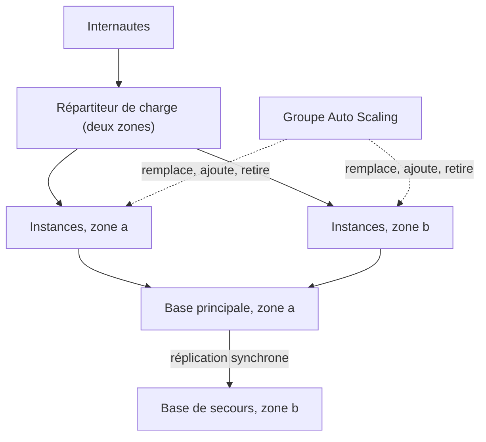

Le site de la boutique tourne sur une seule instance, « très fiable ». Un mardi, la zone de disponibilité qui l'héberge connaît une panne électrique : plus de site pendant trois heures. Aucune machine n'est fiable à elle seule ; la disponibilité vient de la **redondance** et du **remplacement automatique**.

## Chasser les points de défaillance uniques

Un **point de défaillance unique** (*single point of failure*) est un composant dont la panne arrête tout. La méthode : parcourir l'architecture et, pour chaque élément, demander « et s'il tombe ? ».



| Composant unique | Remède |
| --- | --- |
| Une instance | Plusieurs instances, dans au moins deux zones, derrière un répartiteur de charge |
| Une zone de disponibilité | Répartir chaque niveau sur plusieurs zones |
| Une base de données | Déploiement Multi-AZ, ou un service réparti par conception (DynamoDB, Aurora) |
| L'état gardé sur un serveur (sessions, fichiers) | Le sortir : cache ElastiCache, DynamoDB, S3, EFS |
| Une région | Stratégie de reprise après sinistre (leçon 7) |

## Trois répartiteurs de charge

| | Application Load Balancer | Network Load Balancer | Gateway Load Balancer |
| --- | --- | --- | --- |
| Couche | 7 : HTTP, HTTPS | 4 : TCP, UDP, TLS | 3 : paquets IP |
| Sait faire | Router selon le chemin ou le nom d'hôte, vers des instances, des conteneurs, des fonctions Lambda | Très haut débit, latence minimale, **adresse IP fixe** par zone | Insérer des équipements de sécurité tiers (pare-feu, inspection) dans le trafic |
| Cas typique | Sites web, API, microservices | Jeu en ligne, protocoles non HTTP, clients qui exigent une adresse fixe | Faire passer tout le trafic par une flotte de pare-feu |

Un répartiteur surveille ses cibles par des **contrôles de santé** (*health checks*) et n'envoie rien à une cible défaillante. Il se déploie lui-même sur plusieurs zones.

## Le groupe Auto Scaling

Un groupe Auto Scaling a trois nombres (minimum, capacité souhaitée, maximum), un **modèle de lancement** (*launch template*) qui décrit les instances, et une liste de sous-réseaux. Il fait deux choses :

1. il **maintient** la capacité : une instance en mauvaise santé est remplacée (avec le type de contrôle `ELB`, il se fie au verdict du répartiteur, pas seulement à l'état de la machine) ;
2. il **ajuste** la capacité selon une politique.

| Politique | Principe | Quand |
| --- | --- | --- |
| **Suivi de cible** (*target tracking*) | « Garde l'utilisation moyenne du processeur à 50 % » : le groupe calcule lui-même combien d'instances il faut | Le choix par défaut, le plus simple |
| **Par paliers** (*step scaling*) | « Au-delà de 70 %, ajoute 2 instances ; au-delà de 90 %, ajoutes-en 4 » | Besoin d'une réaction graduée précise |
| **Planifiée** (*scheduled*) | « Chaque jour à 18 h, passe à 4 instances » | Pics connus à l'avance |
| **Prédictive** | Prévision à partir de l'historique | Charge cyclique régulière |

Pour qu'une instance puisse être remplacée sans douleur, elle doit être **sans état** et démarrer prête à servir : c'est le principe de l'**infrastructure immuable** (on ne répare pas une machine, on la remplace par une neuve issue du modèle).

## Rendre une base de données disponible

| Mécanisme | Réplication | Sert à | Lisible ? |
| --- | --- | --- | --- |
| **RDS Multi-AZ** (une instance de secours) | Synchrone, vers une autre zone | La **disponibilité** : bascule automatique en cas de panne | Non |
| **Réplica en lecture** | Asynchrone, même région ou autre région | La **performance** en lecture ; peut être promu à la main | Oui |
| **Amazon Aurora** | Le volume de stockage est copié sur trois zones | Disponibilité et lectures, jusqu'à 15 réplicas | Oui |
| **Amazon RDS Proxy** | (pas de réplication) | Mutualiser les connexions, par exemple depuis de nombreuses fonctions Lambda, et raccourcir l'interruption lors d'une bascule | Sans objet |

Le piège classique : un réplica en lecture n'est **pas** un mécanisme de haute disponibilité automatique, et le Multi-AZ classique n'accélère **pas** les lectures.

## Les commandes du labo

Le réseau est prêt : le VPC `site`, deux sous-réseaux dans deux zones et un groupe de sécurité.

```shell run
aws ec2 describe-subnets --filters Name=tag:Name,Values=app-a,app-b --query 'Subnets[].[Tags[0].Value,SubnetId,AvailabilityZone]' --output text
aws ec2 describe-images --owners amazon --query 'Images[0].[ImageId,Name]' --output text
```

Un modèle de lancement décrit l'instance à créer :

```bash
aws ec2 create-launch-template --launch-template-name web \
  --launch-template-data '{"ImageId": "<id de l AMI>", "InstanceType": "t3.micro"}'
```

Le répartiteur se construit en trois objets : un **groupe cible** (où envoyer, et comment vérifier la santé), le **répartiteur** lui-même (dans quels sous-réseaux), et un **écouteur** (*listener* : sur quel port écouter, et vers quel groupe cible transmettre).

```bash
aws elbv2 create-target-group --name web --protocol HTTP --port 80 \
  --vpc-id <id du VPC> --health-check-path /sante
aws elbv2 create-load-balancer --name web --subnets <id de app-a> <id de app-b>
aws elbv2 create-listener --load-balancer-arn <ARN du répartiteur> --protocol HTTP --port 80 \
  --default-actions Type=forward,TargetGroupArn=<ARN du groupe cible>
```

Le groupe Auto Scaling réunit le tout :

```bash
aws autoscaling create-auto-scaling-group --auto-scaling-group-name web \
  --launch-template LaunchTemplateName=web --min-size 2 --max-size 6 \
  --vpc-zone-identifier "<id de app-a>,<id de app-b>" \
  --target-group-arns <ARN du groupe cible> --health-check-type ELB --health-check-grace-period 120
```

:::warning Ce qui diffère du vrai AWS
Ici, tout est **déclaratif** : l'émulateur enregistre le répartiteur, le groupe et ses politiques, et crée des fiches d'instances, mais rien ne tourne. Il ne remplace pas une instance « en panne », n'ajoute rien quand la charge monte, ne retient pas le lien entre le groupe et le groupe cible, et ses bases RDS sont de simples fiches (aucune bascule Multi-AZ à observer). Le labo vérifie donc ta **configuration**, pas son comportement.
:::

:::tip Deux zones au minimum, trois si possible
Avec deux zones et deux instances, la perte d'une zone divise ta capacité par deux le temps que le groupe relance des instances. Dimensionne pour que la capacité restante suffise, ou répartis sur trois zones.
:::

## Entraîne-toi

Tu rends le niveau web de la boutique hautement disponible : un modèle de lancement, un répartiteur sur deux zones, un groupe Auto Scaling de 2 à 6 instances, une politique de suivi de cible et un renfort planifié pour le pic du soir.

:::lab
engine: real
intro: |
  Le VPC `site` existe avec les sous-réseaux `app-a` (zone `eu-west-3a`) et `app-b` (zone `eu-west-3b`) et le groupe de sécurité `sg-app`. Toutes les ressources que tu crées s'appellent `web`. Les étapes sont vérifiées sur la configuration enregistrée par l'émulateur.
files:
  labo/preparer.sh: |
    #!/bin/sh
    # Prépare le réseau du labo (rejouable : ne recrée rien de ce qui existe).
    set -e
    v=$(aws ec2 describe-vpcs --filters Name=tag:Name,Values=site --query 'Vpcs[0].VpcId' --output text)
    if [ "$v" = "None" ]; then
        v=$(aws ec2 create-vpc --cidr-block 10.0.0.0/16 --tag-specifications 'ResourceType=vpc,Tags=[{Key=Name,Value=site}]' --query Vpc.VpcId --output text)
        aws ec2 create-subnet --vpc-id "$v" --cidr-block 10.0.1.0/24 --availability-zone eu-west-3a --tag-specifications 'ResourceType=subnet,Tags=[{Key=Name,Value=app-a}]' > /dev/null
        aws ec2 create-subnet --vpc-id "$v" --cidr-block 10.0.2.0/24 --availability-zone eu-west-3b --tag-specifications 'ResourceType=subnet,Tags=[{Key=Name,Value=app-b}]' > /dev/null
        aws ec2 create-security-group --group-name sg-app --description "Niveau web" --vpc-id "$v" > /dev/null
    fi
commands:
  - demarrer-aws
  - sh labo/preparer.sh
steps:
  - text: "Crée le modèle de lancement `web` : type `t3.micro`, à partir de l'AMI listée par `aws ec2 describe-images --owners amazon`"
    checks:
      - output-contains:
          - "aws ec2 describe-launch-template-versions --launch-template-name web --versions '$Latest' --query 'LaunchTemplateVersions[0].LaunchTemplateData.[InstanceType,ImageId]' --output text"
          - '^t3\.micro\s+ami-'
    solution:
      - "aws ec2 create-launch-template --launch-template-name web --launch-template-data \"{\\\"ImageId\\\": \\\"$(aws ec2 describe-images --owners amazon --query 'Images[0].ImageId' --output text)\\\", \\\"InstanceType\\\": \\\"t3.micro\\\"}\""
  - text: "Crée le groupe cible `web` (HTTP, port 80, dans le VPC `site`) avec `/sante` comme chemin du contrôle de santé"
    checks:
      - output-contains:
          - "aws elbv2 describe-target-groups --names web --query 'TargetGroups[].[Protocol,Port,HealthCheckPath]' --output text"
          - '^HTTP\s+80\s+/sante$'
    solution:
      - "aws elbv2 create-target-group --name web --protocol HTTP --port 80 --vpc-id \"$(aws ec2 describe-vpcs --filters Name=tag:Name,Values=site --query 'Vpcs[0].VpcId' --output text)\" --health-check-path /sante"
  - text: "Crée le répartiteur de charge `web` sur les **deux** sous-réseaux, puis un écouteur HTTP sur le port 80 qui transmet au groupe cible `web`"
    after: [2]
    checks:
      - output-contains:
          - "aws elbv2 describe-load-balancers --names web --query 'LoadBalancers[0].[Type,length(AvailabilityZones)]' --output text"
          - '^application\s+2$'
      - output-contains:
          - "aws elbv2 describe-listeners --load-balancer-arn \"$(aws elbv2 describe-load-balancers --names web --query 'LoadBalancers[0].LoadBalancerArn' --output text)\" --query 'Listeners[].[Port,DefaultActions[0].Type]' --output text"
          - '^80\s+forward$'
    solution:
      - "aws elbv2 create-load-balancer --name web --subnets $(aws ec2 describe-subnets --filters Name=tag:Name,Values=app-a,app-b --query 'Subnets[].SubnetId' --output text)"
      - "aws elbv2 create-listener --load-balancer-arn \"$(aws elbv2 describe-load-balancers --names web --query 'LoadBalancers[0].LoadBalancerArn' --output text)\" --protocol HTTP --port 80 --default-actions Type=forward,TargetGroupArn=\"$(aws elbv2 describe-target-groups --names web --query 'TargetGroups[0].TargetGroupArn' --output text)\""
  - text: "Crée le groupe Auto Scaling `web` : modèle `web`, de **2** à **6** instances, sur les deux sous-réseaux, relié au groupe cible, avec le type de contrôle de santé `ELB`"
    after: [1, 2]
    checks:
      - output-contains:
          - "aws autoscaling describe-auto-scaling-groups --auto-scaling-group-names web --query 'AutoScalingGroups[0].[MinSize,MaxSize,HealthCheckType]' --output text"
          - '^2\s+6\s+ELB$'
      - output-contains:
          - "aws autoscaling describe-auto-scaling-groups --auto-scaling-group-names web --query 'AutoScalingGroups[0].VPCZoneIdentifier' --output text"
          - '^subnet-[0-9a-f]+,\s*subnet-[0-9a-f]+$'
    solution:
      - "aws autoscaling create-auto-scaling-group --auto-scaling-group-name web --launch-template LaunchTemplateName=web --min-size 2 --max-size 6 --vpc-zone-identifier \"$(aws ec2 describe-subnets --filters Name=tag:Name,Values=app-a,app-b --query 'Subnets[].SubnetId' --output text | tr '\\t' ',')\" --target-group-arns \"$(aws elbv2 describe-target-groups --names web --query 'TargetGroups[0].TargetGroupArn' --output text)\" --health-check-type ELB --health-check-grace-period 120"
  - text: "Ajoute au groupe la politique `cpu-50`, de type suivi de cible, qui maintient l'utilisation moyenne du processeur à 50 %"
    hint: "aws autoscaling put-scaling-policy --auto-scaling-group-name web --policy-name cpu-50 --policy-type TargetTrackingScaling --target-tracking-configuration '{\"PredefinedMetricSpecification\": {\"PredefinedMetricType\": \"ASGAverageCPUUtilization\"}, \"TargetValue\": 50.0}'"
    after: [4]
    checks:
      - output-contains:
          - "aws autoscaling describe-policies --auto-scaling-group-name web --policy-names cpu-50 --query 'ScalingPolicies[].[PolicyType,TargetTrackingConfiguration.PredefinedMetricSpecification.PredefinedMetricType,TargetTrackingConfiguration.TargetValue]' --output text"
          - '^TargetTrackingScaling\s+ASGAverageCPUUtilization\s+50(\.0)?$'
    solution:
      - "aws autoscaling put-scaling-policy --auto-scaling-group-name web --policy-name cpu-50 --policy-type TargetTrackingScaling --target-tracking-configuration '{\"PredefinedMetricSpecification\": {\"PredefinedMetricType\": \"ASGAverageCPUUtilization\"}, \"TargetValue\": 50.0}'"
  - text: "Le pic a lieu chaque soir : ajoute l'action planifiée `soir`, qui porte la capacité souhaitée à **4** tous les jours à 18 h UTC (récurrence `0 18 * * *`)"
    hint: "aws autoscaling put-scheduled-update-group-action --auto-scaling-group-name web --scheduled-action-name soir --recurrence '0 18 * * *' --desired-capacity 4"
    after: [4]
    checks:
      - output-contains:
          - "aws autoscaling describe-scheduled-actions --auto-scaling-group-name web --query 'ScheduledUpdateGroupActions[].[ScheduledActionName,Recurrence,DesiredCapacity]' --output text"
          - '^soir\s+0 18 \* \* \*\s+4$'
    solution:
      - "aws autoscaling put-scheduled-update-group-action --auto-scaling-group-name web --scheduled-action-name soir --recurrence '0 18 * * *' --desired-capacity 4"
:::

## Vérifie tes acquis

:::quiz
Une application de jeu utilise un protocole UDP, et ses clients doivent se connecter à une adresse IP fixe. Quel répartiteur de charge convient ?

- [ ] Application Load Balancer
- [x] Network Load Balancer
- [ ] Gateway Load Balancer
- [ ] Aucun : il faut une adresse IP élastique par instance

> Le Network Load Balancer travaille en couche 4 (TCP, UDP) et fournit une adresse fixe par zone. L'Application Load Balancer ne traite que HTTP et HTTPS.
:::

:::quiz
Une base Amazon RDS doit survivre à la panne d'une zone de disponibilité, avec une bascule automatique et sans changer l'application. Que configurer ?

- [ ] Un réplica en lecture dans une autre zone
- [ ] Des instantanés toutes les heures
- [x] Un déploiement Multi-AZ
- [ ] Amazon ElastiCache devant la base

> Le Multi-AZ tient une copie synchrone dans une autre zone et bascule automatiquement. Un réplica en lecture est asynchrone et doit être promu à la main.
:::

:::quiz
Un site reçoit une charge imprévisible. L'équipe veut que le nombre d'instances suive la charge avec le moins de réglages possible. Quelle politique de mise à l'échelle choisir ?

- [ ] Planifiée
- [ ] Par paliers, avec six alarmes
- [ ] Aucune : fixer le minimum au maximum
- [x] Suivi de cible sur l'utilisation du processeur

> Le suivi de cible ne demande qu'une valeur à maintenir : le groupe calcule lui-même les ajouts et les retraits.
:::

:::quiz
Les instances d'un groupe Auto Scaling répondent encore au système, mais l'application qu'elles hébergent est bloquée. Le groupe ne les remplace pas. Que changer ?

- [ ] Augmenter la capacité maximale du groupe
- [x] Utiliser le type de contrôle de santé `ELB`, pour que le groupe se fie au contrôle de santé du répartiteur
- [ ] Ajouter une zone de disponibilité
- [ ] Remplacer le modèle de lancement par une configuration de lancement

> Par défaut, le groupe ne regarde que l'état de la machine. Avec le type `ELB`, une instance que le répartiteur juge défaillante est remplacée.
:::
