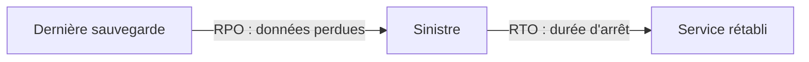

« Combien de données acceptez-vous de perdre ? Et combien de temps le service peut-il rester arrêté ? » Posées à la direction, ces deux questions obtiennent d'abord « rien » et « zéro »… jusqu'à ce qu'on en chiffre le prix. La reprise après sinistre est un **compromis entre un risque et un coût**, et c'est à l'architecte de le rendre explicite.

## Deux mesures : RPO et RTO



- Le **RPO** (*Recovery Point Objective*) est la quantité de données, mesurée en temps, que l'on accepte de perdre. Il dicte la **fréquence** des sauvegardes ou le type de réplication.
- Le **RTO** (*Recovery Time Objective*) est la durée d'interruption acceptable. Il dicte ce qui doit être **déjà prêt** dans le site de secours.

## Quatre stratégies

AWS décrit quatre stratégies, de la moins chère à la plus rapide :

| Stratégie | Ce qui existe dans la région de secours | RPO / RTO | Coût |
| --- | --- | --- | --- |
| **Sauvegarde et restauration** (*backup and restore*) | Des sauvegardes copiées. Tout le reste est à recréer (d'où l'importance de l'infrastructure en code) | Heures | Le plus bas |
| **Veilleuse** (*pilot light*) | Les **données** répliquées en continu et l'infrastructure de base ; les serveurs applicatifs sont « éteints » | Dizaines de minutes | Bas |
| **Secours tiède** (*warm standby*) | Une copie **complète, qui tourne**, à capacité réduite | Minutes | Moyen |
| **Multi-site actif** (*multi-site active/active*) | Plusieurs régions servent le trafic en même temps | Proche de zéro | Le plus haut |

La différence entre veilleuse et secours tiède tombe souvent à l'examen : la veilleuse **ne peut pas traiter de requêtes** sans action préalable (il faut démarrer et déployer des serveurs), alors que le secours tiède en traite **immédiatement**, à capacité réduite, et n'a plus qu'à grossir.

Pour une panne limitée à **une zone de disponibilité**, une architecture répartie sur plusieurs zones (leçon 6) suffit le plus souvent : les stratégies ci-dessus visent la perte d'une **région**, ou une exigence réglementaire.

## Les briques de la réplication

| Donnée | Réplication entre régions |
| --- | --- |
| Objets S3 | **Réplication entre régions** (*Cross-Region Replication*), asynchrone ; exige le versionnage des deux buckets et un rôle IAM |
| Tables DynamoDB | **Tables globales** : chaque région accepte lectures et écritures |
| Base Aurora | **Base de données globale** : une région principale, des régions secondaires en lecture, promotion rapide en cas de sinistre |
| Base RDS | **Réplica en lecture** dans une autre région, à promouvoir à la main |
| Volumes EBS, AMI | Copie d'instantanés et d'images vers une autre région |
| Plusieurs services à la fois | **AWS Backup**, avec copie vers une autre région ou un autre compte |

**AWS Elastic Disaster Recovery** réplique en continu des serveurs entiers (sur site ou dans le cloud) vers AWS et les relance en cas de sinistre : c'est une veilleuse clés en main pour des applications sur serveurs.

:::danger La réplication n'est pas une sauvegarde
Une suppression ou une corruption est **répliquée** aussi fidèlement que le reste. Seules des copies datées (versions S3, instantanés, restauration à un instant donné) permettent de revenir **avant** l'erreur. Une stratégie sérieuse combine les deux, et se **teste** : une reprise jamais essayée est une hypothèse, pas un plan.
:::

## Basculer le trafic

Une fois le secours prêt, il faut y **envoyer** les utilisateur·rice·s :

- **Amazon Route 53**, avec une politique de **basculement** (*failover*) : un enregistrement principal associé à un **contrôle de santé**, un enregistrement secondaire servi quand le principal est en panne ;
- **AWS Global Accelerator** : des adresses IP fixes, et une bascule qui ne dépend pas des caches DNS ;
- **Amazon CloudFront**, avec un groupe d'origines : une requête qui échoue sur l'origine principale est rejouée sur la seconde.

## Les commandes du labo

La réplication S3 se décrit dans un document. `Role` est le rôle que S3 endosse pour copier ; `Destination` désigne le bucket d'arrivée par son ARN :

```json
{
  "Role": "arn:aws:iam::000000000000:role/role-replication-s3",
  "Rules": [
    {
      "ID": "vers-irlande",
      "Status": "Enabled",
      "Priority": 1,
      "Filter": {},
      "DeleteMarkerReplication": {"Status": "Disabled"},
      "Destination": {"Bucket": "arn:aws:s3:::asso-donnees-secours"}
    }
  ]
}
```

`DeleteMarkerReplication` désactivé signifie qu'une suppression dans le bucket d'origine **n'est pas** propagée : la copie de secours survit à une suppression accidentelle… ou malveillante.

Côté DNS, la zone `asso.example` existe déjà dans le labo :

```shell run
aws route53 list-hosted-zones-by-name --dns-name asso.example --query 'HostedZones[0].Id' --output text
```

Un contrôle de santé surveille le point d'entrée principal :

```bash
aws route53 create-health-check --caller-reference sante-paris \
  --health-check-config IPAddress=203.0.113.10,Port=443,Type=HTTPS,ResourcePath=/sante
```

Les deux enregistrements de basculement portent le même nom, un `SetIdentifier` différent et un rôle `PRIMARY` ou `SECONDARY` ; le principal référence le contrôle de santé.

:::warning Ce qui diffère du vrai AWS
L'émulateur copie réellement les objets d'un bucket à l'autre (tout de suite, là où la réplication réelle prend de quelques secondes à quelques minutes), mais il ne vérifie pas le rôle de réplication. Ses contrôles de santé Route 53 n'interrogent rien, et aucune résolution DNS n'a lieu : la bascule est **décrite**, pas exécutée. La restauration à un instant donné de DynamoDB est un réglage enregistré.
:::

:::tip Du métier à la stratégie
« Perte d'une journée acceptable, reprise en 24 h, budget minimal » → sauvegarde et restauration. « Reprise en moins d'une heure, coût maîtrisé » → veilleuse. « Quelques minutes d'arrêt au plus » → secours tiède. « Aucune interruption perceptible » → multi-site actif.
:::

## Entraîne-toi

Tu protèges les données de l'association contre la perte de la région de Paris : réplication S3 vers l'Irlande, bascule DNS, et restauration à un instant donné sur la table des adhérent·e·s.

```json file=replication.json
{
  "Role": "arn:aws:iam::000000000000:role/role-replication-s3",
  "Rules": [
    {
      "ID": "vers-irlande",
      "Status": "Enabled",
      "Priority": 1,
      "Filter": {},
      "DeleteMarkerReplication": {"Status": "Disabled"},
      "Destination": {"Bucket": "arn:aws:s3:::asso-donnees-secours"}
    }
  ]
}
```

Dans le fichier suivant, remplace `ID-DU-CONTROLE` par l'identifiant du contrôle de santé que tu auras créé (`aws route53 list-health-checks --query 'HealthChecks[].Id' --output text`) :

```json file=bascule.json
{
  "Changes": [
    {
      "Action": "CREATE",
      "ResourceRecordSet": {
        "Name": "www.asso.example",
        "Type": "A",
        "SetIdentifier": "paris",
        "Failover": "PRIMARY",
        "TTL": 60,
        "HealthCheckId": "ID-DU-CONTROLE",
        "ResourceRecords": [{"Value": "203.0.113.10"}]
      }
    },
    {
      "Action": "CREATE",
      "ResourceRecordSet": {
        "Name": "www.asso.example",
        "Type": "A",
        "SetIdentifier": "irlande",
        "Failover": "SECONDARY",
        "TTL": 60,
        "ResourceRecords": [{"Value": "203.0.113.20"}]
      }
    }
  ]
}
```

:::lab
engine: real
intro: |
  Sont en place : le bucket `asso-donnees` (Paris), le bucket `asso-donnees-secours` (Irlande), le rôle `role-replication-s3`, la zone DNS `asso.example` et la table DynamoDB `adherents`. Ton dossier de travail contient `registre.csv`. Les adresses `203.0.113.x` sont des adresses de documentation, fictives.
files:
  registre.csv: |
    id,prenom
    1,Léa
    2,Karim
  labo/confiance-s3.json: |
    {
      "Version": "2012-10-17",
      "Statement": [
        {
          "Effect": "Allow",
          "Principal": {"Service": "s3.amazonaws.com"},
          "Action": "sts:AssumeRole"
        }
      ]
    }
commands:
  - demarrer-aws
  - 'aws s3api head-bucket --bucket asso-donnees 2>/dev/null || aws s3 mb s3://asso-donnees'
  - 'aws s3api head-bucket --bucket asso-donnees-secours 2>/dev/null || aws s3 mb s3://asso-donnees-secours --region eu-west-1'
  - 'aws iam get-role --role-name role-replication-s3 >/dev/null 2>&1 || aws iam create-role --role-name role-replication-s3 --assume-role-policy-document file://labo/confiance-s3.json'
  - 'test "$(aws route53 list-hosted-zones-by-name --dns-name asso.example --query "length(HostedZones)" --output text)" != 0 || aws route53 create-hosted-zone --name asso.example --caller-reference labo-reprise'
  - 'aws dynamodb describe-table --table-name adherents >/dev/null 2>&1 || aws dynamodb create-table --table-name adherents --attribute-definitions AttributeName=id,AttributeType=S --key-schema AttributeName=id,KeyType=HASH --billing-mode PAY_PER_REQUEST'
steps:
  - text: "Active le versionnage sur les **deux** buckets, `asso-donnees` et `asso-donnees-secours` : la réplication l'exige"
    checks:
      - output-contains:
          - 'aws s3api get-bucket-versioning --bucket asso-donnees --query Status --output text'
          - '^Enabled$'
      - output-contains:
          - 'aws s3api get-bucket-versioning --bucket asso-donnees-secours --query Status --output text'
          - '^Enabled$'
    solution:
      - aws s3api put-bucket-versioning --bucket asso-donnees --versioning-configuration Status=Enabled
      - aws s3api put-bucket-versioning --bucket asso-donnees-secours --versioning-configuration Status=Enabled
  - text: "Écris `replication.json` et applique-le au bucket `asso-donnees` avec `aws s3api put-bucket-replication`"
    hint: "aws s3api put-bucket-replication --bucket asso-donnees --replication-configuration file://replication.json"
    after: [1]
    checks:
      - output-contains:
          - "aws s3api get-bucket-replication --bucket asso-donnees --query 'ReplicationConfiguration.Rules[0].[Status,Destination.Bucket]' --output text"
          - '^Enabled\s+arn:aws:s3:::asso-donnees-secours$'
    solution:
      - write:
          replication.json: |
            {
              "Role": "arn:aws:iam::000000000000:role/role-replication-s3",
              "Rules": [
                {
                  "ID": "vers-irlande",
                  "Status": "Enabled",
                  "Priority": 1,
                  "Filter": {},
                  "DeleteMarkerReplication": {"Status": "Disabled"},
                  "Destination": {"Bucket": "arn:aws:s3:::asso-donnees-secours"}
                }
              ]
            }
      - aws s3api put-bucket-replication --bucket asso-donnees --replication-configuration file://replication.json
  - text: "Envoie `registre.csv` dans `asso-donnees` et vérifie qu'il arrive en Irlande : garde `aws s3 ls s3://asso-donnees-secours > secours.txt`"
    after: [2]
    checks:
      - command-succeeds: 'aws s3api head-object --bucket asso-donnees-secours --key registre.csv'
      - env-file-contains: [secours.txt, 'registre\.csv']
    solution:
      - aws s3 cp registre.csv s3://asso-donnees/registre.csv
      - sleep 2
      - aws s3 ls s3://asso-donnees-secours > secours.txt
  - text: "Crée un contrôle de santé Route 53 de type `HTTPS` sur `203.0.113.10`, port 443, chemin `/sante`"
    checks:
      - output-contains:
          - "aws route53 list-health-checks --query 'HealthChecks[].HealthCheckConfig.[IPAddress,Port,Type,ResourcePath]' --output text"
          - '^203\.0\.113\.10\s+443\s+HTTPS\s+/sante$'
    solution:
      - aws route53 create-health-check --caller-reference sante-paris --health-check-config IPAddress=203.0.113.10,Port=443,Type=HTTPS,ResourcePath=/sante
  - text: "Écris `bascule.json` avec l'identifiant de ton contrôle de santé, puis crée les deux enregistrements de basculement dans la zone `asso.example` (`aws route53 change-resource-record-sets`)"
    hint: "`aws route53 change-resource-record-sets --hosted-zone-id <id de la zone> --change-batch file://bascule.json`"
    after: [4]
    checks:
      - output-contains:
          - "aws route53 list-resource-record-sets --hosted-zone-id \"$(aws route53 list-hosted-zones-by-name --dns-name asso.example --query 'HostedZones[0].Id' --output text)\" --query \"ResourceRecordSets[?Failover=='PRIMARY'].[SetIdentifier,HealthCheckId]\" --output text"
          - '^paris\s+[0-9a-f]{8}-'
      - output-contains:
          - "aws route53 list-resource-record-sets --hosted-zone-id \"$(aws route53 list-hosted-zones-by-name --dns-name asso.example --query 'HostedZones[0].Id' --output text)\" --query \"ResourceRecordSets[?Failover=='SECONDARY'].SetIdentifier\" --output text"
          - '^irlande$'
    solution:
      - write:
          bascule.json: |
            {
              "Changes": [
                {
                  "Action": "CREATE",
                  "ResourceRecordSet": {
                    "Name": "www.asso.example",
                    "Type": "A",
                    "SetIdentifier": "paris",
                    "Failover": "PRIMARY",
                    "TTL": 60,
                    "HealthCheckId": "ID-DU-CONTROLE",
                    "ResourceRecords": [{"Value": "203.0.113.10"}]
                  }
                },
                {
                  "Action": "CREATE",
                  "ResourceRecordSet": {
                    "Name": "www.asso.example",
                    "Type": "A",
                    "SetIdentifier": "irlande",
                    "Failover": "SECONDARY",
                    "TTL": 60,
                    "ResourceRecords": [{"Value": "203.0.113.20"}]
                  }
                }
              ]
            }
      - "sed -i \"s/ID-DU-CONTROLE/$(aws route53 list-health-checks --query 'HealthChecks[0].Id' --output text)/\" bascule.json"
      - "aws route53 change-resource-record-sets --hosted-zone-id \"$(aws route53 list-hosted-zones-by-name --dns-name asso.example --query 'HostedZones[0].Id' --output text)\" --change-batch file://bascule.json"
  - text: "Active la restauration à un instant donné sur la table `adherents` (`aws dynamodb update-continuous-backups`)"
    hint: "aws dynamodb update-continuous-backups --table-name adherents --point-in-time-recovery-specification PointInTimeRecoveryEnabled=true"
    checks:
      - output-contains:
          - 'aws dynamodb describe-continuous-backups --table-name adherents --query ContinuousBackupsDescription.PointInTimeRecoveryDescription.PointInTimeRecoveryStatus --output text'
          - '^ENABLED$'
    solution:
      - aws dynamodb update-continuous-backups --table-name adherents --point-in-time-recovery-specification PointInTimeRecoveryEnabled=true
:::

## Vérifie tes acquis

:::quiz
Le métier accepte de perdre au plus quinze minutes de données et exige une reprise en moins de dix minutes, sans payer une seconde infrastructure à pleine capacité. Quelle stratégie retenir ?

- [ ] Sauvegarde et restauration
- [ ] Veilleuse
- [x] Secours tiède
- [ ] Multi-site actif

> Le secours tiède fait tourner une copie complète à capacité réduite : elle sert le trafic tout de suite et n'a qu'à grossir. La veilleuse demanderait de démarrer et de déployer des serveurs, ce qui dépasse dix minutes.
:::

:::quiz
Une table critique a été vidée par un script défectueux, et la suppression s'est propagée à sa réplique dans l'autre région. Qu'est-ce qui aurait permis de récupérer les données ?

- [ ] Une troisième région de réplication
- [x] Une restauration à un instant donné, ou des sauvegardes datées
- [ ] Un contrôle de santé Route 53
- [ ] Un groupe Auto Scaling plus grand

> La réplication propage aussi les erreurs. Seule une copie datée permet de revenir à l'état d'avant.
:::

:::quiz
Quelle est la condition préalable à la réplication d'un bucket S3 vers un bucket d'une autre région ?

- [ ] Les deux buckets doivent être dans le même compte
- [ ] Le bucket d'origine doit être public
- [ ] Les deux buckets doivent utiliser la classe S3 Standard
- [x] Le versionnage doit être activé sur les deux buckets

> La réplication S3 exige le versionnage à l'origine et à la destination, ainsi qu'un rôle que S3 peut endosser.
:::

:::quiz
Une application doit être servie depuis une région de secours quand la région principale ne répond plus, automatiquement. Quel mécanisme DNS mettre en place ?

- [ ] Une politique de routage simple avec deux adresses
- [ ] Une politique pondérée à 50 % et 50 %
- [x] Une politique de basculement, avec un contrôle de santé sur l'enregistrement principal
- [ ] Un enregistrement CNAME vers la passerelle NAT

> La politique de basculement sert l'enregistrement secondaire quand le contrôle de santé du principal échoue.
:::
