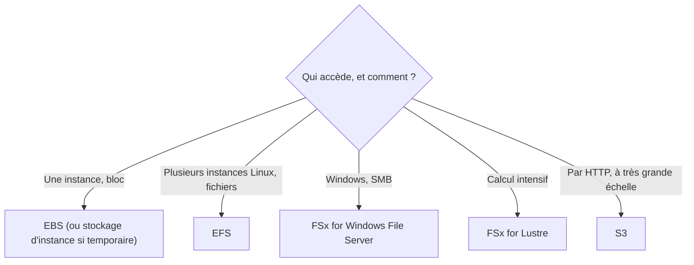

La base de données de la boutique est lente. L'équipe double la taille de l'instance : aucun effet. Le goulot n'était pas le processeur, mais le **disque**, limité en opérations par seconde. Bien choisir un stockage, c'est d'abord savoir **ce qu'on lui demande** : beaucoup de petites lectures aléatoires, ou de gros flux séquentiels ?

## Deux mesures à ne pas confondre

- Les **IOPS** (opérations d'entrée-sortie par seconde) comptent pour les accès **aléatoires** et petits : bases de données transactionnelles.
- Le **débit** (en Mio/s) compte pour les accès **séquentiels** et gros : journaux, traitement de données, vidéo.

## Les volumes EBS

| Type | Famille | Fait pour | À retenir |
| --- | --- | --- | --- |
| **gp3** | SSD usage général | La plupart des charges : disques système, bases moyennes | 3 000 IOPS et 125 Mio/s de base, **quelle que soit la taille** ; IOPS et débit s'achètent séparément du volume. Le SSD le moins cher |
| **gp2** | SSD usage général (génération précédente) | Existant | Les IOPS **dépendent de la taille** (3 par Gio) : grossir le volume pour gagner en performance |
| **io2 Block Express** | SSD à IOPS provisionnées | Bases critiques, très fortes IOPS, latence faible et constante | Le plus performant et le plus cher ; permet l'attachement multiple |
| **st1** | Disque dur optimisé pour le débit | Gros volumes lus séquentiellement et souvent : journaux, entrepôts de données | Ne peut pas servir de disque de démarrage |
| **sc1** | Disque dur « froid » | Données peu consultées, au prix le plus bas | Ne peut pas servir de disque de démarrage |

Trois faits d'architecture :

- un volume EBS vit dans **une** zone de disponibilité et se branche à une instance de cette zone (l'attachement multiple, réservé à io1 et io2, relie un volume à plusieurs instances **de la même zone**) ;
- on peut **modifier à chaud** la taille, le type et les performances d'un volume ;
- un **instantané** (*snapshot*) est incrémental, stocké dans S3 par AWS, et peut être copié vers une autre région.

Le **stockage d'instance** reste le plus rapide (disques locaux de l'hôte) pour des données temporaires : caches, fichiers d'échange, données répliquées ailleurs. Il ne survit pas à l'arrêt de l'instance.

## Les systèmes de fichiers partagés

| Service | Protocole et public | Cas typique |
| --- | --- | --- |
| **Amazon EFS** | NFS, pour Linux ; plusieurs zones ; taille élastique | Contenu partagé entre des serveurs web, répertoires personnels |
| **Amazon FSx for Windows File Server** | SMB, intégré à Active Directory | Partages de fichiers Windows |
| **Amazon FSx for Lustre** | Système de fichiers parallèle, pouvant être relié à S3 | Calcul haute performance, apprentissage automatique |
| **Amazon FSx for NetApp ONTAP / OpenZFS** | Compatibles avec ces systèmes | Migrer un existant sans le transformer |

EFS propose une classe d'accès peu fréquent et un cycle de vie qui y déplace les fichiers inactifs : c'est le même raisonnement que pour les classes S3.



## Accélérer S3

| Technique | Effet |
| --- | --- |
| **Envoi en plusieurs parties** (*multipart upload*) | Un gros objet est découpé en parties envoyées **en parallèle** ; une partie en échec est seule à refaire. Recommandé à partir d'une centaine de mégaoctets. |
| **Lectures par plages d'octets** | Télécharger plusieurs morceaux d'un objet en parallèle, ou seulement l'en-tête d'un fichier. |
| **Répartition sur plusieurs préfixes** | Le débit de requêtes de S3 se compte **par préfixe** (plusieurs milliers de requêtes par seconde chacun) : répartir les clés sur plusieurs préfixes multiplie la capacité. |
| **S3 Transfer Acceleration** | Les envois entrent par le point de présence le plus proche et empruntent le réseau d'AWS : utile pour des utilisateur·rice·s éloigné·e·s du bucket. |
| **Amazon CloudFront** | Pour la **lecture** : copies gardées près des internautes (leçon 10). |

La commande `aws s3 cp` découpe d'elle-même les fichiers de plus de 8 Mo. On le voit à l'**ETag** de l'objet, qui se termine alors par un tiret et le nombre de parties (`…-3`).

## Stockage hybride et transferts

| Besoin | Service |
| --- | --- |
| Des applications sur site continuent d'écrire en NFS ou SMB, les données allant dans S3 | **AWS Storage Gateway** (passerelle de fichiers) |
| Remplacer des bandes de sauvegarde par du stockage S3 | **Storage Gateway** (passerelle de bandes) |
| Copier régulièrement de gros volumes entre un stockage sur site et AWS, en ligne | **AWS DataSync** |
| Des partenaires déposent des fichiers par SFTP ou FTPS | **AWS Transfer Family** |

:::info Côté coûts
gp3 coûte moins cher au gigaoctet que gp2 et n'oblige plus à surdimensionner un volume pour obtenir des IOPS : migrer de gp2 vers gp3 est une optimisation classique. Les volumes non attachés et les vieux instantanés sont des dépenses souvent oubliées. Un transfert accéléré ou un débit provisionné se paient : ne les active que là où la mesure en montre le besoin.
:::

## Les commandes du labo

```bash
aws ec2 create-volume --availability-zone eu-west-3a --size 100 --volume-type gp3 --iops 6000 --encrypted \
  --tag-specifications 'ResourceType=volume,Tags=[{Key=Name,Value=donnees}]'
aws ec2 create-snapshot --volume-id <id du volume> --description "Avant agrandissement" \
  --tag-specifications 'ResourceType=snapshot,Tags=[{Key=Name,Value=donnees-j1}]'
aws ec2 modify-volume --volume-id <id du volume> --size 200
```

- `--iops 6000` : on achète 3 000 IOPS de plus que la base de gp3, sans toucher à la taille.
- L'instantané **avant** modification est une précaution élémentaire.
- `modify-volume` agrandit le volume sans le détacher ; il reste ensuite à étendre le système de fichiers depuis l'instance.

Pour créer un fichier d'essai de 20 Mo :

```shell run
dd if=/dev/zero of=video.bin bs=1M count=20
ls -lh video.bin
```

:::warning Ce qui diffère du vrai AWS
Les volumes et les instantanés de l'émulateur sont des fiches : aucun disque, donc aucune performance à mesurer, et un instantané y est « terminé » instantanément. L'envoi en plusieurs parties vers S3, lui, est réel. Transfer Acceleration est un réglage enregistré, sans effet ici.
:::

:::tip Lis l'unité dans l'énoncé
« 40 000 IOPS, latence constante » désigne io2 Block Express. « 500 Mio/s en lecture séquentielle, au moindre coût » désigne st1. « Partagé entre des instances Linux de plusieurs zones » désigne EFS, jamais EBS.
:::

## Entraîne-toi

Tu prépares le stockage de la base de la boutique (un volume gp3 performant, sauvegardé puis agrandi), un volume économique pour les journaux, et tu envoies une vidéo en plusieurs parties vers S3.

:::lab
engine: real
intro: |
  Le bucket `asso-medias` existe. Tes volumes se créent dans la zone `eu-west-3a` et sont retrouvés par leur étiquette `Name` : `donnees`, `journaux`, et `donnees-j1` pour l'instantané.
commands:
  - demarrer-aws
  - 'aws s3api head-bucket --bucket asso-medias 2>/dev/null || aws s3 mb s3://asso-medias'
steps:
  - text: "Crée un volume `gp3` de 100 Gio, **chiffré**, avec 6 000 IOPS, étiqueté `Name=donnees`"
    checks:
      - output-contains:
          - "aws ec2 describe-volumes --filters Name=tag:Name,Values=donnees --query 'Volumes[].[VolumeType,Iops,Encrypted,AvailabilityZone]' --output text"
          - '^gp3\s+6000\s+True\s+eu-west-3a$'
    solution:
      - "aws ec2 create-volume --availability-zone eu-west-3a --size 100 --volume-type gp3 --iops 6000 --encrypted --tag-specifications 'ResourceType=volume,Tags=[{Key=Name,Value=donnees}]'"
  - text: "Prends un instantané de ce volume, étiqueté `Name=donnees-j1`"
    after: [1]
    checks:
      - output-contains:
          - "aws ec2 describe-snapshots --filters Name=tag:Name,Values=donnees-j1 --query 'Snapshots[].[State,VolumeSize]' --output text"
          - '^completed\s+[0-9]+$'
    solution:
      - "aws ec2 create-snapshot --volume-id \"$(aws ec2 describe-volumes --filters Name=tag:Name,Values=donnees --query 'Volumes[0].VolumeId' --output text)\" --description 'Avant agrandissement' --tag-specifications 'ResourceType=snapshot,Tags=[{Key=Name,Value=donnees-j1}]'"
  - text: "Agrandis le volume `donnees` à 200 Gio, à chaud, avec `aws ec2 modify-volume`"
    after: [2]
    checks:
      - output-contains:
          - "aws ec2 describe-volumes --filters Name=tag:Name,Values=donnees --query 'Volumes[].Size' --output text"
          - '^200$'
    solution:
      - "aws ec2 modify-volume --volume-id \"$(aws ec2 describe-volumes --filters Name=tag:Name,Values=donnees --query 'Volumes[0].VolumeId' --output text)\" --size 200"
  - text: "Crée pour les journaux un volume `st1` de 500 Gio, étiqueté `Name=journaux`"
    checks:
      - output-contains:
          - "aws ec2 describe-volumes --filters Name=tag:Name,Values=journaux --query 'Volumes[].[VolumeType,Size]' --output text"
          - '^st1\s+500$'
    solution:
      - "aws ec2 create-volume --availability-zone eu-west-3a --size 500 --volume-type st1 --tag-specifications 'ResourceType=volume,Tags=[{Key=Name,Value=journaux}]'"
  - text: "Crée le fichier `video.bin` de 20 Mo (commande `dd` de la leçon), envoie-le dans `asso-medias`, puis garde son ETag : `aws s3api head-object --bucket asso-medias --key video.bin --query ETag --output text > etag.txt`"
    checks:
      - output-contains:
          - 'aws s3api head-object --bucket asso-medias --key video.bin --query ETag --output text'
          - '-[0-9]+"?$'
      - env-file-contains: [etag.txt, '-[0-9]+"?$']
    solution:
      - dd if=/dev/zero of=video.bin bs=1M count=20
      - aws s3 cp video.bin s3://asso-medias/video.bin --only-show-errors
      - aws s3api head-object --bucket asso-medias --key video.bin --query ETag --output text > etag.txt
  - text: "Active S3 Transfer Acceleration sur le bucket `asso-medias`"
    hint: "aws s3api put-bucket-accelerate-configuration --bucket asso-medias --accelerate-configuration Status=Enabled"
    checks:
      - output-contains:
          - 'aws s3api get-bucket-accelerate-configuration --bucket asso-medias --query Status --output text'
          - '^Enabled$'
    solution:
      - aws s3api put-bucket-accelerate-configuration --bucket asso-medias --accelerate-configuration Status=Enabled
:::

## Vérifie tes acquis

:::quiz
Une base de données transactionnelle critique a besoin de 50 000 IOPS avec une latence faible et constante. Quel type de volume EBS choisir ?

- [ ] st1
- [ ] sc1
- [x] io2 Block Express
- [ ] gp2 de 100 Gio

> Les volumes à IOPS provisionnées sont faits pour les fortes IOPS à latence constante. st1 et sc1 sont des disques durs conçus pour le débit séquentiel.
:::

:::quiz
Dix serveurs web Linux, répartis sur trois zones de disponibilité, doivent partager les mêmes fichiers téléversés par les utilisateur·rice·s. Quel stockage convient ?

- [ ] Un volume EBS gp3 attaché aux dix instances
- [x] Amazon EFS
- [ ] Le stockage d'instance de chaque serveur
- [ ] Amazon FSx for Windows File Server

> EFS est un système de fichiers NFS partagé entre plusieurs zones. Un volume EBS est lié à une zone, et le stockage d'instance est local et éphémère.
:::

:::quiz
Des utilisateur·rice·s en Australie envoient de gros fichiers vers un bucket situé à Paris, et les envois sont lents. Quelle option améliore ces envois sans déplacer le bucket ?

- [ ] Une classe de stockage S3 Standard-IA
- [ ] Le versionnage du bucket
- [ ] Une règle de cycle de vie
- [x] S3 Transfer Acceleration, avec des envois en plusieurs parties

> Transfer Acceleration fait entrer les données par un point de présence proche et les achemine par le réseau d'AWS ; le découpage en parties parallélise l'envoi.
:::

:::quiz
Un volume gp2 de 500 Gio n'est rempli qu'à 10 % : il avait été surdimensionné pour obtenir assez d'IOPS. Comment réduire le coût en gardant la performance ?

- [ ] Passer à sc1
- [ ] Activer l'attachement multiple
- [x] Migrer vers un volume gp3 dimensionné pour la capacité utile, en provisionnant à part les IOPS nécessaires
- [ ] Le remplacer par un stockage d'instance

> Avec gp3, la performance ne dépend plus de la taille : on paie la capacité utile et, séparément, les IOPS voulues. Un volume ne se réduit pas sur place : on en crée un plus petit et on y copie les données.
:::
