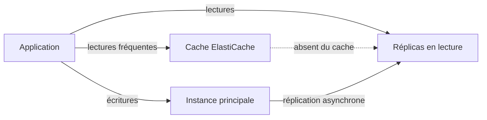

La page « Commandes en cours » de la boutique mettait 200 millisecondes à s'afficher avec mille commandes. Avec un million, elle en met vingt secondes, et la facture de la base a triplé. Rien n'a changé dans le code : la requête **parcourt toute la table** pour en garder trois lignes. Le modèle de données n'avait pas été pensé pour la question qu'on lui pose.

## Partir du modèle d'accès

| Les données et les requêtes | Base |
| --- | --- |
| Relations entre tables, transactions, requêtes SQL variées | **Amazon RDS** ou **Amazon Aurora** |
| Accès par clé, schéma souple, débit très élevé, latence constante | **Amazon DynamoDB** |
| Cache, sessions, classements, compteurs en mémoire | **Amazon ElastiCache**, **Amazon MemoryDB** |
| Analyse sur de très gros volumes, stockage en colonnes | **Amazon Redshift** |
| Documents JSON, compatibilité MongoDB | **Amazon DocumentDB** |
| Relations en graphe (réseau social, détection de fraude) | **Amazon Neptune** |
| Séries temporelles (mesures de capteurs) | **Amazon Timestream** |

Entre RDS et Aurora : Aurora est compatible MySQL et PostgreSQL, sépare le calcul du stockage (copié sur trois zones), accepte jusqu'à 15 réplicas en lecture et existe en version **Serverless**, dont la capacité suit la charge. RDS reste le choix pour les autres moteurs (Oracle, SQL Server, MariaDB, Db2) ou les besoins simples.

## Accélérer une base relationnelle



- Les **réplicas en lecture** absorbent les requêtes de consultation et de rapport. La réplication est **asynchrone** : une lecture peut retarder légèrement sur l'écriture.
- Un **cache** évite de recalculer ce qui est demandé sans cesse. Deux stratégies :
  - **chargement paresseux** (*lazy loading*) : on interroge le cache ; s'il n'a pas la donnée, on lit la base et on remplit le cache. Seul ce qui est demandé est mis en cache, mais la donnée peut être périmée ;
  - **écriture simultanée** (*write-through*) : chaque écriture met à jour la base **et** le cache. Le cache est toujours frais, mais contient aussi ce que personne ne lit.
- Dans les deux cas, une **durée de vie** (TTL) sur les entrées du cache limite la péremption.
- **Amazon RDS Proxy** mutualise les connexions quand de très nombreux clients (des fonctions Lambda, par exemple) ouvrent et ferment des connexions sans cesse.

## Concevoir pour DynamoDB

Dans DynamoDB, on ne retrouve efficacement un élément que par sa **clé primaire** :

- une **clé de partition** seule (`id`) ; ou
- une clé **composée** : une clé de partition (`client`) et une **clé de tri** (`jour`). Tous les éléments d'un même client sont rangés ensemble, triés par jour.

| Opération | Ce qu'elle fait | Coût |
| --- | --- | --- |
| `GetItem` | Lit un élément par sa clé complète | Un élément |
| `Query` | Lit les éléments d'**une** clé de partition, éventuellement filtrés sur la clé de tri | Seulement les éléments concernés |
| `Scan` | Lit **toute** la table, puis filtre | Toute la table, même pour trois résultats |

Quand une question ne correspond pas à la clé (« toutes les commandes en cours, tous clients confondus »), on crée un **index secondaire** :

| | Index secondaire global (GSI) | Index secondaire local (LSI) |
| --- | --- | --- |
| Clé | Une clé de partition **différente** de celle de la table | La **même** clé de partition, une autre clé de tri |
| Création | À tout moment | Seulement à la création de la table |
| Cohérence | À terme (*eventual*) | Forte possible |

Deux **modes de capacité** : **à la demande** (on paie à la requête, idéal pour une charge imprévisible ou nouvelle) et **provisionné** (on réserve un débit en unités de lecture et d'écriture, avec mise à l'échelle automatique : moins cher pour une charge régulière et connue).

Pour des lectures en **microsecondes**, **DynamoDB Accelerator (DAX)** ajoute un cache en mémoire devant la table, sans réécrire l'application.

:::info Côté coûts
Un `Scan` facture la lecture de toute la table : remplacer un parcours par une requête sur un index est souvent la meilleure économie possible. Un index global a un coût (il stocke une copie des attributs projetés et consomme sa propre capacité) : n'en crée que pour des questions réellement posées. Les réplicas en lecture et les caches coûtent aussi : mesure avant d'en ajouter.
:::

## Les commandes du labo

Une table à clé composée :

```bash
aws dynamodb create-table --table-name commandes \
  --attribute-definitions AttributeName=client,AttributeType=S AttributeName=jour,AttributeType=S \
  --key-schema AttributeName=client,KeyType=HASH AttributeName=jour,KeyType=RANGE \
  --billing-mode PAY_PER_REQUEST
```

Une requête sur la clé : les commandes du client `c1` depuis le 1er octobre. Les valeurs sont passées à part, sous des noms qui commencent par `:` :

```bash
aws dynamodb query --table-name commandes \
  --key-condition-expression 'client = :c AND jour >= :j' \
  --expression-attribute-values file://valeurs.json
```

Le même besoin, mais sur un attribut qui n'est pas dans la clé, oblige à un parcours :

```bash
aws dynamodb scan --table-name commandes \
  --filter-expression 'statut = :s' --expression-attribute-values '{":s": {"S": "en-cours"}}'
```

Dans chaque réponse, compare `Count` (éléments renvoyés) et `ScannedCount` (éléments **lus**, donc facturés).

Dans le labo, regarde d'abord les cinq commandes à charger et les valeurs de la première requête :

```shell run
cat lot.json
cat valeurs.json
```

:::warning Ce qui diffère du vrai AWS
L'émulateur exécute réellement les requêtes, les parcours et les index de DynamoDB, et renvoie des `Count` et `ScannedCount` exacts. Il ne limite pas le débit, ne facture rien et crée un index instantanément (sur une grande table réelle, le remplissage d'un index prend du temps). RDS, Aurora et ElastiCache n'y sont que des fiches.
:::

:::tip Certains noms sont réservés
DynamoDB réserve des mots comme `date`, `status` ou `total` : on ne peut pas les écrire tels quels dans une expression (il faut passer par `--expression-attribute-names`). C'est pourquoi la table du labo utilise `jour`, `statut` et `montant`.
:::

## Entraîne-toi

Tu crées la table des commandes, tu la remplis, puis tu réponds à deux questions : « les commandes récentes du client `c1` » (par la clé) et « toutes les commandes en cours » (d'abord par un parcours coûteux, puis par un index).

```json file=index.json
[
  {
    "Create": {
      "IndexName": "par-statut",
      "KeySchema": [
        {"AttributeName": "statut", "KeyType": "HASH"},
        {"AttributeName": "jour", "KeyType": "RANGE"}
      ],
      "Projection": {"ProjectionType": "ALL"}
    }
  }
]
```

:::lab
engine: real
intro: |
  Ton dossier de travail contient `lot.json` (cinq commandes à charger) et `valeurs.json` (les valeurs de la première requête). Les étapes sont vérifiées sur la table et sur les réponses que tu gardes.
files:
  lot.json: |
    {
      "commandes": [
        {"PutRequest": {"Item": {"client": {"S": "c1"}, "jour": {"S": "2026-09-01"}, "statut": {"S": "livree"}, "montant": {"N": "30"}}}},
        {"PutRequest": {"Item": {"client": {"S": "c1"}, "jour": {"S": "2026-10-02"}, "statut": {"S": "livree"}, "montant": {"N": "12"}}}},
        {"PutRequest": {"Item": {"client": {"S": "c1"}, "jour": {"S": "2026-10-05"}, "statut": {"S": "en-cours"}, "montant": {"N": "45"}}}},
        {"PutRequest": {"Item": {"client": {"S": "c2"}, "jour": {"S": "2026-10-03"}, "statut": {"S": "en-cours"}, "montant": {"N": "99"}}}},
        {"PutRequest": {"Item": {"client": {"S": "c3"}, "jour": {"S": "2026-08-20"}, "statut": {"S": "annulee"}, "montant": {"N": "15"}}}}
      ]
    }
  valeurs.json: |
    {
      ":c": {"S": "c1"},
      ":j": {"S": "2026-10-01"}
    }
commands:
  - demarrer-aws
steps:
  - text: "Crée la table `commandes` à clé composée : clé de partition `client`, clé de tri `jour` (deux chaînes), facturée à la demande"
    checks:
      - output-contains:
          - "aws dynamodb describe-table --table-name commandes --query 'Table.KeySchema[].[AttributeName,KeyType]' --output text"
          - '^client\s+HASH$'
      - output-contains:
          - "aws dynamodb describe-table --table-name commandes --query 'Table.KeySchema[].[AttributeName,KeyType]' --output text"
          - '^jour\s+RANGE$'
    solution:
      - aws dynamodb create-table --table-name commandes --attribute-definitions AttributeName=client,AttributeType=S AttributeName=jour,AttributeType=S --key-schema AttributeName=client,KeyType=HASH AttributeName=jour,KeyType=RANGE --billing-mode PAY_PER_REQUEST
  - text: "Charge les cinq commandes de `lot.json` en une fois avec `aws dynamodb batch-write-item`"
    hint: "aws dynamodb batch-write-item --request-items file://lot.json"
    after: [1]
    checks:
      - output-contains:
          - 'aws dynamodb scan --table-name commandes --select COUNT --query Count --output text'
          - '^5$'
    solution:
      - aws dynamodb batch-write-item --request-items file://lot.json
  - text: "Par la clé : garde dans `requete.json` les commandes du client `c1` à partir du 1er octobre 2026 (`aws dynamodb query`, avec `valeurs.json`)"
    hint: "--key-condition-expression 'client = :c AND jour >= :j' --expression-attribute-values file://valeurs.json"
    after: [2]
    checks:
      - env-file-contains: [requete.json, '"Count": 2,']
      - env-file-contains: [requete.json, '"ScannedCount": 2,']
    solution:
      - "aws dynamodb query --table-name commandes --key-condition-expression 'client = :c AND jour >= :j' --expression-attribute-values file://valeurs.json > requete.json"
  - text: "Sans index : garde dans `parcours.json` toutes les commandes dont le `statut` vaut `en-cours`, avec `aws dynamodb scan` et un filtre. Compare `Count` et `ScannedCount`"
    after: [2]
    checks:
      - env-file-contains: [parcours.json, '"Count": 2,']
      - env-file-contains: [parcours.json, '"ScannedCount": 5,']
    solution:
      - "aws dynamodb scan --table-name commandes --filter-expression 'statut = :s' --expression-attribute-values '{\":s\": {\"S\": \"en-cours\"}}' > parcours.json"
  - text: "Écris `index.json` et ajoute à la table l'index secondaire global `par-statut` (clé de partition `statut`, clé de tri `jour`) avec `aws dynamodb update-table`"
    hint: "aws dynamodb update-table --table-name commandes --attribute-definitions AttributeName=statut,AttributeType=S AttributeName=jour,AttributeType=S --global-secondary-index-updates file://index.json"
    after: [1]
    checks:
      - output-contains:
          - "aws dynamodb describe-table --table-name commandes --query 'Table.GlobalSecondaryIndexes[].[IndexName,IndexStatus,KeySchema[0].AttributeName]' --output text"
          - '^par-statut\s+ACTIVE\s+statut$'
    solution:
      - write:
          index.json: |
            [
              {
                "Create": {
                  "IndexName": "par-statut",
                  "KeySchema": [
                    {"AttributeName": "statut", "KeyType": "HASH"},
                    {"AttributeName": "jour", "KeyType": "RANGE"}
                  ],
                  "Projection": {"ProjectionType": "ALL"}
                }
              }
            ]
      - aws dynamodb update-table --table-name commandes --attribute-definitions AttributeName=statut,AttributeType=S AttributeName=jour,AttributeType=S --global-secondary-index-updates file://index.json
  - text: "Avec l'index : garde dans `par-statut.json` les commandes `en-cours`, cette fois par une requête sur l'index (`aws dynamodb query --index-name par-statut`)"
    hint: "--key-condition-expression 'statut = :s' --expression-attribute-values '{\":s\": {\"S\": \"en-cours\"}}'"
    after: [2, 5]
    checks:
      - env-file-contains: [par-statut.json, '"Count": 2,']
      - env-file-contains: [par-statut.json, '"ScannedCount": 2,']
    solution:
      - "aws dynamodb query --table-name commandes --index-name par-statut --key-condition-expression 'statut = :s' --expression-attribute-values '{\":s\": {\"S\": \"en-cours\"}}' > par-statut.json"
:::

## Vérifie tes acquis

:::quiz
Les rapports mensuels ralentissent la base PostgreSQL de production, sur Amazon RDS, pendant leur exécution. Comment les isoler sans toucher aux écritures ?

- [ ] Activer le déploiement Multi-AZ
- [x] Créer un réplica en lecture et y diriger les rapports
- [ ] Augmenter la durée de rétention des sauvegardes
- [ ] Passer la base en mode de capacité à la demande

> Un réplica en lecture reçoit les requêtes de consultation ; l'instance principale garde ses ressources pour les écritures. Le Multi-AZ classique ne sert pas de lectures.
:::

:::quiz
Une table DynamoDB a pour clé de partition `client` et pour clé de tri `jour`. Il faut lister toutes les commandes au statut `en-cours`, tous clients confondus, des milliers de fois par jour. Que faire ?

- [ ] Un `Scan` avec un filtre sur `statut`
- [ ] Un index secondaire local sur `statut`
- [x] Un index secondaire global dont la clé de partition est `statut`
- [ ] Augmenter la capacité provisionnée de la table

> Un index global permet d'interroger par une autre clé de partition. Un index local garde la clé de partition `client` ; un parcours lirait toute la table à chaque fois.
:::

:::quiz
Une application lit beaucoup plus qu'elle n'écrit et supporte qu'une donnée affichée ait quelques minutes de retard. L'équipe veut ne mettre en cache que ce qui est réellement demandé. Quelle stratégie choisir ?

- [ ] Écriture simultanée, sans durée de vie
- [ ] Aucun cache, mais un déploiement Multi-AZ
- [ ] Un réplica dans une autre région
- [x] Chargement paresseux, avec une durée de vie sur les entrées

> Le chargement paresseux ne remplit le cache qu'à la demande ; la durée de vie borne la péremption. L'écriture simultanée met en cache tout ce qui est écrit, même ce qui n'est jamais lu.
:::

:::quiz
Une nouvelle application a une charge imprévisible, avec de longues périodes sans trafic et des pics soudains. Quel mode de capacité DynamoDB limite le risque et le coût ?

- [x] À la demande
- [ ] Provisionné, dimensionné sur le pic
- [ ] Provisionné, dimensionné sur la moyenne, sans mise à l'échelle
- [ ] Réservé sur trois ans

> Le mode à la demande facture à la requête et absorbe les pics sans réglage. Le mode provisionné convient à une charge régulière et connue.
:::
