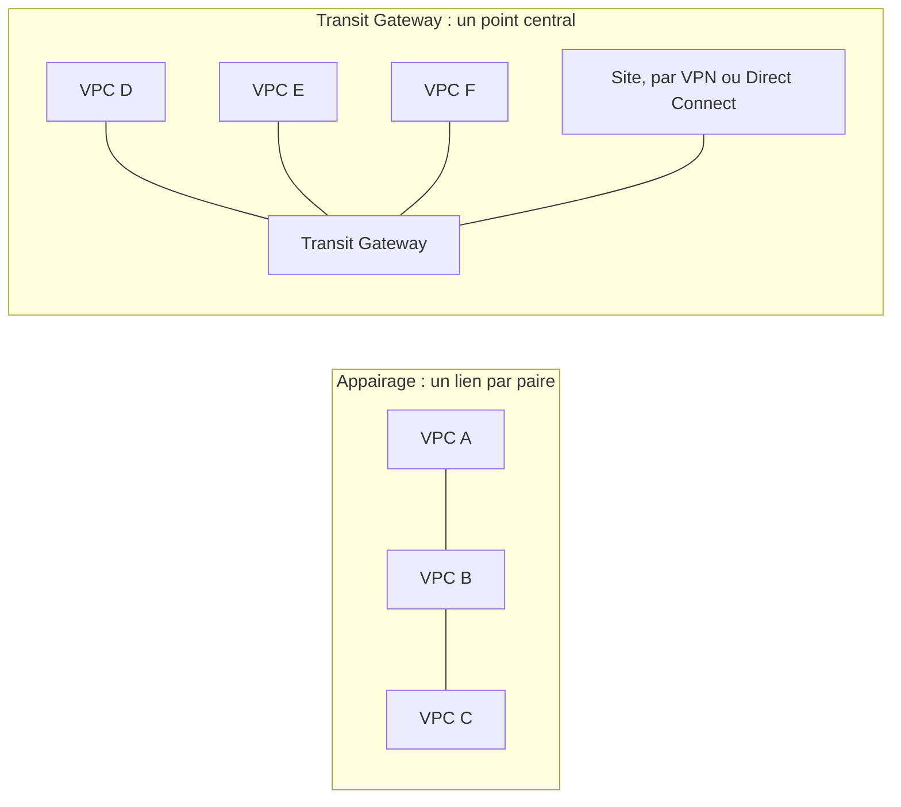

L'association ouvre son site aux adhérent·e·s du Japon : chaque page y met trois secondes à s'afficher. Les serveurs, à Paris, répondent pourtant vite. Le temps perdu est celui du **trajet** : les octets traversent la planète sur Internet. Un réseau performant rapproche le contenu, choisit le bon point d'arrivée et évite les détours.

## Rapprocher : CloudFront ou Global Accelerator ?

| | Amazon CloudFront | AWS Global Accelerator |
| --- | --- | --- |
| Nature | Réseau de diffusion de contenu (CDN) : **garde des copies** dans les points de présence | Accélérateur réseau : **achemine** le trafic sur le réseau d'AWS dès le point de présence, sans rien garder |
| Protocoles | HTTP, HTTPS | TCP et UDP |
| Point d'entrée | Un nom de domaine | Deux **adresses IP fixes**, annoncées depuis tous les points de présence |
| Fait pour | Sites web, images, vidéo, API à réponses cachables | Jeux, voix, objets connectés, applications non HTTP ; bascule rapide entre régions ; clients qui exigent une adresse fixe |

Autour de CloudFront : l'**origine** est la source du contenu (un bucket S3, un répartiteur de charge) ; un **contrôle d'accès à l'origine** (OAC) garantit qu'un bucket n'est lisible **que** par CloudFront ; la **durée de vie** (TTL) règle le temps de conservation dans les points de présence ; une **invalidation** force le rafraîchissement.

## Router : les politiques de Route 53

| Politique | Envoie le trafic… | Usage |
| --- | --- | --- |
| **Simple** | Vers une ressource | Cas de base |
| **Pondérée** (*weighted*) | Selon des proportions que tu fixes | Déploiement progressif, test A/B |
| **Par latence** (*latency*) | Vers la région qui répond le plus vite à l'utilisateur·rice | Application déployée dans plusieurs régions |
| **Basculement** (*failover*) | Vers le secours quand le principal est en panne | Actif-passif (leçon 7) |
| **Géolocalisation** | Selon le pays ou le continent de l'utilisateur·rice | Contenu localisé, obligations légales |
| **Géoproximité** | Selon la distance aux ressources, avec un biais réglable | Déplacer une part du trafic d'une région à l'autre |
| **Selon l'adresse IP** (*IP-based*) | Selon la plage d'adresses d'origine | Trafic d'un fournisseur d'accès précis |
| **Réponses multiples** (*multivalue answer*) | Jusqu'à huit enregistrements sains, tirés au hasard | Répartition simple avec contrôle de santé |

À ne pas confondre : **latence** choisit la région la plus **rapide** (souvent, mais pas toujours, la plus proche) ; **géolocalisation** applique une **règle** liée au lieu, même si une autre région serait plus rapide.

## Relier des VPC



| Moyen | Principe | Limite ou atout |
| --- | --- | --- |
| **Appairage de VPC** (*VPC peering*) | Un lien privé entre **deux** VPC, y compris entre régions et entre comptes | **Non transitif** : si A est appairé à B et B à C, A ne joint pas C. Les plages d'adresses ne doivent pas se chevaucher. Aucun coût horaire. |
| **AWS Transit Gateway** | Un **concentrateur** auquel on rattache des VPC, des VPN et Direct Connect | Routage central et transitif ; passe à l'échelle de centaines de VPC ; facturé à l'heure et au volume. |
| **AWS PrivateLink** | Exposer **un service** d'un VPC à d'autres, par une interface privée | Les consommateurs n'accèdent qu'au service, pas au réseau ; fonctionne même si les plages se chevauchent. |

Dans l'appairage de l'exemple, A et C ne se joignent pas : il faudrait un troisième lien, ou un Transit Gateway.

## Relier ses locaux

| | VPN site à site | AWS Direct Connect |
| --- | --- | --- |
| Support | Internet, chiffré (IPsec) | Liaison dédiée, hors Internet |
| Mise en place | Minutes à heures | Semaines |
| Débit et latence | Variables | Stables, débits élevés |
| Coût | Faible | Plus élevé à l'installation ; le transfert sortant y est souvent moins cher au gigaoctet |

Un montage courant : Direct Connect pour le trafic normal, un VPN en **secours**.

## Rapprocher les instances : les groupes de placement

| Stratégie | Place les instances… | Pour |
| --- | --- | --- |
| **Cluster** | Au plus près, dans une même zone | Calcul intensif à très faible latence entre nœuds |
| **Spread** (répartition) | Sur du matériel distinct | Un petit nombre d'instances critiques qui ne doivent pas tomber ensemble |
| **Partition** | Par groupes isolés les uns des autres | Grands systèmes répartis (Kafka, Cassandra, Hadoop) |

:::info Côté coûts
Le transfert de données est un poste discret : le trafic entre zones, entre régions et vers Internet est facturé. Servir par CloudFront réduit le volume qui sort de l'origine ; garder dans la même zone deux composants très bavards évite du transfert entre zones ; un point de terminaison de passerelle évite de payer une passerelle NAT pour atteindre S3.
:::

## Les commandes du labo

L'appairage se fait en deux temps, demande puis acceptation, et ne sert à rien tant que les **tables de routage** des deux côtés n'ont pas de route vers l'autre VPC :

```bash
aws ec2 create-vpc-peering-connection --vpc-id <id de appli> --peer-vpc-id <id de partage>
aws ec2 accept-vpc-peering-connection --vpc-peering-connection-id <pcx-…>
aws ec2 create-route --route-table-id <table de appli> \
  --destination-cidr-block 10.1.0.0/16 --vpc-peering-connection-id <pcx-…>
```

Les deux VPC du labo et leurs tables de routage sont étiquetés `appli` et `partage` :

```shell run
aws ec2 describe-vpcs --filters Name=tag:Name,Values=appli,partage --query 'Vpcs[].[Tags[0].Value,VpcId,CidrBlock]' --output text
aws ec2 describe-route-tables --filters Name=tag:Name,Values=appli,partage --query 'RouteTables[].[Tags[0].Value,RouteTableId]' --output text
```

Des enregistrements par latence portent le même nom, un `SetIdentifier` distinct et la **région** de la ressource qu'ils désignent.

:::warning Ce qui diffère du vrai AWS
L'émulateur enregistre l'appairage, les routes et les enregistrements DNS, mais aucun paquet ne circule et aucune requête DNS n'est résolue : tu ne mesureras ni latence ni bascule. CloudFront, Global Accelerator, Transit Gateway et Direct Connect ne sont pas émulés (ou seulement en façade) : ils se travaillent ici par la lecture et les questions.
:::

:::tip Trois mots qui orientent la réponse
« Contenu statique, utilisateurs dans le monde entier » → CloudFront. « Adresse IP fixe », « UDP », « bascule en quelques secondes entre régions » → Global Accelerator. « Des dizaines de VPC et un site à relier » → Transit Gateway.
:::

## Entraîne-toi

Tu relies le VPC de l'application au VPC des services partagés par un appairage, tu routes le nom `api.asso.example` vers la région la plus rapide, et tu prépares un groupe de placement pour un calcul intensif.

```json file=latence.json
{
  "Changes": [
    {
      "Action": "CREATE",
      "ResourceRecordSet": {
        "Name": "api.asso.example",
        "Type": "A",
        "SetIdentifier": "paris",
        "Region": "eu-west-3",
        "TTL": 60,
        "ResourceRecords": [{"Value": "203.0.113.11"}]
      }
    },
    {
      "Action": "CREATE",
      "ResourceRecordSet": {
        "Name": "api.asso.example",
        "Type": "A",
        "SetIdentifier": "tokyo",
        "Region": "ap-northeast-1",
        "TTL": 60,
        "ResourceRecords": [{"Value": "203.0.113.21"}]
      }
    }
  ]
}
```

:::lab
engine: real
intro: |
  Sont en place : le VPC `appli` (`10.0.0.0/16`) et le VPC `partage` (`10.1.0.0/16`), chacun avec une table de routage portant la même étiquette `Name` que lui, et la zone DNS `asso.example`. Les étapes retrouvent tes ressources par ces étiquettes.
files:
  labo/preparer.sh: |
    #!/bin/sh
    # Prépare les deux VPC et la zone DNS du labo (rejouable : ne recrée rien de ce qui existe).
    set -e
    for paire in appli:10.0.0.0/16 partage:10.1.0.0/16; do
        nom=${paire%%:*}
        plage=${paire#*:}
        v=$(aws ec2 describe-vpcs --filters "Name=tag:Name,Values=$nom" --query 'Vpcs[0].VpcId' --output text)
        if [ "$v" = "None" ]; then
            v=$(aws ec2 create-vpc --cidr-block "$plage" --tag-specifications "ResourceType=vpc,Tags=[{Key=Name,Value=$nom}]" --query Vpc.VpcId --output text)
            aws ec2 create-route-table --vpc-id "$v" --tag-specifications "ResourceType=route-table,Tags=[{Key=Name,Value=$nom}]" > /dev/null
        fi
    done
    if [ "$(aws route53 list-hosted-zones-by-name --dns-name asso.example --query 'length(HostedZones)' --output text)" = 0 ]; then
        aws route53 create-hosted-zone --name asso.example --caller-reference labo-reseau > /dev/null
    fi
commands:
  - demarrer-aws
  - sh labo/preparer.sh
steps:
  - text: "Crée une connexion d'appairage entre le VPC `appli` et le VPC `partage`, puis accepte-la"
    checks:
      - output-contains:
          - "aws ec2 describe-vpc-peering-connections --filters Name=requester-vpc-info.vpc-id,Values=\"$(aws ec2 describe-vpcs --filters Name=tag:Name,Values=appli --query 'Vpcs[0].VpcId' --output text)\" Name=accepter-vpc-info.vpc-id,Values=\"$(aws ec2 describe-vpcs --filters Name=tag:Name,Values=partage --query 'Vpcs[0].VpcId' --output text)\" --query 'VpcPeeringConnections[].Status.Code' --output text"
          - '\bactive\b'
    solution:
      - "aws ec2 accept-vpc-peering-connection --vpc-peering-connection-id \"$(aws ec2 create-vpc-peering-connection --vpc-id \"$(aws ec2 describe-vpcs --filters Name=tag:Name,Values=appli --query 'Vpcs[0].VpcId' --output text)\" --peer-vpc-id \"$(aws ec2 describe-vpcs --filters Name=tag:Name,Values=partage --query 'Vpcs[0].VpcId' --output text)\" --query VpcPeeringConnection.VpcPeeringConnectionId --output text)\""
  - text: "Ajoute les **deux** routes : dans la table `appli`, `10.1.0.0/16` vers l'appairage ; dans la table `partage`, `10.0.0.0/16` vers l'appairage"
    hint: "aws ec2 create-route --route-table-id … --destination-cidr-block … --vpc-peering-connection-id pcx-…"
    after: [1]
    checks:
      - output-contains:
          - "aws ec2 describe-route-tables --filters Name=tag:Name,Values=appli --query 'RouteTables[0].Routes[].[DestinationCidrBlock,VpcPeeringConnectionId]' --output text"
          - '^10\.1\.0\.0/16\s+pcx-'
      - output-contains:
          - "aws ec2 describe-route-tables --filters Name=tag:Name,Values=partage --query 'RouteTables[0].Routes[].[DestinationCidrBlock,VpcPeeringConnectionId]' --output text"
          - '^10\.0\.0\.0/16\s+pcx-'
    solution:
      - "P=$(aws ec2 describe-vpc-peering-connections --query 'VpcPeeringConnections[0].VpcPeeringConnectionId' --output text); aws ec2 create-route --route-table-id $(aws ec2 describe-route-tables --filters Name=tag:Name,Values=appli --query 'RouteTables[0].RouteTableId' --output text) --destination-cidr-block 10.1.0.0/16 --vpc-peering-connection-id $P && aws ec2 create-route --route-table-id $(aws ec2 describe-route-tables --filters Name=tag:Name,Values=partage --query 'RouteTables[0].RouteTableId' --output text) --destination-cidr-block 10.0.0.0/16 --vpc-peering-connection-id $P"
  - text: "Écris `latence.json` et crée dans la zone `asso.example` les deux enregistrements par latence de `api.asso.example` (Paris et Tokyo)"
    hint: "aws route53 change-resource-record-sets --hosted-zone-id \"$(aws route53 list-hosted-zones-by-name --dns-name asso.example --query 'HostedZones[0].Id' --output text)\" --change-batch file://latence.json"
    checks:
      - output-contains:
          - "aws route53 list-resource-record-sets --hosted-zone-id \"$(aws route53 list-hosted-zones-by-name --dns-name asso.example --query 'HostedZones[0].Id' --output text)\" --query \"ResourceRecordSets[?Name=='api.asso.example.'].[SetIdentifier,Region]\" --output text"
          - '^paris\s+eu-west-3$'
      - output-contains:
          - "aws route53 list-resource-record-sets --hosted-zone-id \"$(aws route53 list-hosted-zones-by-name --dns-name asso.example --query 'HostedZones[0].Id' --output text)\" --query \"ResourceRecordSets[?Name=='api.asso.example.'].[SetIdentifier,Region]\" --output text"
          - '^tokyo\s+ap-northeast-1$'
    solution:
      - write:
          latence.json: |
            {
              "Changes": [
                {
                  "Action": "CREATE",
                  "ResourceRecordSet": {
                    "Name": "api.asso.example",
                    "Type": "A",
                    "SetIdentifier": "paris",
                    "Region": "eu-west-3",
                    "TTL": 60,
                    "ResourceRecords": [{"Value": "203.0.113.11"}]
                  }
                },
                {
                  "Action": "CREATE",
                  "ResourceRecordSet": {
                    "Name": "api.asso.example",
                    "Type": "A",
                    "SetIdentifier": "tokyo",
                    "Region": "ap-northeast-1",
                    "TTL": 60,
                    "ResourceRecords": [{"Value": "203.0.113.21"}]
                  }
                }
              ]
            }
      - "aws route53 change-resource-record-sets --hosted-zone-id \"$(aws route53 list-hosted-zones-by-name --dns-name asso.example --query 'HostedZones[0].Id' --output text)\" --change-batch file://latence.json"
  - text: "Crée le groupe de placement `calcul`, de stratégie `cluster`, pour des nœuds de calcul qui échangent en permanence"
    hint: "aws ec2 create-placement-group --group-name calcul --strategy cluster"
    checks:
      - output-contains:
          - "aws ec2 describe-placement-groups --group-names calcul --query 'PlacementGroups[].Strategy' --output text"
          - '^cluster$'
    solution:
      - aws ec2 create-placement-group --group-name calcul --strategy cluster
:::

## Vérifie tes acquis

:::quiz
Une application de voix sur IP utilise UDP, tourne dans deux régions, et ses clients ne peuvent enregistrer que des adresses IP fixes. Que placer devant elle ?

- [ ] Amazon CloudFront
- [x] AWS Global Accelerator
- [ ] Une politique Route 53 de géolocalisation
- [ ] Un appairage de VPC entre les deux régions

> Global Accelerator fournit des adresses IP fixes, accepte UDP et route vers la région saine la plus proche. CloudFront ne traite que HTTP et HTTPS.
:::

:::quiz
Le VPC A est appairé au VPC B, et le VPC B au VPC C. Une instance de A doit joindre une instance de C. Que constates-tu ?

- [ ] La communication fonctionne, par l'intermédiaire de B
- [ ] Elle fonctionne si les groupes de sécurité l'autorisent
- [x] Elle échoue : l'appairage n'est pas transitif
- [ ] Elle échoue sauf si B possède une passerelle NAT

> Un appairage ne relie que les deux VPC qu'il nomme. Il faut un appairage direct entre A et C, ou un Transit Gateway.
:::

:::quiz
Une application est déployée à Paris et à Tokyo. Chaque utilisateur·rice doit être dirigé·e vers la région qui lui répond le plus vite. Quelle politique de routage Route 53 choisir ?

- [ ] Géolocalisation
- [ ] Pondérée
- [ ] Basculement
- [x] Par latence

> La politique par latence choisit la région qui offre la meilleure latence à l'utilisateur·rice. La géolocalisation applique une règle liée au pays, même si une autre région serait plus rapide.
:::

:::quiz
Un éditeur veut offrir son service, hébergé dans son VPC, à des centaines de clients AWS, sans leur ouvrir son réseau et bien que certaines plages d'adresses se chevauchent. Quel moyen convient ?

- [ ] Un appairage de VPC avec chaque client
- [ ] Un Transit Gateway partagé
- [x] AWS PrivateLink
- [ ] Une passerelle Internet et des adresses publiques

> PrivateLink expose un service par une interface privée dans le VPC du client : pas d'accès au reste du réseau, et pas de contrainte sur les plages d'adresses.
:::
