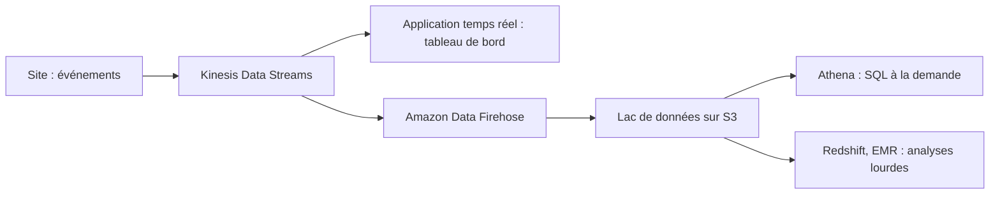

Le site de l'association produit dix mille événements de navigation par minute pendant le gala. La direction veut un tableau de bord presque en direct, et les analystes veulent tout garder pour étudier les parcours plus tard. Une base de données classique n'est faite ni pour l'un ni pour l'autre : il faut un **flux** pour l'instant présent et un **lac de données** pour l'histoire.

## Trois façons de faire entrer un flux

| | Kinesis Data Streams | Amazon Data Firehose | Amazon SQS |
| --- | --- | --- | --- |
| Nature | Un **journal ordonné** et relisible | Un **tuyau de livraison** géré | Une **file** de tâches |
| Consommateurs | Plusieurs, chacun à son rythme ; rejeu possible | Aucun à écrire : livraison vers S3, Redshift, OpenSearch… | Un groupe qui se partage les messages ; un message traité disparaît |
| Conservation | 24 heures par défaut, jusqu'à 365 jours | Aucune (mise en tampon avant livraison) | Jusqu'à 14 jours, tant que le message n'est pas traité |
| Délai | Temps réel | Proche du temps réel (tampon de quelques secondes à quelques minutes) | Selon les consommateurs |
| Ordre | Garanti **par fragment** | — | Seulement en FIFO |

Dans Kinesis Data Streams, un flux est fait de **fragments** (*shards*). Chaque enregistrement porte une **clé de partition** : les enregistrements de même clé vont dans le même fragment et y restent **dans l'ordre**. La capacité se règle en nombre de fragments, ou se délègue au mode **à la demande**.

Firehose sait aussi **transformer** en route : appeler une fonction Lambda, ou convertir du JSON vers un format en colonnes comme Parquet.



## Le lac de données

Un **lac de données** (*data lake*) garde toutes les données, brutes et transformées, dans S3, et laisse plusieurs outils les lire :

| Brique | Rôle |
| --- | --- |
| **Amazon S3** | Le stockage, organisé par préfixes (par exemple `clics/2026/10/06/`) |
| **AWS Glue** | Le **catalogue** (quelles tables, quelles colonnes, où) ; des *crawlers* qui le remplissent en inspectant S3 ; des tâches de transformation (ETL) sans serveur |
| **AWS Lake Formation** | La **gouvernance** : des droits fins (table, colonne, ligne) au-dessus de S3 et du catalogue |
| **Amazon Athena** | Des requêtes SQL sans serveur, directement sur S3, facturées à la requête selon le volume lu |
| **Amazon Redshift** | Un entrepôt de données pour des analyses complexes et répétées ; Redshift Spectrum lit aussi S3 |
| **Amazon EMR** | Des grappes Spark ou Hadoop pour des traitements massifs sur mesure |
| **Amazon Quick** (anciennement QuickSight) | Les tableaux de bord |

Deux réglages changent tout pour la performance **et** le coût d'Athena : stocker en **format en colonnes** (Parquet plutôt que CSV, pour ne lire que les colonnes utiles) et **partitionner** par date (pour ne lire que les jours demandés).

## Faire entrer des données par lots

| Situation | Service |
| --- | --- |
| Copie régulière d'un stockage sur site (NFS, SMB) vers S3 ou EFS, en ligne | **AWS DataSync** |
| Des partenaires déposent des fichiers par SFTP | **AWS Transfer Family** |
| Des applications sur site écrivent sur un partage, les données allant dans S3 | **AWS Storage Gateway** |
| Migrer une base de données, en continu | **AWS DMS** |
| Petits envois nombreux | Les regrouper : un envoi par lots vers S3 coûte moins de requêtes que des milliers d'objets minuscules |

Pour choisir, pose trois questions : **quel volume**, **à quelle fréquence**, et **avec quel débit réseau** ? Des dizaines de téraoctets sur une liaison modeste se comptent en semaines.

:::info Côté coûts
Athena facture le volume de données lu : compresser, convertir en Parquet et partitionner réduit directement la facture. Un flux Kinesis provisionné coûte par fragment et par heure, qu'il serve ou non. Firehose ne coûte qu'au volume traité. Et les données d'un lac vieillissent : une règle de cycle de vie S3 les fait descendre vers des classes moins chères.
:::

## Les commandes du labo

Un flux, puis des enregistrements. `--cli-binary-format raw-in-base64-out` permet d'écrire les données en clair ; la réponse indique le **fragment** qui a reçu l'enregistrement :

```bash
aws kinesis create-stream --stream-name clics --shard-count 2
aws kinesis put-record --stream-name clics --partition-key visiteur-1 \
  --cli-binary-format raw-in-base64-out --data '{"page": "/don"}'
```

Lire demande un **itérateur**, un curseur posé à un endroit du fragment. `TRIM_HORIZON` le place au tout début :

```bash
ITERATEUR=$(aws kinesis get-shard-iterator --stream-name clics --shard-id shardId-000000000000 \
  --shard-iterator-type TRIM_HORIZON --query ShardIterator --output text)
aws kinesis get-records --shard-iterator $ITERATEUR
```

Les données reviennent encodées en base64 ; lire ne retire rien du flux, un autre consommateur peut relire les mêmes enregistrements.

Un flux de livraison Firehose vers S3 se déclare avec le rôle qu'il endosse, le bucket et un préfixe :

```bash
aws firehose create-delivery-stream --delivery-stream-name clics-vers-s3 \
  --extended-s3-destination-configuration \
  RoleARN=arn:aws:iam::000000000000:role/role-firehose,BucketARN=arn:aws:s3:::asso-lac,Prefix=clics/
```

Dans le labo, le bucket du lac et le rôle sont prêts :

```shell run
aws s3 ls s3://asso-lac
aws iam get-role --role-name role-firehose --query Role.Arn --output text
```

:::warning Ce qui diffère du vrai AWS
Kinesis et Firehose sont réellement exécutés par l'émulateur, mais sans limite de débit, et Firehose y livre l'objet dans S3 immédiatement, alors que le vrai service met d'abord les données en tampon. Le catalogue Glue est enregistré, mais Athena n'exécute pas de vraies requêtes dans cet environnement, et Redshift, EMR, Lake Formation et Amazon Quick n'y existent pas : cette partie se travaille par la lecture.
:::

:::tip Flux ou file ?
Plusieurs applications doivent lire **les mêmes** événements, ou les **rejouer** : Kinesis Data Streams. Il faut seulement **déposer** les événements dans S3 ou Redshift sans rien coder : Firehose. Des tâches à distribuer entre des travailleurs, chacune traitée une fois : SQS.
:::

## Entraîne-toi

Tu montes la chaîne d'ingestion des clics du site : un flux Kinesis à deux fragments, des enregistrements que tu relis, une livraison Firehose vers le lac de données S3 et la base du catalogue.

:::lab
engine: real
intro: |
  Sont en place : le bucket `asso-lac` et le rôle `role-firehose`. Les étapes sont vérifiées sur l'état de l'émulateur et sur le fichier que tu gardes.
files:
  labo/confiance-firehose.json: |
    {
      "Version": "2012-10-17",
      "Statement": [
        {
          "Effect": "Allow",
          "Principal": {"Service": "firehose.amazonaws.com"},
          "Action": "sts:AssumeRole"
        }
      ]
    }
commands:
  - demarrer-aws
  - 'aws s3api head-bucket --bucket asso-lac 2>/dev/null || aws s3 mb s3://asso-lac'
  - 'aws iam get-role --role-name role-firehose >/dev/null 2>&1 || aws iam create-role --role-name role-firehose --assume-role-policy-document file://labo/confiance-firehose.json'
steps:
  - text: "Crée le flux Kinesis `clics` avec **2** fragments"
    checks:
      - output-contains:
          - "aws kinesis describe-stream-summary --stream-name clics --query 'StreamDescriptionSummary.[StreamStatus,OpenShardCount]' --output text"
          - '^ACTIVE\s+2$'
    solution:
      - aws kinesis create-stream --stream-name clics --shard-count 2
  - text: "Envoie trois enregistrements dans le flux : deux avec la clé de partition `visiteur-1`, un avec `visiteur-2`. Observe dans chaque réponse le fragment (`ShardId`) choisi"
    hint: "aws kinesis put-record --stream-name clics --partition-key visiteur-1 --cli-binary-format raw-in-base64-out --data '{\"page\": \"/don\"}'"
    after: [1]
    checks:
      - output-contains:
          - "for f in 0 1; do aws kinesis get-records --shard-iterator \"$(aws kinesis get-shard-iterator --stream-name clics --shard-id shardId-00000000000$f --shard-iterator-type TRIM_HORIZON --query ShardIterator --output text)\" --query 'Records[].PartitionKey' --output text; done | tr '\\t' '\\n' | sort | uniq -c | tr -s ' ' | tr '\\n' ';'"
          - '[2-9] visiteur-1;.*[1-9] visiteur-2;'
    solution:
      - "aws kinesis put-record --stream-name clics --partition-key visiteur-1 --cli-binary-format raw-in-base64-out --data '{\"page\": \"/don\"}'"
      - "aws kinesis put-record --stream-name clics --partition-key visiteur-1 --cli-binary-format raw-in-base64-out --data '{\"page\": \"/merci\"}'"
      - "aws kinesis put-record --stream-name clics --partition-key visiteur-2 --cli-binary-format raw-in-base64-out --data '{\"page\": \"/accueil\"}'"
  - text: "Relis depuis le début le fragment qui a reçu `visiteur-1` (itérateur `TRIM_HORIZON`) et garde la réponse dans `lecture.json`"
    hint: "Le ShardId est celui que put-record a affiché : shardId-000000000000 ou shardId-000000000001."
    after: [2]
    checks:
      - env-file-contains: [lecture.json, '"PartitionKey": "visiteur-1"']
      - env-file-contains: [lecture.json, '"SequenceNumber"']
    solution:
      - "for f in 0 1; do aws kinesis get-records --shard-iterator \"$(aws kinesis get-shard-iterator --stream-name clics --shard-id shardId-00000000000$f --shard-iterator-type TRIM_HORIZON --query ShardIterator --output text)\" > lecture-$f.json; done; grep -l visiteur-1 lecture-0.json lecture-1.json | head -n 1 | xargs -I{} cp {} lecture.json"
  - text: "Crée le flux de livraison Firehose `clics-vers-s3`, qui dépose dans le bucket `asso-lac` sous le préfixe `clics/`, avec le rôle `role-firehose`"
    checks:
      - output-contains:
          - "aws firehose describe-delivery-stream --delivery-stream-name clics-vers-s3 --query 'DeliveryStreamDescription.[DeliveryStreamStatus,Destinations[0].ExtendedS3DestinationDescription.BucketARN,Destinations[0].ExtendedS3DestinationDescription.Prefix]' --output text"
          - '^ACTIVE\s+arn:aws:s3:::asso-lac\s+clics/$'
    solution:
      - aws firehose create-delivery-stream --delivery-stream-name clics-vers-s3 --extended-s3-destination-configuration RoleARN=arn:aws:iam::000000000000:role/role-firehose,BucketARN=arn:aws:s3:::asso-lac,Prefix=clics/
  - text: "Envoie un enregistrement à Firehose (`aws firehose put-record`, avec `--cli-binary-format raw-in-base64-out`) et vérifie qu'un objet apparaît dans le lac : garde `aws s3 ls s3://asso-lac/clics/ --recursive > lac.txt`"
    hint: "aws firehose put-record --delivery-stream-name clics-vers-s3 --cli-binary-format raw-in-base64-out --record '{\"Data\": \"page=/don\"}'"
    after: [4]
    checks:
      - output-contains:
          - 'aws s3 ls s3://asso-lac/clics/ --recursive'
          - 'clics/.+'
      - env-file-contains: [lac.txt, 'clics/.+']
    solution:
      - "aws firehose put-record --delivery-stream-name clics-vers-s3 --cli-binary-format raw-in-base64-out --record '{\"Data\": \"page=/don\"}'"
      - sleep 3
      - aws s3 ls s3://asso-lac/clics/ --recursive > lac.txt
  - text: "Déclare la base `lac` dans le catalogue AWS Glue : c'est là que seront décrites les tables du lac de données"
    hint: "aws glue create-database --database-input Name=lac"
    checks:
      - output-contains:
          - 'aws glue get-database --name lac --query Database.Name --output text'
          - '^lac$'
    solution:
      - aws glue create-database --database-input Name=lac
:::

## Vérifie tes acquis

:::quiz
Des événements de navigation doivent être déposés dans S3, convertis en Parquet, sans écrire ni exploiter de programme de consommation. Quel service choisir ?

- [ ] Kinesis Data Streams avec une application sur EC2
- [ ] Amazon SQS avec une fonction Lambda
- [x] Amazon Data Firehose
- [ ] AWS DataSync

> Firehose livre un flux vers S3 sans code de consommation et peut convertir le format en route.
:::

:::quiz
Trois applications distinctes doivent lire le même flux d'événements, chacune à son rythme, et l'une d'elles doit pouvoir rejouer les six dernières heures. Quel service convient ?

- [x] Kinesis Data Streams
- [ ] Une file SQS standard
- [ ] Amazon SNS sans abonné durable
- [ ] Amazon Athena

> Un flux Kinesis conserve les enregistrements et se relit par plusieurs consommateurs indépendants. Dans une file SQS, un message traité disparaît.
:::

:::quiz
Des requêtes Athena sur des fichiers CSV coûtent cher : elles lisent toute la table pour n'utiliser que deux colonnes d'une seule journée. Quelle amélioration réduit le plus le volume lu ?

- [ ] Passer les fichiers en classe S3 Standard-IA
- [ ] Augmenter le nombre de fragments Kinesis
- [ ] Activer le versionnage du bucket
- [x] Convertir les données en Parquet et les partitionner par date

> Le format en colonnes ne lit que les colonnes demandées, et le partitionnement ne lit que les dates demandées. Athena étant facturé au volume lu, le coût baisse d'autant.
:::

:::quiz
Une entreprise doit copier chaque nuit les nouveaux fichiers d'un serveur NFS de ses locaux vers Amazon S3, par sa liaison réseau existante. Quel service est fait pour cela ?

- [ ] Amazon Data Firehose
- [ ] AWS Transfer Family
- [x] AWS DataSync
- [ ] AWS Glue

> DataSync automatise et accélère les copies en ligne entre un stockage sur site et AWS, avec planification et vérification.
:::
