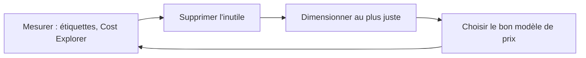

La facture de la boutique a doublé en un an sans que le trafic bouge. En cherchant, on trouve : des volumes de disque orphelins, des instances de test allumées le week-end, dix ans de versions d'objets jamais purgées et une table de base de données dimensionnée pour un pic qui n'a lieu qu'une fois par an. Aucune de ces dépenses n'est une erreur technique ; ce sont des **décisions qui n'ont pas été revues**.

## Quatre leviers



L'ordre compte : s'engager trois ans sur une instance deux fois trop grosse, c'est payer longtemps une erreur.

## Le calcul

| Profil de charge | Option |
| --- | --- |
| Régulière, connue, sur un an ou plus | **Savings Plans** (*Compute* : souples sur la famille, la région, et valables pour Fargate et Lambda ; *EC2 Instance* : liés à une famille dans une région, réduction plus forte) ou **instances réservées** |
| Tolérante aux interruptions : lots, intégration continue, nœuds sans état | **Instances Spot** |
| Imprévisible ou de courte durée | **À la demande** |
| Rare et courte, pilotée par des événements | **Lambda** |
| Environnements de test | Extinction planifiée hors des heures de travail ; l'**hibernation** garde la mémoire d'une instance sur son disque pour un redémarrage rapide |

Les combinaisons gagnantes : une **base** de capacité couverte par un Savings Plan, les **pics** à la demande, et tout ce qui supporte l'interruption en Spot. Un groupe Auto Scaling sait mélanger ces options.

Le **juste dimensionnement** s'appuie sur des mesures : **AWS Compute Optimizer** recommande des types d'instances d'après l'usage observé. Les processeurs **Graviton** (architecture ARM) offrent souvent un meilleur rapport prix-performance quand l'application les supporte.

## Le stockage

Un cycle de vie complet traite **trois** populations que l'on oublie facilement :

| Population | Règle |
| --- | --- |
| Les objets courants qui vieillissent | Transitions vers Standard-IA, puis les classes Glacier |
| Les **anciennes versions** (bucket versionné) | `NoncurrentVersionExpiration` : les supprimer après un délai |
| Les **envois en plusieurs parties abandonnés** | `AbortIncompleteMultipartUpload` : leurs morceaux, invisibles dans les listes, sont facturés tant qu'on ne les purge pas |

Rappels utiles : Standard-IA et One Zone-IA ont une durée minimale facturée de 30 jours, les classes Glacier de 90 ou 180 jours ; ces classes facturent la récupération. Pour un accès imprévisible, **S3 Intelligent-Tiering** déplace les objets tout seul. Côté EBS : passer de gp2 à gp3, supprimer les volumes non attachés (après un instantané si un doute subsiste) et purger les vieux instantanés.

## Les bases de données

| Situation | Choix économique |
| --- | --- |
| Charge régulière sur DynamoDB | Mode **provisionné** avec mise à l'échelle automatique |
| Charge imprévisible ou faible | Mode **à la demande** |
| Base relationnelle utilisée par intermittence | **Aurora Serverless**, dont la capacité suit la charge |
| Base RDS régulière | Instances de base de données **réservées** |
| Données éphémères (sessions, paniers) | Une **durée de vie** (TTL) DynamoDB : les éléments expirés sont supprimés sans frais d'écriture |
| Lectures répétées et coûteuses | Un **cache**, moins cher qu'une base plus grosse |

## Le réseau

- Une **passerelle NAT** est facturée à l'heure et au gigaoctet traité. Les **points de terminaison de passerelle** (S3, DynamoDB) sont gratuits : y faire passer le trafic vers ces services allège la NAT.
- Le trafic **entre zones** et **entre régions** est facturé : garde ensemble ce qui échange beaucoup, sans sacrifier la disponibilité.
- **CloudFront** réduit le volume servi par l'origine, et son tarif de sortie est souvent plus bas que celui d'une sortie directe.
- En test, **une** passerelle NAT partagée suffit ; en production, une par zone.

## Mesurer et répartir

| Outil | Usage |
| --- | --- |
| **Étiquettes d'allocation des coûts** | Ventiler la facture par projet, équipe, environnement |
| **AWS Cost Explorer** | Analyser, prévoir, repérer les ressources sous-utilisées |
| **AWS Budgets** | Alerter sur un seuil, y compris **par étiquette** |
| **AWS Cost and Usage Report** | Le détail ligne à ligne, à interroger avec Athena |
| **AWS Trusted Advisor** | Signaler les ressources inactives et les réservations sous-utilisées |
| **S3 Storage Lens** | Vue d'ensemble de l'usage du stockage S3 |

Un bucket peut être réglé en **paiement par le demandeur** (*Requester Pays*) : c'est celui qui télécharge qui paie le transfert, utile pour partager de gros jeux de données.

## Les commandes du labo

Le cycle de vie complet du bucket `asso-photos` :

```json
{
  "Rules": [
    {
      "ID": "cycle-complet",
      "Status": "Enabled",
      "Filter": {"Prefix": ""},
      "Transitions": [
        {"Days": 30, "StorageClass": "STANDARD_IA"},
        {"Days": 90, "StorageClass": "GLACIER_IR"},
        {"Days": 365, "StorageClass": "DEEP_ARCHIVE"}
      ],
      "NoncurrentVersionExpiration": {"NoncurrentDays": 30},
      "AbortIncompleteMultipartUpload": {"DaysAfterInitiation": 7}
    }
  ]
}
```

- `Filter` avec un préfixe vide : la règle vaut pour tout le bucket.
- Trois transitions successives ; les délais respectent les durées minimales de chaque classe.
- Les deux dernières lignes purgent les anciennes versions et les envois abandonnés.

Changer le mode de capacité d'une table et activer la durée de vie des éléments :

```bash
aws dynamodb update-table --table-name sessions --billing-mode PAY_PER_REQUEST
aws dynamodb update-time-to-live --table-name sessions \
  --time-to-live-specification Enabled=true,AttributeName=expire
```

Repérer les volumes non attachés, dont l'état est `available` :

```shell run
aws ec2 describe-volumes --filters Name=status,Values=available --query 'Volumes[].[VolumeId,Size,VolumeType,Tags[0].Value]' --output text
```

Un budget limité à un projet filtre sur une étiquette. La valeur s'écrit `user:<clé>$<valeur>` :

```json
{
  "BudgetName": "boutique",
  "BudgetLimit": {"Amount": "30", "Unit": "USD"},
  "TimeUnit": "MONTHLY",
  "BudgetType": "COST",
  "CostFilters": {"TagKeyValue": ["user:projet$boutique"]}
}
```

:::warning Ce qui diffère du vrai AWS
L'émulateur ne calcule **aucun coût** : il enregistre tes règles, tes étiquettes et ton budget, sans pouvoir te montrer l'économie réalisée. Aucune transition de classe ni expiration n'a lieu pendant le labo. Les options d'achat (Savings Plans, instances réservées, Spot), Cost Explorer et Compute Optimizer n'y existent pas : ils se travaillent par la lecture et les questions.
:::

:::tip Le mot qui désigne la réponse
« Le plus économique » pour une charge **interruptible** → Spot. Pour une charge **régulière sur trois ans** avec changement possible de famille d'instances → Compute Savings Plan. Pour des données **rarement lues mais à récupérer immédiatement** → Standard-IA ou Glacier Instant Retrieval, pas Glacier Flexible Retrieval.
:::

## Entraîne-toi

Tu fais le ménage dans le compte de la boutique : un cycle de vie complet, une table ramenée à un mode de capacité adapté, un volume orphelin archivé puis supprimé, et un budget propre au projet.

```json file=cycle-complet.json
{
  "Rules": [
    {
      "ID": "cycle-complet",
      "Status": "Enabled",
      "Filter": {"Prefix": ""},
      "Transitions": [
        {"Days": 30, "StorageClass": "STANDARD_IA"},
        {"Days": 90, "StorageClass": "GLACIER_IR"},
        {"Days": 365, "StorageClass": "DEEP_ARCHIVE"}
      ],
      "NoncurrentVersionExpiration": {"NoncurrentDays": 30},
      "AbortIncompleteMultipartUpload": {"DaysAfterInitiation": 7}
    }
  ]
}
```

```json file=budget-boutique.json
{
  "BudgetName": "boutique",
  "BudgetLimit": {"Amount": "30", "Unit": "USD"},
  "TimeUnit": "MONTHLY",
  "BudgetType": "COST",
  "CostFilters": {"TagKeyValue": ["user:projet$boutique"]}
}
```

:::lab
engine: real
intro: |
  Sont en place : le bucket versionné `asso-photos`, la table DynamoDB `sessions` (mode provisionné, surdimensionnée) et un volume EBS non attaché étiqueté `Name=ancien-test`. Ton compte fictif porte le numéro `000000000000`.
commands:
  - demarrer-aws
  - 'aws s3api head-bucket --bucket asso-photos 2>/dev/null || { aws s3 mb s3://asso-photos && aws s3api put-bucket-versioning --bucket asso-photos --versioning-configuration Status=Enabled; }'
  - 'aws dynamodb describe-table --table-name sessions >/dev/null 2>&1 || aws dynamodb create-table --table-name sessions --attribute-definitions AttributeName=id,AttributeType=S --key-schema AttributeName=id,KeyType=HASH --billing-mode PROVISIONED --provisioned-throughput ReadCapacityUnits=100,WriteCapacityUnits=100'
  - 'test -e "$HOME/.volume-prepare" || { aws ec2 create-volume --availability-zone eu-west-3a --size 50 --volume-type gp2 --tag-specifications "ResourceType=volume,Tags=[{Key=Name,Value=ancien-test}]" > /dev/null && touch "$HOME/.volume-prepare"; }'
steps:
  - text: "Écris `cycle-complet.json` et applique-le au bucket `asso-photos`"
    hint: "aws s3api put-bucket-lifecycle-configuration --bucket asso-photos --lifecycle-configuration file://cycle-complet.json"
    checks:
      - output-contains:
          - "aws s3api get-bucket-lifecycle-configuration --bucket asso-photos --query 'Rules[0].Transitions[].[Days,StorageClass]' --output text"
          - '^365\s+DEEP_ARCHIVE$'
      - output-contains:
          - "aws s3api get-bucket-lifecycle-configuration --bucket asso-photos --query 'Rules[0].[NoncurrentVersionExpiration.NoncurrentDays,AbortIncompleteMultipartUpload.DaysAfterInitiation]' --output text"
          - '^30\s+7$'
    solution:
      - write:
          cycle-complet.json: |
            {
              "Rules": [
                {
                  "ID": "cycle-complet",
                  "Status": "Enabled",
                  "Filter": {"Prefix": ""},
                  "Transitions": [
                    {"Days": 30, "StorageClass": "STANDARD_IA"},
                    {"Days": 90, "StorageClass": "GLACIER_IR"},
                    {"Days": 365, "StorageClass": "DEEP_ARCHIVE"}
                  ],
                  "NoncurrentVersionExpiration": {"NoncurrentDays": 30},
                  "AbortIncompleteMultipartUpload": {"DaysAfterInitiation": 7}
                }
              ]
            }
      - aws s3api put-bucket-lifecycle-configuration --bucket asso-photos --lifecycle-configuration file://cycle-complet.json
  - text: "La table `sessions` a une charge faible et irrégulière : passe-la en mode de capacité **à la demande**"
    checks:
      - output-contains:
          - 'aws dynamodb describe-table --table-name sessions --query Table.BillingModeSummary.BillingMode --output text'
          - '^PAY_PER_REQUEST$'
    solution:
      - aws dynamodb update-table --table-name sessions --billing-mode PAY_PER_REQUEST
  - text: "Les sessions expirées ne servent plus : active la durée de vie (TTL) de la table sur l'attribut `expire`"
    checks:
      - output-contains:
          - "aws dynamodb describe-time-to-live --table-name sessions --query 'TimeToLiveDescription.[TimeToLiveStatus,AttributeName]' --output text"
          - '^ENABLED\s+expire$'
    solution:
      - aws dynamodb update-time-to-live --table-name sessions --time-to-live-specification Enabled=true,AttributeName=expire
  - text: "Le volume `ancien-test` n'est attaché à rien. Par précaution, prends-en un instantané étiqueté `Name=ancien-test-archive`, puis supprime le volume"
    hint: "aws ec2 create-snapshot --volume-id … --tag-specifications 'ResourceType=snapshot,Tags=[{Key=Name,Value=ancien-test-archive}]' ; puis aws ec2 delete-volume --volume-id …"
    checks:
      - output-contains:
          - "aws ec2 describe-snapshots --filters Name=tag:Name,Values=ancien-test-archive --query 'Snapshots[].State' --output text"
          - '\bcompleted\b'
      - output-contains:
          - "aws ec2 describe-volumes --filters Name=tag:Name,Values=ancien-test --query 'length(Volumes)' --output text"
          - '^0$'
    solution:
      - "V=$(aws ec2 describe-volumes --filters Name=tag:Name,Values=ancien-test --query 'Volumes[0].VolumeId' --output text); aws ec2 create-snapshot --volume-id $V --description 'Archive avant suppression' --tag-specifications 'ResourceType=snapshot,Tags=[{Key=Name,Value=ancien-test-archive}]' && aws ec2 delete-volume --volume-id $V"
  - text: "Étiquette le bucket `asso-photos` et la table `sessions` avec `projet=boutique`"
    hint: "aws s3api put-bucket-tagging … ; aws dynamodb tag-resource --resource-arn arn:aws:dynamodb:eu-west-3:000000000000:table/sessions --tags Key=projet,Value=boutique"
    checks:
      - output-contains:
          - 'aws s3api get-bucket-tagging --bucket asso-photos --output text'
          - 'projet\s+boutique'
      - output-contains:
          - "aws dynamodb list-tags-of-resource --resource-arn arn:aws:dynamodb:eu-west-3:000000000000:table/sessions --query 'Tags[].[Key,Value]' --output text"
          - '^projet\s+boutique$'
    solution:
      - "aws s3api put-bucket-tagging --bucket asso-photos --tagging 'TagSet=[{Key=projet,Value=boutique}]'"
      - aws dynamodb tag-resource --resource-arn arn:aws:dynamodb:eu-west-3:000000000000:table/sessions --tags Key=projet,Value=boutique
  - text: "Écris `budget-boutique.json` et crée le budget `boutique`, limité aux ressources étiquetées `projet=boutique`"
    hint: "aws budgets create-budget --account-id 000000000000 --budget file://budget-boutique.json"
    checks:
      - output-contains:
          - "aws budgets describe-budget --account-id 000000000000 --budget-name boutique --query 'Budget.CostFilters.TagKeyValue[0]' --output text"
          - '^user:projet\$boutique$'
    solution:
      - write:
          budget-boutique.json: |
            {
              "BudgetName": "boutique",
              "BudgetLimit": {"Amount": "30", "Unit": "USD"},
              "TimeUnit": "MONTHLY",
              "BudgetType": "COST",
              "CostFilters": {"TagKeyValue": ["user:projet$boutique"]}
            }
      - aws budgets create-budget --account-id 000000000000 --budget file://budget-boutique.json
:::

## Vérifie tes acquis

:::quiz
Une application web tourne en permanence sur au moins quatre instances, avec des pics qui montent à dix. L'équipe prévoit de changer de famille d'instances dans l'année. Quelle combinaison est la plus économique ?

- [ ] Dix instances réservées Standard sur trois ans
- [x] Un Compute Savings Plan couvrant la base de quatre instances, et les pics à la demande ou en Spot
- [ ] Tout à la demande, pour garder la souplesse
- [ ] Quatre hôtes dédiés

> On engage seulement la base stable, avec un plan qui suit les changements de famille ; le reste varie avec la charge. Réserver dix instances ferait payer une capacité inutilisée la plupart du temps.
:::

:::quiz
Un bucket versionné reçoit de gros fichiers envoyés en plusieurs parties, et sa facture dépasse ce que justifient les objets visibles. Que faut-il ajouter au cycle de vie ?

- [ ] Une transition des objets courants vers S3 Standard
- [ ] La réplication vers une autre région
- [x] L'expiration des anciennes versions et l'abandon des envois en plusieurs parties incomplets
- [ ] Le paiement par le demandeur

> Les anciennes versions et les morceaux d'envois abandonnés sont facturés sans apparaître dans une liste simple du bucket. Deux règles de cycle de vie les purgent.
:::

:::quiz
Des instances d'un sous-réseau privé échangent beaucoup avec DynamoDB, et la ligne « passerelle NAT » de la facture grimpe. Que proposer ?

- [ ] Une seconde passerelle NAT pour répartir le trafic
- [ ] Déplacer les instances dans un sous-réseau public
- [ ] Remplacer DynamoDB par une base sur EC2
- [x] Un point de terminaison de passerelle pour DynamoDB dans le VPC

> Le point de terminaison de passerelle est gratuit et fait sortir ce trafic de la passerelle NAT, facturée au gigaoctet.
:::

:::quiz
Une base relationnelle de rapports n'est sollicitée que quelques heures par semaine, de façon imprévisible. Quelle option réduit le coût sans intervention manuelle ?

- [ ] Une instance RDS réservée sur trois ans
- [x] Aurora Serverless, dont la capacité suit la charge
- [ ] Un déploiement Multi-AZ avec deux instances de secours
- [ ] Un réplica en lecture dans une autre région

> Une capacité qui s'ajuste à la charge évite de payer en permanence une instance dimensionnée pour quelques heures d'usage.
:::
