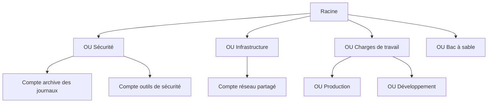
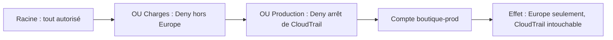

La fédération à laquelle appartient ton association compte quarante équipes, chacune avec ses applications. Tout tient dans **un seul** compte AWS : un stagiaire a supprimé par erreur une base de production en nettoyant « son » environnement de test, et personne ne sait répartir la facture. La première décision d'architecture, à cette échelle, n'est pas technique : c'est **où passent les frontières**.

## Pourquoi plusieurs comptes

Un compte AWS est la frontière la plus solide qu'offre AWS :

- **isolation** : une erreur ou une compromission reste dans son compte (le « rayon d'explosion » est borné) ;
- **quotas** : les limites de service s'appliquent par compte ; une équipe n'épuise pas celles d'une autre ;
- **facturation** : le coût de chaque compte est lisible sans étiquette ;
- **délégation** : une équipe peut être administratrice de **son** compte sans l'être des autres.

## Une structure type

**AWS Organizations** regroupe les comptes sous un **compte de gestion** et les range dans des **unités d'organisation** (OU), elles-mêmes imbriquées sous une **racine**.



| Élément | Rôle |
| --- | --- |
| **Compte de gestion** | Crée l'organisation, paie la facture. **Aucune charge de travail** n'y tourne, et très peu de personnes y accèdent. |
| **Archive des journaux** | Reçoit les journaux de tous les comptes (CloudTrail, Config) dans des buckets que les équipes ne peuvent pas modifier. |
| **Outils de sécurité** | Administration déléguée de GuardDuty, Security Hub, IAM Access Analyzer ; rôles d'audit en lecture vers tous les comptes. |
| **Réseau partagé** | Transit Gateway, liaisons Direct Connect, sous-réseaux partagés avec les autres comptes. |
| **Production / Développement** | Un compte par application et par environnement, rangé dans l'OU qui porte les garde-fous adaptés. |
| **Bac à sable** | Expérimentation, avec des budgets stricts et sans accès au réseau de l'entreprise. |

On range les comptes par **nature de garde-fous à appliquer**, pas par organigramme : une réorganisation d'équipes ne doit pas obliger à déplacer des comptes.

## Les politiques de contrôle des services

Une **SCP** se rattache à la racine, à une OU ou à un compte. Elle ne donne aucun droit : elle **plafonne** ce que les politiques IAM des comptes concernés peuvent accorder.

### L'héritage

Pour qu'une action soit possible dans un compte, il faut qu'elle soit **autorisée à chaque niveau**, de la racine jusqu'au compte ; un `Deny` à n'importe quel niveau l'interdit définitivement.



### Deux stratégies

| | Liste d'interdictions (*deny list*) | Liste d'autorisations (*allow list*) |
| --- | --- | --- |
| Principe | On garde la politique `FullAWSAccess` (tout est permis) et on ajoute des `Deny` ciblés | On retire `FullAWSAccess` et on n'autorise que les services voulus |
| Entretien | Faible : rien à faire quand AWS sort un service | Élevé : chaque nouveau service doit être ajouté |
| Usage | Le cas général | Environnements très réglementés |

### Ce qu'une SCP ne fait pas

- elle ne s'applique **pas au compte de gestion** : raison de plus pour n'y rien héberger ;
- elle ne concerne pas les rôles liés aux services (ceux que les services AWS utilisent pour fonctionner) ;
- elle s'applique en revanche à l'**utilisateur racine** des comptes membres.

Voici une SCP classique, qui limite une OU à deux régions européennes. `NotAction` exclut de l'interdiction les services **globaux**, qui ne fonctionneraient plus si on les restreignait à une région :

```json
{
  "Version": "2012-10-17",
  "Statement": [
    {
      "Sid": "RegionsEuropeennesSeulement",
      "Effect": "Deny",
      "NotAction": ["iam:*", "organizations:*", "sts:*", "cloudfront:*", "route53:*", "support:*"],
      "Resource": "*",
      "Condition": {
        "StringNotEquals": {"aws:RequestedRegion": ["eu-west-1", "eu-west-3"]}
      }
    }
  ]
}
```

D'autres types de politiques d'organisation existent : les **politiques d'étiquettes** (*tag policies*), qui normalisent les clés et les valeurs d'étiquettes, et les **politiques de sauvegarde**, qui imposent des plans AWS Backup.

## Automatiser et gouverner

- **AWS Control Tower** déploie cette structure toute faite (une *landing zone*) : comptes d'archive et d'audit, connexion par IAM Identity Center, et des **contrôles** de trois natures : *préventifs* (des SCP), *détectifs* (des règles AWS Config) et *proactifs* (des vérifications avant création des ressources). Son *Account Factory* crée des comptes conformes à la demande.
- L'**administration déléguée** confie la gestion d'un service à l'échelle de l'organisation (GuardDuty, Security Hub, Config, StackSets…) à un compte membre, pour ne pas travailler dans le compte de gestion.
- **AWS RAM** (*Resource Access Manager*) partage des ressources entre comptes d'une organisation : des sous-réseaux d'un VPC central, un Transit Gateway, des règles de résolution DNS.
- **CloudFormation StackSets**, avec les autorisations gérées par le service, déploie un même modèle dans tous les comptes d'une OU, y compris ceux qui y entreront plus tard.

### Journaliser pour toute l'organisation

Un **trail d'organisation** CloudTrail, créé une fois, enregistre l'activité de **tous** les comptes dans un bucket du compte d'archive. Les comptes membres voient le trail mais ne peuvent ni le modifier ni le supprimer. Un **agrégateur** AWS Config donne de même une vue unique de la conformité.

## Les commandes du labo

L'organisation du labo existe déjà ; ton compte par défaut en est le compte de gestion :

```shell run
aws organizations describe-organization --query 'Organization.[Id,FeatureSet,MasterAccountId]' --output text
aws organizations list-roots --query 'Roots[0].Id' --output text
```

Une OU se crée sous un parent (la racine ou une autre OU) ; un compte se crée à la racine, puis se déplace :

```bash
RACINE=$(aws organizations list-roots --query 'Roots[0].Id' --output text)
aws organizations create-organizational-unit --parent-id $RACINE --name Securite
aws organizations create-account --email journaux@asso.example --account-name journaux
aws organizations move-account --account-id <id du compte> \
  --source-parent-id $RACINE --destination-parent-id <id de l OU>
```

Une SCP se crée à partir d'un fichier, puis se rattache à une cible :

```bash
aws organizations create-policy --name regions-europe --type SERVICE_CONTROL_POLICY \
  --description "Regions europeennes seulement" --content file://regions-europe.json
aws organizations attach-policy --policy-id <p-…> --target-id <id de l OU>
```

:::warning Ce qui diffère du vrai AWS
L'émulateur **enregistre** l'arborescence, les comptes et les politiques, mais il **n'applique pas** les SCP : un compte de l'OU `Charges` y pourrait toujours agir hors d'Europe. Le labo vérifie donc ta structure et tes rattachements, pas leur effet. Les comptes créés ici sont de simples fiches, créées instantanément ; sur le vrai AWS, la création d'un compte prend quelques minutes, et **fermer** un compte est une opération lourde. Control Tower, l'administration déléguée, RAM et StackSets ne sont pas émulés.
:::

:::tip Une SCP se teste avant de se généraliser
Rattache d'abord une nouvelle SCP à une OU de test contenant un compte sans enjeu. Une SCP trop large rattachée à la racine peut bloquer d'un coup toute l'organisation, équipes d'exploitation comprises.
:::

## Entraîne-toi

Tu structures l'organisation de la fédération : une OU `Securite` avec le compte d'archive des journaux, une OU `Charges` contenant `Production`, le compte de la boutique en production, et une SCP qui limite les charges de travail à l'Europe.

```json file=regions-europe.json
{
  "Version": "2012-10-17",
  "Statement": [
    {
      "Sid": "RegionsEuropeennesSeulement",
      "Effect": "Deny",
      "NotAction": ["iam:*", "organizations:*", "sts:*", "cloudfront:*", "route53:*", "support:*"],
      "Resource": "*",
      "Condition": {
        "StringNotEquals": {"aws:RequestedRegion": ["eu-west-1", "eu-west-3"]}
      }
    }
  ]
}
```

:::lab
engine: real
intro: |
  Ton compte `000000000000` est le compte de gestion d'une organisation encore vide. Les étapes retrouvent tes unités d'organisation, tes comptes et ta politique par leur **nom** : respecte `Securite`, `Charges`, `Production`, `journaux`, `boutique-prod` et `regions-europe`.
commands:
  - demarrer-aws
steps:
  - text: "Sous la racine, crée les unités d'organisation `Securite` et `Charges` ; puis, **dans** `Charges`, l'unité `Production`"
    checks:
      - output-contains:
          - "aws organizations list-organizational-units-for-parent --parent-id \"$(aws organizations list-roots --query 'Roots[0].Id' --output text)\" --query 'OrganizationalUnits[].Name' --output text | tr '\\t' '\\n' | sort | tr '\\n' ' '"
          - 'Charges Securite'
      - output-contains:
          - "aws organizations list-organizational-units-for-parent --parent-id \"$(aws organizations list-organizational-units-for-parent --parent-id \"$(aws organizations list-roots --query 'Roots[0].Id' --output text)\" --query \"OrganizationalUnits[?Name=='Charges'].Id\" --output text)\" --query 'OrganizationalUnits[].Name' --output text"
          - '^Production$'
    solution:
      - "R=$(aws organizations list-roots --query 'Roots[0].Id' --output text); aws organizations create-organizational-unit --parent-id $R --name Securite && C=$(aws organizations create-organizational-unit --parent-id $R --name Charges --query OrganizationalUnit.Id --output text) && aws organizations create-organizational-unit --parent-id $C --name Production"
  - text: "Crée le compte `journaux` (adresse `journaux@asso.example`) et déplace-le dans l'unité `Securite`"
    after: [1]
    checks:
      - output-contains:
          - "aws organizations list-accounts-for-parent --parent-id \"$(aws organizations list-organizational-units-for-parent --parent-id \"$(aws organizations list-roots --query 'Roots[0].Id' --output text)\" --query \"OrganizationalUnits[?Name=='Securite'].Id\" --output text)\" --query 'Accounts[].Name' --output text"
          - '\bjournaux\b'
    solution:
      - "R=$(aws organizations list-roots --query 'Roots[0].Id' --output text); S=$(aws organizations list-organizational-units-for-parent --parent-id $R --query \"OrganizationalUnits[?Name=='Securite'].Id\" --output text); A=$(aws organizations create-account --email journaux@asso.example --account-name journaux --query CreateAccountStatus.AccountId --output text); aws organizations move-account --account-id $A --source-parent-id $R --destination-parent-id $S"
  - text: "Crée le compte `boutique-prod` (adresse `boutique-prod@asso.example`) et déplace-le dans l'unité `Production`"
    after: [1]
    checks:
      - output-contains:
          - "aws organizations list-accounts-for-parent --parent-id \"$(aws organizations list-organizational-units-for-parent --parent-id \"$(aws organizations list-organizational-units-for-parent --parent-id \"$(aws organizations list-roots --query 'Roots[0].Id' --output text)\" --query \"OrganizationalUnits[?Name=='Charges'].Id\" --output text)\" --query \"OrganizationalUnits[?Name=='Production'].Id\" --output text)\" --query 'Accounts[].Name' --output text"
          - '\bboutique-prod\b'
    solution:
      - "R=$(aws organizations list-roots --query 'Roots[0].Id' --output text); C=$(aws organizations list-organizational-units-for-parent --parent-id $R --query \"OrganizationalUnits[?Name=='Charges'].Id\" --output text); P=$(aws organizations list-organizational-units-for-parent --parent-id $C --query \"OrganizationalUnits[?Name=='Production'].Id\" --output text); A=$(aws organizations create-account --email boutique-prod@asso.example --account-name boutique-prod --query CreateAccountStatus.AccountId --output text); aws organizations move-account --account-id $A --source-parent-id $R --destination-parent-id $P"
  - text: "Écris `regions-europe.json` et crée la politique de contrôle des services `regions-europe`"
    hint: "aws organizations create-policy --name regions-europe --type SERVICE_CONTROL_POLICY --description \"Regions europeennes seulement\" --content file://regions-europe.json"
    checks:
      - output-contains:
          - "aws organizations describe-policy --policy-id \"$(aws organizations list-policies --filter SERVICE_CONTROL_POLICY --query \"Policies[?Name=='regions-europe'].Id\" --output text)\" --query Policy.Content --output text"
          - 'aws:RequestedRegion'
      - output-contains:
          - "aws organizations describe-policy --policy-id \"$(aws organizations list-policies --filter SERVICE_CONTROL_POLICY --query \"Policies[?Name=='regions-europe'].Id\" --output text)\" --query Policy.Content --output text"
          - '"NotAction"'
    solution:
      - write:
          regions-europe.json: |
            {
              "Version": "2012-10-17",
              "Statement": [
                {
                  "Sid": "RegionsEuropeennesSeulement",
                  "Effect": "Deny",
                  "NotAction": ["iam:*", "organizations:*", "sts:*", "cloudfront:*", "route53:*", "support:*"],
                  "Resource": "*",
                  "Condition": {
                    "StringNotEquals": {"aws:RequestedRegion": ["eu-west-1", "eu-west-3"]}
                  }
                }
              ]
            }
      - 'aws organizations create-policy --name regions-europe --type SERVICE_CONTROL_POLICY --description "Regions europeennes seulement" --content file://regions-europe.json'
  - text: "Rattache la politique `regions-europe` à l'unité `Charges` : elle vaudra, par héritage, pour `Production` et ses comptes. Garde ensuite la liste des cibles : `aws organizations list-targets-for-policy --policy-id <id> > cibles.json`"
    after: [1, 4]
    checks:
      - output-contains:
          - "aws organizations list-policies-for-target --target-id \"$(aws organizations list-organizational-units-for-parent --parent-id \"$(aws organizations list-roots --query 'Roots[0].Id' --output text)\" --query \"OrganizationalUnits[?Name=='Charges'].Id\" --output text)\" --filter SERVICE_CONTROL_POLICY --query 'Policies[].Name' --output text"
          - '\bregions-europe\b'
      - env-file-contains: [cibles.json, '"Name": "Charges"']
    solution:
      - "P=$(aws organizations list-policies --filter SERVICE_CONTROL_POLICY --query \"Policies[?Name=='regions-europe'].Id\" --output text); C=$(aws organizations list-organizational-units-for-parent --parent-id $(aws organizations list-roots --query 'Roots[0].Id' --output text) --query \"OrganizationalUnits[?Name=='Charges'].Id\" --output text); aws organizations attach-policy --policy-id $P --target-id $C && aws organizations list-targets-for-policy --policy-id $P > cibles.json"
:::

## Vérifie tes acquis

:::quiz
Une SCP rattachée à la racine interdit `s3:DeleteBucket`. Une autre, rattachée à l'OU Production, autorise explicitement `s3:*`. Un administrateur d'un compte de Production peut-il supprimer un bucket ?

- [ ] Oui : la politique la plus proche du compte l'emporte
- [ ] Oui, s'il utilise l'utilisateur racine du compte
- [x] Non : un `Deny` à n'importe quel niveau de la hiérarchie interdit l'action
- [ ] Non, mais seulement jusqu'à ce que la SCP de la racine soit détachée de l'OU

> Une action doit être autorisée à chaque niveau, et une interdiction explicite, où qu'elle soit, l'emporte. La proximité ne joue aucun rôle, et l'utilisateur racine d'un compte membre est soumis aux SCP.
:::

:::quiz
Une organisation veut interdire quelques actions sensibles dans tous ses comptes, sans avoir à modifier ses politiques chaque fois qu'AWS lance un service. Quelle stratégie de SCP convient ?

- [x] Une liste d'interdictions : conserver `FullAWSAccess` et ajouter des `Deny` ciblés
- [ ] Une liste d'autorisations : retirer `FullAWSAccess` et énumérer les services permis
- [ ] Une limite d'autorisations sur chaque rôle de chaque compte
- [ ] Une politique d'étiquettes

> La liste d'interdictions laisse passer tout ce qui n'est pas explicitement interdit, nouveaux services compris : c'est la stratégie la moins coûteuse à entretenir.
:::

:::quiz
L'équipe de sécurité doit administrer Amazon GuardDuty pour tous les comptes, sans se connecter au compte de gestion de l'organisation. Que mettre en place ?

- [ ] Un utilisateur IAM partagé dans le compte de gestion
- [ ] Une SCP qui autorise GuardDuty dans le compte de sécurité
- [ ] Un appairage de VPC vers chaque compte
- [x] L'administration déléguée de GuardDuty au compte des outils de sécurité

> L'administration déléguée confie la gestion d'un service, à l'échelle de l'organisation, à un compte membre : on ne travaille pas dans le compte de gestion.
:::

:::quiz
Tous les comptes, présents et futurs, d'une OU doivent recevoir le même rôle d'audit et les mêmes règles de conformité, sans intervention à chaque nouveau compte. Quel mécanisme répond le mieux à ce besoin ?

- [ ] Un script lancé à la main dans chaque compte
- [ ] Une SCP contenant la définition du rôle
- [x] Un StackSet CloudFormation à autorisations gérées par le service, ciblant l'OU avec déploiement automatique
- [ ] AWS RAM, en partageant le rôle

> Un StackSet ciblant une OU déploie le modèle dans ses comptes et, avec le déploiement automatique, dans ceux qui la rejoignent. Une SCP ne crée aucune ressource, et RAM ne partage pas de rôles IAM.
:::
