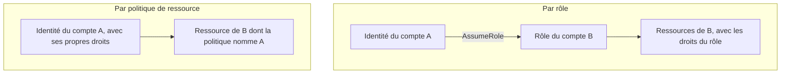

Un prestataire de supervision demande « un accès à votre compte ». Chaque compte de la fédération doit déposer ses journaux dans un bucket central, sans pouvoir lire ceux des autres. Les équipes veulent envoyer leurs alertes dans une file commune. Trois besoins, trois comptes différents qui se parlent : à chaque fois, la question est **qui endosse quoi**, ou **quelle ressource fait confiance à qui**.

## Deux mécanismes



| | Rôle inter-comptes | Politique de ressource |
| --- | --- | --- |
| L'appelant agit… | **Avec l'identité du rôle** : il abandonne ses propres droits le temps de la session | **Avec sa propre identité** : il garde ses droits dans son compte |
| Disponible pour | Tous les services | Les services qui ont une politique de ressource : S3, SQS, SNS, KMS, Lambda, Secrets Manager, bus EventBridge… |
| Bien adapté à | Un accès large ou interactif (audit, exploitation) | Un flux précis entre deux services (déposer des journaux, envoyer un message) |
| Piège | L'appelant ne peut pas, dans la même opération, lire chez lui et écrire chez l'autre | Les objets S3 déposés par un autre compte : mieux vaut imposer que le propriétaire du bucket en soit propriétaire |

Le second point de la première ligne décide souvent de la réponse : pour **copier** des données d'un bucket de A vers un bucket de B, l'appelant a besoin des deux droits **en même temps**, ce que seule une politique de ressource permet sans étape intermédiaire.

Dans les deux cas, entre comptes, **les deux côtés** doivent autoriser : la ressource (ou la politique de confiance) nomme l'autre compte, et le compte appelant accorde l'action à son identité.

## Ouvrir un rôle à un tiers

Un prestataire sert de nombreux clients depuis **son** compte AWS. Si tu lui ouvres un rôle en te contentant de faire confiance à son compte, un autre client du prestataire pourrait lui faire endosser **ton** rôle en lui donnant ton ARN : c'est le problème de l'**adjoint désorienté** (*confused deputy*).

La parade est l'**identifiant externe** : une valeur propre à ta relation avec le prestataire, exigée par la politique de confiance.

```json
{
  "Version": "2012-10-17",
  "Statement": [
    {
      "Effect": "Allow",
      "Principal": {"AWS": "arn:aws:iam::222222222222:root"},
      "Action": "sts:AssumeRole",
      "Condition": {"StringEquals": {"sts:ExternalId": "asso-7f3a"}}
    }
  ]
}
```

Le prestataire doit fournir `asso-7f3a` à chaque appel. Comme il associe cette valeur à **ton** dossier client, il ne l'enverra pas pour le compte d'un autre.

## Restreindre un partage

Une politique de ressource se resserre de trois façons :

- par l'**action** : `sqs:SendMessage` sans `sqs:ReceiveMessage` (on dépose, on ne lit pas) ;
- par la **ressource** : un préfixe propre à chaque compte, `AWSLogs/222222222222/*` ;
- par une **condition** : `aws:PrincipalOrgID` limite l'accès aux identités de **ton organisation**, sans énumérer les comptes ; `aws:SourceArn` et `aws:SourceAccount` limitent un service à une ressource donnée.

Pour un bucket d'archive de journaux, on combine le tout :

```json
{
  "Version": "2012-10-17",
  "Statement": [
    {
      "Sid": "DepotParCompte",
      "Effect": "Allow",
      "Principal": {"AWS": "arn:aws:iam::222222222222:root"},
      "Action": "s3:PutObject",
      "Resource": "arn:aws:s3:::journaux-centraux/AWSLogs/222222222222/*"
    }
  ]
}
```

Le compte `222222222222` peut **déposer** sous son préfixe. Il ne peut ni lister le bucket, ni relire, ni écrire sous le préfixe d'un autre.

## Les personnes : fédération et Identity Center

Pour les humains, on ne crée pas d'utilisateur par compte :

- **AWS IAM Identity Center** relie une source d'identités (son propre annuaire, Active Directory, ou un fournisseur externe par SAML et SCIM) à des **jeux d'autorisations** attribués par compte. Chaque connexion fournit des identifiants temporaires.
- La **fédération** directe avec IAM (SAML 2.0 ou OpenID Connect) reste utile pour des cas particuliers : par exemple, un outil d'intégration continue externe qui endosse un rôle par OIDC, sans clé d'accès à stocker.
- Le **contrôle d'accès par attributs** (ABAC) s'appuie sur des étiquettes : une seule politique autorise « les ressources dont l'étiquette `projet` égale celle de l'identité », au lieu d'une politique par projet.

## Vérifier et partager à l'échelle

- **IAM Access Analyzer** repère les ressources **partagées hors de ton organisation** (un bucket, un rôle, une clé ouverts à un compte extérieur), signale les accès inutilisés et valide les politiques.
- **AWS RAM** partage des ressources d'infrastructure entre comptes : sous-réseaux, Transit Gateway, règles DNS.
- Une clé **KMS** se partage par sa politique de clé ; l'autre compte doit en plus s'accorder le droit de l'utiliser. C'est le préalable au partage d'un instantané chiffré ou d'une image.

## Les commandes du labo

Deux comptes : le tien, `000000000000`, qui héberge les ressources communes, et celui du prestataire, `222222222222`, que tu pilotes avec le profil `partenaire` pour **te mettre à sa place**.

```shell run
aws sts get-caller-identity --query Account --output text
aws sts get-caller-identity --profile partenaire --query Account --output text
```

Endosser un rôle à la main, avec puis sans identifiant externe :

```bash
aws sts assume-role --profile partenaire --role-session-name supervision \
  --role-arn arn:aws:iam::000000000000:role/supervision-externe --external-id asso-7f3a
```

La politique d'une file SQS est un attribut de la file. Comme il s'agit de JSON dans du JSON, on la range dans un fichier d'attributs :

```bash
aws sqs set-queue-attributes --queue-url http://127.0.0.1:4566/000000000000/evenements-securite \
  --attributes file://attributs-file.json
```

:::warning Ce qui diffère du vrai AWS
L'émulateur applique réellement tout ce que tu vas tester : la condition `sts:ExternalId`, la politique de la file et la politique du bucket **entre comptes**. Deux écarts : il ne connaît pas la condition `aws:PrincipalOrgID` (le labo nomme donc le compte), et il n'applique pas les politiques de bucket **à l'intérieur** d'un même compte. Le partage de clés KMS et les bus EventBridge entre comptes n'y fonctionnent pas. Enfin, le profil `partenaire` est l'utilisateur racine du compte fictif : un vrai prestataire utiliserait un rôle de son propre compte.
:::

:::tip Reconnaître le bon mécanisme
« Le prestataire accède à notre compte » → rôle avec identifiant externe. « Chaque compte dépose dans un bucket central » → politique de bucket, par préfixe ou par organisation. « Copier d'un compte à l'autre en une opération » → politique de ressource. « Les équipes se connectent à tous les comptes » → IAM Identity Center.
:::

## Entraîne-toi

Tu ouvres au prestataire un rôle de supervision protégé par un identifiant externe, puis tu partages avec lui une file d'alertes (dépôt seulement) et un bucket de journaux (dépôt sous son préfixe seulement). À chaque fois, tu te mets à sa place pour vérifier ce qui passe **et** ce qui est refusé.

```json file=confiance-tiers.json
{
  "Version": "2012-10-17",
  "Statement": [
    {
      "Effect": "Allow",
      "Principal": {"AWS": "arn:aws:iam::222222222222:root"},
      "Action": "sts:AssumeRole",
      "Condition": {"StringEquals": {"sts:ExternalId": "asso-7f3a"}}
    }
  ]
}
```

```json file=attributs-file.json
{
  "Policy": "{\"Version\":\"2012-10-17\",\"Statement\":[{\"Sid\":\"DepotSeulement\",\"Effect\":\"Allow\",\"Principal\":{\"AWS\":\"arn:aws:iam::222222222222:root\"},\"Action\":\"sqs:SendMessage\",\"Resource\":\"arn:aws:sqs:eu-west-3:000000000000:evenements-securite\"}]}"
}
```

```json file=politique-journaux.json
{
  "Version": "2012-10-17",
  "Statement": [
    {
      "Sid": "DepotParCompte",
      "Effect": "Allow",
      "Principal": {"AWS": "arn:aws:iam::222222222222:root"},
      "Action": "s3:PutObject",
      "Resource": "arn:aws:s3:::journaux-centraux/AWSLogs/222222222222/*"
    }
  ]
}
```

:::lab
engine: real
intro: |
  Ton compte `000000000000` héberge la file `evenements-securite` et le bucket `journaux-centraux`, pour l'instant fermés à tout autre compte. Le profil `partenaire` agit comme le compte `222222222222`. Ton dossier de travail contient `journal.txt`. L'émulateur applique réellement les politiques entre comptes.
files:
  journal.txt: |
    2026-10-06T07:00:00Z connexion acceptée (ligne de journal fictive)
commands:
  - demarrer-aws
  - aws configure set aws_access_key_id 222222222222 --profile partenaire
  - aws configure set aws_secret_access_key test --profile partenaire
  - aws sqs create-queue --queue-name evenements-securite
  - 'aws s3api head-bucket --bucket journaux-centraux 2>/dev/null || aws s3 mb s3://journaux-centraux'
steps:
  - text: "Écris `confiance-tiers.json`, crée le rôle `supervision-externe` avec cette politique de confiance et rattache-lui `arn:aws:iam::aws:policy/ReadOnlyAccess`"
    checks:
      - output-contains:
          - "aws iam get-role --role-name supervision-externe --query 'Role.AssumeRolePolicyDocument.Statement[0].Condition.StringEquals' --output json"
          - '"sts:ExternalId":\s*"asso-7f3a"'
      - output-contains:
          - "aws iam list-attached-role-policies --role-name supervision-externe --query 'AttachedPolicies[].PolicyName' --output text"
          - '\bReadOnlyAccess\b'
    solution:
      - write:
          confiance-tiers.json: |
            {
              "Version": "2012-10-17",
              "Statement": [
                {
                  "Effect": "Allow",
                  "Principal": {"AWS": "arn:aws:iam::222222222222:root"},
                  "Action": "sts:AssumeRole",
                  "Condition": {"StringEquals": {"sts:ExternalId": "asso-7f3a"}}
                }
              ]
            }
      - aws iam create-role --role-name supervision-externe --assume-role-policy-document file://confiance-tiers.json
      - aws iam attach-role-policy --role-name supervision-externe --policy-arn arn:aws:iam::aws:policy/ReadOnlyAccess
  - text: "À la place du prestataire (`--profile partenaire`), tente d'endosser le rôle **sans** identifiant externe en gardant l'erreur dans `sans-identifiant.txt`, puis **avec** `asso-7f3a` en gardant la réponse dans `session.json`"
    hint: "aws sts assume-role --profile partenaire --role-arn arn:aws:iam::000000000000:role/supervision-externe --role-session-name supervision [--external-id asso-7f3a]"
    after: [1]
    checks:
      - env-file-contains: [sans-identifiant.txt, 'AccessDenied']
      - env-file-contains: [session.json, 'assumed-role/supervision-externe/supervision']
    solution:
      - 'aws sts assume-role --profile partenaire --role-arn arn:aws:iam::000000000000:role/supervision-externe --role-session-name supervision 2> sans-identifiant.txt || true'
      - aws sts assume-role --profile partenaire --role-arn arn:aws:iam::000000000000:role/supervision-externe --role-session-name supervision --external-id asso-7f3a > session.json
  - text: "Écris `attributs-file.json` et applique-le à la file `evenements-securite` : le compte `222222222222` pourra y **déposer** des messages, rien d'autre"
    checks:
      - output-contains:
          - 'aws sqs get-queue-attributes --queue-url http://127.0.0.1:4566/000000000000/evenements-securite --attribute-names Policy --query Attributes.Policy --output text'
          - '222222222222'
      - command-fails: 'aws sqs get-queue-attributes --queue-url http://127.0.0.1:4566/000000000000/evenements-securite --attribute-names Policy --query Attributes.Policy --output text | grep -Eq "sqs:\*|ReceiveMessage"'
    solution:
      - write:
          attributs-file.json: |
            {
              "Policy": "{\"Version\":\"2012-10-17\",\"Statement\":[{\"Sid\":\"DepotSeulement\",\"Effect\":\"Allow\",\"Principal\":{\"AWS\":\"arn:aws:iam::222222222222:root\"},\"Action\":\"sqs:SendMessage\",\"Resource\":\"arn:aws:sqs:eu-west-3:000000000000:evenements-securite\"}]}"
            }
      - aws sqs set-queue-attributes --queue-url http://127.0.0.1:4566/000000000000/evenements-securite --attributes file://attributs-file.json
  - text: "À la place du prestataire, envoie le message `alerte-disque` dans la file, puis tente de **lire** la file en gardant l'erreur dans `lecture-refusee.txt`"
    after: [3]
    checks:
      - output-contains:
          - "aws sqs get-queue-attributes --queue-url http://127.0.0.1:4566/000000000000/evenements-securite --attribute-names ApproximateNumberOfMessages ApproximateNumberOfMessagesNotVisible --query 'Attributes.*' --output text"
          - '[1-9]'
      - env-file-contains: [lecture-refusee.txt, 'AccessDenied']
    solution:
      - aws sqs send-message --profile partenaire --queue-url http://127.0.0.1:4566/000000000000/evenements-securite --message-body alerte-disque
      - 'aws sqs receive-message --profile partenaire --queue-url http://127.0.0.1:4566/000000000000/evenements-securite 2> lecture-refusee.txt || true'
  - text: "Écris `politique-journaux.json` et applique-la au bucket `journaux-centraux`"
    checks:
      - output-contains:
          - 'aws s3api get-bucket-policy --bucket journaux-centraux --query Policy --output text'
          - 'journaux-centraux/AWSLogs/222222222222/\*'
    solution:
      - write:
          politique-journaux.json: |
            {
              "Version": "2012-10-17",
              "Statement": [
                {
                  "Sid": "DepotParCompte",
                  "Effect": "Allow",
                  "Principal": {"AWS": "arn:aws:iam::222222222222:root"},
                  "Action": "s3:PutObject",
                  "Resource": "arn:aws:s3:::journaux-centraux/AWSLogs/222222222222/*"
                }
              ]
            }
      - aws s3api put-bucket-policy --bucket journaux-centraux --policy file://politique-journaux.json
  - text: "À la place du prestataire, dépose `journal.txt` sous `AWSLogs/222222222222/journal.txt`, puis tente de le déposer sous `AWSLogs/111111111111/journal.txt` en gardant l'erreur dans `prefixe-refuse.txt`"
    after: [5]
    checks:
      - command-succeeds: 'aws s3api head-object --bucket journaux-centraux --key AWSLogs/222222222222/journal.txt > /dev/null && ! aws s3api head-object --bucket journaux-centraux --key AWSLogs/111111111111/journal.txt > /dev/null 2>&1'
      - env-file-contains: [prefixe-refuse.txt, 'AccessDenied']
    solution:
      - aws s3 cp journal.txt s3://journaux-centraux/AWSLogs/222222222222/journal.txt --profile partenaire
      - 'aws s3 cp journal.txt s3://journaux-centraux/AWSLogs/111111111111/journal.txt --profile partenaire 2> prefixe-refuse.txt || true'
:::

## Vérifie tes acquis

:::quiz
Une tâche du compte A doit copier, en une seule opération, des objets d'un bucket du compte A vers un bucket du compte B. Quelle conception le permet le plus simplement ?

- [ ] Un rôle du compte B, que la tâche endosse pour lire et écrire
- [x] Une politique sur le bucket de B qui autorise le rôle de la tâche, et l'action correspondante dans la politique de ce rôle
- [ ] Un utilisateur IAM créé dans le compte B, dont la clé est stockée dans A
- [ ] Un appairage de VPC entre les deux comptes

> En endossant un rôle de B, la tâche perdrait ses droits de lecture dans A. Avec une politique de ressource, elle agit sous sa propre identité et dispose des deux droits à la fois.
:::

:::quiz
Un éditeur de supervision, qui sert des centaines de clients depuis son compte AWS, endosse un rôle dans le tien. Quelle condition de la politique de confiance empêche qu'un autre de ses clients lui fasse endosser ton rôle ?

- [ ] `aws:SecureTransport`
- [ ] `aws:RequestedRegion`
- [x] `sts:ExternalId`
- [ ] `aws:MultiFactorAuthPresent`

> L'identifiant externe, propre à ta relation avec l'éditeur, répond au problème de l'adjoint désorienté.
:::

:::quiz
Un bucket central doit accepter les journaux de tous les comptes de l'organisation, présents et futurs, et de personne d'autre. Comment écrire sa politique sans la modifier à chaque nouveau compte ?

- [ ] Énumérer les comptes dans `Principal` et tenir la liste à jour
- [ ] Rendre le bucket public en écriture
- [ ] Créer un utilisateur IAM commun à tous les comptes
- [x] Autoriser le dépôt avec une condition `aws:PrincipalOrgID` égale à l'identifiant de l'organisation

> La condition `aws:PrincipalOrgID` couvre toute identité de l'organisation, comptes futurs compris, sans les énumérer.
:::

:::quiz
L'équipe de sécurité veut savoir quels buckets, rôles et clés de l'organisation sont accessibles depuis un compte extérieur. Quel service fournit cette analyse ?

- [ ] AWS RAM
- [x] IAM Access Analyzer
- [ ] Amazon Inspector
- [ ] AWS Shield

> IAM Access Analyzer examine les politiques de ressource et signale les accès accordés hors de la zone de confiance (le compte ou l'organisation).
:::
