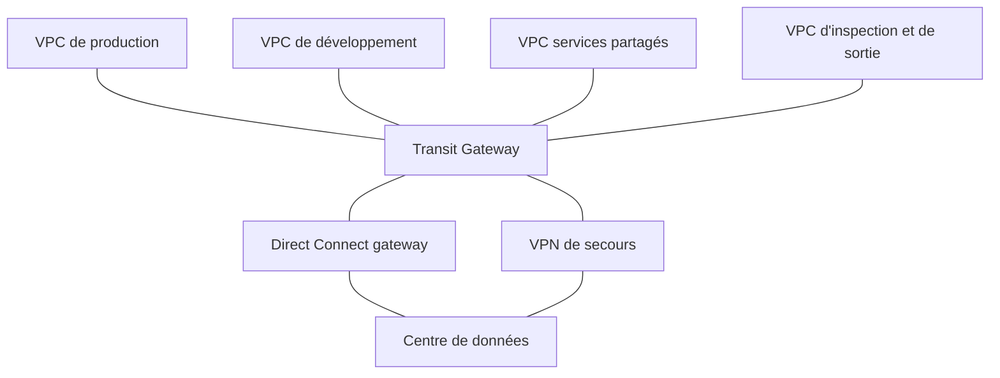
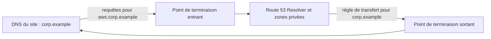

La fédération a vingt VPC répartis dans douze comptes, un centre de données et trois bureaux. Chaque nouveau projet réclame « juste une connexion » vers deux ou trois autres réseaux. Après deux ans d'appairages posés au fil de l'eau, plus personne ne sait dessiner le réseau, et deux plages d'adresses se chevauchent. À cette échelle, le réseau ne se **raccorde** plus : il se **conçoit**.

## Relier beaucoup de VPC

| Moyen | Fait pour | Limites |
| --- | --- | --- |
| **Appairage de VPC** | Quelques VPC ; trafic intense entre deux VPC (aucun coût horaire) | Non transitif : le nombre de liens explose avec le nombre de VPC |
| **AWS Transit Gateway** | Un concentrateur régional : VPC, VPN et Direct Connect s'y rattachent une fois | Facturé par rattachement et au volume ; c'est une ressource régionale : entre régions, on apparie des Transit Gateway |
| **AWS PrivateLink** | Exposer **un service** à d'autres VPC ou comptes, sans relier les réseaux | Sens unique, du consommateur vers le service |
| **Partage de sous-réseaux** (*VPC sharing*, par AWS RAM) | Plusieurs comptes créent leurs ressources dans les sous-réseaux d'un VPC central | Tout le monde partage le même plan d'adressage ; l'isolation repose sur les groupes de sécurité |

Le Transit Gateway apporte aussi la **segmentation** : chaque rattachement est associé à une **table de routage du Transit Gateway**. Avec une table « production » et une table « développement », les deux environnements passent par le même concentrateur sans pouvoir se joindre, tout en atteignant chacun les services partagés.



Deux motifs centralisés reviennent souvent :

- la **sortie centralisée** : une seule batterie de passerelles NAT dans un VPC dédié, au lieu d'une par VPC ;
- l'**inspection centralisée** : tout le trafic passe par AWS Network Firewall ou par des équipements tiers derrière un Gateway Load Balancer.

Tout cela suppose un **plan d'adressage sans chevauchement**, tenu à l'échelle de l'organisation (Amazon VPC IPAM le gère et l'impose). Deux réseaux aux plages identiques ne se relient pas ; on ne s'en sort que par de la traduction d'adresses ou par PrivateLink.

## Relier les sites

### AWS Direct Connect

| Notion | À savoir |
| --- | --- |
| **Connexion dédiée ou hébergée** | Dédiée : un port physique à ton usage (1, 10, 100 ou 400 Gbit/s). Hébergée : fournie par un partenaire, en débits variés. |
| **Interface virtuelle privée** | Accès à **un** VPC, par ses adresses privées. |
| **Interface virtuelle publique** | Accès aux services publics d'AWS (S3, par exemple) par leurs adresses publiques, sans passer par Internet. |
| **Interface virtuelle de transit** | Accès à un ou plusieurs Transit Gateway, par une Direct Connect gateway. |
| **Direct Connect gateway** | Relie une liaison à des VPC ou des Transit Gateway de **plusieurs régions**. |
| **Agrégation de liens** (LAG) | Plusieurs ports vus comme un seul, pour le débit : **pas** une redondance de site. |
| **Chiffrement** | Aucun par défaut. MACsec sur certaines connexions dédiées, ou un VPN par-dessus. |
| **Délai** | Des semaines : ce n'est jamais la réponse à « d'ici vendredi ». |

La **résilience** se joue sur les emplacements : AWS décrit un modèle *résilience maximale* (des connexions séparées dans **plusieurs** emplacements Direct Connect) et un modèle *haute résilience* ; des connexions redondantes dans un seul emplacement ne conviennent qu'au développement et aux tests.

### VPN site à site

Chaque connexion VPN comporte **deux tunnels**, terminés dans deux zones de disponibilité. Elle se monte en quelques minutes, sur une passerelle privée virtuelle (un VPC) ou sur un Transit Gateway (tous les VPC, avec répartition sur plusieurs tunnels). Avec le routage dynamique (BGP), les routes du site sont **propagées** automatiquement dans les tables de routage ; un VPN *accéléré* fait entrer le trafic par le réseau d'AWS au plus près du site.

Le montage classique d'entreprise : **Direct Connect en nominal, VPN en secours**, les deux annonçant les mêmes routes ; BGP préfère la liaison dédiée et bascule seul.

## La résolution de noms hybride



- un **point de terminaison entrant** (*inbound*) reçoit les requêtes du site pour des noms hébergés dans AWS (zones hébergées privées) ;
- un **point de terminaison sortant** (*outbound*), avec des **règles de transfert** par domaine, envoie vers les serveurs DNS du site les requêtes des VPC pour les noms internes ;
- les règles se **partagent** entre comptes par AWS RAM : on les définit une fois, dans le compte réseau.

## Comprendre un flux qui ne passe pas

| Outil | Ce qu'il dit |
| --- | --- |
| **Journaux de flux VPC** (*flow logs*) | Ce qui a **réellement** circulé : source, destination, port, accepté ou rejeté. Destination : CloudWatch Logs, S3 ou Firehose. |
| **Reachability Analyzer** | Une analyse de **configuration** : le chemin entre deux ressources est-il possible, et sinon quel composant le bloque ? Aucun paquet n'est envoyé. |
| **Network Access Analyzer** | Quels chemins d'accès existent alors qu'ils ne devraient pas ? |
| **Traffic Mirroring** | Une copie des paquets, pour une analyse approfondie. |
| **Transit Gateway Network Manager** | La vue d'ensemble d'un réseau mondial et de ses événements. |

Méthode : Reachability Analyzer pour savoir **si la configuration autorise** le chemin ; les journaux de flux pour voir **ce qui s'est passé** (un `REJECT` désigne un groupe de sécurité ou une liste de contrôle d'accès ; aucun enregistrement désigne plutôt le routage).

## Les commandes du labo

Côté AWS, un VPN se décrit par trois objets : la **passerelle client** (l'équipement du site, son adresse publique et son numéro de système autonome BGP), la **passerelle privée virtuelle** attachée au VPC, et la **connexion** entre les deux.

```bash
aws ec2 create-customer-gateway --type ipsec.1 --public-ip 203.0.113.50 --bgp-asn 65010 \
  --tag-specifications 'ResourceType=customer-gateway,Tags=[{Key=Name,Value=siege}]'
aws ec2 create-vpn-gateway --type ipsec.1
aws ec2 attach-vpn-gateway --vpn-gateway-id <vgw-…> --vpc-id <id du VPC>
aws ec2 create-vpn-connection --type ipsec.1 --customer-gateway-id <cgw-…> --vpn-gateway-id <vgw-…>
aws ec2 enable-vgw-route-propagation --route-table-id <rtb-…> --gateway-id <vgw-…>
```

La dernière commande active la **propagation** : les routes annoncées par le site en BGP apparaissent d'elles-mêmes dans la table de routage.

Dans le labo, le VPC et sa table de routage sont prêts :

```shell run
aws ec2 describe-vpcs --filters Name=tag:Name,Values=siege-aws --query 'Vpcs[].[VpcId,CidrBlock]' --output text
aws ec2 describe-route-tables --filters Name=tag:Name,Values=prive --query 'RouteTables[].RouteTableId' --output text
```

:::warning Ce qui diffère du vrai AWS
L'émulateur **enregistre** la passerelle client, la passerelle privée virtuelle, la connexion VPN, la propagation et les journaux de flux ; aucun tunnel n'est monté, aucune route n'est apprise, aucun journal n'est produit. Transit Gateway, Direct Connect, Route 53 Resolver, Network Firewall et Reachability Analyzer **ne sont pas émulés** : ils sont traités ici par la lecture, les schémas et les questions, et demandent de la pratique sur un vrai compte.
:::

:::tip Les mots qui tranchent
« Dès cette semaine » ou « en secours » → VPN. « Débit stable, gros volumes, latence prévisible » → Direct Connect. « Des dizaines de VPC, des segments isolés » → Transit Gateway avec plusieurs tables de routage. « Plages d'adresses qui se chevauchent » → PrivateLink. « Les noms internes doivent se résoudre des deux côtés » → points de terminaison Route 53 Resolver.
:::

## Entraîne-toi

En attendant la livraison de la liaison Direct Connect, tu relies le siège au VPC `siege-aws` par un VPN à routage dynamique, tu fais apprendre ses routes à la table privée et tu actives les journaux de flux sur le trafic rejeté.

:::lab
engine: real
intro: |
  Sont en place : le VPC `siege-aws` (`10.20.0.0/16`), sa table de routage étiquetée `prive` et le bucket `journaux-reseau`. L'adresse `203.0.113.50` est une adresse de documentation, fictive. Les étapes sont vérifiées sur la configuration enregistrée.
files:
  labo/preparer.sh: |
    #!/bin/sh
    # Prépare le VPC du labo (rejouable : ne recrée rien de ce qui existe).
    set -e
    v=$(aws ec2 describe-vpcs --filters Name=tag:Name,Values=siege-aws --query 'Vpcs[0].VpcId' --output text)
    if [ "$v" = "None" ]; then
        v=$(aws ec2 create-vpc --cidr-block 10.20.0.0/16 --tag-specifications 'ResourceType=vpc,Tags=[{Key=Name,Value=siege-aws}]' --query Vpc.VpcId --output text)
        aws ec2 create-route-table --vpc-id "$v" --tag-specifications 'ResourceType=route-table,Tags=[{Key=Name,Value=prive}]' > /dev/null
    fi
    aws s3api head-bucket --bucket journaux-reseau 2> /dev/null || aws s3 mb s3://journaux-reseau > /dev/null
commands:
  - demarrer-aws
  - sh labo/preparer.sh
steps:
  - text: "Déclare l'équipement du siège : une passerelle client d'adresse publique `203.0.113.50`, de numéro de système autonome BGP `65010`, étiquetée `Name=siege`"
    checks:
      - output-contains:
          - "aws ec2 describe-customer-gateways --filters Name=tag:Name,Values=siege --query 'CustomerGateways[].[IpAddress,BgpAsn,State]' --output text"
          - '^203\.0\.113\.50\s+65010\s+available$'
    solution:
      - "aws ec2 create-customer-gateway --type ipsec.1 --public-ip 203.0.113.50 --bgp-asn 65010 --tag-specifications 'ResourceType=customer-gateway,Tags=[{Key=Name,Value=siege}]'"
  - text: "Crée une passerelle privée virtuelle et attache-la au VPC `siege-aws`"
    checks:
      - output-contains:
          - "aws ec2 describe-vpn-gateways --filters Name=attachment.vpc-id,Values=\"$(aws ec2 describe-vpcs --filters Name=tag:Name,Values=siege-aws --query 'Vpcs[0].VpcId' --output text)\" --query 'VpnGateways[].VpcAttachments[].State' --output text"
          - '\battached\b'
    solution:
      - "aws ec2 attach-vpn-gateway --vpn-gateway-id \"$(aws ec2 create-vpn-gateway --type ipsec.1 --query VpnGateway.VpnGatewayId --output text)\" --vpc-id \"$(aws ec2 describe-vpcs --filters Name=tag:Name,Values=siege-aws --query 'Vpcs[0].VpcId' --output text)\""
  - text: "Crée la connexion VPN entre la passerelle client `siege` et ta passerelle privée virtuelle"
    after: [1, 2]
    checks:
      - command-succeeds: "test \"$(aws ec2 describe-vpn-connections --query 'VpnConnections[?State==`available`] | [0].CustomerGatewayId' --output text)\" = \"$(aws ec2 describe-customer-gateways --filters Name=tag:Name,Values=siege --query 'CustomerGateways[0].CustomerGatewayId' --output text)\""
      - output-contains:
          - "aws ec2 describe-vpn-connections --query 'VpnConnections[].[State,VpnGatewayId]' --output text"
          - '^available\s+vgw-'
    solution:
      - "aws ec2 create-vpn-connection --type ipsec.1 --customer-gateway-id \"$(aws ec2 describe-customer-gateways --filters Name=tag:Name,Values=siege --query 'CustomerGateways[0].CustomerGatewayId' --output text)\" --vpn-gateway-id \"$(aws ec2 describe-vpn-gateways --query 'VpnGateways[0].VpnGatewayId' --output text)\""
  - text: "Active la propagation des routes de la passerelle privée virtuelle dans la table de routage `prive`"
    after: [2]
    checks:
      - output-contains:
          - "aws ec2 describe-route-tables --filters Name=tag:Name,Values=prive --query 'RouteTables[0].PropagatingVgws' --output text"
          - 'vgw-[0-9a-f]+'
    solution:
      - "aws ec2 enable-vgw-route-propagation --route-table-id \"$(aws ec2 describe-route-tables --filters Name=tag:Name,Values=prive --query 'RouteTables[0].RouteTableId' --output text)\" --gateway-id \"$(aws ec2 describe-vpn-gateways --query 'VpnGateways[0].VpnGatewayId' --output text)\""
  - text: "Active des journaux de flux sur le VPC `siege-aws`, pour le trafic **rejeté** seulement (`REJECT`), à destination de `arn:aws:s3:::journaux-reseau/flux/`"
    hint: "`aws ec2 create-flow-logs --resource-type VPC --resource-ids <id du VPC> --traffic-type REJECT --log-destination-type s3 --log-destination arn:aws:s3:::journaux-reseau/flux/`"
    checks:
      - output-contains:
          - "aws ec2 describe-flow-logs --filter Name=resource-id,Values=\"$(aws ec2 describe-vpcs --filters Name=tag:Name,Values=siege-aws --query 'Vpcs[0].VpcId' --output text)\" --query 'FlowLogs[].[TrafficType,LogDestinationType,LogDestination]' --output text"
          - '^REJECT\s+s3\s+arn:aws:s3:::journaux-reseau/flux/$'
    solution:
      - "aws ec2 create-flow-logs --resource-type VPC --resource-ids \"$(aws ec2 describe-vpcs --filters Name=tag:Name,Values=siege-aws --query 'Vpcs[0].VpcId' --output text)\" --traffic-type REJECT --log-destination-type s3 --log-destination arn:aws:s3:::journaux-reseau/flux/"
:::

## Vérifie tes acquis

:::quiz
Une entreprise relie trente VPC et son centre de données. La production et le développement ne doivent pas communiquer entre eux, mais tous deux doivent joindre le VPC des services partagés et le centre de données. Quelle conception répond à ces exigences avec le moins d'éléments à gérer ?

- [ ] Un maillage complet d'appairages, filtré par des listes de contrôle d'accès
- [x] Un Transit Gateway avec des tables de routage distinctes pour la production et le développement
- [ ] Un VPN par VPC vers le centre de données
- [ ] Un seul grand VPC partagé par tous les comptes

> Les tables de routage du Transit Gateway segmentent les rattachements : chaque environnement voit les services partagés et le site, pas l'autre environnement.
:::

:::quiz
Une liaison Direct Connect unique relie le siège à AWS. La direction exige que la connectivité survive à la perte de cet emplacement Direct Connect, pour un coût contenu, en acceptant un débit réduit pendant l'incident. Que proposer ?

- [ ] Un second port dans le même emplacement, agrégé au premier
- [ ] Une interface virtuelle publique supplémentaire
- [x] Un VPN site à site en secours, annonçant les mêmes routes en BGP
- [ ] Un appairage de VPC vers une autre région

> Un VPN passe par Internet, indépendamment de l'emplacement Direct Connect, et BGP bascule automatiquement. Un second port au même endroit, même agrégé, tombe avec l'emplacement.
:::

:::quiz
Les serveurs du centre de données doivent résoudre les noms d'une zone hébergée privée d'AWS, et les instances des VPC doivent résoudre les noms du domaine interne `corp.example`. Que faut-il mettre en place ?

- [ ] Une zone hébergée publique contenant tous les noms internes
- [ ] Un serveur DNS installé sur une instance dans chaque VPC
- [ ] Une politique de routage par géolocalisation
- [x] Des points de terminaison Route 53 Resolver entrant et sortant, avec une règle de transfert pour `corp.example`

> Le point de terminaison entrant répond aux requêtes venues du site ; le sortant, avec sa règle de transfert, envoie vers le site les requêtes pour le domaine interne.
:::

:::quiz
Une instance ne parvient pas à joindre une base située dans un autre VPC. L'équipe veut savoir, sans générer de trafic, quel composant de la configuration bloque le chemin. Quel outil utiliser ?

- [ ] Les journaux de flux VPC
- [ ] Traffic Mirroring
- [x] Reachability Analyzer
- [ ] AWS X-Ray

> Reachability Analyzer analyse la configuration et désigne le composant bloquant, sans envoyer de paquet. Les journaux de flux décrivent le trafic qui a réellement circulé.
:::
