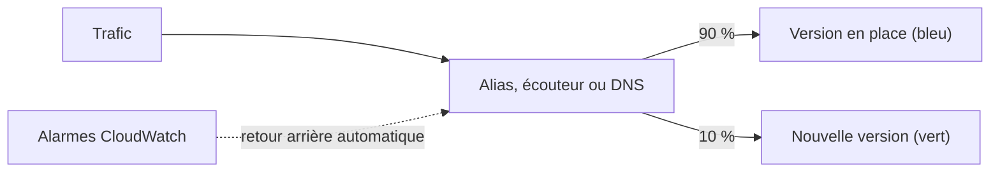

Vendredi, 17 h : une mise à jour « mineure » du modèle CloudFormation renomme une table. CloudFormation, obéissant, crée la nouvelle table… et supprime l'ancienne, avec trois ans de commandes. Personne n'avait relu ce que la mise à jour allait **réellement** faire. À grande échelle, la question n'est plus « comment déployer », mais « **que se passe-t-il si ce déploiement est mauvais**, et en combien de temps revient-on en arrière ? ».

## Les stratégies de déploiement

| Stratégie | Principe | Interruption | Retour arrière | Coût |
| --- | --- | --- | --- | --- |
| **Tout d'un coup** (*all at once*) | Toutes les cibles en même temps | Possible | Redéployer l'ancienne version | Nul |
| **Progressif** (*rolling*) | Par lots successifs | Capacité réduite pendant le déploiement | Redéployer, lot par lot | Nul |
| **Progressif avec lot supplémentaire** | On ajoute d'abord un lot neuf, pour garder la capacité | Aucune | Redéployer | Faible |
| **Immuable** | Un jeu complet de nouvelles instances, ajouté puis substitué | Aucune | Supprimer les nouvelles instances | Double capacité, brièvement |
| **Bleu-vert** (*blue/green*) | Deux environnements complets ; on bascule le trafic de l'un à l'autre | Aucune | **Rebasculer** : immédiat | Double environnement |
| **Canari** (*canary*) | Une petite part du trafic d'abord, puis tout le reste | Aucune | Rebasculer ; peu d'utilisateurs touchés | Faible |
| **Linéaire** | Le trafic glisse par paliers réguliers | Aucune | Rebasculer | Faible |



Où ces stratégies se règlent :

- **AWS CodeDeploy** : sur EC2, déploiement en place (un par un, par moitié, tout d'un coup) ou bleu-vert ; sur **Lambda** et **ECS**, configurations canari, linéaires ou tout d'un coup. Il sait **revenir en arrière automatiquement** quand une alarme CloudWatch se déclenche.
- **AWS Elastic Beanstalk** : politiques *All at once*, *Rolling*, *Rolling with additional batch*, *Immutable*, *Traffic splitting*.
- Le **point de bascule** d'un bleu-vert : un alias Lambda, des groupes cibles pondérés d'un Application Load Balancer, des enregistrements Route 53 pondérés (attention aux caches DNS), une étape de déploiement d'API Gateway.
- **Bases de données** : les déploiements bleu-vert d'Amazon RDS créent un environnement de préproduction synchronisé avec la production, que l'on promeut par une bascule de moins d'une minute en général.

Deux pièges reviennent dans les scénarios : un bleu-vert ne vaut que si l'on peut revenir en arrière, ce qui impose des **changements de schéma compatibles** avec les deux versions ; et un retour arrière par DNS est lent, parce que les clients gardent l'ancienne réponse en cache.

## L'infrastructure en code, à l'échelle

| Mécanisme CloudFormation | À quoi il sert |
| --- | --- |
| **Ensemble de modifications** (*change set*) | Voir **avant** d'appliquer ce qui sera ajouté, modifié ou **remplacé** |
| **Politique de pile** (*stack policy*) | Interdire certaines mises à jour (remplacement, suppression) sur des ressources désignées. Un garde-fou contre l'erreur, pas un contrôle d'accès |
| **Protection contre la suppression** (*termination protection*) | Refuser la suppression de la pile |
| `DeletionPolicy`, `UpdateReplacePolicy` | Conserver la ressource, ou en prendre un instantané, quand elle est supprimée ou remplacée |
| **Détection de dérive** (*drift*) | Repérer les ressources modifiées hors de CloudFormation |
| **Piles imbriquées** et exports | Découper un grand modèle et partager des valeurs entre piles |
| **StackSets** | Déployer le même modèle dans de nombreux comptes et régions |

Dans un ensemble de modifications, la colonne à lire est **`Replacement`** : `True` signifie que la ressource sera **recréée**, donc que son contenu est perdu s'il s'agit d'une base ou d'un bucket. Changer le nom d'une table, par exemple, impose un remplacement.

Autour de CloudFormation : **AWS CDK** génère des modèles à partir de code ; **CodePipeline** enchaîne construction (CodeBuild), tests et déploiement, avec des étapes d'approbation manuelle ; **AWS Systems Manager** applique des configurations et des correctifs à un parc (State Manager, Patch Manager) et exécute des procédures (Automation) ; **AWS AppConfig** active progressivement une fonctionnalité sans redéployer.

Enfin, le meilleur moyen de réduire le risque de déploiement est d'avoir **moins à déployer** : préférer un service géré (une base RDS, une file SQS, Fargate) supprime des couches entières à corriger et à mettre à jour.

## Versions et alias Lambda

Une fonction Lambda a une version de travail, `$LATEST`, et des **versions publiées**, numérotées et **immuables**. Un **alias** (`prod`) est un pointeur vers une version : les appelants utilisent l'alias, et déployer revient à déplacer le pointeur.

```bash
aws lambda publish-version --function-name api
aws lambda create-alias --function-name api --name prod --function-version 1
aws lambda update-alias --function-name api --name prod --function-version 2
```

Un alias peut aussi **répartir** le trafic entre deux versions, ce qui donne un canari :

```bash
aws lambda update-alias --function-name api --name prod \
  --routing-config 'AdditionalVersionWeights={2=0.1}'
```

Ici, 10 % des appels iraient à la version 2, le reste à la version désignée par l'alias. CodeDeploy automatise ce glissement et son retour arrière.

## Les commandes du labo

Créer un ensemble de modifications sans rien appliquer, puis le lire :

```bash
aws cloudformation create-change-set --stack-name commandes --change-set-name renommage \
  --template-body file://pile.yml \
  --parameters ParameterKey=NomTable,ParameterValue=commandes-v2
aws cloudformation describe-change-set --stack-name commandes --change-set-name renommage \
  --query 'Changes[].ResourceChange.[LogicalResourceId,Action,Replacement]' --output text
```

On l'applique avec `execute-change-set`, ou on l'abandonne avec `delete-change-set`. Les deux protections :

```bash
aws cloudformation update-termination-protection --stack-name commandes --enable-termination-protection
aws cloudformation set-stack-policy --stack-name commandes --stack-policy-body file://politique-pile.json
```

Dans le labo, relis le modèle avant de le déployer : repère les deux paramètres et les propriétés qui en dépendent.

```shell run
cat pile.yml
aws cloudformation validate-template --template-body file://pile.yml
```

:::warning Ce qui diffère du vrai AWS
L'émulateur exécute réellement CloudFormation (pour les types de ressources qu'il connaît), calcule les ensembles de modifications avec leur colonne `Replacement`, et refuse de supprimer une pile protégée. Les fonctions Lambda, leurs versions et la bascule d'un alias y sont réelles. En revanche, il **enregistre** la répartition pondérée d'un alias sans l'appliquer (tous les appels vont à la version principale), il enregistre la politique de pile sans la faire respecter, et CodeDeploy, CodePipeline, Elastic Beanstalk et StackSets n'y existent pas. C'est pourquoi le labo pratique le bleu-vert par bascule d'alias, pas le canari.
:::

:::danger Lis `Replacement` avant d'appliquer
Une mise à jour qui remplace une ressource contenant des données la **détruit**, sauf si `DeletionPolicy` et `UpdateReplacePolicy` valent `Retain` ou `Snapshot`. Aucune confirmation ne sera demandée.
:::

## Entraîne-toi

Tu déploies la pile `commandes`, tu évites un remplacement destructeur grâce à un ensemble de modifications, tu protèges la pile, puis tu déploies une nouvelle version d'une fonction en bleu-vert, avec un retour arrière.

```json file=politique-pile.json
{
  "Statement": [
    {
      "Effect": "Deny",
      "Action": ["Update:Replace", "Update:Delete"],
      "Principal": "*",
      "Resource": "LogicalResourceId/Table"
    },
    {
      "Effect": "Allow",
      "Action": "Update:*",
      "Principal": "*",
      "Resource": "*"
    }
  ]
}
```

:::lab
engine: real
intro: |
  Ton dossier de travail contient le modèle `pile.yml` (une table DynamoDB et une file SQS, paramétrées) et `app.py`, le code de la fonction `api`, qui répond `v1`. Le rôle `role-api` est prêt. Les étapes sont vérifiées sur l'état de l'émulateur et sur les fichiers que tu gardes.
files:
  pile.yml: |
    AWSTemplateFormatVersion: "2010-09-09"
    Description: Table et file des commandes
    Parameters:
      NomTable:
        Type: String
        Default: commandes-v1
      Retention:
        Type: Number
        Default: 345600
    Resources:
      Table:
        Type: AWS::DynamoDB::Table
        Properties:
          TableName: !Ref NomTable
          BillingMode: PAY_PER_REQUEST
          AttributeDefinitions:
            - AttributeName: id
              AttributeType: S
          KeySchema:
            - AttributeName: id
              KeyType: HASH
      File:
        Type: AWS::SQS::Queue
        Properties:
          QueueName: commandes
          MessageRetentionPeriod: !Ref Retention
  app.py: |
    def handler(event, context):
        return {"version": "v1"}
  labo/confiance-lambda.json: |
    {
      "Version": "2012-10-17",
      "Statement": [
        {
          "Effect": "Allow",
          "Principal": {"Service": "lambda.amazonaws.com"},
          "Action": "sts:AssumeRole"
        }
      ]
    }
commands:
  - demarrer-aws
  - 'aws iam get-role --role-name role-api >/dev/null 2>&1 || aws iam create-role --role-name role-api --assume-role-policy-document file://labo/confiance-lambda.json'
steps:
  - text: "Déploie la pile `commandes` à partir de `pile.yml`, avec ses valeurs par défaut"
    hint: "aws cloudformation deploy --stack-name commandes --template-file pile.yml"
    checks:
      - output-contains:
          - "aws cloudformation describe-stacks --stack-name commandes --query 'Stacks[0].StackStatus' --output text"
          - '^(CREATE|UPDATE)_COMPLETE$'
      - command-succeeds: 'aws dynamodb describe-table --table-name commandes-v1'
    solution:
      - aws cloudformation deploy --stack-name commandes --template-file pile.yml
  - text: "Quelqu'un propose de renommer la table. Crée l'ensemble de modifications `renommage` (`NomTable=commandes-v2`, `Retention=86400`), garde son analyse dans `modifications.txt` (commande `describe-change-set` de la leçon), puis **abandonne-le** avec `delete-change-set`"
    after: [1]
    checks:
      - env-file-contains: [modifications.txt, '^Table\s+Modify\s+True$']
      - env-file-contains: [modifications.txt, '^File\s+Modify\s+False$']
      - command-succeeds: 'aws dynamodb describe-table --table-name commandes-v1 > /dev/null && ! aws cloudformation describe-change-set --stack-name commandes --change-set-name renommage > /dev/null 2>&1'
    solution:
      - aws cloudformation create-change-set --stack-name commandes --change-set-name renommage --template-body file://pile.yml --parameters ParameterKey=NomTable,ParameterValue=commandes-v2 ParameterKey=Retention,ParameterValue=86400
      - sleep 2
      - "aws cloudformation describe-change-set --stack-name commandes --change-set-name renommage --query 'Changes[].ResourceChange.[LogicalResourceId,Action,Replacement]' --output text > modifications.txt"
      - aws cloudformation delete-change-set --stack-name commandes --change-set-name renommage
  - text: "Protège la pile : active la protection contre la suppression, puis applique `politique-pile.json`, qui interdit de remplacer ou de supprimer la ressource `Table`"
    after: [1]
    checks:
      - output-contains:
          - "aws cloudformation describe-stacks --stack-name commandes --query 'Stacks[0].EnableTerminationProtection' --output text"
          - '^True$'
      - output-contains:
          - 'aws cloudformation get-stack-policy --stack-name commandes --query StackPolicyBody --output text'
          - 'Update:Replace'
    solution:
      - write:
          politique-pile.json: |
            {
              "Statement": [
                {
                  "Effect": "Deny",
                  "Action": ["Update:Replace", "Update:Delete"],
                  "Principal": "*",
                  "Resource": "LogicalResourceId/Table"
                },
                {
                  "Effect": "Allow",
                  "Action": "Update:*",
                  "Principal": "*",
                  "Resource": "*"
                }
              ]
            }
      - aws cloudformation update-termination-protection --stack-name commandes --enable-termination-protection
      - aws cloudformation set-stack-policy --stack-name commandes --stack-policy-body file://politique-pile.json
  - text: "Crée la fonction `api` à partir de `app.py` (environnement `python3.13`, point d'entrée `app.handler`, rôle `role-api`), publie sa version **1**, crée l'alias `prod` vers cette version, puis appelle `api:prod` en gardant la réponse dans `avant.json`"
    hint: "zip app.zip app.py ; aws lambda create-function … ; aws lambda wait function-active-v2 --function-name api ; aws lambda publish-version … ; aws lambda create-alias … ; aws lambda invoke --function-name api:prod avant.json"
    checks:
      - env-file-contains: [avant.json, '"version": "v1"']
      - command-succeeds: 'aws lambda get-alias --function-name api --name prod'
    solution:
      - zip app.zip app.py
      - aws lambda create-function --function-name api --runtime python3.13 --handler app.handler --zip-file fileb://app.zip --role arn:aws:iam::000000000000:role/role-api
      - aws lambda wait function-active-v2 --function-name api
      - aws lambda publish-version --function-name api
      - aws lambda create-alias --function-name api --name prod --function-version 1
      - aws lambda invoke --function-name api:prod avant.json
  - text: "Déploie la version 2 : remplace `v1` par `v2` dans `app.py`, mets à jour le code de la fonction, publie la version **2**, bascule l'alias `prod` dessus, puis appelle `api:prod` en gardant la réponse dans `apres.json`"
    hint: "sed -i 's/v1/v2/' app.py ; zip app.zip app.py ; aws lambda update-function-code --function-name api --zip-file fileb://app.zip ; aws lambda wait function-updated-v2 --function-name api ; puis publish-version et update-alias"
    after: [4]
    checks:
      - env-file-contains: [apres.json, '"version": "v2"']
      - output-contains:
          - "aws lambda list-versions-by-function --function-name api --query 'Versions[].Version' --output text"
          - '\b2\b'
    solution:
      - "sed -i 's/v1/v2/' app.py"
      - zip app.zip app.py
      - aws lambda update-function-code --function-name api --zip-file fileb://app.zip
      - aws lambda wait function-updated-v2 --function-name api
      - aws lambda publish-version --function-name api
      - aws lambda update-alias --function-name api --name prod --function-version 2
      - aws lambda invoke --function-name api:prod apres.json
  - text: "La version 2 pose problème : reviens en arrière en rebasculant l'alias `prod` sur la version **1**, puis appelle `api:prod` en gardant la réponse dans `retour.json`"
    after: [5]
    checks:
      - output-contains:
          - 'aws lambda get-alias --function-name api --name prod --query FunctionVersion --output text'
          - '^1$'
      - env-file-contains: [retour.json, '"version": "v1"']
    solution:
      - aws lambda update-alias --function-name api --name prod --function-version 1
      - aws lambda invoke --function-name api:prod retour.json
:::

## Vérifie tes acquis

:::quiz
Une application critique sur ECS doit être mise à jour sans interruption. En cas de hausse du taux d'erreurs, le retour à la version précédente doit être automatique et toucher le moins d'utilisateurs possible. Quelle approche répond le mieux à ces exigences ?

- [ ] Un déploiement tout d'un coup, suivi d'une surveillance manuelle
- [ ] Un déploiement progressif par lots de 50 %
- [x] Un déploiement canari avec CodeDeploy, associé à une alarme CloudWatch qui déclenche le retour arrière
- [ ] Une mise à jour directe de la définition de tâche en production

> Le canari n'expose d'abord qu'une petite part du trafic, et CodeDeploy rebascule automatiquement quand l'alarme se déclenche.
:::

:::quiz
Un ensemble de modifications CloudFormation indique `Replacement: True` pour une base de données de production. Que faut-il en conclure ?

- [ ] La base sera modifiée sur place, avec une brève interruption
- [ ] La mise à jour sera refusée par CloudFormation
- [x] La base sera recréée : sans politique de conservation ou d'instantané, ses données seront perdues
- [ ] La base sera répliquée dans une autre région avant la mise à jour

> Un remplacement crée une nouvelle ressource et supprime l'ancienne. `DeletionPolicy` et `UpdateReplacePolicy` à `Retain` ou `Snapshot` protègent les données.
:::

:::quiz
Une équipe veut qu'aucune mise à jour de pile ne puisse remplacer ou supprimer la base de données de la pile, tout en laissant les autres ressources évoluer. Quel mécanisme CloudFormation utiliser ?

- [ ] La protection contre la suppression de la pile
- [ ] La détection de dérive
- [ ] Une pile imbriquée
- [x] Une politique de pile qui refuse `Update:Replace` et `Update:Delete` sur cette ressource

> La politique de pile filtre les actions de mise à jour par ressource. La protection contre la suppression ne concerne que la suppression de la pile entière.
:::

:::quiz
Une nouvelle version d'une application doit modifier le schéma de sa base de données. L'équipe veut un déploiement bleu-vert avec un retour arrière possible pendant une heure. Quelle condition est indispensable ?

- [ ] Utiliser un Network Load Balancer
- [x] Que le changement de schéma reste compatible avec l'ancienne version de l'application
- [ ] Désactiver les sauvegardes pendant la bascule
- [ ] Fixer la durée de vie des enregistrements DNS à 24 heures

> Si le nouveau schéma casse l'ancienne version, rebasculer le trafic ne suffit plus à revenir en arrière. Les deux versions doivent pouvoir fonctionner sur le même schéma pendant la période de retour possible.
:::
