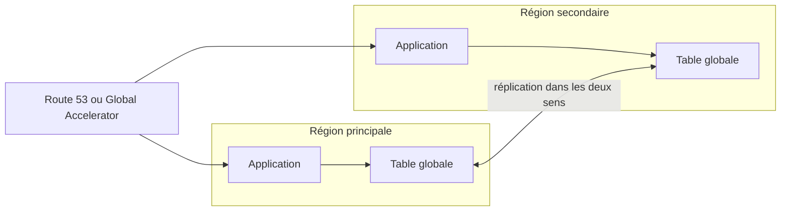

Le plan de reprise de la fédération tenait en une phrase : « en cas de sinistre, on redéploie tout dans une autre région avec CloudFormation ». Le jour de l'exercice, la console de la région touchée ne répondait plus, les quotas de la région de secours étaient à leur valeur par défaut, et la dernière copie des données datait de la veille. Un plan de continuité se juge sur ce dont il **dépend** au moment où tout va mal.

## Plan de contrôle, plan de données, stabilité statique

Chaque service AWS a deux faces :

- le **plan de données** rend le service en continu : répondre aux requêtes DNS, router un paquet, lire un objet ;
- le **plan de contrôle** configure : créer une instance, modifier un enregistrement, changer une capacité.

Les plans de données sont conçus pour une disponibilité plus élevée que les plans de contrôle. D'où un principe : une bascule ne doit reposer **que sur des opérations de plan de données**. Un système est **statiquement stable** quand il continue de fonctionner, pendant une panne, **sans rien avoir à créer ni modifier**.

| Dépend du plan de contrôle (fragile pendant une panne) | Repose sur le plan de données (robuste) |
| --- | --- |
| Lancer des instances dans la région de secours au moment du sinistre | Capacité déjà en service dans la région de secours |
| Modifier un enregistrement DNS pour basculer | Contrôles de santé Route 53, ou contrôles de routage d'Amazon Application Recovery Controller |
| Compter sur la mise à l'échelle automatique pour absorber tout le trafic | Capacité préprovisionnée, quitte à la compléter ensuite |
| Demander une hausse de quota le jour J | Quotas alignés à l'avance dans les deux régions |

## Répliquer : quelle cohérence ?

| Donnée | Mécanisme | Écritures | À savoir |
| --- | --- | --- | --- |
| Objets S3 | Réplication entre régions ; *Replication Time Control* vise 99,9 % des objets en moins de 15 minutes | Une source, ou bidirectionnelle | Asynchrone ; versionnage requis |
| Tables DynamoDB | **Tables globales** | **Toutes les régions** | Par défaut, cohérence à terme entre régions et résolution des conflits par « dernière écriture gagnante » ; un mode à cohérence forte entre régions existe |
| Aurora | **Base de données globale** | Une région principale ; transfert d'écriture possible depuis les secondaires | Réplication asynchrone à faible retard ; bascule planifiée ou de secours |
| RDS | Réplica en lecture dans une autre région | Une région | Promotion manuelle |
| ElastiCache, EFS, ECR, Secrets Manager | Réplications propres à chaque service | Variable | À ne pas oublier dans l'inventaire |
| Clés de chiffrement | **Clés KMS multi-régions** | — | Même matériel de clé dans plusieurs régions : une donnée chiffrée dans l'une se déchiffre dans l'autre, sans appel entre régions |



Trois façons d'organiser les écritures dans un système actif dans plusieurs régions :

- **écriture globale** : tout s'écrit dans une seule région (Aurora Global Database) ;
- **écriture locale** : chacun écrit dans sa région, et les conflits se règlent ensuite (tables globales DynamoDB) ;
- **écriture partitionnée** : chaque enregistrement « appartient » à une région, ce qui évite les conflits.

Le piège de l'écriture locale : deux écritures simultanées sur la **même** clé dans deux régions. Avec « dernière écriture gagnante », l'une des deux est **silencieusement écrasée**. Cela convient à un profil d'utilisateur, pas à un solde de compte.

## Basculer

- **Route 53**, politique de basculement avec contrôles de santé : la décision est prise par le plan de données de Route 53.
- **Amazon Application Recovery Controller** : des **contrôles de routage**, interrupteurs très disponibles que l'on bascule par une API de plan de données, des vérifications de préparation et, à l'intérieur d'une région, le **décalage de zone** (*zonal shift*) pour sortir d'une zone de disponibilité dégradée.
- **AWS Global Accelerator** : bascule sans dépendre des caches DNS.
- **CloudFront** : bascule d'origine, requête par requête.

Une bascule **déclenchée automatiquement** va vite mais peut partir sur une fausse alerte, avec perte de données à la clé si la réplication est asynchrone. Beaucoup d'organisations **automatisent les étapes** et gardent la **décision** humaine.

## Sauvegarder à l'échelle de l'organisation

La réplication ne protège ni d'une corruption ni d'un rançongiciel : elle les propage. Il faut aussi des copies **datées**, **hors d'atteinte** :

- **AWS Backup** : plans centralisés (fréquence, rétention), sélection des ressources **par étiquette**, copie vers une **autre région** et vers un **autre compte** ;
- des **politiques de sauvegarde** d'AWS Organizations imposent ces plans à des unités d'organisation entières ;
- **AWS Backup Vault Lock** rend un coffre inaltérable (modèle WORM) : en mode conformité, une fois le délai de grâce écoulé, personne ne peut supprimer les points de restauration avant leur échéance ;
- un **compte de sauvegarde dédié** protège des copies contre la compromission du compte d'origine.

**AWS Elastic Disaster Recovery** complète le tableau pour les serveurs : réplication continue au niveau bloc vers une zone d'attente peu coûteuse, et relance à la demande.

Enfin, un plan se **teste** : exercices de bascule réguliers, et injection de pannes contrôlées avec **AWS Fault Injection Service**.

## Les commandes du labo

Ajouter une région à une table la transforme en table globale :

```bash
aws dynamodb update-table --table-name profils --replica-updates 'Create={RegionName=eu-west-1}'
```

On lit ou on écrit ensuite dans l'une ou l'autre région en changeant simplement `--region` :

```bash
aws dynamodb put-item --table-name profils --item file://p1.json
aws dynamodb get-item --table-name profils --region eu-west-1 --key '{"id": {"S": "p1"}}'
```

Un plan de sauvegarde se décrit en JSON : une règle, un coffre cible, un horaire, une rétention, et une **action de copie** vers le coffre d'une autre région.

Dans le labo, la table existe déjà à Paris, avec le flux de modifications dont les tables globales ont besoin :

```shell run
aws dynamodb describe-table --table-name profils --query 'Table.[TableStatus,StreamSpecification.StreamViewType,Replicas]'
```

:::warning Ce qui diffère du vrai AWS
L'émulateur réplique réellement les éléments de la table entre les deux régions, dans les deux sens, mais **instantanément** : tu n'y verras ni retard de réplication, ni véritable conflit (les deux écritures de l'exercice y sont simplement appliquées l'une après l'autre). Le plan de sauvegarde, sa copie entre régions et sa sélection par étiquette sont **enregistrés**, sans qu'aucune sauvegarde ne soit prise. Vault Lock, Application Recovery Controller, Aurora Global Database et les clés KMS multi-régions ne sont pas émulés.
:::

:::tip Lire un scénario de continuité
Repère d'abord le RPO et le RTO chiffrés, puis ce qui est dit du **sens des écritures** et de la **cohérence** exigée : « les utilisateurs écrivent dans la région la plus proche » désigne les tables globales DynamoDB ; « base relationnelle, RPO de quelques secondes, promotion rapide » désigne Aurora Global Database ; « la bascule ne doit dépendre d'aucune modification de configuration » désigne des contrôles de santé ou de routage.
:::

## Entraîne-toi

Tu rends la table des profils disponible en écriture dans deux régions, tu observes ce qui arrive à deux écritures sur la même clé, puis tu décris la sauvegarde quotidienne avec copie en Irlande.

```json file=plan-sauvegarde.json
{
  "BackupPlanName": "quotidien",
  "Rules": [
    {
      "RuleName": "nuit",
      "TargetBackupVaultName": "coffre-paris",
      "ScheduleExpression": "cron(0 3 * * ? *)",
      "Lifecycle": {"DeleteAfterDays": 35},
      "CopyActions": [
        {
          "DestinationBackupVaultArn": "arn:aws:backup:eu-west-1:000000000000:backup-vault:coffre-irlande",
          "Lifecycle": {"DeleteAfterDays": 35}
        }
      ]
    }
  ]
}
```

```json file=selection.json
{
  "SelectionName": "par-etiquette",
  "IamRoleArn": "arn:aws:iam::000000000000:role/role-sauvegarde",
  "ListOfTags": [
    {"ConditionType": "STRINGEQUALS", "ConditionKey": "sauvegarde", "ConditionValue": "oui"}
  ]
}
```

:::lab
engine: real
intro: |
  Sont en place : la table DynamoDB `profils` à Paris (clé `id`), le rôle `role-sauvegarde`, et dans ton dossier de travail les éléments `p1.json`, `p2.json`, `p3-paris.json` et `p3-irlande.json`. Paris est `eu-west-3` (ta région par défaut), l'Irlande `eu-west-1`.
files:
  p1.json: |
    {"id": {"S": "p1"}, "ville": {"S": "Paris"}}
  p2.json: |
    {"id": {"S": "p2"}, "ville": {"S": "Dublin"}}
  p3-paris.json: |
    {"id": {"S": "p3"}, "ville": {"S": "ecrit-a-Paris"}}
  p3-irlande.json: |
    {"id": {"S": "p3"}, "ville": {"S": "ecrit-en-Irlande"}}
  labo/confiance-backup.json: |
    {
      "Version": "2012-10-17",
      "Statement": [
        {
          "Effect": "Allow",
          "Principal": {"Service": "backup.amazonaws.com"},
          "Action": "sts:AssumeRole"
        }
      ]
    }
commands:
  - demarrer-aws
  - 'aws dynamodb describe-table --table-name profils >/dev/null 2>&1 || aws dynamodb create-table --table-name profils --attribute-definitions AttributeName=id,AttributeType=S --key-schema AttributeName=id,KeyType=HASH --billing-mode PAY_PER_REQUEST --stream-specification StreamEnabled=true,StreamViewType=NEW_AND_OLD_IMAGES'
  - 'aws iam get-role --role-name role-sauvegarde >/dev/null 2>&1 || aws iam create-role --role-name role-sauvegarde --assume-role-policy-document file://labo/confiance-backup.json'
steps:
  - text: "Ajoute à la table `profils` une réplique dans la région `eu-west-1`"
    checks:
      - output-contains:
          - "aws dynamodb describe-table --table-name profils --query 'Table.Replicas[].[RegionName,ReplicaStatus]' --output text"
          - '^eu-west-1\s+ACTIVE$'
    solution:
      - "aws dynamodb update-table --table-name profils --replica-updates 'Create={RegionName=eu-west-1}'"
  - text: "Écris `p1.json` dans la table à **Paris**, puis relis l'élément `p1` depuis l'**Irlande** en gardant la réponse dans `lu-en-irlande.json`"
    after: [1]
    checks:
      - output-contains:
          - "aws dynamodb get-item --table-name profils --region eu-west-1 --key '{\"id\": {\"S\": \"p1\"}}' --query Item.ville.S --output text"
          - '^Paris$'
      - env-file-contains: [lu-en-irlande.json, '"Paris"']
    solution:
      - aws dynamodb put-item --table-name profils --item file://p1.json
      - "aws dynamodb get-item --table-name profils --region eu-west-1 --key '{\"id\": {\"S\": \"p1\"}}' > lu-en-irlande.json"
  - text: "Dans l'autre sens : écris `p2.json` en **Irlande**, et vérifie qu'il est lisible à Paris"
    after: [1]
    checks:
      - output-contains:
          - "aws dynamodb get-item --table-name profils --region eu-west-3 --key '{\"id\": {\"S\": \"p2\"}}' --query Item.ville.S --output text"
          - '^Dublin$'
    solution:
      - aws dynamodb put-item --table-name profils --region eu-west-1 --item file://p2.json
  - text: "Deux écritures sur la même clé : écris `p3-paris.json` à Paris, puis `p3-irlande.json` en Irlande. Relis `p3` dans **chaque** région et garde les deux réponses dans `p3-vu-de-paris.json` et `p3-vu-d-irlande.json` : une seule des deux écritures a survécu"
    after: [1]
    checks:
      - env-file-contains: [p3-vu-de-paris.json, 'ecrit-en-Irlande']
      - env-file-contains: [p3-vu-d-irlande.json, 'ecrit-en-Irlande']
      - output-contains:
          - "aws dynamodb get-item --table-name profils --region eu-west-3 --key '{\"id\": {\"S\": \"p3\"}}' --query Item.ville.S --output text"
          - '^ecrit-'
    solution:
      - aws dynamodb put-item --table-name profils --region eu-west-3 --item file://p3-paris.json
      - aws dynamodb put-item --table-name profils --region eu-west-1 --item file://p3-irlande.json
      - "aws dynamodb get-item --table-name profils --region eu-west-3 --key '{\"id\": {\"S\": \"p3\"}}' > p3-vu-de-paris.json"
      - "aws dynamodb get-item --table-name profils --region eu-west-1 --key '{\"id\": {\"S\": \"p3\"}}' > p3-vu-d-irlande.json"
  - text: "Crée les coffres de sauvegarde `coffre-paris` (région par défaut) et `coffre-irlande` (`eu-west-1`), puis le plan `quotidien` à partir de `plan-sauvegarde.json`"
    hint: "aws backup create-backup-vault --backup-vault-name … [--region eu-west-1] ; aws backup create-backup-plan --backup-plan file://plan-sauvegarde.json"
    checks:
      - command-succeeds: 'aws backup describe-backup-vault --backup-vault-name coffre-paris > /dev/null && aws backup describe-backup-vault --backup-vault-name coffre-irlande --region eu-west-1 > /dev/null'
      - output-contains:
          - "aws backup get-backup-plan --backup-plan-id \"$(aws backup list-backup-plans --query \"BackupPlansList[?BackupPlanName=='quotidien'].BackupPlanId | [0]\" --output text)\" --query 'BackupPlan.Rules[0].[TargetBackupVaultName,Lifecycle.DeleteAfterDays,CopyActions[0].DestinationBackupVaultArn]' --output text"
          - '^coffre-paris\s+35\s+arn:aws:backup:eu-west-1:000000000000:backup-vault:coffre-irlande$'
    solution:
      - write:
          plan-sauvegarde.json: |
            {
              "BackupPlanName": "quotidien",
              "Rules": [
                {
                  "RuleName": "nuit",
                  "TargetBackupVaultName": "coffre-paris",
                  "ScheduleExpression": "cron(0 3 * * ? *)",
                  "Lifecycle": {"DeleteAfterDays": 35},
                  "CopyActions": [
                    {
                      "DestinationBackupVaultArn": "arn:aws:backup:eu-west-1:000000000000:backup-vault:coffre-irlande",
                      "Lifecycle": {"DeleteAfterDays": 35}
                    }
                  ]
                }
              ]
            }
      - aws backup create-backup-vault --backup-vault-name coffre-paris
      - aws backup create-backup-vault --backup-vault-name coffre-irlande --region eu-west-1
      - aws backup create-backup-plan --backup-plan file://plan-sauvegarde.json
  - text: "Écris `selection.json` et rattache-la au plan : toute ressource étiquetée `sauvegarde=oui` sera sauvegardée (`aws backup create-backup-selection`)"
    hint: "`aws backup create-backup-selection --backup-plan-id <id du plan> --backup-selection file://selection.json`"
    after: [5]
    checks:
      - output-contains:
          - "aws backup list-backup-selections --backup-plan-id \"$(aws backup list-backup-plans --query \"BackupPlansList[?BackupPlanName=='quotidien'].BackupPlanId | [0]\" --output text)\" --query 'BackupSelectionsList[].SelectionName' --output text"
          - '\bpar-etiquette\b'
    solution:
      - write:
          selection.json: |
            {
              "SelectionName": "par-etiquette",
              "IamRoleArn": "arn:aws:iam::000000000000:role/role-sauvegarde",
              "ListOfTags": [
                {"ConditionType": "STRINGEQUALS", "ConditionKey": "sauvegarde", "ConditionValue": "oui"}
              ]
            }
      - "aws backup create-backup-selection --backup-plan-id \"$(aws backup list-backup-plans --query \"BackupPlansList[?BackupPlanName=='quotidien'].BackupPlanId | [0]\" --output text)\" --backup-selection file://selection.json"
:::

## Vérifie tes acquis

:::quiz
Une application de profils d'utilisateurs doit accepter des écritures dans trois régions, chacun écrivant dans la région la plus proche, et continuer de fonctionner si une région disparaît. Une incohérence passagère entre régions est acceptable. Quelle base choisir ?

- [ ] Amazon RDS Multi-AZ avec un réplica en lecture par région
- [ ] Aurora Global Database, sans transfert d'écriture
- [x] Une table globale DynamoDB
- [ ] Amazon ElastiCache dans une seule région

> Les tables globales acceptent lectures et écritures dans chaque région et se répliquent entre elles. Aurora Global Database n'écrit que dans la région principale.
:::

:::quiz
Un plan de reprise prévoit de lancer les serveurs de la région de secours au moment du sinistre. Quelle est la principale faiblesse de ce plan ?

- [ ] Il coûte plus cher qu'un secours tiède
- [x] Il dépend du plan de contrôle et de la capacité disponible au pire moment, au lieu d'être statiquement stable
- [ ] Il interdit l'usage de Route 53
- [ ] Il impose une cohérence forte entre régions

> Créer des ressources est une opération de plan de contrôle, moins disponible que le plan de données, et la capacité peut manquer quand tout le monde bascule en même temps. Un système statiquement stable n'a rien à créer.
:::

:::quiz
Une organisation veut des sauvegardes qu'aucun administrateur, même celui d'un compte compromis, ne puisse supprimer avant leur échéance. Que mettre en place ?

- [ ] Des instantanés conservés dans le même compte, avec une étiquette « ne pas supprimer »
- [ ] La réplication S3 entre régions
- [ ] Un réplica en lecture dans une autre région
- [x] Des copies vers un coffre AWS Backup d'un compte dédié, verrouillé par Vault Lock en mode conformité

> Un compte séparé isole les copies de la compromission du compte d'origine, et le verrou en mode conformité empêche toute suppression anticipée. La réplication, elle, propagerait une destruction.
:::

:::quiz
Deux régions actives écrivent presque en même temps une valeur différente sur la même clé d'une table globale DynamoDB en cohérence à terme. Que se passe-t-il ?

- [ ] La seconde écriture est refusée avec une erreur de conflit
- [ ] Les deux valeurs sont conservées et l'application doit choisir
- [x] La dernière écriture l'emporte dans toutes les régions ; l'autre est écrasée sans erreur
- [ ] La table passe en lecture seule jusqu'à une intervention

> La réconciliation suit la règle « dernière écriture gagnante ». Pour des données où une écriture perdue est inacceptable, il faut une autre organisation des écritures ou un mode à cohérence forte.
:::
