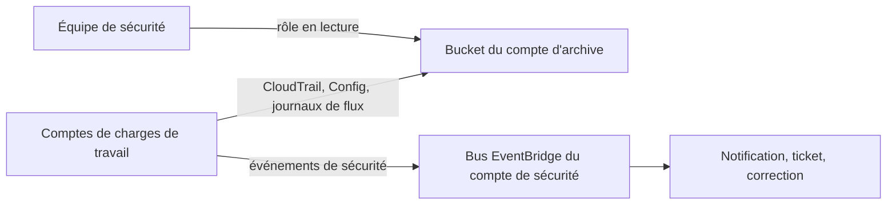

Un attaquant qui prend la main sur un compte commence souvent par la même action : **arrêter la journalisation**, puis effacer ce qui a déjà été enregistré. Si les journaux vivent dans le compte qu'il vient de compromettre, l'enquête s'arrête là. À l'échelle d'une organisation, la sécurité se conçoit en partant de cette hypothèse : **un compte finira par être compromis**.

## Mettre les journaux hors de portée



Les principes d'une archive de journaux :

- un **compte dédié**, auquel presque personne n'accède, et jamais les équipes des comptes surveillés ;
- un **trail d'organisation** CloudTrail, multi-régions, que les comptes membres ne peuvent ni arrêter ni modifier ; une SCP interdit en plus `cloudtrail:StopLogging` et `cloudtrail:DeleteTrail` ;
- la **validation de l'intégrité des fichiers** : CloudTrail publie des condensés signés qui prouvent qu'un fichier de journal n'a été ni modifié ni supprimé ;
- un bucket **versionné**, avec verrouillage d'objets si une durée de conservation est imposée, et une politique qui n'autorise que le **dépôt** ;
- un cycle de vie vers des classes d'archive, pour le coût.

Pour interroger ces journaux, on dispose d'Athena sur le bucket, ou de **CloudTrail Lake**. **AWS Config**, avec un agrégateur, conserve de son côté l'historique des **configurations** de tous les comptes.

## Détecter et notifier, pour tous les comptes

| Service | Détecte | À l'échelle de l'organisation |
| --- | --- | --- |
| **Amazon GuardDuty** | Menaces (comportements anormaux, communications suspectes) | Administrateur délégué ; activation automatique pour les nouveaux comptes |
| **AWS Config** | Écarts de configuration par rapport à des règles | Règles et **packs de conformité** déployés sur l'organisation ; correction automatique par des procédures Systems Manager |
| **Amazon Inspector** | Vulnérabilités logicielles | Administrateur délégué |
| **Amazon Macie** | Données sensibles dans S3 | Administrateur délégué |
| **IAM Access Analyzer** | Accès ouverts hors de l'organisation, accès inutilisés | Analyseur d'organisation |
| **AWS Security Hub** | Regroupe les constats de tous les précédents | Agrégation entre comptes et entre régions |

Le fil conducteur : chaque constat devient un **événement EventBridge**. Une règle filtre les événements qui comptent et les envoie vers une notification (SNS), un ticket, ou une **correction automatique** (une fonction Lambda, une procédure Systems Manager). Les règles se testent avant d'être posées, avec l'opération `TestEventPattern`.

Voici un motif qui repère l'arrêt ou la suppression d'un trail. Les événements des appels d'API arrivent dans EventBridge sous le type `AWS API Call via CloudTrail` :

```json
{
  "source": ["aws.cloudtrail"],
  "detail-type": ["AWS API Call via CloudTrail"],
  "detail": {
    "eventSource": ["cloudtrail.amazonaws.com"],
    "eventName": ["StopLogging", "DeleteTrail"]
  }
}
```

Un motif se lit comme un filtre : chaque champ cité doit valoir **l'une** des valeurs de sa liste ; les champs non cités sont ignorés.

## Défendre une application exposée

Les défenses s'empilent, de l'extérieur vers la donnée :

| Couche | Défense |
| --- | --- |
| Périphérie | **CloudFront** absorbe et filtre au plus loin de l'origine ; **AWS Shield Advanced** ajoute une protection DDoS renforcée, une visibilité sur les attaques et l'appui de l'équipe d'intervention d'AWS |
| Applicatif | **AWS WAF** : règles gérées, règles **fondées sur le débit** pour freiner une adresse trop insistante ; **AWS Firewall Manager** impose ces règles à tous les comptes |
| Réseau | Sous-réseaux privés, groupes de sécurité chaînés, origine accessible **seulement** depuis CloudFront, AWS Network Firewall pour l'inspection |
| Identité | Rôles au moindre privilège, sessions courtes, pas de clés durables |
| Donnée | Chiffrement, clés contrôlées, sauvegardes inaltérables |

Aucune couche ne suffit seule : c'est la **défense en profondeur**.

## Chiffrement, secrets, correctifs

- **Clés** : des clés KMS gérées par le client pour ce qui doit être contrôlé et audité ; des **clés multi-régions** quand une donnée chiffrée doit se déchiffrer dans une autre région ; **AWS CloudHSM** quand une réglementation impose un module matériel dédié. Les **subventions** (*grants*) accordent un usage temporaire et ciblé d'une clé à un service.
- **En transit** : TLS partout, y compris entre services internes ; certificats publics par ACM, certificats internes par une autorité de certification privée.
- **Secrets** : AWS Secrets Manager, avec rotation automatique et réplication entre régions ; les applications lisent le secret à l'exécution avec leur rôle.
- **Correctifs** : **Systems Manager Patch Manager** applique des référentiels de correctifs par groupes d'instances, dans des fenêtres de maintenance, et rend compte de la conformité. Pour les conteneurs et les fonctions, on reconstruit l'image ou on met à jour l'environnement d'exécution.
- **Moindre privilège, en continu** : les informations de dernier accès et IAM Access Analyzer montrent les droits jamais utilisés, à retirer.

## Les commandes du labo

Deux comptes : le tien, `000000000000`, joue un compte de charges de travail ; le compte `333333333333` (profil `archive`) est l'archive des journaux et possède le bucket `archive-journaux`.

```shell run
aws sts get-caller-identity --profile archive --query Account --output text
aws s3api get-bucket-versioning --bucket archive-journaux --profile archive
```

Un trail multi-régions, avec validation de l'intégrité, vers le bucket d'un autre compte :

```bash
aws cloudtrail create-trail --name organisation --s3-bucket-name archive-journaux \
  --is-multi-region-trail --enable-log-file-validation
aws cloudtrail start-logging --name organisation
```

Tester un motif EventBridge contre un événement d'exemple, **avant** de créer la règle :

```bash
aws events test-event-pattern --event-pattern file://motif.json --event file://evenement.json
```

:::warning Ce qui diffère du vrai AWS
L'émulateur enregistre le trail et la règle AWS Config, et il évalue **réellement** un motif EventBridge avec `test-event-pattern`. Mais il ne livre aucun fichier de journal dans le bucket, ne publie pas les appels d'API dans EventBridge (ta règle ne se déclenchera donc pas si tu arrêtes le trail), n'évalue pas les règles Config, et n'émule ni GuardDuty, ni Security Hub, ni Shield Advanced, ni Firewall Manager, ni Patch Manager. Un vrai trail **d'organisation** se crée depuis le compte de gestion ou un administrateur délégué, avec l'option prévue à cet effet ; le labo en reproduit seulement la forme.
:::

:::tip Chercher la réponse « organisation »
Quand un scénario dit « pour tous les comptes, y compris ceux qui seront créés », la bonne réponse s'appuie presque toujours sur un mécanisme d'organisation : trail d'organisation, administrateur délégué avec activation automatique, pack de conformité d'organisation, politique Firewall Manager, StackSet ciblant une unité d'organisation. Une solution à déployer « dans chaque compte » est rarement la meilleure.
:::

## Entraîne-toi

Tu prépares le bucket d'archive pour qu'il n'accepte que des dépôts de CloudTrail, tu crées le trail vers ce bucket, tu poses une règle de conformité, puis tu construis et tu testes l'alerte qui signalera toute tentative d'arrêter la journalisation.

```json file=politique-archive.json
{
  "Version": "2012-10-17",
  "Statement": [
    {
      "Sid": "LectureDesDroitsParCloudTrail",
      "Effect": "Allow",
      "Principal": {"Service": "cloudtrail.amazonaws.com"},
      "Action": "s3:GetBucketAcl",
      "Resource": "arn:aws:s3:::archive-journaux"
    },
    {
      "Sid": "DepotParCloudTrail",
      "Effect": "Allow",
      "Principal": {"Service": "cloudtrail.amazonaws.com"},
      "Action": "s3:PutObject",
      "Resource": "arn:aws:s3:::archive-journaux/AWSLogs/000000000000/*",
      "Condition": {"StringEquals": {"s3:x-amz-acl": "bucket-owner-full-control"}}
    }
  ]
}
```

```json file=motif.json
{
  "source": ["aws.cloudtrail"],
  "detail-type": ["AWS API Call via CloudTrail"],
  "detail": {
    "eventSource": ["cloudtrail.amazonaws.com"],
    "eventName": ["StopLogging", "DeleteTrail"]
  }
}
```

:::lab
engine: real
intro: |
  Le compte d'archive `333333333333` (profil `archive`) possède le bucket `archive-journaux`, encore sans politique. Ton compte par défaut, `000000000000`, est un compte de charges de travail ; le sujet SNS `alertes-securite` y existe. Ton dossier de travail contient `evenement.json`, un exemple d'événement d'arrêt de trail.
files:
  evenement.json: |
    {
      "id": "exemple-1",
      "account": "000000000000",
      "source": "aws.cloudtrail",
      "time": "2026-10-06T07:00:00Z",
      "region": "eu-west-3",
      "resources": [],
      "detail-type": "AWS API Call via CloudTrail",
      "detail": {
        "eventSource": "cloudtrail.amazonaws.com",
        "eventName": "StopLogging"
      }
    }
commands:
  - demarrer-aws
  - aws configure set aws_access_key_id 333333333333 --profile archive
  - aws configure set aws_secret_access_key test --profile archive
  - 'aws s3api head-bucket --bucket archive-journaux --profile archive 2>/dev/null || aws s3 mb s3://archive-journaux --profile archive'
  - aws sns create-topic --name alertes-securite
steps:
  - text: "Dans le compte d'archive (`--profile archive`), active le versionnage du bucket `archive-journaux`, puis applique-lui `politique-archive.json`"
    checks:
      - output-contains:
          - 'aws s3api get-bucket-versioning --bucket archive-journaux --profile archive --query Status --output text'
          - '^Enabled$'
      - output-contains:
          - 'aws s3api get-bucket-policy --bucket archive-journaux --profile archive --query Policy --output text'
          - 'cloudtrail\.amazonaws\.com'
      - output-contains:
          - 'aws s3api get-bucket-policy --bucket archive-journaux --profile archive --query Policy --output text'
          - 'archive-journaux/AWSLogs/000000000000/\*'
    solution:
      - write:
          politique-archive.json: |
            {
              "Version": "2012-10-17",
              "Statement": [
                {
                  "Sid": "LectureDesDroitsParCloudTrail",
                  "Effect": "Allow",
                  "Principal": {"Service": "cloudtrail.amazonaws.com"},
                  "Action": "s3:GetBucketAcl",
                  "Resource": "arn:aws:s3:::archive-journaux"
                },
                {
                  "Sid": "DepotParCloudTrail",
                  "Effect": "Allow",
                  "Principal": {"Service": "cloudtrail.amazonaws.com"},
                  "Action": "s3:PutObject",
                  "Resource": "arn:aws:s3:::archive-journaux/AWSLogs/000000000000/*",
                  "Condition": {"StringEquals": {"s3:x-amz-acl": "bucket-owner-full-control"}}
                }
              ]
            }
      - aws s3api put-bucket-versioning --bucket archive-journaux --versioning-configuration Status=Enabled --profile archive
      - aws s3api put-bucket-policy --bucket archive-journaux --policy file://politique-archive.json --profile archive
  - text: "Dans ton compte, crée le trail `organisation` vers le bucket `archive-journaux` : multi-régions, avec validation de l'intégrité des fichiers. Puis démarre la journalisation"
    checks:
      - output-contains:
          - "aws cloudtrail describe-trails --trail-name-list organisation --query 'trailList[].[IsMultiRegionTrail,LogFileValidationEnabled,S3BucketName]' --output text"
          - '^True\s+True\s+archive-journaux$'
      - output-contains:
          - 'aws cloudtrail get-trail-status --name organisation --query IsLogging --output text'
          - '^True$'
    solution:
      - aws cloudtrail create-trail --name organisation --s3-bucket-name archive-journaux --is-multi-region-trail --enable-log-file-validation
      - aws cloudtrail start-logging --name organisation
  - text: "Pose la règle AWS Config gérée `volumes-chiffres`, de source `ENCRYPTED_VOLUMES`, qui signale tout volume EBS non chiffré"
    hint: "aws configservice put-config-rule --config-rule '{\"ConfigRuleName\": \"volumes-chiffres\", \"Source\": {\"Owner\": \"AWS\", \"SourceIdentifier\": \"ENCRYPTED_VOLUMES\"}}'"
    checks:
      - output-contains:
          - "aws configservice describe-config-rules --config-rule-names volumes-chiffres --query 'ConfigRules[].[Source.Owner,Source.SourceIdentifier]' --output text"
          - '^AWS\s+ENCRYPTED_VOLUMES$'
    solution:
      - "aws configservice put-config-rule --config-rule '{\"ConfigRuleName\": \"volumes-chiffres\", \"Source\": {\"Owner\": \"AWS\", \"SourceIdentifier\": \"ENCRYPTED_VOLUMES\"}}'"
  - text: "Écris `motif.json`, puis **teste-le** contre `evenement.json` et garde le verdict : `aws events test-event-pattern --event-pattern file://motif.json --event file://evenement.json > verdict.json`"
    checks:
      - env-file-contains: [verdict.json, '"Result": true']
      - env-file-contains: [motif.json, '"DeleteTrail"']
    solution:
      - write:
          motif.json: |
            {
              "source": ["aws.cloudtrail"],
              "detail-type": ["AWS API Call via CloudTrail"],
              "detail": {
                "eventSource": ["cloudtrail.amazonaws.com"],
                "eventName": ["StopLogging", "DeleteTrail"]
              }
            }
      - aws events test-event-pattern --event-pattern file://motif.json --event file://evenement.json > verdict.json
  - text: "Crée la règle EventBridge `journalisation-arretee` à partir de `motif.json`, et donne-lui pour cible le sujet SNS `arn:aws:sns:eu-west-3:000000000000:alertes-securite`"
    hint: "aws events put-rule --name journalisation-arretee --event-pattern file://motif.json ; aws events put-targets --rule journalisation-arretee --targets Id=alerte,Arn=…"
    after: [4]
    checks:
      - output-contains:
          - 'aws events describe-rule --name journalisation-arretee --query EventPattern --output text'
          - 'StopLogging'
      - output-contains:
          - "aws events list-targets-by-rule --rule journalisation-arretee --query 'Targets[].Arn' --output text"
          - 'arn:aws:sns:eu-west-3:000000000000:alertes-securite'
    solution:
      - aws events put-rule --name journalisation-arretee --event-pattern file://motif.json
      - aws events put-targets --rule journalisation-arretee --targets Id=alerte,Arn=arn:aws:sns:eu-west-3:000000000000:alertes-securite
:::

## Vérifie tes acquis

:::quiz
Une organisation de quatre-vingts comptes veut un enregistrement de toute l'activité d'API, que les administrateurs des comptes membres ne puissent ni arrêter ni altérer. Quelle conception retenir ?

- [ ] Un trail créé dans chaque compte, vers un bucket local
- [ ] Un trail dans le compte de gestion seulement, limité à ce compte
- [x] Un trail d'organisation, avec validation de l'intégrité, vers un bucket d'un compte d'archive dédié, complété par une SCP qui interdit d'arrêter CloudTrail
- [ ] L'historique d'événements par défaut de chaque compte

> Le trail d'organisation couvre tous les comptes et échappe à leurs administrateurs ; le compte d'archive isole les journaux ; la validation d'intégrité prouve qu'ils n'ont pas été modifiés.
:::

:::quiz
L'équipe de sécurité veut qu'un constat critique de GuardDuty, dans n'importe quel compte, crée automatiquement un ticket et isole l'instance concernée. Quel enchaînement mettre en place ?

- [ ] Un rapport hebdomadaire envoyé par courriel
- [x] Une règle EventBridge sur les constats, qui déclenche une notification et une fonction ou une procédure de correction
- [ ] Une SCP qui interdit les instances compromises
- [ ] Une alarme de facturation

> Les constats sont publiés comme événements. Une règle EventBridge les filtre et déclenche notification et correction automatique, depuis le compte administrateur délégué.
:::

:::quiz
Un site marchand mondial subit des vagues de requêtes automatisées qui saturent sa page de connexion, depuis des milliers d'adresses. Quelle défense répond le plus directement à ce problème ?

- [ ] Un groupe de sécurité qui liste les adresses à bloquer
- [ ] Des instances plus grosses derrière le répartiteur de charge
- [ ] Un VPN pour les clients
- [x] AWS WAF, avec une règle fondée sur le débit, placé devant l'application sur CloudFront

> Une règle fondée sur le débit bloque automatiquement les adresses qui dépassent un seuil de requêtes, à la périphérie, avant que le trafic n'atteigne l'origine. Un groupe de sécurité ne sait pas refuser et ne suit pas des milliers d'adresses changeantes.
:::

:::quiz
Des données chiffrées avec KMS sont répliquées vers une seconde région, où elles doivent pouvoir être déchiffrées même si la première région est injoignable. Que choisir ?

- [ ] Une clé gérée par AWS dans chaque région
- [ ] Recopier le matériel de clé à la main dans la seconde région
- [x] Une clé KMS multi-régions, avec une réplique dans la seconde région
- [ ] Désactiver le chiffrement dans la région de secours

> Les clés multi-régions partagent le même matériel de clé : ce qui est chiffré dans une région se déchiffre dans l'autre sans appel entre régions.
:::
