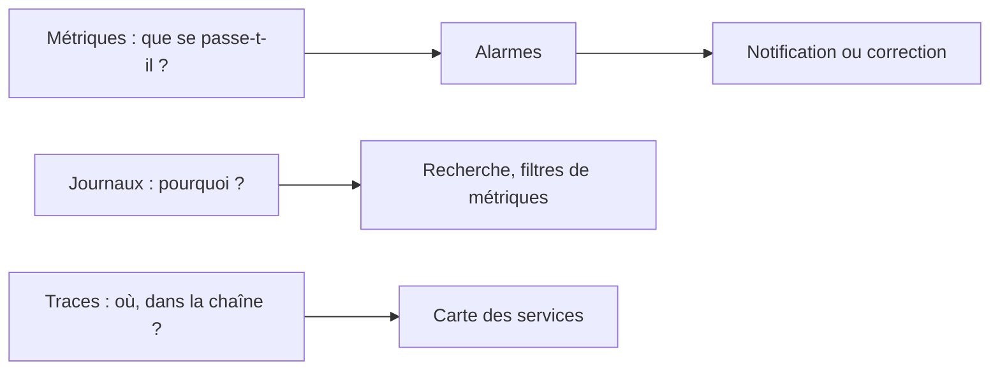
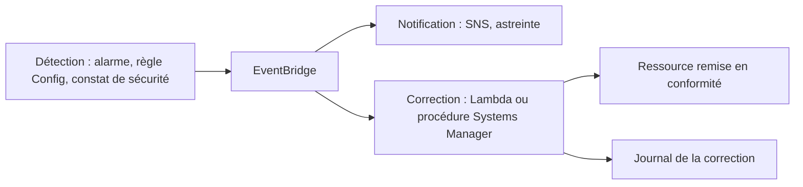

Trois heures du matin : la file de rebut des commandes se remplit depuis minuit. Personne ne le sait, parce que l'alarme existante surveille le processeur des serveurs, qui va très bien. À huit heures, deux cents commandes sont à retraiter à la main. Le système ne manquait pas de mesures ; il lui manquait **la bonne**, reliée à **une action**.

## De l'exigence à l'indicateur

Une exigence comme « les commandes sont traitées rapidement » ne se surveille pas. Il faut la traduire :

| Exigence | Indicateur mesurable | Alarme |
| --- | --- | --- |
| « Aucune commande perdue » | Nombre de messages dans la file de rebut | Supérieur à 0 |
| « Traitement rapide » | Âge du plus ancien message de la file | Supérieur à 5 minutes |
| « Le site répond » | Taux d'erreurs 5xx du répartiteur de charge ; latence au 99e centile | Au-dessus du seuil pendant 3 minutes |
| « Le parcours d'achat fonctionne » | Résultat d'un scénario joué en continu | Deux échecs consécutifs |

Les métriques qui parlent du **résultat pour l'utilisateur** (erreurs, latence, commandes traitées) font de meilleures alarmes que celles qui parlent des **ressources** (processeur, mémoire), utiles surtout au diagnostic.

## Métriques, journaux, traces



| Besoin | Outil |
| --- | --- |
| Suivre une valeur dans le temps, y compris une valeur métier publiée par l'application | **Métriques CloudWatch**, standard ou personnalisées |
| Être prévenu·e | **Alarmes** : sur seuil, sur détection d'anomalie, ou **composites** (plusieurs alarmes combinées, pour éviter les avalanches) |
| Chercher dans les journaux, en tirer une métrique | **CloudWatch Logs** : requêtes Logs Insights, **filtres de métriques** (compter les lignes « ERROR ») |
| Suivre une requête à travers plusieurs services | **AWS X-Ray** |
| Vérifier de l'extérieur qu'un parcours fonctionne | **CloudWatch Synthetics** (scénarios joués à intervalles réguliers) |
| Voir plusieurs comptes d'un coup | L'observabilité **inter-comptes** de CloudWatch, vers un compte de supervision |

Deux réglages d'alarme évitent bien des faux positifs : le nombre de périodes à franchir avant de sonner, et le traitement des **données manquantes** (une métrique qui ne s'émet qu'en cas de problème n'a, la plupart du temps, aucune donnée : il faut dire que cette absence n'est **pas** une violation).

## De l'alarme à la correction

Réveiller quelqu'un pour une action toujours identique est un défaut de conception. Le motif de base :



| Déclencheur | Correction automatique typique |
| --- | --- |
| Alarme CloudWatch | Action de mise à l'échelle ; redémarrage ou récupération d'une instance ; retour arrière d'un déploiement |
| Règle AWS Config non respectée | Procédure **Systems Manager Automation** associée à la règle |
| Événement EventBridge (changement d'état, constat, événement applicatif) | Fonction Lambda, flux Step Functions, procédure Systems Manager |
| Contrôle de santé en échec | Remplacement par le groupe Auto Scaling ; bascule Route 53 |

Une correction automatique doit être **idempotente** (la rejouer ne casse rien), **limitée** dans ses droits, et **tracée**. On automatise en priorité ce qui est fréquent, sans ambiguïté et sans risque ; le reste reste une alerte accompagnée d'une procédure écrite.

## Exploiter un parc : AWS Systems Manager

| Outil | Usage |
| --- | --- |
| **Session Manager** | Ouvrir une session sur une instance sans port SSH ni bastion, avec journalisation |
| **Run Command** | Exécuter une commande sur un groupe d'instances |
| **Automation** | Des procédures (*runbooks*) en plusieurs étapes, avec approbations |
| **Patch Manager** | Appliquer et suivre les correctifs |
| **State Manager** | Maintenir une configuration voulue |
| **Parameter Store** | Centraliser les paramètres de configuration |
| **Incident Manager**, **OpsCenter** | Coordonner la réponse aux incidents et suivre les problèmes d'exploitation |

## S'exercer à la panne

On ne sait qu'un système se rétablit qu'après l'avoir vu se rétablir. **AWS Fault Injection Service** provoque des pannes contrôlées (arrêt d'instances, latence réseau, indisponibilité d'une zone) avec des conditions d'arrêt ; les **journées d'exercice** (*game days*) font dérouler les procédures par les équipes. Chaque exercice doit vérifier une hypothèse précise : « si la zone A tombe, le taux d'erreurs reste sous 1 % ».

## Les commandes du labo

Une application publie une métrique métier avec `put-metric-data`, et une alarme la surveille :

```bash
aws cloudwatch put-metric-alarm --alarm-name rebut-non-vide \
  --namespace Asso/Commandes --metric-name MessagesAuRebut \
  --statistic Maximum --period 60 --evaluation-periods 1 \
  --threshold 0 --comparison-operator GreaterThanThreshold \
  --treat-missing-data notBreaching \
  --alarm-actions arn:aws:sns:eu-west-3:000000000000:astreinte
aws cloudwatch put-metric-data --namespace Asso/Commandes --metric-name MessagesAuRebut --value 3
```

- `--statistic Maximum --period 60` : on regarde la plus grande valeur de chaque minute.
- `--threshold 0 --comparison-operator GreaterThanThreshold` : l'alarme sonne dès que cette valeur dépasse 0.
- `--treat-missing-data notBreaching` : pas de donnée, pas de problème.
- `--alarm-actions` : le sujet SNS prévenu quand l'alarme passe à l'état `ALARM`.

Pour qu'une règle EventBridge puisse appeler une fonction Lambda, la fonction doit l'y **autoriser** par sa politique de ressource :

```bash
aws lambda add-permission --function-name corriger-versionnage --statement-id depuis-eventbridge \
  --action lambda:InvokeFunction --principal events.amazonaws.com \
  --source-arn arn:aws:events:eu-west-3:000000000000:rule/seau-sans-versionnage
```

Un événement applicatif se publie avec `put-events` ; son champ `Detail` est un texte JSON :

```bash
aws events put-events --entries file://evenement.json
```

Dans le labo, le sujet `astreinte` est déjà relié à la file `astreinte-tickets`, qui joue le rôle de l'outil d'astreinte :

```shell run
aws sns list-subscriptions-by-topic --topic-arn arn:aws:sns:eu-west-3:000000000000:astreinte --query 'Subscriptions[].Endpoint' --output text
aws s3api get-bucket-versioning --bucket donnees-clients
```

:::warning Ce qui diffère du vrai AWS
Tout ce labo s'exécute **réellement** dans l'émulateur : l'alarme est évaluée, la notification part, la règle EventBridge appelle la fonction, et la fonction corrige le bucket avec les droits de son rôle. Les écarts : l'alarme réagit ici en quelques secondes, alors qu'une alarme réelle attend la fin de sa période ; il n'y a ni détection d'anomalie, ni tableaux de bord, ni X-Ray, ni Systems Manager Automation, ni Fault Injection Service. Sur le vrai AWS, enfin, c'est AWS Config (ou un constat de sécurité) qui émettrait l'événement de non-conformité ; ici, tu l'émets toi-même.
:::

:::tip Une alarme sans destinataire ne sert à rien
Avant de créer une alarme, réponds à deux questions : **qui** la reçoit, et **que fait-il ou elle** en la recevant ? Si la réponse à la seconde est toujours la même, automatise-la.
:::

## Entraîne-toi

Tu mets sous surveillance la file de rebut des commandes, tu vérifies que l'alerte arrive bien à l'astreinte, puis tu montes une correction automatique : tout bucket signalé sans versionnage est corrigé sans intervention humaine.

```json file=evenement.json
[
  {
    "Source": "asso.conformite",
    "DetailType": "SeauSansVersionnage",
    "Detail": "{\"seau\": \"donnees-clients\"}"
  }
]
```

:::lab
engine: real
intro: |
  Sont en place : le sujet SNS `astreinte`, abonné à la file SQS `astreinte-tickets` ; le bucket `donnees-clients`, sans versionnage ; le rôle `role-correction`, qui autorise à activer le versionnage d'un bucket ; et, dans ton dossier de travail, la fonction `corriger.py`. Tout ce que tu configures ici s'exécute réellement.
files:
  corriger.py: |
    import boto3


    def handler(event, context):
        seau = event["detail"]["seau"]
        boto3.client("s3").put_bucket_versioning(
            Bucket=seau, VersioningConfiguration={"Status": "Enabled"}
        )
        print("Versionnage activé sur", seau)
        return {"corrige": seau}
  labo/confiance-lambda.json: |
    {
      "Version": "2012-10-17",
      "Statement": [
        {
          "Effect": "Allow",
          "Principal": {"Service": "lambda.amazonaws.com"},
          "Action": "sts:AssumeRole"
        }
      ]
    }
  labo/droits-correction.json: |
    {
      "Version": "2012-10-17",
      "Statement": [
        {
          "Effect": "Allow",
          "Action": "s3:PutBucketVersioning",
          "Resource": "arn:aws:s3:::*"
        },
        {
          "Effect": "Allow",
          "Action": ["logs:CreateLogGroup", "logs:CreateLogStream", "logs:PutLogEvents"],
          "Resource": "*"
        }
      ]
    }
  labo/file-astreinte.json: |
    {"Policy": "{\"Version\":\"2012-10-17\",\"Statement\":[{\"Effect\":\"Allow\",\"Principal\":{\"Service\":\"sns.amazonaws.com\"},\"Action\":\"sqs:SendMessage\",\"Resource\":\"arn:aws:sqs:eu-west-3:000000000000:astreinte-tickets\",\"Condition\":{\"ArnEquals\":{\"aws:SourceArn\":\"arn:aws:sns:eu-west-3:000000000000:astreinte\"}}}]}"}
commands:
  - demarrer-aws
  - aws sns create-topic --name astreinte
  - aws sqs create-queue --queue-name astreinte-tickets --attributes file://labo/file-astreinte.json
  - 'aws sns list-subscriptions-by-topic --topic-arn arn:aws:sns:eu-west-3:000000000000:astreinte --query "Subscriptions[].Endpoint" --output text | grep -q astreinte-tickets || aws sns subscribe --topic-arn arn:aws:sns:eu-west-3:000000000000:astreinte --protocol sqs --notification-endpoint arn:aws:sqs:eu-west-3:000000000000:astreinte-tickets'
  - 'aws s3api head-bucket --bucket donnees-clients 2>/dev/null || aws s3 mb s3://donnees-clients'
  - 'aws iam get-role --role-name role-correction >/dev/null 2>&1 || aws iam create-role --role-name role-correction --assume-role-policy-document file://labo/confiance-lambda.json'
  - aws iam put-role-policy --role-name role-correction --policy-name corriger --policy-document file://labo/droits-correction.json
steps:
  - text: "Crée l'alarme `rebut-non-vide` sur la métrique `MessagesAuRebut` de l'espace de noms `Asso/Commandes` : elle sonne quand le maximum sur une minute dépasse 0, ignore les données manquantes et prévient le sujet `astreinte`"
    hint: "La commande aws cloudwatch put-metric-alarm de la leçon. L'étape suivante vérifiera que la notification part bien vers le sujet astreinte."
    checks:
      - output-contains:
          - "aws cloudwatch describe-alarms --alarm-names rebut-non-vide --query 'MetricAlarms[0].[Namespace,MetricName,ComparisonOperator,Threshold,EvaluationPeriods]' --output text"
          - '^Asso/Commandes\s+MessagesAuRebut\s+GreaterThanThreshold\s+0(\.0)?\s+1$'
    solution:
      - aws cloudwatch put-metric-alarm --alarm-name rebut-non-vide --namespace Asso/Commandes --metric-name MessagesAuRebut --statistic Maximum --period 60 --evaluation-periods 1 --threshold 0 --comparison-operator GreaterThanThreshold --treat-missing-data notBreaching --alarm-actions arn:aws:sns:eu-west-3:000000000000:astreinte
  - text: "Simule l'incident : publie la valeur `3` pour la métrique, attends une quinzaine de secondes, puis lis la file `astreinte-tickets` en gardant la notification dans `notification.json`"
    hint: "aws cloudwatch put-metric-data --namespace Asso/Commandes --metric-name MessagesAuRebut --value 3 ; puis aws sqs receive-message --queue-url http://127.0.0.1:4566/000000000000/astreinte-tickets --visibility-timeout 0 > notification.json"
    after: [1]
    checks:
      - env-file-contains: [notification.json, 'rebut-non-vide']
      - env-file-contains: [notification.json, 'ALARM']
    solution:
      - aws cloudwatch put-metric-data --namespace Asso/Commandes --metric-name MessagesAuRebut --value 3
      - sleep 15
      - aws sqs receive-message --queue-url http://127.0.0.1:4566/000000000000/astreinte-tickets --visibility-timeout 0 > notification.json
  - text: "Déploie la fonction de correction : crée `corriger-versionnage` à partir de `corriger.py` (environnement `python3.13`, point d'entrée `corriger.handler`, rôle `role-correction`, durée maximale 10 secondes)"
    checks:
      - output-contains:
          - "aws lambda get-function-configuration --function-name corriger-versionnage --query '[Handler,Role]' --output text"
          - '^corriger\.handler\s+arn:aws:iam::000000000000:role/role-correction$'
    solution:
      - zip corriger.zip corriger.py
      - aws lambda create-function --function-name corriger-versionnage --runtime python3.13 --handler corriger.handler --zip-file fileb://corriger.zip --role arn:aws:iam::000000000000:role/role-correction --timeout 10
      - aws lambda wait function-active-v2 --function-name corriger-versionnage
  - text: "Crée la règle EventBridge `seau-sans-versionnage` (source `asso.conformite`, type de détail `SeauSansVersionnage`), autorise-la à appeler la fonction (`aws lambda add-permission`) et donne-lui la fonction pour cible"
    hint: "aws events put-rule --name seau-sans-versionnage --event-pattern '{\"source\": [\"asso.conformite\"], \"detail-type\": [\"SeauSansVersionnage\"]}'"
    after: [3]
    checks:
      - output-contains:
          - 'aws events describe-rule --name seau-sans-versionnage --query EventPattern --output text'
          - 'SeauSansVersionnage'
      - output-contains:
          - "aws events list-targets-by-rule --rule seau-sans-versionnage --query 'Targets[].Arn' --output text"
          - 'function:corriger-versionnage$'
      - output-contains:
          - 'aws lambda get-policy --function-name corriger-versionnage --query Policy --output text'
          - 'events\.amazonaws\.com'
    solution:
      - "aws events put-rule --name seau-sans-versionnage --event-pattern '{\"source\": [\"asso.conformite\"], \"detail-type\": [\"SeauSansVersionnage\"]}'"
      - aws lambda add-permission --function-name corriger-versionnage --statement-id depuis-eventbridge --action lambda:InvokeFunction --principal events.amazonaws.com --source-arn arn:aws:events:eu-west-3:000000000000:rule/seau-sans-versionnage
      - aws events put-targets --rule seau-sans-versionnage --targets Id=correction,Arn=arn:aws:lambda:eu-west-3:000000000000:function:corriger-versionnage
  - text: "Écris `evenement.json` et publie-le avec `aws events put-events` : la fonction doit activer d'elle-même le versionnage du bucket `donnees-clients`"
    after: [4]
    checks:
      - output-contains:
          - 'aws s3api get-bucket-versioning --bucket donnees-clients --query Status --output text'
          - '^Enabled$'
      - output-contains:
          - "aws logs filter-log-events --log-group-name /aws/lambda/corriger-versionnage --query 'events[].message' --output text"
          - 'Versionnage activé sur donnees-clients'
    solution:
      - write:
          evenement.json: |
            [
              {
                "Source": "asso.conformite",
                "DetailType": "SeauSansVersionnage",
                "Detail": "{\"seau\": \"donnees-clients\"}"
              }
            ]
      - aws events put-events --entries file://evenement.json
  - text: "Les journaux de la correction doivent être conservés 30 jours, pas indéfiniment : règle la rétention du groupe `/aws/lambda/corriger-versionnage`"
    hint: "aws logs put-retention-policy --log-group-name /aws/lambda/corriger-versionnage --retention-in-days 30"
    after: [5]
    checks:
      - output-contains:
          - "aws logs describe-log-groups --log-group-name-prefix /aws/lambda/corriger-versionnage --query 'logGroups[0].retentionInDays' --output text"
          - '^30$'
    solution:
      - aws logs put-retention-policy --log-group-name /aws/lambda/corriger-versionnage --retention-in-days 30
:::

## Vérifie tes acquis

:::quiz
Une alarme surveille une métrique que l'application ne publie qu'en cas d'erreur. Elle reste la plupart du temps dans l'état « données insuffisantes » et déclenche des notifications parasites. Quel réglage corriger ?

- [ ] Réduire la période à une seconde
- [x] Traiter les données manquantes comme non violantes
- [ ] Remplacer la statistique Maximum par Minimum
- [ ] Supprimer l'action de l'alarme

> Une métrique émise seulement en cas de problème n'a pas de données quand tout va bien. Dire que l'absence de données n'est pas une violation garde l'alarme dans l'état normal.
:::

:::quiz
Une panne en cascade déclenche quarante alarmes en deux minutes, et l'astreinte ne sait plus laquelle traiter. Quelle évolution réduit ce bruit sans perdre d'information ?

- [ ] Supprimer les alarmes les moins importantes
- [ ] Augmenter tous les seuils de 50 %
- [x] Une alarme composite, qui ne notifie que sur une combinaison significative d'alarmes
- [ ] Envoyer les notifications par courriel plutôt que par SMS

> L'alarme composite combine plusieurs alarmes par des conditions logiques : une seule notification porte le symptôme utile, les alarmes de détail restent consultables.
:::

:::quiz
Une règle AWS Config détecte régulièrement des groupes de sécurité ouvrant le port 22 au monde entier. L'équipe veut que la règle fautive soit retirée sans intervention humaine, de façon tracée. Que mettre en place ?

- [ ] Un courriel quotidien aux propriétaires des comptes
- [ ] Une SCP qui interdit la création de groupes de sécurité
- [ ] Un tableau de bord CloudWatch
- [x] Une action de correction automatique associée à la règle, qui exécute une procédure Systems Manager Automation

> AWS Config peut associer à une règle une procédure de correction exécutée automatiquement sur les ressources non conformes, avec un historique d'exécution.
:::

:::quiz
Une équipe affirme que son application supporte la perte d'une zone de disponibilité, sans l'avoir jamais vérifié. Quelle démarche valide cette affirmation ?

- [ ] Relire le schéma d'architecture en réunion
- [ ] Doubler le nombre d'instances par précaution
- [x] Provoquer la panne de façon contrôlée, avec AWS Fault Injection Service, et mesurer l'effet sur les indicateurs
- [ ] Attendre la prochaine panne réelle

> Seule une expérience contrôlée, avec une hypothèse mesurable et des conditions d'arrêt, montre que le système se comporte comme prévu.
:::
