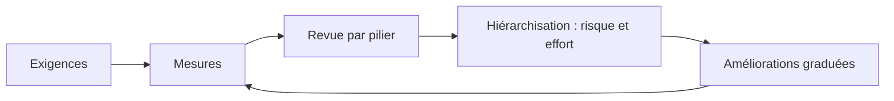
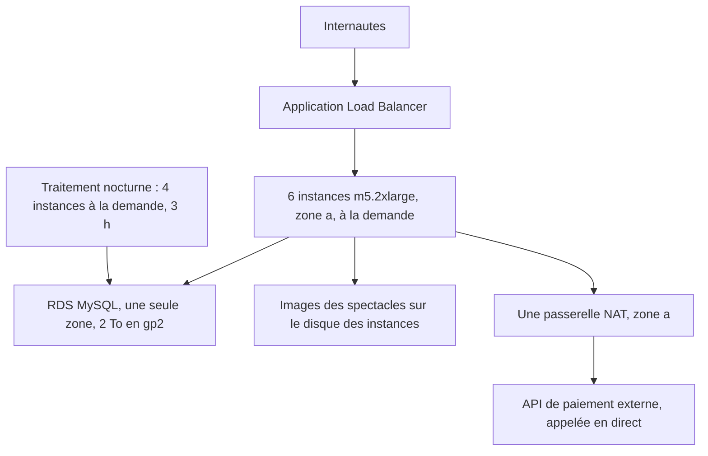

On ne te demandera presque jamais de concevoir sur une page blanche. On te montrera un système qui fonctionne, qui rapporte de l'argent, que personne n'ose toucher, et on te demandera de le rendre **plus fiable, plus rapide ou moins cher**, sans l'arrêter. Cette leçon n'a pas de labo : la facturation, la charge réelle et les pannes ne s'émulent pas. Elle te donne une méthode, puis l'applique à un cas.

## La méthode : mesurer, hiérarchiser, graduer

1. **Partir des exigences**, pas de la technique : quel niveau de service est promis (disponibilité, temps de réponse), quel budget, quelles contraintes réglementaires ?
2. **Mesurer l'existant** : indicateurs de service, utilisation des ressources, facture détaillée. Une optimisation sans mesure est une opinion.
3. **Passer les piliers en revue** (l'outil AWS Well-Architected Tool sert à cela) et lister les écarts.
4. **Hiérarchiser** par risque et par effort : un point de défaillance unique sur la base de données passe avant un gain de 3 % sur la facture.
5. **Graduer** les réponses : d'abord ce qui ne demande aucun changement applicatif, ensuite ce qui touche à l'architecture.

## L'étude de cas : une billetterie en ligne

La billetterie de la fédération vend des places de spectacle. Son architecture, héritée d'une migration rapide :

Les constats rapportés : le site tombe à chaque ouverture de vente importante ; la page d'accueil met quatre secondes à s'afficher ; la facture a doublé en un an ; le traitement nocturne ralentit le site jusqu'à 3 h du matin.

### Fiabilité : chasser les points de défaillance uniques

| Constat | Risque | Amélioration, de la plus simple à la plus structurante |
| --- | --- | --- |
| Toutes les instances dans la zone a | Une panne de zone arrête tout | Groupe Auto Scaling sur trois zones |
| Base dans une seule zone | Perte du service, voire des données | Déploiement Multi-AZ (un réglage, sans changement applicatif) |
| Images sur le disque des instances | Perdues quand une instance est remplacée ; interdisent la mise à l'échelle | Les déplacer dans S3 (ou EFS si l'application exige un système de fichiers) |
| Une seule passerelle NAT | La sortie vers le paiement disparaît avec la zone a | Une passerelle NAT par zone |
| Paiement appelé en direct | Un ralentissement du prestataire bloque les ventes | File SQS et traitement asynchrone, avec file de rebut |
| Quotas jamais vérifiés | La mise à l'échelle échoue au pire moment | Suivre les quotas (Service Quotas, Trusted Advisor) et les relever à l'avance |

Deux façons de grandir : **verticalement** (*scale up*, une machine plus grosse : simple, mais plafonné et avec interruption) et **horizontalement** (*scale out*, plus de machines : sans plafond, à condition que l'application soit sans état). Sortir les images et les sessions des instances est ce qui **rend possible** la mise à l'échelle horizontale.

### Performance : trouver le goulot avant d'agir

Les mesures montrent : processeur des instances à 25 %, processeur de la base à 95 % pendant les ventes, 90 % de requêtes de lecture, et des images servies depuis Paris à un public mondial.

| Goulot | Motif | Mise en œuvre |
| --- | --- | --- |
| Lectures répétées sur la base | **Mise en cache** | ElastiCache devant la base, pour le catalogue des spectacles |
| Lectures lourdes (rapports, traitement nocturne) | **Réplicas** | Réplica en lecture, vers lequel pointe le traitement nocturne |
| Pic d'écritures à l'ouverture des ventes | **Mise en tampon** | File SQS : les commandes s'accumulent, la base écrit à son rythme |
| Contenu statique servi de loin | **Diffusion à la périphérie** | CloudFront devant S3 et devant le répartiteur de charge |
| Verrous sur la table des places | **Base adaptée à l'usage** | Un magasin clé-valeur (DynamoDB) pour l'inventaire des places, la base relationnelle gardant les commandes |

Remarque de méthode : doubler la taille des instances n'aurait **rien** changé, puisqu'elles sont à 25 % de processeur. C'est le piège classique des réponses fausses : traiter un composant qui n'est pas le goulot.

### Coût : supprimer, dimensionner, puis s'engager

| Poste | Constat | Action |
| --- | --- | --- |
| 6 instances `m5.2xlarge` à 25 % | Surdimensionnées | **Juste dimensionnement** (AWS Compute Optimizer), puis mise à l'échelle automatique : moins d'instances la nuit |
| Tout à la demande | Base de charge stable depuis un an | **Savings Plan** sur la base de charge, une fois le dimensionnement corrigé |
| Traitement nocturne | Interruptible, 3 h par nuit | **Instances Spot** |
| 2 To en gp2 | Volume agrandi pour ses IOPS, rempli à 15 % | Passage à **gp3**, IOPS provisionnées séparément |
| Images jamais archivées | Tout en accès immédiat | **Cycle de vie** S3, ou Intelligent-Tiering |
| Ligne « NAT » et « transfert » | Trafic vers S3 par la passerelle NAT ; téléchargements servis en direct | **Point de terminaison de passerelle** S3 ; CloudFront |

L'ordre compte : **supprimer** l'inutile, **dimensionner** au plus juste, et **seulement ensuite** s'engager. S'engager trois ans sur six instances deux fois trop grosses, c'est figer le gaspillage.

## Modéliser le transfert de données

Le transfert est le poste le plus mal anticipé. Les règles générales à avoir en tête :

| Trajet | Facturation |
| --- | --- |
| D'Internet vers AWS | Non facturé |
| D'AWS vers Internet | Facturé au volume ; souvent moins cher via CloudFront |
| Entre deux régions | Facturé, à la sortie de la région d'origine |
| Entre deux zones d'une même région | Facturé, dans les deux sens |
| À travers une passerelle NAT | Facturé au volume traité, en plus de l'heure |
| Vers S3 ou DynamoDB par un point de terminaison de passerelle | Pas de frais de point de terminaison |
| Par Direct Connect, en sortie | Tarif au volume généralement inférieur à celui d'Internet |

Une architecture « bavarde » entre zones ou entre régions peut coûter davantage en transfert qu'en calcul. Avant de répartir un système, estime les volumes échangés entre ses parties.

## Voir et répartir les coûts à l'échelle de l'organisation

- **Étiquettes d'allocation des coûts**, rendues cohérentes par des **politiques d'étiquettes**, pour rattacher chaque dépense à une unité métier ; les comptes eux-mêmes sont le premier niveau de répartition.
- **AWS Cost and Usage Report**, interrogé avec Athena, pour le détail ligne à ligne ; **Cost Explorer** pour les tendances et les recommandations.
- **AWS Budgets** et les alarmes de facturation, réglés sur le **profil attendu** de dépense, pas sur un plafond annuel.
- **Compute Optimizer** et **S3 Storage Lens** pour repérer le surdimensionnement et le stockage dormant ; **Trusted Advisor** pour les ressources inactives.
- Les réductions des **Savings Plans** et des instances réservées se **partagent** par défaut entre les comptes d'une organisation : on les achète de façon centralisée, pour la base de charge de l'ensemble. Ce partage peut être désactivé pour un compte.

:::warning Ce que cette leçon ne peut pas te donner
Lire une étude de cas n'est pas mener une revue. Sur un vrai système, les mesures sont incomplètes, les exigences se contredisent et chaque changement a un propriétaire à convaincre. L'examen, lui, te présentera des cas voisins de celui-ci en quelques lignes, avec quatre réponses qui améliorent toutes quelque chose : la bonne est celle qui traite **le constat de l'énoncé** au **moindre changement**.
:::

:::tip Trois réflexes pour les scénarios d'amélioration
Repère la **mesure** citée dans l'énoncé : c'est elle qui désigne le goulot. Préfère l'amélioration qui **ne modifie pas l'application** quand l'énoncé dit « sans changement de code » ou « au plus vite ». Méfie-toi des réponses qui reconstruisent tout : elles sont rarement « la plus économique » ni « la moins risquée ».
:::

## Vérifie tes acquis

:::quiz
Un site ralentit fortement à chaque pic. Les mesures montrent des serveurs applicatifs à 20 % de processeur et une base de données relationnelle saturée, avec 85 % de requêtes de lecture identiques. Quelle amélioration traiter en premier ?

- [ ] Doubler la taille des serveurs applicatifs
- [ ] Ajouter des serveurs applicatifs au groupe Auto Scaling
- [x] Mettre en cache les lectures fréquentes et diriger les autres lectures vers un réplica
- [ ] Déplacer les serveurs applicatifs dans une autre région

> Le goulot est la base, en lecture. Agir sur les serveurs applicatifs, qui ne sont pas chargés, ne changerait rien.
:::

:::quiz
Une organisation veut réduire sa facture de calcul. Ses instances sont utilisées à 15 % en moyenne et tournent à la demande depuis deux ans. Dans quel ordre agir ?

- [ ] Acheter un Savings Plan sur trois ans, puis réduire la taille des instances
- [x] Dimensionner les instances au plus juste, puis couvrir la base de charge restante par un Savings Plan
- [ ] Passer toutes les instances en Spot
- [ ] Réserver des hôtes dédiés

> S'engager avant de dimensionner fige une capacité inutile pour trois ans. On corrige d'abord la taille, puis on s'engage sur ce qui reste stable.
:::

:::quiz
Une application répartie sur trois zones de disponibilité échange en permanence de gros volumes entre ses services, et la ligne « transfert de données » de sa facture dépasse celle du calcul. Quelle piste examiner en premier ?

- [ ] Remplacer les instances par des instances plus grosses
- [ ] Désactiver le chiffrement en transit
- [ ] Ajouter une quatrième zone de disponibilité
- [x] Réduire les échanges entre zones : garder dans la même zone les appels entre composants très liés, ou compresser et regrouper les échanges

> Le trafic entre zones est facturé dans les deux sens. Faire en sorte qu'un composant appelle de préférence ses voisins de la même zone réduit ce volume sans renoncer à la répartition.
:::

:::quiz
Un traitement nocturne interroge la base de production et dégrade le site pendant trois heures. L'équipe ne peut pas modifier le traitement cette année. Quelle amélioration demande le moins de changement ?

- [ ] Réécrire le traitement en fonctions Lambda
- [ ] Migrer la base vers DynamoDB
- [x] Créer un réplica en lecture et y faire pointer la chaîne de connexion du traitement
- [ ] Décaler le traitement à midi

> Changer la chaîne de connexion suffit à sortir la charge de lecture de l'instance principale, sans toucher au code du traitement.
:::
