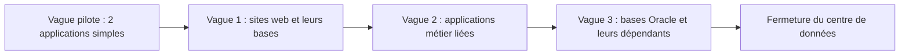

La fédération doit quitter son centre de données dans dix-huit mois : le bail ne sera pas renouvelé. Trois cents serveurs, quarante applications, deux bases Oracle dont plus personne ne connaît toutes les dépendances, et 80 téraoctets de documents. « On copie tout sur AWS » n'est pas un plan : c'est la description du problème.

## Trois phases

| Phase | Ce qu'on y fait | Outils |
| --- | --- | --- |
| **Évaluer** (*assess*) | Inventaire, dépendances, coût total actuel et cible, dossier de décision | **Migration Evaluator** (dossier économique), **AWS Application Discovery Service** (inventaire, utilisation, connexions réseau entre serveurs) |
| **Mobiliser** (*mobilize*) | Préparer le terrain : zone d'accueil, réseau, identités, compétences, premières migrations pilotes | **AWS Control Tower**, Direct Connect ou VPN, IAM Identity Center |
| **Migrer et moderniser** | Déplacer par vagues, puis améliorer | **AWS Migration Hub** (suivi), outils de transfert ci-dessous |

L'inventaire se fait **sans agent** (un collecteur interroge l'hyperviseur : configuration et utilisation) ou **avec agent** (sur chaque serveur : processus et **connexions réseau**, indispensables pour reconstituer les dépendances).

Le **coût total de possession** (TCO) compare ce qui est comparable : matériel et son renouvellement, licences, locaux, énergie, personnel d'exploitation d'un côté ; services, transfert de données, support et effort de migration de l'autre. Comparer seulement le prix d'un serveur au prix d'une instance fausse la décision dans les deux sens.

## Choisir une stratégie par application

Les « 7 R » s'appliquent **application par application**, selon sa valeur, son état et les contraintes :

| Situation | Stratégie | Outil principal |
| --- | --- | --- |
| Plus personne ne s'en sert | *Retire* | — |
| Dépend d'un matériel spécifique, ou vient d'être rénovée | *Retain* | — |
| Délai court, application standard, pas de budget de transformation | *Rehost* | **AWS Application Migration Service** |
| Parc VMware à déplacer tel quel | *Relocate* | Offres VMware sur AWS |
| Un équivalent SaaS existe | *Repurchase* | — |
| Gain rapide sans réécriture : base gérée, conteneurs | *Replatform* | **AWS DMS**, conteneurisation |
| Application stratégique, freinée par son architecture | *Refactor* | Leçon 10 |

Pour une grande migration, on **réhéberge ou replateforme d'abord**, et on modernise ensuite : transformer pendant qu'on déplace cumule les risques.

**AWS Application Migration Service** (que la documentation récente présente aussi sous le nom AWS Transform MGN) réplique en continu les disques des serveurs sources, au niveau **bloc**, vers une zone d'attente ; on lance des instances de **test** sans toucher à la source, puis on bascule avec une interruption de quelques minutes.

### Le découpage en vagues

On regroupe les applications en **vagues** d'après leurs dépendances : ce qui se parle beaucoup migre ensemble, pour ne pas faire traverser la liaison à des échanges incessants. On commence par des applications simples et peu critiques, pour roder la méthode, et l'on garde les plus couplées pour la fin.



## Migrer les bases de données

| Cas | Démarche |
| --- | --- |
| **Homogène** (même moteur : MySQL vers RDS MySQL) | Outils natifs du moteur, ou AWS DMS |
| **Hétérogène** (Oracle vers Aurora PostgreSQL) | **AWS SCT** convertit le schéma et le code ; **AWS DMS** copie les données |
| Interruption minimale exigée | DMS en **chargement complet, puis réplication continue** (capture des changements, CDC) : la cible suit la source jusqu'à la bascule |

Avec la réplication continue, la bascule se réduit à : arrêter les écritures sur la source, laisser la cible rattraper, repointer les applications.

## Transférer les données

Le choix se fait par un calcul. Pour 80 To sur une liaison de 200 Mbit/s utilisée à plein : 80 To font 640 000 Gbit ; à 0,2 Gbit/s, il faut 3,2 millions de secondes, soit **37 jours**, sans compter le trafic normal ni les reprises.

| Outil | Pour quoi |
| --- | --- |
| **AWS DataSync** | Copie en ligne depuis NFS, SMB ou un stockage objet, **incrémentale**, planifiée, avec chiffrement et **vérification d'intégrité** |
| **AWS Transfer Family** | Garder des échanges SFTP ou FTPS avec des partenaires, les fichiers arrivant dans S3 ou EFS |
| **S3 Transfer Acceleration** | Envois vers S3 depuis des sites éloignés |
| **AWS Storage Gateway** | Garder un accès local (fichiers, volumes, bandes) pendant et après la migration |
| **AWS Direct Connect** | Débit stable pour une migration longue, puis pour l'exploitation |
| Transfert **hors ligne** | Quand le calcul donne des mois. La famille AWS Snow figure au guide d'examen ; à la date de rédaction, la documentation d'AWS indique que Snowball Edge n'est plus proposé aux nouveaux clients et renvoie vers DataSync et vers AWS Data Transfer Terminal |

La démarche est toujours la même : une **copie initiale**, des **synchronisations incrémentales** tant que la source vit, une **vérification**, puis la bascule.

## Basculer, et pouvoir revenir

Une bascule **progressive** envoie d'abord une petite part des utilisateurs vers la cible. Avec des enregistrements Route 53 **pondérés** : 90 % vers l'ancien, 10 % vers le nouveau, puis 50/50, puis 100 %. Tant que l'ancien système tourne et que les données restent synchronisées, **revenir en arrière** consiste à remettre les poids. Une durée de vie (TTL) courte sur les enregistrements rend chaque changement rapidement effectif.

Le point délicat est toujours la **donnée** : dès que la cible accepte des écritures que la source ne reçoit pas, le retour arrière se complique. D'où l'ordre habituel : basculer d'abord les lectures, puis les écritures, avec une fenêtre de gel courte.

## Les commandes du labo

`aws s3 sync` copie vers S3 ce qui manque ou a changé, et rien d'autre. `--dryrun` montre ce qui **serait** fait :

```bash
aws s3 sync partage s3://migration-documents/ --dryrun
aws s3 sync partage s3://migration-documents/
aws s3 ls s3://migration-documents --recursive --summarize
```

Dans le labo, `partage/` joue le serveur de fichiers du centre de données, et la zone DNS contient déjà les deux enregistrements pondérés de `docs.asso.example` :

```shell run
find partage -type f
aws route53 list-resource-record-sets --hosted-zone-id "$(aws route53 list-hosted-zones-by-name --dns-name asso.example --query 'HostedZones[0].Id' --output text)" --query "ResourceRecordSets[?Type=='A'].[SetIdentifier,Weight]" --output text
```

Changer des poids se fait avec l'action `UPSERT` (créer ou remplacer) :

```bash
aws route53 change-resource-record-sets --hosted-zone-id <id de la zone> --change-batch file://vague-1.json
```

:::warning Ce qui diffère du vrai AWS
`aws s3 sync` fonctionne ici comme sur le vrai S3, sur quelques octets : aucun débit, aucune durée, aucun coût de transfert à observer. Les enregistrements pondérés sont enregistrés, mais aucune requête DNS n'est résolue : la bascule est décrite, pas vécue. DataSync, Application Migration Service, DMS, Application Discovery Service et Migration Hub **ne sont pas émulés** ; `aws s3 sync` n'est qu'une image simplifiée de ce que fait DataSync (qui ajoute planification, vérification, limitation de débit et reprise).
:::

:::tip Lire un scénario de migration
Trois nombres décident presque toujours : le **volume** de données, le **débit** disponible et le **délai**. Ajoute la tolérance à l'**interruption** : « sans interruption » ou « fenêtre de quelques minutes » impose une réplication continue (DMS avec capture des changements, Application Migration Service), pas une copie unique.
:::

## Entraîne-toi

Tu migres les documents du serveur de fichiers vers S3 : copie initiale, synchronisation incrémentale des changements survenus entre-temps, vérification, puis bascule du nom `docs.asso.example` en deux temps.

```json file=vague-1.json
{
  "Changes": [
    {
      "Action": "UPSERT",
      "ResourceRecordSet": {
        "Name": "docs.asso.example", "Type": "A", "SetIdentifier": "ancien", "Weight": 90, "TTL": 60,
        "ResourceRecords": [{"Value": "203.0.113.30"}]
      }
    },
    {
      "Action": "UPSERT",
      "ResourceRecordSet": {
        "Name": "docs.asso.example", "Type": "A", "SetIdentifier": "nouveau", "Weight": 10, "TTL": 60,
        "ResourceRecords": [{"Value": "203.0.113.40"}]
      }
    }
  ]
}
```

:::lab
engine: real
intro: |
  Le dossier `partage/` de ton dossier de travail contient quatre documents : c'est le « serveur de fichiers » à migrer. Le bucket `migration-documents` est vide. Dans la zone `asso.example`, le nom `docs.asso.example` a deux enregistrements pondérés : `ancien` (poids 100, `203.0.113.30`) et `nouveau` (poids 0, `203.0.113.40`).
files:
  partage/statuts.txt: |
    Statuts de l'association (document fictif).
  partage/bureau/compte-rendu-2026-09.txt: |
    Compte rendu du bureau de septembre 2026 (fictif).
  partage/bureau/compte-rendu-2026-10.txt: |
    Compte rendu du bureau d'octobre 2026 (fictif), en cours de rédaction.
  partage/adherents/liste.csv: |
    id,prenom
    1,Léa
    2,Karim
  labo/dns-initial.json: |
    {
      "Changes": [
        {"Action": "UPSERT", "ResourceRecordSet": {"Name": "docs.asso.example", "Type": "A", "SetIdentifier": "ancien", "Weight": 100, "TTL": 60, "ResourceRecords": [{"Value": "203.0.113.30"}]}},
        {"Action": "UPSERT", "ResourceRecordSet": {"Name": "docs.asso.example", "Type": "A", "SetIdentifier": "nouveau", "Weight": 0, "TTL": 60, "ResourceRecords": [{"Value": "203.0.113.40"}]}}
      ]
    }
commands:
  - demarrer-aws
  - 'aws s3api head-bucket --bucket migration-documents 2>/dev/null || aws s3 mb s3://migration-documents'
  - 'test "$(aws route53 list-hosted-zones-by-name --dns-name asso.example --query "length(HostedZones)" --output text)" != 0 || { aws route53 create-hosted-zone --name asso.example --caller-reference labo-migration && aws route53 change-resource-record-sets --hosted-zone-id "$(aws route53 list-hosted-zones-by-name --dns-name asso.example --query "HostedZones[0].Id" --output text)" --change-batch file://labo/dns-initial.json; }'
steps:
  - text: "Avant de copier, regarde ce qui serait transféré : `aws s3 sync partage s3://migration-documents/ --dryrun > plan-de-copie.txt`"
    checks:
      - env-file-contains: [plan-de-copie.txt, '\(dryrun\) upload: partage/statuts\.txt']
    solution:
      - aws s3 sync partage s3://migration-documents/ --dryrun > plan-de-copie.txt
  - text: "Fais la copie initiale de `partage/` vers le bucket `migration-documents` avec `aws s3 sync`"
    checks:
      - command-succeeds: 'aws s3api head-object --bucket migration-documents --key statuts.txt > /dev/null && aws s3api head-object --bucket migration-documents --key adherents/liste.csv > /dev/null && aws s3api head-object --bucket migration-documents --key bureau/compte-rendu-2026-09.txt > /dev/null'
    solution:
      - aws s3 sync partage s3://migration-documents/
  - text: "Le serveur continue de vivre pendant la migration : ajoute une ligne à `partage/bureau/compte-rendu-2026-10.txt` et crée `partage/bureau/ordre-du-jour.txt`. Relance la synchronisation en gardant sa sortie dans `increment.txt` : seuls ces deux fichiers doivent partir"
    hint: "echo 'Point ajouté.' >> partage/bureau/compte-rendu-2026-10.txt ; echo 'Ordre du jour' > partage/bureau/ordre-du-jour.txt ; aws s3 sync partage s3://migration-documents/ > increment.txt"
    after: [2]
    checks:
      - command-succeeds: 'aws s3api head-object --bucket migration-documents --key bureau/ordre-du-jour.txt'
      - env-file-contains: [increment.txt, 'ordre-du-jour\.txt']
      - command-fails: 'grep -q "statuts.txt" increment.txt'
    solution:
      - "echo 'Point ajouté pendant la migration.' >> partage/bureau/compte-rendu-2026-10.txt"
      - "echo 'Ordre du jour de novembre (fictif).' > partage/bureau/ordre-du-jour.txt"
      - aws s3 sync partage s3://migration-documents/ > increment.txt
  - text: "Vérifie avant de basculer : garde dans `verification.txt` le résumé du bucket (`aws s3 ls s3://migration-documents --recursive --summarize`) ; il doit compter autant d'objets que `partage/` contient de fichiers"
    after: [3]
    checks:
      - env-file-contains: [verification.txt, 'Total Objects: 5']
    solution:
      - aws s3 ls s3://migration-documents --recursive --summarize > verification.txt
  - text: "Première vague : écris `vague-1.json` et applique-le pour envoyer 10 % du trafic de `docs.asso.example` vers le nouveau système. Garde ensuite l'état des enregistrements dans `vague-1-appliquee.txt` (commande `list-resource-record-sets` de la leçon)"
    after: [4]
    checks:
      - env-file-contains: [vague-1-appliquee.txt, '^ancien\s+90$']
      - env-file-contains: [vague-1-appliquee.txt, '^nouveau\s+10$']
    solution:
      - write:
          vague-1.json: |
            {
              "Changes": [
                {
                  "Action": "UPSERT",
                  "ResourceRecordSet": {
                    "Name": "docs.asso.example", "Type": "A", "SetIdentifier": "ancien", "Weight": 90, "TTL": 60,
                    "ResourceRecords": [{"Value": "203.0.113.30"}]
                  }
                },
                {
                  "Action": "UPSERT",
                  "ResourceRecordSet": {
                    "Name": "docs.asso.example", "Type": "A", "SetIdentifier": "nouveau", "Weight": 10, "TTL": 60,
                    "ResourceRecords": [{"Value": "203.0.113.40"}]
                  }
                }
              ]
            }
      - "aws route53 change-resource-record-sets --hosted-zone-id \"$(aws route53 list-hosted-zones-by-name --dns-name asso.example --query 'HostedZones[0].Id' --output text)\" --change-batch file://vague-1.json"
      - "aws route53 list-resource-record-sets --hosted-zone-id \"$(aws route53 list-hosted-zones-by-name --dns-name asso.example --query 'HostedZones[0].Id' --output text)\" --query \"ResourceRecordSets[?Type=='A'].[SetIdentifier,Weight]\" --output text > vague-1-appliquee.txt"
  - text: "La première vague s'est bien passée : termine la bascule. Copie `vague-1.json` en `bascule-finale.json`, mets les poids à **0** pour `ancien` et **100** pour `nouveau`, et applique-le"
    hint: "sed 's/\"Weight\": 90/\"Weight\": 0/; s/\"Weight\": 10/\"Weight\": 100/' vague-1.json > bascule-finale.json"
    after: [5]
    checks:
      - output-contains:
          - "aws route53 list-resource-record-sets --hosted-zone-id \"$(aws route53 list-hosted-zones-by-name --dns-name asso.example --query 'HostedZones[0].Id' --output text)\" --query \"ResourceRecordSets[?Type=='A'].[SetIdentifier,Weight]\" --output text"
          - '^ancien\s+0$'
      - output-contains:
          - "aws route53 list-resource-record-sets --hosted-zone-id \"$(aws route53 list-hosted-zones-by-name --dns-name asso.example --query 'HostedZones[0].Id' --output text)\" --query \"ResourceRecordSets[?Type=='A'].[SetIdentifier,Weight]\" --output text"
          - '^nouveau\s+100$'
    solution:
      - "sed 's/\"Weight\": 90/\"Weight\": 0/; s/\"Weight\": 10/\"Weight\": 100/' vague-1.json > bascule-finale.json"
      - "aws route53 change-resource-record-sets --hosted-zone-id \"$(aws route53 list-hosted-zones-by-name --dns-name asso.example --query 'HostedZones[0].Id' --output text)\" --change-batch file://bascule-finale.json"
:::

## Vérifie tes acquis

:::quiz
Une entreprise doit migrer une base Oracle de 2 To vers Aurora PostgreSQL. L'application ne peut être arrêtée que quinze minutes. Quelle démarche convient ?

- [ ] Un export complet un week-end, puis un import
- [x] Convertir le schéma avec AWS SCT, puis migrer avec AWS DMS en chargement complet suivi d'une réplication continue jusqu'à la bascule
- [ ] Copier les fichiers de la base avec AWS DataSync
- [ ] Réhéberger le serveur Oracle avec AWS Application Migration Service, sans autre étape

> Le changement de moteur demande une conversion de schéma (SCT). La réplication continue de DMS garde la cible à jour jusqu'à la bascule, ce qui réduit l'interruption à quelques minutes.
:::

:::quiz
Un centre de données doit transférer 60 To vers S3 en trois semaines. La liaison disponible est de 100 Mbit/s, déjà utilisée à moitié par la production. Que conclure ?

- [ ] Le transfert en ligne tient largement dans le délai
- [ ] Il suffit d'activer S3 Transfer Acceleration
- [x] Le transfert en ligne ne tient pas dans le délai : il faut davantage de débit ou un transfert hors ligne
- [ ] Il faut compresser les données avec AWS Glue

> 60 To font 480 000 Gbit ; à 50 Mbit/s utiles, il faudrait environ 111 jours. Transfer Acceleration n'augmente pas le débit de la liaison du site.
:::

:::quiz
Avant de planifier les vagues d'une migration de trois cents serveurs, l'équipe doit savoir quels serveurs communiquent entre eux. Quel moyen fournit cette information ?

- [ ] AWS Pricing Calculator
- [ ] Un inventaire sans agent limité à la configuration des machines virtuelles
- [x] Les agents d'AWS Application Discovery Service, qui relèvent les connexions réseau entre serveurs
- [ ] AWS Trusted Advisor

> Les agents collectent les processus et les connexions réseau, ce qui permet de reconstituer les dépendances et de regrouper les serveurs par application.
:::

:::quiz
Deux cents serveurs applicatifs standards doivent quitter un centre de données en quatre mois, sans budget pour les transformer. Quelle approche retenir pour le gros du parc ?

- [ ] Réécrire chaque application en services sans serveur avant de migrer
- [ ] Attendre de pouvoir les remplacer par des offres SaaS
- [ ] Les recréer à la main, un par un, sur des instances neuves
- [x] Les réhéberger avec AWS Application Migration Service, puis moderniser après la migration

> Avec un délai court et un parc standard, le réhébergement par réplication des disques est le plus rapide et le moins risqué ; la modernisation vient ensuite, application par application.
:::
