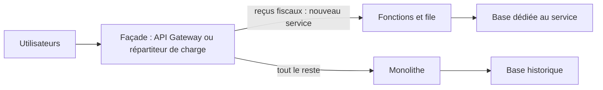

Une fois sur AWS, le monolithe de gestion des dons de la fédération fonctionne comme avant : une seule application, une seule base, un déploiement risqué par trimestre. Chaque demande d'évolution reçoit la même réponse : « il faudrait tout réécrire ». Moderniser ne veut pas dire tout réécrire ; cela veut dire **détacher les morceaux un par un**, en commençant par ceux qui rapportent le plus.

## Découper par étapes

Le motif de l'**étrangleur** (*strangler fig*) : on place une façade devant le monolithe, puis on redirige fonctionnalité par fonctionnalité vers de nouveaux services. Le monolithe rétrécit jusqu'à pouvoir être éteint.



Par où commencer ? Par ce qui est **à la fois** utile et détachable : une fonctionnalité qui change souvent, qui a besoin de monter en charge seule, ou dont la panne ne doit pas arrêter le reste ; et qui a peu de liens avec le cœur.

Chaque morceau détaché devrait posséder **ses** données. Deux services qui partagent une même base restent couplés par le schéma.

## Choisir où exécuter

| Besoin | Plateforme |
| --- | --- |
| Traitement court, déclenché par des événements, charge irrégulière | **AWS Lambda** |
| Application existante mise en conteneur, sans serveur à gérer | **Amazon ECS avec Fargate** |
| L'organisation utilise déjà Kubernetes, ou veut la portabilité de ses outils | **Amazon EKS** |
| Besoin de contrôler l'hôte (processeur graphique, noyau, licences) | Conteneurs sur des **instances EC2** |
| Application web classique à déployer vite, sans la transformer | **AWS Elastic Beanstalk** |
| Logiciel qui exige un système précis | **Amazon EC2** |

Entre ECS et EKS, l'argument décisif est rarement technique : ECS est plus simple et intégré à AWS ; EKS se justifie par une compétence ou un outillage Kubernetes existants. **Amazon ECR** range les images dans les deux cas.

## Choisir où stocker

| Donnée | Service |
| --- | --- |
| Accès par clé à grande échelle, schéma souple | **Amazon DynamoDB** |
| Relationnel, charge variable ou intermittente | **Amazon Aurora Serverless** |
| Relationnel classique | **Amazon RDS** ; une base **autogérée sur EC2** seulement si une fonction du moteur ou une contrainte de licence l'impose |
| Recherche plein texte, analyse de journaux | **Amazon OpenSearch Service** |
| Cache, sessions | **Amazon ElastiCache** |
| Fichiers partagés par des conteneurs ou des instances | **Amazon EFS** ; **Amazon FSx** pour Windows ou le calcul intensif |
| Objets, contenus statiques, lac de données | **Amazon S3** |
| Volumes en mode bloc présentés à des serveurs sur site | **AWS Storage Gateway** (passerelle de volumes) |

## Choisir comment faire communiquer

| Échange | Service | Pourquoi |
| --- | --- | --- |
| Une tâche à faire, par un seul travailleur, sans la perdre | **Amazon SQS** | Tampon, reprises, file de rebut |
| Un fait à annoncer à plusieurs abonnés connus | **Amazon SNS** | Diffusion immédiate, filtrage par abonné |
| Des événements à router selon leur contenu, entre équipes, comptes, logiciels en SaaS | **Amazon EventBridge** | Règles, bus multiples, archivage et rejeu |
| Un traitement en plusieurs étapes, avec décisions, attentes et compensations | **AWS Step Functions** | L'état du traitement est tenu par le service, visible et repris |
| Un flux continu relu par plusieurs applications | **Amazon Kinesis Data Streams** | Ordre par fragment, rejeu |
| Une application existante qui parle JMS ou AMQP | **Amazon MQ** | Compatibilité, sans réécrire les échanges |

Deux styles s'opposent et se complètent : la **chorégraphie** (chaque service réagit aux événements des autres, sans chef : souple, mais le déroulé d'ensemble n'est écrit nulle part) et l'**orchestration** (un flux décrit explicitement les étapes : lisible et contrôlable, au prix d'un point central). Dès qu'un traitement a un début, une fin, des branches et des cas d'échec à compenser, l'orchestration est plus sûre.

## Orchestrer avec Step Functions

Un **flux** (*state machine*) se décrit en JSON, dans le langage *Amazon States Language* : des **états** reliés entre eux.

```json
{
  "StartAt": "Evaluer",
  "States": {
    "Evaluer": {
      "Type": "Task",
      "Resource": "arn:aws:lambda:eu-west-3:000000000000:function:evaluer-don",
      "Retry": [{"ErrorEquals": ["States.TaskFailed"], "IntervalSeconds": 2, "MaxAttempts": 2}],
      "Next": "Decider"
    },
    "Decider": {
      "Type": "Choice",
      "Choices": [{"Variable": "$.risque", "StringEquals": "eleve", "Next": "RevueManuelle"}],
      "Default": "Accepter"
    },
    "RevueManuelle": {
      "Type": "Task",
      "Resource": "arn:aws:states:::sqs:sendMessage",
      "Parameters": {
        "QueueUrl": "http://127.0.0.1:4566/000000000000/revue-manuelle",
        "MessageBody.$": "States.JsonToString($)"
      },
      "End": true
    },
    "Accepter": {"Type": "Succeed"}
  }
}
```

- `Evaluer` est une **tâche** : elle appelle une fonction Lambda. `Retry` la relance deux fois en cas d'échec, sans une ligne de code.
- `Decider` est un **choix** : selon le champ `risque` renvoyé par la fonction, le flux part vers la revue manuelle ou s'achève.
- `RevueManuelle` appelle **directement** SQS, sans fonction intermédiaire : Step Functions sait parler à de nombreux services. `"MessageBody.$"` signifie « calcule cette valeur à partir de l'état courant ».
- `Accepter` termine le flux avec succès.

Rappel : un flux **Standard** peut durer jusqu'à un an, chaque étape étant exécutée exactement une fois ; un flux **Express** dure cinq minutes au plus, pour de très forts volumes.

## Les commandes du labo

```bash
aws stepfunctions create-state-machine --name traiter-don \
  --role-arn arn:aws:iam::000000000000:role/role-flux --definition file://flux.json
aws stepfunctions start-execution --name petit-don --input '{"montant": 50}' \
  --state-machine-arn arn:aws:states:eu-west-3:000000000000:stateMachine:traiter-don
aws stepfunctions describe-execution \
  --execution-arn arn:aws:states:eu-west-3:000000000000:execution:traiter-don:petit-don
```

Donner un **nom** à une exécution (`--name`) rend son ARN prévisible, et empêche de lancer deux fois le même traitement. `get-execution-history` montre, état par état, le chemin réellement suivi.

Dans le labo, la fonction d'évaluation est fournie, ainsi que la file de revue et le rôle du flux :

```shell run
cat evaluer.py
aws sqs get-queue-url --queue-name revue-manuelle --query QueueUrl --output text
```

:::warning Ce qui diffère du vrai AWS
L'émulateur exécute réellement le flux : la fonction Lambda est appelée, le choix est évalué, le message part dans la file. Les écarts : l'adresse de la file dans `flux.json` est celle de l'émulateur (sur le vrai AWS, elle commence par `https://sqs.<région>.amazonaws.com/`), aucune exécution n'est facturée, et les conteneurs (ECS, EKS, Fargate), Amazon MQ et OpenSearch ne sont pas émulés de façon utilisable ici : le choix d'une plateforme se travaille par la lecture et les questions.
:::

:::tip Reconnaître le besoin d'orchestration
« Si l'étape 3 échoue, il faut annuler les étapes 1 et 2 », « attendre une validation humaine », « reprendre là où l'on s'est arrêté » : ces phrases désignent Step Functions. « Plusieurs équipes veulent réagir au même événement sans se connaître » désigne EventBridge.
:::

## Entraîne-toi

Tu extrais du monolithe le traitement des dons : une fonction évalue le risque, un flux Step Functions décide, et les dons à risque partent dans une file de revue manuelle.

```json file=flux.json
{
  "StartAt": "Evaluer",
  "States": {
    "Evaluer": {
      "Type": "Task",
      "Resource": "arn:aws:lambda:eu-west-3:000000000000:function:evaluer-don",
      "Retry": [{"ErrorEquals": ["States.TaskFailed"], "IntervalSeconds": 2, "MaxAttempts": 2}],
      "Next": "Decider"
    },
    "Decider": {
      "Type": "Choice",
      "Choices": [{"Variable": "$.risque", "StringEquals": "eleve", "Next": "RevueManuelle"}],
      "Default": "Accepter"
    },
    "RevueManuelle": {
      "Type": "Task",
      "Resource": "arn:aws:states:::sqs:sendMessage",
      "Parameters": {
        "QueueUrl": "http://127.0.0.1:4566/000000000000/revue-manuelle",
        "MessageBody.$": "States.JsonToString($)"
      },
      "End": true
    },
    "Accepter": {"Type": "Succeed"}
  }
}
```

:::lab
engine: real
intro: |
  Sont en place : la file SQS `revue-manuelle` et le rôle `role-flux`, que Lambda et Step Functions peuvent endosser et qui autorise à appeler la fonction et à écrire dans la file. Ton dossier de travail contient `evaluer.py`. Le flux que tu vas créer s'exécute réellement.
files:
  evaluer.py: |
    def handler(event, context):
        montant = event["montant"]
        risque = "eleve" if montant > 1000 else "faible"
        print("Don de", montant, "euros : risque", risque)
        return {"montant": montant, "risque": risque}
  labo/confiance-flux.json: |
    {
      "Version": "2012-10-17",
      "Statement": [
        {
          "Effect": "Allow",
          "Principal": {"Service": ["lambda.amazonaws.com", "states.amazonaws.com"]},
          "Action": "sts:AssumeRole"
        }
      ]
    }
  labo/droits-flux.json: |
    {
      "Version": "2012-10-17",
      "Statement": [
        {
          "Effect": "Allow",
          "Action": "lambda:InvokeFunction",
          "Resource": "arn:aws:lambda:eu-west-3:000000000000:function:evaluer-don"
        },
        {
          "Effect": "Allow",
          "Action": "sqs:SendMessage",
          "Resource": "arn:aws:sqs:eu-west-3:000000000000:revue-manuelle"
        },
        {
          "Effect": "Allow",
          "Action": ["logs:CreateLogGroup", "logs:CreateLogStream", "logs:PutLogEvents"],
          "Resource": "*"
        }
      ]
    }
commands:
  - demarrer-aws
  - aws sqs create-queue --queue-name revue-manuelle
  - 'aws iam get-role --role-name role-flux >/dev/null 2>&1 || aws iam create-role --role-name role-flux --assume-role-policy-document file://labo/confiance-flux.json'
  - aws iam put-role-policy --role-name role-flux --policy-name flux --policy-document file://labo/droits-flux.json
steps:
  - text: "Déploie la fonction `evaluer-don` à partir de `evaluer.py` (environnement `python3.13`, point d'entrée `evaluer.handler`, rôle `role-flux`)"
    checks:
      - output-contains:
          - 'aws lambda get-function-configuration --function-name evaluer-don --query Handler --output text'
          - '^evaluer\.handler$'
    solution:
      - zip evaluer.zip evaluer.py
      - aws lambda create-function --function-name evaluer-don --runtime python3.13 --handler evaluer.handler --zip-file fileb://evaluer.zip --role arn:aws:iam::000000000000:role/role-flux
      - aws lambda wait function-active-v2 --function-name evaluer-don
  - text: "Écris `flux.json` et crée le flux Step Functions `traiter-don` avec le rôle `role-flux`"
    after: [1]
    checks:
      - output-contains:
          - 'aws stepfunctions describe-state-machine --state-machine-arn arn:aws:states:eu-west-3:000000000000:stateMachine:traiter-don --query definition --output text'
          - '"Type":\s*"Choice"'
    solution:
      - write:
          flux.json: |
            {
              "StartAt": "Evaluer",
              "States": {
                "Evaluer": {
                  "Type": "Task",
                  "Resource": "arn:aws:lambda:eu-west-3:000000000000:function:evaluer-don",
                  "Retry": [{"ErrorEquals": ["States.TaskFailed"], "IntervalSeconds": 2, "MaxAttempts": 2}],
                  "Next": "Decider"
                },
                "Decider": {
                  "Type": "Choice",
                  "Choices": [{"Variable": "$.risque", "StringEquals": "eleve", "Next": "RevueManuelle"}],
                  "Default": "Accepter"
                },
                "RevueManuelle": {
                  "Type": "Task",
                  "Resource": "arn:aws:states:::sqs:sendMessage",
                  "Parameters": {
                    "QueueUrl": "http://127.0.0.1:4566/000000000000/revue-manuelle",
                    "MessageBody.$": "States.JsonToString($)"
                  },
                  "End": true
                },
                "Accepter": {"Type": "Succeed"}
              }
            }
      - aws stepfunctions create-state-machine --name traiter-don --role-arn arn:aws:iam::000000000000:role/role-flux --definition file://flux.json
  - text: "Lance une exécution nommée `petit-don` avec l'entrée `{\"montant\": 50}`, attends quelques secondes, puis garde son état dans `petit-don.json` (`aws stepfunctions describe-execution`)"
    after: [2]
    checks:
      - env-file-contains: [petit-don.json, '"status": "SUCCEEDED"']
      - env-file-contains: [petit-don.json, 'faible']
    solution:
      - "aws stepfunctions start-execution --name petit-don --input '{\"montant\": 50}' --state-machine-arn arn:aws:states:eu-west-3:000000000000:stateMachine:traiter-don"
      - sleep 5
      - aws stepfunctions describe-execution --execution-arn arn:aws:states:eu-west-3:000000000000:execution:traiter-don:petit-don > petit-don.json
  - text: "Lance une exécution nommée `gros-don` avec l'entrée `{\"montant\": 5000}` : le don doit arriver dans la file `revue-manuelle`"
    after: [2]
    checks:
      - output-contains:
          - "aws sqs get-queue-attributes --queue-url http://127.0.0.1:4566/000000000000/revue-manuelle --attribute-names ApproximateNumberOfMessages ApproximateNumberOfMessagesNotVisible --query 'Attributes.*' --output text"
          - '[1-9]'
      - output-contains:
          - 'aws stepfunctions describe-execution --execution-arn arn:aws:states:eu-west-3:000000000000:execution:traiter-don:gros-don --query status --output text'
          - '^SUCCEEDED$'
    solution:
      - "aws stepfunctions start-execution --name gros-don --input '{\"montant\": 5000}' --state-machine-arn arn:aws:states:eu-west-3:000000000000:stateMachine:traiter-don"
  - text: "Retrace le chemin suivi par `gros-don` : garde dans `parcours.txt` la suite des événements de l'exécution (`aws stepfunctions get-execution-history … --query 'events[].type' --output text`), puis lis le message de la file dans `a-revoir.json`"
    after: [4]
    checks:
      - env-file-contains: [parcours.txt, 'ChoiceStateEntered']
      - env-file-contains: [parcours.txt, 'ExecutionSucceeded']
      - env-file-contains: [a-revoir.json, '5000']
    solution:
      - "aws stepfunctions get-execution-history --execution-arn arn:aws:states:eu-west-3:000000000000:execution:traiter-don:gros-don --query 'events[].type' --output text > parcours.txt"
      - aws sqs receive-message --queue-url http://127.0.0.1:4566/000000000000/revue-manuelle --visibility-timeout 0 > a-revoir.json
:::

## Vérifie tes acquis

:::quiz
Un monolithe critique doit être modernisé sans interruption de service ni projet de réécriture complète. Quelle démarche réduit le plus le risque ?

- [ ] Geler les évolutions pendant un an et réécrire l'ensemble en microservices
- [x] Placer une façade devant le monolithe et en extraire les fonctionnalités une à une vers de nouveaux services
- [ ] Dupliquer le monolithe dans une seconde région
- [ ] Le migrer d'abord sur des instances plus grosses

> Le motif de l'étrangleur remplace le monolithe progressivement : chaque extraction est petite, réversible et livrable, alors qu'une réécriture d'un bloc concentre tous les risques sur une seule bascule.
:::

:::quiz
Une réservation de voyage enchaîne la réservation d'un vol, d'un hôtel et d'une voiture. Si l'une échoue, les précédentes doivent être annulées, et l'état de chaque réservation doit rester consultable. Quel service porte le mieux ce traitement ?

- [ ] Amazon SNS, avec un sujet par étape
- [ ] Amazon SQS, avec une file par étape
- [ ] Amazon Kinesis Data Streams
- [x] AWS Step Functions, avec des étapes de compensation

> Un traitement à étapes, avec branches d'échec et compensations, relève de l'orchestration : Step Functions tient l'état de chaque exécution et décrit explicitement les annulations.
:::

:::quiz
Une entreprise dont les équipes maîtrisent Kubernetes et ses outils veut héberger ses conteneurs sur AWS en conservant ces outils. Quel service choisir ?

- [ ] Amazon ECS
- [ ] AWS Lambda
- [x] Amazon EKS
- [ ] AWS Elastic Beanstalk

> EKS fournit un Kubernetes géré, compatible avec les outils existants. ECS est plus simple, mais propre à AWS.
:::

:::quiz
Une application existante échange avec ses partenaires par un serveur de messages utilisant le protocole AMQP. L'entreprise veut ne plus administrer ce serveur, sans modifier les applications. Que proposer ?

- [ ] Remplacer les échanges par Amazon SQS
- [ ] Remplacer les échanges par Amazon EventBridge
- [ ] Installer le serveur de messages sur une instance EC2
- [x] Amazon MQ

> Amazon MQ est un service géré compatible avec les protocoles des serveurs de messages classiques : les applications n'ont pas à changer. Passer à SQS exigerait de les réécrire.
:::
