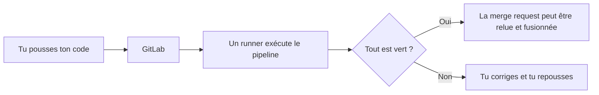

« Ça marche chez moi. » Tu as sûrement déjà entendu (ou dit) cette phrase : le code fonctionne sur un ordinateur, mais plante sur celui d'une autre personne ou sur le serveur. L'**intégration continue** (CI, pour *Continuous Integration*) existe pour couper court à ce genre de surprise.

## Le principe

La CI consiste à **vérifier automatiquement chaque modification** du code, dès qu'elle est envoyée dans le dépôt, et dans un environnement propre et identique pour tout le monde. Au lieu de découvrir un problème des semaines plus tard, on le voit en quelques minutes, sur la modification qui l'a causé.

Quelques mots à connaître avant d'aller plus loin :

- Le **dépôt** est la copie centrale du projet, hébergée sur GitLab. Tu l'alimentes avec `git push`, la commande qui envoie tes commits vers ce dépôt.
- Une **merge request** (MR) est une demande de fusion : tu proposes d'intégrer ta branche dans la branche principale, et l'équipe relit avant d'accepter.
- Une **dépendance** est une bibliothèque dont ton code a besoin pour fonctionner.
- Une **image Docker** est un paquet qui contient un programme et tout ce qu'il lui faut pour tourner, quel que soit l'ordinateur.

Concrètement, à chaque `git push` ou à chaque merge request, un serveur :

1. récupère le code,
2. le construit (installation des dépendances, compilation, fabrication d'une image Docker),
3. lance des contrôles (formatage, tests automatiques, analyses de sécurité),
4. te répond par une pastille verte ✅ ou rouge ❌ directement dans la merge request.



## CI, livraison continue, déploiement continu

Le sigle **CI/CD** regroupe trois idées qui s'enchaînent (**déployer** veut dire mettre une version en ligne, pour que les utilisateur·rice·s s'en servent) :

:::cartes
### Intégration continue (CI)

Construire et tester chaque modification automatiquement.

### Livraison continue

Garder en permanence une version prête à être mise en production (le serveur que les utilisateur·rice·s utilisent vraiment), que l'on déclenche à la main.

### Déploiement continu

Mettre en production automatiquement chaque version qui a passé tous les contrôles.
:::

Un projet n'a pas besoin des trois : la plupart commencent par la CI, qui apporte le plus de valeur pour le moins d'effort.

## Les acteurs dans GitLab

| Élément | Rôle |
| --- | --- |
| `.gitlab-ci.yml` | Le fichier, versionné avec le code, qui décrit **quoi** exécuter. Il est écrit en **YAML**, un format texte où l'indentation (des espaces, jamais de tabulation) exprime l'imbrication |
| Pipeline | Une exécution complète de ce fichier, déclenchée par un évènement (un push, une merge request…) |
| Stage | Une étape du pipeline (par exemple `build`, puis `test`) ; les étapes s'enchaînent dans l'ordre |
| Job | Une tâche du pipeline (par exemple `lint` ou `build`), rangée dans un stage |
| Runner | La machine ou le conteneur qui **exécute** les jobs |

La configuration vit dans le dépôt : elle se relit, se modifie et se revient en arrière comme le reste du code.

## Ton premier `.gitlab-ci.yml`, ligne à ligne

Voici le plus petit pipeline utile : il construit, puis il teste.

```yaml
stages:
  - build
  - test

compiler:
  stage: build
  script:
    - python3 -m compileall app

tests:
  stage: test
  script:
    - sh app/tests.sh
```

Lecture ligne à ligne :

- `stages:` ouvre la liste des étapes, dans l'ordre où elles s'exécutent. Chaque ligne `- nom` ajoute un élément à la liste (en YAML, un tiret en début de ligne est un élément de liste).
- `- build` puis `- test` : le pipeline a deux stages, `build` d'abord, `test` ensuite. Le stage `test` ne démarre que si tout `build` a réussi.
- `compiler:` est le **nom d'un job**. Ce nom est libre ; ce qui compte, c'est ce qui est indenté dessous.
- `stage: build` range le job `compiler` dans le stage `build` (il doit figurer dans `stages`).
- `script:` liste les commandes que le runner lance, dans l'ordre. Si une commande se termine avec un code différent de 0, le job est rouge. Le **code de sortie** est le petit nombre qu'une commande renvoie en finissant : 0 veut dire « tout s'est bien passé ».
- `python3 -m compileall app` vérifie que les fichiers Python du dossier `app` se compilent. `sh app/tests.sh` lance les tests de l'application.
- `tests:` est un second job, rangé dans le stage `test`.

## Pourquoi c'est utile dans l'équipe

Les projets de l'équipe changent de mains au fil des promotions. La CI garde la mémoire de ce qui doit être vrai pour qu'une modification soit acceptée. Dans MiniShop, par exemple, un stage `quality` lance le lint (un outil qui repère les erreurs de style et les maladresses), la vérification des types TypeScript et le contrôle du formatage avant le `build`. Dans l'API d'Adhésion, des modèles GitLab ajoutent des analyses de sécurité.

:::tip
Une CI n'est pas un juge : elle ne prouve pas que ton code est bon, seulement que les contrôles que le projet a choisis passent. Plus les tests sont complets, plus la pastille verte a de la valeur.
:::

## Entraîne-toi

:::info Il n'y a pas de vrai runner dans ce labo
Un vrai pipeline a besoin d'un serveur GitLab et d'un runner. Ton conteneur n'a ni l'un ni l'autre (et pas de réseau). À la place, tu disposes de `verifier-ci`, un petit outil de l'équipe qui lit un `.gitlab-ci.yml` et en vérifie la **structure** comme GitLab le ferait avant de créer le pipeline : stages déclarés, jobs rattachés à un stage connu, `script` présent, clés inconnues. Il n'exécute **aucun** job. C'est un bon filet pour repérer une faute avant de pousser, mais le dernier mot reste à GitLab (son éditeur de pipeline, menu *Build*).
:::

:::labo
moteur: reel
intro: |
  Tu as un vrai terminal Linux. Pour afficher un fichier, tape `cat nom-du-fichier`. Pour en créer ou en modifier un, tape `nano nom-du-fichier` (Ctrl+O puis Entrée pour enregistrer, Ctrl+X pour quitter) ou utilise l'éditeur de VS Code si le portail te le propose. Dans ton dossier de travail : `exemple-minishop.yml` (la CI de MiniShop, simplifiée), `pipeline-casse.yml` (un pipeline à réparer) et le dossier `app` (une minuscule application avec ses tests). La commande `verifier-ci fichier.yml` diagnostique un pipeline ; avec l'option `--montrer`, elle affiche les stages et les jobs.
commandes:
  - cp -R /opt/exercices/01-premier-pipeline/. .
etapes:
  - texte: 'Compte les jobs du stage `quality` dans `exemple-minishop.yml`, puis écris ce nombre dans un fichier `reponse.txt` (avec `echo NOMBRE > reponse.txt`, en remplaçant NOMBRE)'
    indice: 'Lance `verifier-ci --montrer exemple-minishop.yml` : chaque ligne `[quality] nom` est un job du stage `quality`.'
    verif:
      - fichier-contient-dans-env: [reponse.txt, '^\s*3\s*$']
    solution:
      - echo 3 > reponse.txt
  - texte: 'Écris un `.gitlab-ci.yml` à deux stages, `build` puis `test`, avec un job `compiler` dans `build` et un job `tests` dans `test` ; chacun a un `script` (une seule commande suffit, par exemple `echo "ok"`)'
    indice: 'Reprends la forme du cours : `stages:` avec deux éléments, puis `compiler:` et `tests:` avec leur `stage:` et leur `script:`. Contrôle avec `verifier-ci .gitlab-ci.yml`.'
    verif:
      - commande-reussit: verifier-ci .gitlab-ci.yml
      - commande-reussit: "verifier-ci .gitlab-ci.yml --stages build,test"
      - commande-reussit: "verifier-ci .gitlab-ci.yml --job compiler --stage build --cree"
      - commande-reussit: "verifier-ci .gitlab-ci.yml --job tests --stage test --cree"
    solution:
      - ecrire:
          .gitlab-ci.yml: |
            stages:
              - build
              - test

            compiler:
              stage: build
              script:
                - echo "ok"

            tests:
              stage: test
              script:
                - echo "ok"
  - texte: 'Fais lancer à ton job `tests` les vrais tests de l''application : sa commande doit être `sh app/tests.sh` (essaie-la d''abord dans ton terminal : c''est exactement ce que ferait le runner)'
    indice: 'Dans le job `tests`, remplace la commande de `script` par `- sh app/tests.sh`. Relance ensuite `verifier-ci .gitlab-ci.yml`.'
    apres: [2]
    verif:
      - commande-reussit: sh app/tests.sh
      - commande-reussit: "verifier-ci .gitlab-ci.yml --job tests --cree --script-lance 'sh app/tests.sh'"
      - commande-reussit: verifier-ci .gitlab-ci.yml
    solution:
      - ecrire:
          .gitlab-ci.yml: |
            stages:
              - build
              - test

            compiler:
              stage: build
              script:
                - echo "ok"

            tests:
              stage: test
              script:
                - sh app/tests.sh
  - texte: 'Lance `verifier-ci pipeline-casse.yml` : il signale deux erreurs. Corrige le fichier `pipeline-casse.yml` jusqu''à ce que `verifier-ci --strict pipeline-casse.yml` réussisse, sans supprimer de job'
    indice: 'Le premier message cite le stage `biuld` (une faute de frappe) ; le second dit qu''un job n''a pas de `script`. Ajoute par exemple `script:` puis `- sh app/tests.sh` au job `tests`.'
    verif:
      - commande-reussit: verifier-ci --strict pipeline-casse.yml
      - sortie-contient: ['verifier-ci --montrer pipeline-casse.yml', '\[build\] compiler']
      - sortie-contient: ['verifier-ci --montrer pipeline-casse.yml', '\[test\] tests']
    solution:
      - ecrire:
          pipeline-casse.yml: |
            stages:
              - build
              - test

            compiler:
              stage: build
              image: python:3.13
              script:
                - python3 -m compileall app

            tests:
              stage: test
              image: python:3.13
              script:
                - sh app/tests.sh
:::

## Vérifie tes acquis

:::quiz
Que fait l'intégration continue à chaque modification poussée ?

- [ ] Elle déploie toujours en production
- [x] Elle construit et vérifie le code automatiquement
- [ ] Elle fusionne la merge request

> La CI construit et teste ; la fusion reste une décision humaine, et le déploiement est une autre étape.
:::

:::quiz
Quelle est la différence entre livraison continue et déploiement continu ?

- [x] En livraison continue, la mise en production se déclenche à la main ; en déploiement continu, elle est automatique
- [ ] Il n'y en a aucune, ce sont deux noms pour la même chose
- [ ] La livraison continue ne passe jamais par des tests

> Dans les deux cas, une version est toujours prête ; seule la décision de la mettre en ligne diffère.
:::

:::quiz
Qui exécute réellement les jobs d'un pipeline GitLab ?

- [ ] Ton ordinateur
- [ ] Le fichier `.gitlab-ci.yml` lui-même
- [x] Un runner

> Le fichier décrit les jobs ; c'est le runner, une machine ou un conteneur, qui les exécute.
:::

:::quiz
Dans un `.gitlab-ci.yml`, à quoi sert la ligne `stage: test` d'un job ?

- [ ] À lancer les tests automatiquement
- [x] À ranger le job dans l'étape nommée `test`
- [ ] À donner son nom au job

> Le nom du job est la clé qui précède les deux-points ; `stage` le range dans une étape, qui doit être déclarée dans `stages`.
:::
