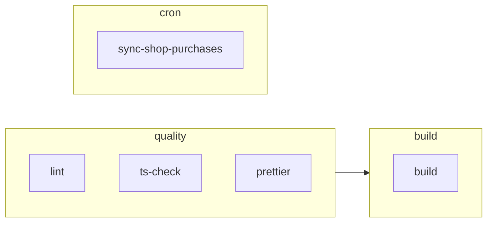

Tu ouvres un projet de l'équipe, tu vois une pastille verte ou rouge sur ta merge request, et un fichier `.gitlab-ci.yml` de 150 lignes à la racine. Par où commencer ? Par comprendre trois mots : *pipeline*, *stage* et *job*.

## Pipeline, stages, jobs

Un **pipeline** est lancé par GitLab à chaque évènement (push, merge request, planification). Il est composé de **jobs**, des tâches rangées dans des **stages** (étapes) qui s'exécutent dans l'ordre. Les jobs d'un même stage tournent en parallèle ; si l'un échoue, les stages suivants ne démarrent pas.



Voici le début du `.gitlab-ci.yml` de MiniShop (projet Next.js d'une association étudiante), simplifié. Rappel : c'est du **YAML**, où les deux-points séparent un nom de sa valeur, un tiret ouvre un élément de liste, et l'indentation (deux espaces) dit ce qui est contenu dans quoi.

```yaml
stages:
  - quality
  - build
  - cron

lint:
  stage: quality
  image: node:24-alpine
  before_script:
    - npm ci
  script:
    - npm run lint
```

- `stages` liste l'ordre des étapes.
- `lint` est le nom d'un job. Tout bloc de premier niveau qui n'est pas un mot-clé réservé (comme `stages`, `include` ou `variables`) est un job.
- `stage: quality` range le job dans le stage `quality`. Sans cette ligne, un job est rangé dans le stage `test`.
- `image` est l'image Docker dans laquelle le job s'exécute (ici Node 24 sur Alpine, une distribution Linux très légère). Une **image Docker** est un paquet qui contient un programme et son environnement : le runner démarre un conteneur à partir d'elle et y lance tes commandes.
- `before_script` puis `script` sont les commandes lancées, dans l'ordre. `npm ci` installe les dépendances exactement comme le fichier de verrouillage les décrit, puis `npm run lint` lance le lint (un outil qui repère erreurs de style et maladresses). Si une commande retourne un code différent de 0, le job échoue.

## Décider quand un job se lance : `rules`

Sans `rules`, un job se lance à chaque pipeline. Avec `rules`, GitLab lit la liste de haut en bas et applique **la première règle qui correspond**. Si aucune ne correspond, le job n'est pas créé.

```yaml
lint:
  rules:
    - if: '$CI_PIPELINE_SOURCE == "schedule"'
      when: never
    - if: '$CI_PIPELINE_SOURCE == "merge_request_event"'
    - if: '$CI_COMMIT_BRANCH == "main"'
    - if: '$CI_COMMIT_BRANCH == "develop"'
```

Les pièces, une par une :

- `$CI_PIPELINE_SOURCE` et `$CI_COMMIT_BRANCH` sont des **variables prédéfinies** : GitLab les remplit lui-même pour chaque pipeline. Le `$` devant le nom veut dire « la valeur de cette variable ». `CI_PIPELINE_SOURCE` dit ce qui a déclenché le pipeline (`push`, `merge_request_event`, `schedule` pour un pipeline planifié, c'est-à-dire lancé à heure fixe, comme un cron). `CI_COMMIT_BRANCH` donne le nom de la branche.
- `if:` est une condition. Elle compare avec `==` (« est égal à »), `!=` (« est différent de »), ou `=~` (« correspond à l'expression régulière »). On peut les combiner avec `&&` (« et ») et `||` (« ou »). Les textes comparés sont entre guillemets, et toute la condition est entourée de guillemets simples pour que YAML ne s'y perde pas.
- `when: never` signifie « ne jamais créer ce job ». Une règle sans `when` garde le comportement normal : le job est créé et se lance si les stages précédents ont réussi.

Lecture de cet exemple réel de MiniShop :

1. Pipeline planifié (cron) : la condition est vraie, donc `when: never` s'applique, le job ne se lance jamais.
2. Pipeline de merge request : il se lance.
3. Push sur `main` ou `develop` : il se lance.
4. Tout le reste (une branche de travail sans merge request) : aucune règle ne correspond, pas de job.

:::warning L'ordre des règles compte
Si tu mets la règle `when: never` du pipeline planifié **après** une règle qui accepte tout, elle ne sera jamais atteinte. Place toujours les exclusions en premier. Une règle sans condition (juste `- when: always`) correspond toujours : tout ce qui la suit est inutile.
:::

## Ne pas se répéter : `include` et `extends`

Trois jobs qui utilisent la même image, c'est trois fois la même ligne. Deux mots-clés évitent la répétition.

`extends` fait hériter un job d'un autre. On y met souvent un **job caché** : un nom qui commence par un point n'est jamais lancé, il sert seulement de modèle.

```yaml
.node:
  image: node:24-alpine

lint:
  extends: .node
  stage: quality
  script:
    - npm run lint
```

Ici, `lint` reçoit l'`image` de `.node`. Quand les deux définissent une même clé, celle du job qui hérite gagne ; les blocs sont fusionnés, les listes sont remplacées.

`include` fusionne d'autres fichiers YAML dans le pipeline. Le projet Vitrine découpe sa CI en plusieurs fichiers et appelle des modèles de GitLab :

```yaml
include:
  - local: .gitlab/ci/*.gitlab-ci.yml
  - template: Jobs/SAST.gitlab-ci.yml
```

- `local:` désigne un ou plusieurs fichiers **du dépôt**, chemin à partir de la racine ; l'étoile `*` remplace n'importe quel nom, donc tous les fichiers du dossier `.gitlab/ci/` qui finissent par `.gitlab-ci.yml` sont ajoutés.
- `template:` désigne un modèle fourni par GitLab (tu les découvriras à la leçon 5).

Le job `helm` de Vitrine, par exemple, hérite ainsi de règles communes avec `extends`.

:::tip Vérifier avant de pousser
Dans le dépôt, l'éditeur de pipeline de GitLab (menu *Build*) valide le YAML et affiche le pipeline qui résulterait de ta modification. Utilise-le plutôt que d'enchaîner les commits « fix ci ». Dans ce cours, `verifier-ci` te donne un avant-goût de ce contrôle, hors ligne.
:::

## Entraîne-toi

:::info Simuler les rules avec verifier-ci
Il n'y a pas de vrai runner dans ce labo. `verifier-ci` ne lance aucun job : il lit le fichier et contrôle sa structure, puis, sur demande, il **simule** les `rules`. L'option `--contexte NOM=VALEUR` dit à l'outil « imagine un pipeline où cette variable vaut cela » ; l'option `--modifie chemin` ajoute un fichier modifié (pour `changes`). L'outil répond par une ligne `+ [stage] job` pour chaque job qui serait créé et `- job : raison` pour chaque job absent. C'est une approximation : GitLab seul a le dernier mot.
:::

:::lab
engine: real
intro: |
  Ton dossier de travail contient un `.gitlab-ci.yml` de départ, avec trois stages (`quality`, `build`, `deploy`) et deux jobs, `lint` et `build`, qui répètent la même image. Pour modifier un fichier, utilise `nano .gitlab-ci.yml` (Ctrl+O puis Entrée pour enregistrer, Ctrl+X pour quitter) ou l'éditeur de VS Code. Tu peux afficher le pipeline avec `verifier-ci --montrer .gitlab-ci.yml`, et simuler un contexte avec, par exemple, `verifier-ci --contexte CI_PIPELINE_SOURCE=schedule .gitlab-ci.yml`.
commands:
  - cp -R /opt/exercices/02-anatomie/. .
steps:
  - text: 'Ajoute des `rules` au job `lint`, comme MiniShop : jamais dans un pipeline planifié (`schedule`), mais dans une merge request (`merge_request_event`) et sur la branche `main`. Vérifie avec `verifier-ci --contexte CI_PIPELINE_SOURCE=schedule --contexte CI_COMMIT_BRANCH=main .gitlab-ci.yml`'
    hint: 'Première règle : `- if: ''$CI_PIPELINE_SOURCE == "schedule"''` suivie de `when: never`. Puis une règle pour `merge_request_event` et une pour `$CI_COMMIT_BRANCH == "main"`.'
    checks:
      - command-succeeds: verifier-ci .gitlab-ci.yml
      - command-succeeds: verifier-ci --contexte CI_PIPELINE_SOURCE=merge_request_event .gitlab-ci.yml | grep -q '^+ \[quality\] lint'
      - command-succeeds: verifier-ci --contexte CI_PIPELINE_SOURCE=push --contexte CI_COMMIT_BRANCH=main .gitlab-ci.yml | grep -q '^+ \[quality\] lint'
      - command-succeeds: verifier-ci --contexte CI_PIPELINE_SOURCE=schedule --contexte CI_COMMIT_BRANCH=main .gitlab-ci.yml | grep -q '^- lint'
      - command-succeeds: verifier-ci --contexte CI_PIPELINE_SOURCE=push --contexte CI_COMMIT_BRANCH=feature-x .gitlab-ci.yml | grep -q '^- lint'
    solution:
      - write:
          .gitlab-ci.yml: |
            stages:
              - quality
              - build
              - deploy

            lint:
              stage: quality
              image: node:24-alpine
              script:
                - npm ci
                - npm run lint
              rules:
                - if: '$CI_PIPELINE_SOURCE == "schedule"'
                  when: never
                - if: '$CI_PIPELINE_SOURCE == "merge_request_event"'
                - if: '$CI_COMMIT_BRANCH == "main"'

            build:
              stage: build
              image: node:24-alpine
              script:
                - npm ci
                - npm run build
  - text: 'Supprime la répétition : crée un job caché `.node` qui porte l''`image` (une seule fois dans tout le fichier), et fais-en hériter `lint` et `build` avec `extends`'
    hint: 'Un bloc `.node:` avec `image: node:24-alpine`, puis `extends: .node` dans `lint` et dans `build`, et plus aucune ligne `image:` dans ces deux jobs. `verifier-ci --montrer .gitlab-ci.yml` doit afficher `extends=.node` sur les deux.'
    checks:
      - command-succeeds: verifier-ci .gitlab-ci.yml
      - command-succeeds: "verifier-ci .gitlab-ci.yml --job .node --image node:24-alpine"
      - command-succeeds: "verifier-ci .gitlab-ci.yml --job lint --stage quality --extends .node --image node:24-alpine --sans-cle-propre image"
      - command-succeeds: "verifier-ci .gitlab-ci.yml --job build --stage build --extends .node --image node:24-alpine --sans-cle-propre image"
    solution:
      - write:
          .gitlab-ci.yml: |
            stages:
              - quality
              - build
              - deploy

            .node:
              image: node:24-alpine

            lint:
              extends: .node
              stage: quality
              script:
                - npm ci
                - npm run lint
              rules:
                - if: '$CI_PIPELINE_SOURCE == "schedule"'
                  when: never
                - if: '$CI_PIPELINE_SOURCE == "merge_request_event"'
                - if: '$CI_COMMIT_BRANCH == "main"'

            build:
              extends: .node
              stage: build
              script:
                - npm ci
                - npm run build
  - text: 'Découpe le fichier comme Vitrine : déplace le job `build` dans un fichier `.gitlab/ci/build.gitlab-ci.yml` et appelle-le depuis `.gitlab-ci.yml` avec `include` et `local`'
    hint: 'Crée le dossier avec `mkdir -p .gitlab/ci`, mets-y le job `build` (sans le retirer du pipeline : il hérite toujours de `.node`), puis ajoute en tête de `.gitlab-ci.yml` : `include:` et `- local: .gitlab/ci/build.gitlab-ci.yml`.'
    after: [2]
    checks:
      - env-file-exists: .gitlab/ci/build.gitlab-ci.yml
      - command-succeeds: "verifier-ci .gitlab-ci.yml --include-local .gitlab/ci/build.gitlab-ci.yml"
      - command-succeeds: "verifier-ci .gitlab-ci.yml --job build --cree --defini-dans .gitlab/ci/build.gitlab-ci.yml"
      - command-succeeds: verifier-ci .gitlab-ci.yml
      - output-contains: ['verifier-ci --montrer .gitlab-ci.yml', '\[build\] build']
    solution:
      - write:
          .gitlab/ci/build.gitlab-ci.yml: |
            build:
              extends: .node
              stage: build
              script:
                - npm ci
                - npm run build
          .gitlab-ci.yml: |
            include:
              - local: .gitlab/ci/build.gitlab-ci.yml

            stages:
              - quality
              - build
              - deploy

            .node:
              image: node:24-alpine

            lint:
              extends: .node
              stage: quality
              script:
                - npm ci
                - npm run lint
              rules:
                - if: '$CI_PIPELINE_SOURCE == "schedule"'
                  when: never
                - if: '$CI_PIPELINE_SOURCE == "merge_request_event"'
                - if: '$CI_COMMIT_BRANCH == "main"'
  - text: 'Ajoute un job `deploiement` dans le stage `deploy` (commande de ton choix, par exemple `echo "Déploiement"`) : il ne doit exister que sur la branche `main`, et se déclencher **à la main** (`when: manual`). Vérifie avec `verifier-ci --contexte CI_COMMIT_BRANCH=main .gitlab-ci.yml`'
    hint: 'Une seule règle suffit : `- if: ''$CI_COMMIT_BRANCH == "main"''` suivie de `when: manual`. Sur une autre branche, aucune règle ne correspond et le job est absent.'
    after: [3]
    checks:
      - command-succeeds: verifier-ci .gitlab-ci.yml
      - command-succeeds: "verifier-ci .gitlab-ci.yml --job deploiement --stage deploy"
      - command-succeeds: verifier-ci --contexte CI_PIPELINE_SOURCE=push --contexte CI_COMMIT_BRANCH=main .gitlab-ci.yml | grep -q '^+ \[deploy\] deploiement (manuel)'
      - command-succeeds: verifier-ci --contexte CI_PIPELINE_SOURCE=push --contexte CI_COMMIT_BRANCH=feature-x .gitlab-ci.yml | grep -q '^- deploiement'
    solution:
      - write:
          .gitlab-ci.yml: |-
            include:
              - local: .gitlab/ci/build.gitlab-ci.yml

            stages:
              - quality
              - build
              - deploy

            .node:
              image: node:24-alpine

            lint:
              extends: .node
              stage: quality
              script:
                - npm ci
                - npm run lint
              rules:
                - if: '$CI_PIPELINE_SOURCE == "schedule"'
                  when: never
                - if: '$CI_PIPELINE_SOURCE == "merge_request_event"'
                - if: '$CI_COMMIT_BRANCH == "main"'

            deploiement:
              extends: .node
              stage: deploy
              script:
                - echo "Déploiement"
              rules:
                - if: '$CI_COMMIT_BRANCH == "main"'
                  when: manual
:::

## Vérifie tes acquis

:::quiz
Dans quel ordre s'exécutent les jobs d'un pipeline ?

- [ ] Dans l'ordre où ils sont écrits dans le fichier
- [ ] Tous en parallèle, quel que soit leur stage
- [x] Stage par stage : en parallèle dans un stage, puis le stage suivant

> Les stages donnent l'ordre global ; au sein d'un stage, les jobs tournent en parallèle.
:::

:::quiz
Un job a une liste `rules` dont aucune règle ne correspond au pipeline en cours. Que se passe-t-il ?

- [x] Le job n'est pas ajouté au pipeline
- [ ] Le job est lancé quand même
- [ ] Le pipeline entier échoue

> Sans règle correspondante, le job est tout simplement absent du pipeline.
:::

:::quiz
Que signifie `- if: '$CI_PIPELINE_SOURCE == "schedule"'` suivi de `when: never` ?

- [ ] Le job est obligatoire pour les pipelines planifiés
- [ ] Le job tourne uniquement la nuit
- [x] Le job ne tourne pas dans un pipeline planifié

> `schedule` désigne les pipelines déclenchés par une planification (cron) ; `when: never` exclut le job.
:::

:::quiz
Un job est écrit `.node:` (avec un point devant). Que se passe-t-il ?

- [ ] Il est lancé en premier dans chaque pipeline
- [ ] GitLab refuse le fichier
- [x] Il n'est jamais lancé, mais d'autres jobs peuvent en hériter avec `extends`

> Un nom qui commence par un point désigne un job caché, utilisé comme modèle.
:::
