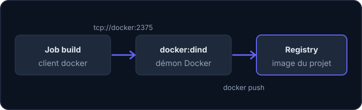

Le résultat d'un build dans l'équipe n'est presque jamais un binaire : c'est une **image Docker** que l'équipe Infra déploie ensuite. Ton pipeline doit donc la construire et la déposer dans le registry du projet.

## Les mots à connaître

- Une **image Docker** est un paquet figé qui contient un programme et tout ce qu'il lui faut pour tourner. Un **conteneur** est une image en cours d'exécution.
- Un **registry** est un entrepôt d'images. Chaque projet GitLab en possède un (menu *Deploy > Container Registry*).
- Un **tag** est l'étiquette d'une version d'image, après les deux-points : dans `mon-projet:feature-contact`, le tag est `feature-contact`.
- Un **démon** est un programme qui tourne en arrière-plan. Le démon Docker fabrique et lance les conteneurs ; la commande `docker` n'est qu'un **client** qui lui passe les ordres.
- Un **service** GitLab est un conteneur supplémentaire démarré à côté de celui du job.

## Le job de build d'Adhésion

Voici le job `build` de l'API d'Adhésion (légèrement raccourci) :

```yaml
build:
  stage: build
  before_script:
    - docker login -u "$CI_REGISTRY_USER" -p "$CI_REGISTRY_PASSWORD" $CI_REGISTRY
  script:
    - docker pull "$CI_REGISTRY_IMAGE:$CI_COMMIT_REF_SLUG" || true
    - docker build --cache-from "$CI_REGISTRY_IMAGE:$CI_COMMIT_REF_SLUG" --pull -t "$CI_REGISTRY_IMAGE:$CI_COMMIT_REF_SLUG" .
    - docker push "$CI_REGISTRY_IMAGE:$CI_COMMIT_REF_SLUG"
  services:
    - docker:dind
  variables:
    DOCKER_HOST: tcp://docker:2375
    DOCKER_DRIVER: overlay2
```

En tête du fichier, `image: docker:latest` indique que les jobs s'exécutent dans une image qui contient le client `docker`.



## Ligne à ligne

- `stage: build` range le job dans le stage `build`.
- `before_script` est lancé avant `script` ; ici il sert à se connecter.
- `docker login -u "$CI_REGISTRY_USER" -p "$CI_REGISTRY_PASSWORD" $CI_REGISTRY` s'authentifie auprès du registry : `-u` donne l'identifiant, `-p` le mot de passe, et le dernier argument l'adresse du registry. Les trois variables (`CI_REGISTRY`, `CI_REGISTRY_USER`, `CI_REGISTRY_PASSWORD`) sont des **variables prédéfinies** : GitLab les crée pour chaque job, tu n'as rien à configurer. Le `$` devant un nom veut dire « la valeur de cette variable ».
- `docker pull "…" || true` télécharge l'image déjà publiée pour la branche. Les deux barres `||` signifient « sinon, fais ceci » : `true` est une commande qui réussit toujours, donc le job ne tombe pas en erreur au tout premier build, quand l'image n'existe pas encore.
- `docker build` construit l'image à partir du `Dockerfile` (la recette de l'image) du dossier courant, représenté par le point final. `--cache-from` réutilise les couches de l'image téléchargée à la ligne précédente pour aller plus vite ; `--pull` récupère la dernière version de l'image de base ; `-t` (pour *tag*) donne son nom à l'image construite.
- `docker push` envoie l'image construite dans le registry.
- `services: - docker:dind` démarre le démon : *dind* signifie *Docker in Docker*. Le conteneur du job ne contient que le client `docker`, il lui faut un démon voisin.
- `DOCKER_HOST: tcp://docker:2375` dit au client où joindre ce démon : le service est joignable sous le nom `docker`, sur le port 2375.
- `DOCKER_DRIVER: overlay2` choisit la technique de stockage des couches d'image, la plus rapide.

Le nom complet d'une image se compose ainsi : `$CI_REGISTRY_IMAGE` est l'adresse du registry **de ton projet** (par exemple `registry.example.org/equipe/…`), suivie de `:` et du tag. `$CI_COMMIT_REF_SLUG` est le nom de la branche ou du tag Git rendu compatible avec une adresse (minuscules, `-` à la place des caractères spéciaux). La branche `feature/contact` donne le tag `feature-contact`.

:::tip Une variante plus discrète pour le mot de passe
Avec `-p`, le mot de passe apparaît dans la ligne de commande. Docker te le signale d'ailleurs par un avertissement. La variante `echo "$CI_REGISTRY_PASSWORD" | docker login -u "$CI_REGISTRY_USER" --password-stdin $CI_REGISTRY` le fait passer par l'entrée standard (le tube `|` envoie la sortie de `echo` à `docker login`) et ne l'affiche pas dans la commande. Les deux écritures marchent ; la seconde est préférable sur un nouveau projet.
:::

## Deux façons de choisir le tag

Les projets de l'équipe ne suivent pas tous la même convention :

:::cards
### Un tag par branche

Adhésion utilise `$CI_COMMIT_REF_SLUG`. Chaque branche a son image, la dernière version de la branche écrase la précédente.

### Un tag par contexte

Vitrine calcule `DOCKER_TAG` dans `workflow:rules` (les règles qui décident si le pipeline entier existe et qui peuvent fixer des variables) : `MR_<numéro>` pour une merge request, `master` pour la branche principale, `<branche>.<commit>` ailleurs.
:::

:::warning Le registry se remplit vite
Un tag par commit ou par merge request crée beaucoup d'images dans le registry du projet. Choisis des tags prévisibles, qui se réutilisent d'un pipeline à l'autre, et pense à faire le ménage dans *Deploy > Container Registry*.
:::

## Entraîne-toi

:::info Pas de démon Docker dans ce labo
Ton conteneur d'entraînement n'a ni démon Docker, ni réseau, ni registry : tu ne construiras donc aucune vraie image. Tu vas écrire le job et `verifier-ci` en contrôlera la **structure**. Il connaît les pièges classiques du build d'image : il avertit quand le script lance `docker` sans `docker:dind` ni `DOCKER_HOST`, quand il pousse sans s'être connecté, ou quand `docker build` n'a pas de `-t`. Il ne remplace pas un vrai pipeline.
:::

:::lab
engine: real
intro: |
  Ton dossier de travail contient une petite application Python (`app`), son `Dockerfile` et un `.gitlab-ci.yml` de départ avec deux jobs : `tests` et un job `build` encore très incomplet. Modifie le fichier avec `nano .gitlab-ci.yml` (Ctrl+O puis Entrée pour enregistrer, Ctrl+X pour quitter) ou l'éditeur de VS Code. L'option `--strict` de `verifier-ci` fait échouer l'outil même pour un simple avertissement : lance `verifier-ci .gitlab-ci.yml` pour lire ses messages. Pour calculer un tag, essaie `verifier-ci --slug 'une/branche'`.
commands:
  - cp -R /opt/exercices/03-image/. .
steps:
  - text: 'Quel tag obtient l''image construite depuis la branche `feature/Contact-Page` avec `$CI_COMMIT_REF_SLUG` ? Calcule-le, puis écris-le dans un fichier `tag.txt`'
    hint: 'Lance `verifier-ci --slug ''feature/Contact-Page''` : l''outil applique la règle de GitLab (minuscules, `-` à la place des caractères spéciaux). Écris le résultat avec `echo TAG > tag.txt`.'
    checks:
      - env-file-contains: [tag.txt, '^feature-contact-page\s*$']
    solution:
      - echo feature-contact-page > tag.txt
  - text: 'Lance `verifier-ci .gitlab-ci.yml` : le job `build` lance `docker` sans démon. Corrige-le (service `docker:dind` et variable `DOCKER_HOST`) jusqu''à ce que `verifier-ci --strict .gitlab-ci.yml` réussisse'
    hint: 'Ajoute au job `build` : `services:` avec l''élément `- docker:dind`, puis `variables:` avec `DOCKER_HOST: tcp://docker:2375`.'
    checks:
      - command-succeeds: verifier-ci --strict .gitlab-ci.yml
      - command-succeeds: "verifier-ci .gitlab-ci.yml --job build --cree --service docker:dind --variable DOCKER_HOST=tcp://docker:2375"
    solution:
      - write:
          .gitlab-ci.yml: |
            stages:
              - test
              - build

            tests:
              stage: test
              image: python:3.13
              script:
                - python3 -B -m unittest discover -s app

            build:
              stage: build
              image: docker:27
              services:
                - docker:dind
              variables:
                DOCKER_HOST: tcp://docker:2375
              script:
                - docker build -t mon-image .
  - text: 'Remplace le nom `mon-image` par un nom de registry lisible : `"$CI_REGISTRY_IMAGE:$CI_COMMIT_REF_SLUG"`'
    hint: 'La ligne devient `docker build -t "$CI_REGISTRY_IMAGE:$CI_COMMIT_REF_SLUG" .` (n''oublie pas le point final : c''est le dossier du `Dockerfile`).'
    after: [2]
    checks:
      - command-succeeds: "verifier-ci .gitlab-ci.yml --job build --cree --service docker:dind --variable DOCKER_HOST=tcp://docker:2375 --script-lance 'docker build :: -t :: $CI_REGISTRY_IMAGE:$CI_COMMIT_REF_SLUG'"
    solution:
      - write:
          .gitlab-ci.yml: |
            stages:
              - test
              - build

            tests:
              stage: test
              image: python:3.13
              script:
                - python3 -B -m unittest discover -s app

            build:
              stage: build
              image: docker:27
              services:
                - docker:dind
              variables:
                DOCKER_HOST: tcp://docker:2375
              script:
                - docker build -t "$CI_REGISTRY_IMAGE:$CI_COMMIT_REF_SLUG" .
  - text: 'Publie l''image : ajoute au job `build` un `before_script` avec `docker login` (identifiant `$CI_REGISTRY_USER`, mot de passe `$CI_REGISTRY_PASSWORD`, adresse `$CI_REGISTRY`), et une dernière commande `docker push` du même nom d''image'
    hint: 'Reprends le job d''Adhésion : `docker login -u "$CI_REGISTRY_USER" -p "$CI_REGISTRY_PASSWORD" $CI_REGISTRY` dans `before_script`, et `docker push "$CI_REGISTRY_IMAGE:$CI_COMMIT_REF_SLUG"` après le build.'
    after: [3]
    checks:
      - command-succeeds: verifier-ci --strict .gitlab-ci.yml
      - command-succeeds: "verifier-ci .gitlab-ci.yml --job build --cree --avant-script-lance 'docker login :: $CI_REGISTRY_USER'"
      - command-succeeds: "verifier-ci .gitlab-ci.yml --job build --script-lance 'docker push :: $CI_REGISTRY_IMAGE:$CI_COMMIT_REF_SLUG' --ordre 'docker login' 'docker build' 'docker push'"
    solution:
      - write:
          .gitlab-ci.yml: |
            stages:
              - test
              - build

            tests:
              stage: test
              image: python:3.13
              script:
                - python3 -B -m unittest discover -s app

            build:
              stage: build
              image: docker:27
              services:
                - docker:dind
              variables:
                DOCKER_HOST: tcp://docker:2375
              before_script:
                - docker login -u "$CI_REGISTRY_USER" -p "$CI_REGISTRY_PASSWORD" $CI_REGISTRY
              script:
                - docker build -t "$CI_REGISTRY_IMAGE:$CI_COMMIT_REF_SLUG" .
                - docker push "$CI_REGISTRY_IMAGE:$CI_COMMIT_REF_SLUG"
  - text: 'Accélère le build avec le cache : avant `docker build`, ajoute `docker pull` de l''image de la branche suivi de `|| true`, et passe `--cache-from` avec ce même nom à `docker build`'
    hint: 'Deux lignes de `script` : `docker pull "$CI_REGISTRY_IMAGE:$CI_COMMIT_REF_SLUG" || true`, puis `docker build --cache-from "$CI_REGISTRY_IMAGE:$CI_COMMIT_REF_SLUG" -t "$CI_REGISTRY_IMAGE:$CI_COMMIT_REF_SLUG" .`.'
    after: [4]
    checks:
      - command-succeeds: verifier-ci --strict .gitlab-ci.yml
      - command-succeeds: "verifier-ci .gitlab-ci.yml --job build --cree --script-lance 'docker pull :: $CI_REGISTRY_IMAGE:$CI_COMMIT_REF_SLUG :: || true'"
      - command-succeeds: "verifier-ci .gitlab-ci.yml --job build --script-lance 'docker build :: --cache-from :: $CI_REGISTRY_IMAGE:$CI_COMMIT_REF_SLUG' --ordre 'docker pull' 'docker build' 'docker push'"
    solution:
      - write:
          .gitlab-ci.yml: |-
            stages:
              - test
              - build

            tests:
              stage: test
              image: python:3.13
              script:
                - python3 -B -m unittest discover -s app

            build:
              stage: build
              image: docker:27
              services:
                - docker:dind
              variables:
                DOCKER_HOST: tcp://docker:2375
              before_script:
                - docker login -u "$CI_REGISTRY_USER" -p "$CI_REGISTRY_PASSWORD" $CI_REGISTRY
              script:
                - docker pull "$CI_REGISTRY_IMAGE:$CI_COMMIT_REF_SLUG" || true
                - docker build --cache-from "$CI_REGISTRY_IMAGE:$CI_COMMIT_REF_SLUG" -t "$CI_REGISTRY_IMAGE:$CI_COMMIT_REF_SLUG" .
                - docker push "$CI_REGISTRY_IMAGE:$CI_COMMIT_REF_SLUG"
:::

## Vérifie tes acquis

:::quiz
Pourquoi le job de build déclare-t-il `services: - docker:dind` ?

- [ ] Pour installer Docker sur le poste de la personne qui pousse
- [ ] Pour télécharger l'image de base du `Dockerfile`
- [x] Pour fournir un démon Docker auquel le client du job se connecte

> Le conteneur du job ne contient que le client `docker` ; le démon tourne dans le service voisin.
:::

:::quiz
D'où viennent `CI_REGISTRY_USER` et `CI_REGISTRY_PASSWORD` ?

- [x] GitLab les crée automatiquement pour chaque job
- [ ] Ils doivent être saisis par un·e mainteneur·se dans les paramètres
- [ ] Ils sont écrits en clair dans le `Dockerfile`

> Ce sont des variables prédéfinies, valables le temps du job.
:::

:::quiz
Quel tag obtient l'image construite depuis la branche `feature/contact` avec `$CI_COMMIT_REF_SLUG` ?

- [ ] `feature/contact`
- [ ] `latest`
- [x] `feature-contact`

> Le slug remplace les caractères non autorisés dans un tag, comme `/`, par des `-`.
:::

:::quiz
Que fait `docker pull "$CI_REGISTRY_IMAGE:$CI_COMMIT_REF_SLUG" || true` avant le build ?

- [ ] Il supprime l'ancienne image du registry
- [ ] Il fait échouer le job si l'image existe
- [x] Il récupère l'image précédente pour accélérer le build, sans échouer si elle n'existe pas

> L'image récupérée sert de cache à `docker build --cache-from`.
:::
