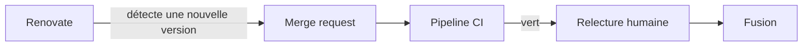

Une dépendance obsolète est une faille qui attend son heure. Mettre à jour à la main une quarantaine de bibliothèques sur chaque projet ? Personne ne le fait régulièrement. Renovate s'en charge : il ouvre lui-même des merge requests.

## Les mots à connaître

- Une **dépendance** est une bibliothèque dont ton projet a besoin (par exemple `next` ou `react` dans un projet web).
- Une **version** s'écrit en général `majeure.mineure.correctif`, par exemple `15.2.1`. Passer de `15.2.1` à `15.2.2` est une mise à jour de **correctif** (`patch`), à `15.3.0` une mise à jour **mineure**, à `16.0.0` une mise à jour **majeure** : c'est celle qui risque de casser des choses.
- Une **merge request** est une demande de fusion que l'équipe relit avant d'accepter.
- **JSON** est un format de texte pour décrire des données : des accolades `{ }` pour un objet (des paires `"clé": valeur`), des crochets `[ ]` pour une liste, des guillemets **doubles** pour les textes, et jamais de virgule après le dernier élément.

## Le principe

**Renovate** est un robot qui lit les fichiers de dépendances de ton dépôt (`Pipfile`, `package.json`, `Dockerfile`…), repère les versions plus récentes et ouvre une **merge request par mise à jour**. Il se règle avec un fichier `renovate.json` à la racine.



La CI joue ici un rôle clé : c'est elle qui dit si la mise à jour casse quelque chose. Sans tests, une merge request de Renovate ne vaut pas grand-chose.

## Lire un `renovate.json` de l'équipe

Celui de l'API d'Adhésion, sans la partie qui concerne l'accès à GitHub :

```json
{
  "extends": ["config:base"],
  "labels": ["Dependencies", "Maintenance", "Merge request::Needs review"],
  "vulnerabilityAlerts": {
    "labels": ["Priority::Critical"]
  },
  "masterIssue": true,
  "masterIssueApproval": true
}
```

- `extends` reprend une configuration prête à l'emploi de Renovate. `config:base` en est une ; son successeur actuel s'appelle `config:recommended`.
- `labels` colle des **étiquettes** (*labels*, des marqueurs colorés que GitLab affiche sur une merge request) sur chaque merge request du robot, ce qui les classe dans le flux de relecture du projet.
- `vulnerabilityAlerts` : une mise à jour qui corrige une vulnérabilité connue (une faille de sécurité publiée) reçoit en plus l'étiquette `Priority::Critical`.
- `masterIssue` et `masterIssueApproval` : Renovate tient une **issue** de suivi (un ticket) qui liste les mises à jour possibles, et n'ouvre la merge request que lorsque quelqu'un coche la case correspondante. Dans les versions récentes de Renovate, cette issue s'appelle le *dependency dashboard* (tableau de bord des dépendances) et les options se nomment `dependencyDashboard` et `dependencyDashboardApproval` : vérifie la documentation actuelle avant de copier la configuration.

Le fichier d'origine déclare aussi un jeton pour accéder à GitHub. Il y est **chiffré** avec la clé de Renovate : c'est le seul moyen acceptable d'écrire un secret dans ce fichier, et tu n'as pas à le recopier dans un nouveau projet. Un jeton écrit en clair dans `renovate.json` doit être révoqué, comme n'importe quel secret commité (leçon 4).

:::tip Traiter une merge request de Renovate
1. Regarde le pipeline : s'il est rouge, la mise à jour casse quelque chose, lis le log.
2. Ouvre le *changelog* (la liste des changements) de la dépendance, lié dans la description.
3. Pour une mise à jour majeure, teste en local avant de fusionner.
4. Fusionne selon la règle de l'équipe : un·e mainteneur·se décide.
:::

:::warning Fusionner sans lire
Un pipeline vert ne prouve que ce que tes tests couvrent. Une dépendance peut changer de comportement sans casser un seul test.
:::

## Entraîne-toi

:::info Ce n'est pas Renovate
Le robot ne tourne pas dans ce labo (il lui faudrait le réseau et un accès au dépôt). `verifier-renovate` est un petit outil de l'équipe qui lit un `renovate.json`, repère les erreurs que Renovate signalerait (JSON mal formé, option inconnue, règle sans effet, jeton en clair) et résume ce que la configuration demande. Sa liste d'options est partielle : en cas de doute, la documentation de Renovate fait foi.
:::

:::lab
engine: real
intro: |
  Ton dossier de travail contient deux fichiers à réparer, `renovate-casse.json` et `renovate-fuite.json`, ainsi qu'un `package.json` et un `Dockerfile` qui jouent les fichiers de dépendances. Modifie les fichiers avec `nano` (Ctrl+O puis Entrée pour enregistrer, Ctrl+X pour quitter) ou l'éditeur de VS Code. Pour contrôler un fichier : `verifier-renovate renovate-casse.json`.
commands:
  - cp -R /opt/exercices/06-renovate/. .
steps:
  - text: 'Répare `renovate-casse.json` : `verifier-renovate renovate-casse.json` signale d''abord un JSON mal formé, puis une option inconnue. Corrige jusqu''à ce que le fichier soit valide'
    hint: 'JSON refuse la virgule après le dernier élément d''un objet. Ensuite, l''option mal orthographiée doit s''appeler `labels`.'
    checks:
      - command-succeeds: verifier-renovate renovate-casse.json
      - output-contains: ['verifier-renovate renovate-casse.json', 'labels : ']
    solution:
      - write:
          renovate-casse.json: |
            {
              "extends": ["config:base"],
              "labels": ["Dependencies"]
            }
  - text: 'Écris un `renovate.json` neuf : il étend `config:recommended` et colle les étiquettes `Dependencies` et `Maintenance` sur les merge requests du robot. `verifier-renovate --strict renovate.json` doit réussir'
    hint: 'Un objet JSON avec deux clés : `"extends": ["config:recommended"]` et `"labels": ["Dependencies", "Maintenance"]`, séparées par une virgule.'
    checks:
      - command-succeeds: verifier-renovate --strict renovate.json
      - output-contains: ['verifier-renovate renovate.json', 'extends : .*config:recommended']
      - output-contains: ['verifier-renovate renovate.json', 'labels : .*Dependencies.*Maintenance']
    solution:
      - write:
          renovate.json: |
            {
              "extends": ["config:recommended"],
              "labels": ["Dependencies", "Maintenance"]
            }
  - text: 'Marque les mises à jour de sécurité : ajoute `vulnerabilityAlerts` avec l''étiquette `Priority::Critical`'
    hint: 'Après `labels`, ajoute une virgule puis `"vulnerabilityAlerts": { "labels": ["Priority::Critical"] }`.'
    after: [2]
    checks:
      - command-succeeds: verifier-renovate --strict renovate.json
      - output-contains: ['verifier-renovate renovate.json', 'alertes de vulnérabilité : labels .*Priority::Critical']
    solution:
      - write:
          renovate.json: |
            {
              "extends": ["config:recommended"],
              "labels": ["Dependencies", "Maintenance"],
              "vulnerabilityAlerts": {
                "labels": ["Priority::Critical"]
              }
            }
  - text: 'Les mises à jour **majeures** sont risquées : ajoute une règle dans `packageRules` qui, pour `matchUpdateTypes` valant `["major"]`, exige une approbation (`dependencyDashboardApproval` à `true`) et ajoute l''étiquette `Major`'
    hint: 'Une liste `"packageRules": [ { … } ]` ; l''objet contient `"matchUpdateTypes": ["major"]` (le critère), puis `"dependencyDashboardApproval": true` et `"labels": ["Major"]` (les effets).'
    after: [3]
    checks:
      - command-succeeds: verifier-renovate --strict renovate.json
      - output-contains: ['verifier-renovate renovate.json', 'règle \d+ : major -> .*dependencyDashboardApproval']
    solution:
      - write:
          renovate.json: |
            {
              "extends": ["config:recommended"],
              "labels": ["Dependencies", "Maintenance"],
              "vulnerabilityAlerts": {
                "labels": ["Priority::Critical"]
              },
              "packageRules": [
                {
                  "matchUpdateTypes": ["major"],
                  "dependencyDashboardApproval": true,
                  "labels": ["Major"]
                }
              ]
            }
  - text: '`renovate-fuite.json` contient un jeton GitLab (faux) écrit en clair. `verifier-renovate renovate-fuite.json` le refuse. Retire-le du fichier : la bonne pratique est de donner le jeton au robot par sa propre configuration, jamais dans le dépôt'
    hint: 'Supprime tout le bloc `hostRules` (et la virgule qui le précède), en gardant `extends`.'
    checks:
      - command-succeeds: verifier-renovate renovate-fuite.json
      - command-fails: grep -q 'glpat-' renovate-fuite.json
      - output-contains: ['verifier-renovate renovate-fuite.json', 'extends : .*config:recommended']
    solution:
      - write:
          renovate-fuite.json: |-
            {
              "extends": ["config:recommended"]
            }
:::

## Vérifie tes acquis

:::quiz
Que fait Renovate ?

- [ ] Il déploie automatiquement l'application en production
- [ ] Il corrige les bugs de ton code
- [x] Il propose des mises à jour de dépendances sous forme de merge requests

> Il ouvre des merge requests ; c'est ensuite à l'équipe de les relire et de les fusionner.
:::

:::quiz
Dans le `renovate.json` d'Adhésion, que fait `"vulnerabilityAlerts": {"labels": ["Priority::Critical"]}` ?

- [ ] Il bloque toutes les mises à jour de l'application
- [x] Il ajoute l'étiquette `Priority::Critical` aux mises à jour qui corrigent une vulnérabilité
- [ ] Il envoie un e-mail à l'équipe Infra

> Le robot distingue ainsi les mises à jour de sécurité des mises à jour de confort.
:::

:::quiz
Pourquoi les tests de la CI sont-ils importants avec Renovate ?

- [ ] Renovate refuse d'ouvrir une merge request sans test
- [ ] Ils remplacent la relecture humaine
- [x] Ils indiquent si la nouvelle version d'une dépendance casse quelque chose

> Le pipeline de la merge request est le premier filet de sécurité.
:::

:::quiz
Une dépendance passe de la version `3.4.1` à `4.0.0`. De quel type de mise à jour s'agit-il ?

- [ ] Un correctif (`patch`)
- [ ] Une mise à jour mineure
- [x] Une mise à jour majeure, à tester avec soin

> Le premier nombre change : le fonctionnement de la bibliothèque a pu évoluer de façon incompatible.
:::
