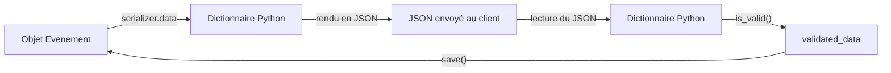

Ton modèle `Evenement` est un objet Python, rangé dans la base de données. Or un client d'API n'attend pas un objet Python : il attend du **JSON**. Et quand il t'envoie un nouvel événement, rien ne garantit que les données soient correctes (une date absente, un nombre de places négatif…). Le **sérialiseur** est la pièce de DRF qui traduit dans les deux sens **et** qui vérifie ce qui arrive.

## Le domaine d'exemple

Dans tout le parcours, on utilise un domaine fictif : des associations (`Asso`) organisent des événements (`Evenement`), auxquels on s'inscrit (`Inscription`). Ce sont des modèles Django ordinaires, comme tu les as vus dans le parcours *Django*.

```python
# agenda/models.py
from django.db import models


class Asso(models.Model):
    nom = models.CharField(max_length=100, unique=True)


class Evenement(models.Model):
    asso = models.ForeignKey(Asso, on_delete=models.CASCADE, related_name="evenements")
    titre = models.CharField(max_length=200)
    date = models.DateTimeField()
    places = models.PositiveIntegerField(default=30)
    ouvert = models.BooleanField(default=True)


class Inscription(models.Model):
    evenement = models.ForeignKey(Evenement, on_delete=models.CASCADE, related_name="inscriptions")
    email = models.EmailField()
```

- `Asso` a un seul champ : son nom, unique.
- `Evenement` appartient à une `Asso` (clé étrangère). `related_name="evenements"` permet d'écrire `asso.evenements` pour retrouver ses événements.
- `Inscription` relie une adresse email à un événement.
- `on_delete=models.CASCADE` signifie que, si l'association est supprimée, ses événements le sont aussi.

Pour utiliser DRF, il faut aussi l'installer (`pip install djangorestframework`) et ajouter `"rest_framework"` à `INSTALLED_APPS` (la liste des applications du projet) dans `settings.py`. Dans les labos de ce parcours, tout est déjà installé et réglé.

## Le sérialiseur dans les deux sens

Un mot de vocabulaire : **sérialiser** veut dire transformer un objet en une forme transportable (ici, un dictionnaire puis du JSON) ; **désérialiser** est l'opération inverse.



- **Sortie** : tu passes un objet (`instance`) au sérialiseur, tu lis `serializer.data`.
- **Entrée** : tu passes les données reçues (`data=`), tu appelles `is_valid()` qui les contrôle, puis `save()` qui enregistre si tout va bien.

## Un premier `ModelSerializer`

Un `ModelSerializer` est un sérialiseur qui **déduit** ses champs à partir d'un modèle. Tu lui dis quel modèle et quels champs : il fait le reste.

```python
# agenda/serializers.py
from rest_framework import serializers

from .models import Asso, Evenement


class EvenementSerializer(serializers.ModelSerializer):
    asso = serializers.SlugRelatedField(slug_field="nom", queryset=Asso.objects.all())
    places_restantes = serializers.SerializerMethodField()

    class Meta:
        model = Evenement
        fields = ("id", "asso", "titre", "date", "places", "places_restantes", "ouvert")
        read_only_fields = ("id",)

    def get_places_restantes(self, obj):
        return obj.places - obj.inscriptions.count()
```

Ligne à ligne :

1. `from rest_framework import serializers` importe la boîte à outils de DRF.
2. `class EvenementSerializer(serializers.ModelSerializer)` crée notre sérialiseur.
3. `asso = serializers.SlugRelatedField(...)` : par défaut, une clé étrangère s'affiche comme un numéro (`"asso": 3`). Un « slug » est ici un identifiant lisible : avec `slug_field="nom"`, on affiche `"asso": "Ciné-club"`. Le `queryset` (la requête Django qui liste les objets possibles, ici toutes les associations) indique où chercher l'association quand on **reçoit** un nom.
4. `places_restantes = serializers.SerializerMethodField()` déclare un champ **calculé** : il n'existe pas en base, sa valeur vient d'une méthode.
5. `class Meta` regroupe la configuration. `model` désigne le modèle, `fields` liste les champs exposés, `read_only_fields` ceux qui sortent mais sont ignorés en entrée (on ne laisse pas le client choisir l'`id`).
6. `get_places_restantes(self, obj)` est la méthode appelée pour le champ calculé : DRF la trouve par son nom (`get_` + nom du champ). `obj` est l'événement sérialisé.

L'API d'Adhésion utilise la même idée : son `StudentProfileSerializer` remplace `study_year`, `school` et `department` par des `SlugRelatedField` sur `name` ou `short_name`.

Dans un shell Django (`python manage.py shell`, une console Python où tes modèles sont importables), avec un événement existant :

```python
>>> from agenda.serializers import EvenementSerializer
>>> EvenementSerializer(evenement).data
{'id': 1, 'asso': 'Ciné-club', 'titre': 'Soirée courts-métrages', 'date': '2099-03-12T18:00:00+01:00', 'places': 2, 'places_restantes': 1, 'ouvert': True}
```

On a bien un dictionnaire prêt à être transformé en JSON, avec le nom de l'association à la place de son numéro et la date au format standard.

## Valider ce qui arrive

En entrée, on ne fait **jamais** confiance au client. `is_valid()` applique d'abord les règles déduites du modèle (types, longueurs, existence de l'association), puis **tes** règles, que tu ajoutes dans le sérialiseur :

```python
from django.utils import timezone


class EvenementSerializer(serializers.ModelSerializer):
    # ... champs et Meta comme avant ...

    def validate_places(self, value):
        if value < 1:
            raise serializers.ValidationError("Il faut au moins une place.")
        return value

    def validate(self, data):
        if data.get("ouvert", True) and data["date"] < timezone.now():
            raise serializers.ValidationError("Un événement passé ne peut pas être ouvert.")
        return data
```

- `validate_places(self, value)` : DRF l'appelle automatiquement pour le champ `places` (préfixe `validate_` + nom du champ). Si la valeur est mauvaise, on lève une `ValidationError` avec un message ; sinon on **renvoie la valeur**.
- `validate(self, data)` est appelée une fois tous les champs validés, avec l'ensemble des données (sous forme de dictionnaire) : c'est l'endroit pour une règle qui compare plusieurs champs. `data.get("ouvert", True)` lit `ouvert`, avec `True` par défaut s'il est absent, car `ouvert` n'est pas obligatoire. Elle doit renvoyer `data`.

Essayons avec des données fausses :

```python
>>> s = EvenementSerializer(data={"asso": "Inconnue", "titre": "x", "date": "2099-01-01T10:00:00Z", "places": 0})
>>> s.is_valid()
False
>>> s.errors
{'asso': [ErrorDetail(string="L'objet avec nom=Inconnue n'existe pas.", code='does_not_exist')], 'places': [ErrorDetail(string='Il faut au moins une place.', code='invalid')]}
```

`s.errors` regroupe les erreurs **par champ** (c'est ce dictionnaire, converti en JSON, que recevra le client avec un code `400`). Les erreurs de `validate()` sont rangées sous `non_field_errors`. Avec des données correctes, `is_valid()` renvoie `True`, `s.validated_data` contient les valeurs converties (l'association est devenue un objet `Asso`) et `s.save()` crée l'événement.

## Imbriquer des sérialiseurs

Pour afficher les événements d'une association dans la même réponse, on utilise un sérialiseur **comme champ** d'un autre :

```python
class AssoSerializer(serializers.ModelSerializer):
    evenements = EvenementSerializer(many=True, read_only=True)

    class Meta:
        model = Asso
        fields = ("id", "nom", "evenements")
```

- `evenements` porte le nom du `related_name` du modèle.
- `many=True` : il y a plusieurs événements, donc une liste.
- `read_only=True` : on ne crée pas d'événements en passant par l'association (l'écriture imbriquée demande du code supplémentaire).

C'est ce que fait `MemberSerializer` dans Adhésion avec `memberships`, `cards` et `bans`. En revanche, son champ `student_profile` est en écriture : le sérialiseur redéfinit alors `create()` et `update()` à la main, car DRF refuse d'enregistrer seul un sérialiseur imbriqué modifiable.

:::warning Un champ ajouté dans `fields` est un champ publié
`fields = "__all__"` expose tout, y compris ce que tu ajouteras demain au modèle (un email personnel, un indicateur interne). Adhésion l'utilise pour `MembershipSerializer`, mais liste explicitement les champs de `MemberSerializer`. Pour des données personnelles, liste toujours les champs.
:::

## Entraîne-toi

:::lab
engine: real
intro: |
  Le projet de l'API des événements est dans ton dossier de travail, avec un sérialiseur à compléter dans `agenda/serializers.py`. Au départ, l'association s'affiche comme un numéro, il n'y a ni champ calculé ni validation. Lance `pytest -q test_serialiseurs.py` : les cinq tests échouent, et chaque message te dit ce qui manque. Corrige-les un par un.
commands:
  - cp -R /opt/exercices/base/. .
  - cp -R /opt/exercices/02-serialiseurs/. .
steps:
  - text: 'Dans `agenda/serializers.py`, affiche l''association d''un événement par son **nom** (`"asso": "Ciné-club"`) au lieu de son numéro, avec un `SlugRelatedField` : `test_asso_affichee_par_son_nom` doit passer'
    hint: 'Dans la classe, déclare `asso = serializers.SlugRelatedField(slug_field="nom", queryset=Asso.objects.all())`. Puis `pytest -q -k asso_affichee`.'
    checks:
      - command-succeeds: '/opt/outils/verifier-tests 02-serialiseurs test_asso_affichee_par_son_nom'
    solution:
      - write:
          agenda/serializers.py: |
            from rest_framework import serializers

            from .models import Asso, Evenement


            class EvenementSerializer(serializers.ModelSerializer):
                asso = serializers.SlugRelatedField(slug_field="nom", queryset=Asso.objects.all())

                class Meta:
                    model = Evenement
                    fields = ("id", "asso", "titre", "date", "places", "ouvert")


            class AssoSerializer(serializers.ModelSerializer):
                class Meta:
                    model = Asso
                    fields = ("id", "nom")
  - text: 'Ajoute le champ calculé `places_restantes` (places moins inscriptions) : un `SerializerMethodField`, sa méthode `get_places_restantes`, et le nom du champ dans `fields`. `test_places_restantes` doit passer'
    hint: 'La méthode reçoit l''événement dans `obj` : `obj.places - obj.inscriptions.count()`. N''oublie pas d''ajouter `"places_restantes"` dans `fields`.'
    after: [1]
    checks:
      - command-succeeds: '/opt/outils/verifier-tests 02-serialiseurs test_places_restantes'
    solution:
      - write:
          agenda/serializers.py: |
            from rest_framework import serializers

            from .models import Asso, Evenement


            class EvenementSerializer(serializers.ModelSerializer):
                asso = serializers.SlugRelatedField(slug_field="nom", queryset=Asso.objects.all())
                places_restantes = serializers.SerializerMethodField()

                class Meta:
                    model = Evenement
                    fields = ("id", "asso", "titre", "date", "places", "places_restantes", "ouvert")
                    read_only_fields = ("id",)

                def get_places_restantes(self, obj):
                    return obj.places - obj.inscriptions.count()


            class AssoSerializer(serializers.ModelSerializer):
                class Meta:
                    model = Asso
                    fields = ("id", "nom")
  - text: 'Refuse les événements à moins d''une place avec `validate_places` : l''erreur doit apparaître sous la clé `places`. `test_places_positives` doit passer'
    hint: 'La méthode s''appelle `validate_places(self, value)` : lève `serializers.ValidationError("Il faut au moins une place.")` si `value < 1`, sinon retourne `value`.'
    after: [2]
    checks:
      - command-succeeds: '/opt/outils/verifier-tests 02-serialiseurs test_places_positives'
    solution:
      - write:
          agenda/serializers.py: |
            from rest_framework import serializers

            from .models import Asso, Evenement


            class EvenementSerializer(serializers.ModelSerializer):
                asso = serializers.SlugRelatedField(slug_field="nom", queryset=Asso.objects.all())
                places_restantes = serializers.SerializerMethodField()

                class Meta:
                    model = Evenement
                    fields = ("id", "asso", "titre", "date", "places", "places_restantes", "ouvert")
                    read_only_fields = ("id",)

                def get_places_restantes(self, obj):
                    return obj.places - obj.inscriptions.count()

                def validate_places(self, value):
                    if value < 1:
                        raise serializers.ValidationError("Il faut au moins une place.")
                    return value


            class AssoSerializer(serializers.ModelSerializer):
                class Meta:
                    model = Asso
                    fields = ("id", "nom")
  - text: 'Refuse un événement **passé** et **ouvert** avec `validate(self, data)` (compare `data["date"]` à `timezone.now()`) : l''erreur est rangée sous `non_field_errors`. `test_evenement_passe` doit passer'
    hint: 'Il faut importer `timezone` (`from django.utils import timezone`). `data.get("ouvert", True)` lit le champ avec `True` par défaut. N''oublie pas de retourner `data`.'
    after: [3]
    checks:
      - command-succeeds: '/opt/outils/verifier-tests 02-serialiseurs test_evenement_passe'
    solution:
      - write:
          agenda/serializers.py: |
            from django.utils import timezone
            from rest_framework import serializers

            from .models import Asso, Evenement


            class EvenementSerializer(serializers.ModelSerializer):
                asso = serializers.SlugRelatedField(slug_field="nom", queryset=Asso.objects.all())
                places_restantes = serializers.SerializerMethodField()

                class Meta:
                    model = Evenement
                    fields = ("id", "asso", "titre", "date", "places", "places_restantes", "ouvert")
                    read_only_fields = ("id",)

                def get_places_restantes(self, obj):
                    return obj.places - obj.inscriptions.count()

                def validate_places(self, value):
                    if value < 1:
                        raise serializers.ValidationError("Il faut au moins une place.")
                    return value

                def validate(self, data):
                    if data.get("ouvert", True) and data["date"] < timezone.now():
                        raise serializers.ValidationError("Un événement passé ne peut pas être ouvert.")
                    return data


            class AssoSerializer(serializers.ModelSerializer):
                class Meta:
                    model = Asso
                    fields = ("id", "nom")
  - text: 'Imbrique les événements dans `AssoSerializer` : un champ `evenements = EvenementSerializer(many=True, read_only=True)`, à ajouter aussi dans `fields`. `test_asso_contient_ses_evenements` doit passer'
    hint: 'Le champ porte le nom du `related_name` du modèle (`evenements`) ; `many=True` car il y en a plusieurs.'
    after: [4]
    checks:
      - command-succeeds: '/opt/outils/verifier-tests 02-serialiseurs test_asso_contient'
    solution:
      - write:
          agenda/serializers.py: |-
            from django.utils import timezone
            from rest_framework import serializers

            from .models import Asso, Evenement


            class EvenementSerializer(serializers.ModelSerializer):
                asso = serializers.SlugRelatedField(slug_field="nom", queryset=Asso.objects.all())
                places_restantes = serializers.SerializerMethodField()

                class Meta:
                    model = Evenement
                    fields = ("id", "asso", "titre", "date", "places", "places_restantes", "ouvert")
                    read_only_fields = ("id",)

                def get_places_restantes(self, obj):
                    return obj.places - obj.inscriptions.count()

                def validate_places(self, value):
                    if value < 1:
                        raise serializers.ValidationError("Il faut au moins une place.")
                    return value

                def validate(self, data):
                    if data.get("ouvert", True) and data["date"] < timezone.now():
                        raise serializers.ValidationError("Un événement passé ne peut pas être ouvert.")
                    return data


            class AssoSerializer(serializers.ModelSerializer):
                evenements = EvenementSerializer(many=True, read_only=True)

                class Meta:
                    model = Asso
                    fields = ("id", "nom", "evenements")
:::

## Vérifie tes acquis

:::quiz
Quel attribut du sérialiseur contient les données prêtes à être renvoyées en JSON ?

- [ ] `serializer.validated_data`
- [ ] `serializer.errors`
- [x] `serializer.data`
- [ ] `serializer.instance`

> `data` est la représentation de sortie. `validated_data` n'existe qu'après `is_valid()` sur des données entrantes.
:::

:::quiz
Tu veux exposer le nombre de places restantes, calculé à partir d'autres données. Quelle solution convient ?

- [ ] Un champ `places_restantes` dans `read_only_fields` uniquement
- [x] Un `SerializerMethodField` et une méthode `get_places_restantes`
- [ ] Une méthode `validate_places_restantes`
- [ ] Un `SlugRelatedField(slug_field="places_restantes")`

> `SerializerMethodField` appelle `get_<nom>` pour produire une valeur en lecture seule. `validate_*` ne sert qu'en entrée.
:::

:::quiz
Où retrouves-tu l'erreur levée par `validate()` (et non par un champ précis) ?

- [ ] Dans `serializer.errors["validate"]`
- [ ] Dans `serializer.validated_data`
- [ ] Elle fait planter la requête avec une erreur 500
- [x] Dans `serializer.errors["non_field_errors"]`

> Les erreurs qui ne concernent pas un champ unique sont rangées sous `non_field_errors`.
:::

:::quiz
Pourquoi préférer `fields = (...)` à `fields = "__all__"` pour un modèle contenant des données personnelles ?

- [ ] Parce que `"__all__"` est plus lent
- [ ] Parce que `"__all__"` empêche l'écriture
- [ ] Parce que `"__all__"` n'accepte pas les relations
- [x] Parce qu'un champ ajouté plus tard au modèle serait exposé sans décision explicite

> Une liste explicite évite les fuites involontaires lors d'évolutions du modèle.
:::
