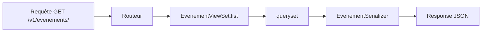

Le sérialiseur sait convertir et valider, mais il ne répond à aucune requête : personne ne l'appelle quand un client envoie `GET /v1/evenements/`. Il manque la pièce qui reçoit la requête, choisit quoi faire selon le verbe, utilise le sérialiseur et renvoie la réponse : la **vue**.

## Une vue à la main, pour comprendre

Une **vue** est une fonction ou une classe qui reçoit une requête et renvoie une réponse. Voici la plus simple, écrite avec la classe `APIView` de DRF :

```python
from rest_framework.response import Response
from rest_framework.views import APIView

from .models import Evenement
from .serializers import EvenementSerializer


class EvenementListe(APIView):
    def get(self, request):
        serializer = EvenementSerializer(Evenement.objects.all(), many=True)
        return Response(serializer.data)
```

- `APIView` appelle la méthode qui porte le nom du verbe HTTP : ici `get` répond aux `GET`.
- `request` est la requête (DRF l'enrichit par rapport à Django : `request.data` contient le JSON reçu).
- `EvenementSerializer(..., many=True)` sérialise une liste d'objets.
- `Response(...)` renvoie les données au client ; DRF choisit le format de sortie (JSON ici).

Pour lister, créer, lire, modifier et supprimer, il faudrait cinq méthodes presque identiques, deux classes et leurs URL. DRF propose un raccourci.

## Le viewset : une classe pour toute une ressource

Un **viewset** regroupe dans une seule classe toutes les opérations sur une ressource. Le plus complet, `ModelViewSet`, fournit tout seul la liste, le détail, la création, la modification et la suppression :

```python
from rest_framework import viewsets

from .models import Evenement
from .serializers import EvenementSerializer


class EvenementViewSet(viewsets.ModelViewSet):
    queryset = Evenement.objects.select_related("asso").order_by("date")
    serializer_class = EvenementSerializer
```

Deux attributs suffisent :

- `queryset` : l'ensemble d'objets sur lequel la vue travaille (une *requête* Django, donc paresseuse : elle n'interroge la base de données qu'au moment où l'on lit son résultat). `select_related("asso")` charge l'association avec chaque événement en une seule requête SQL (SQL est le langage de la base de données), et `order_by("date")` fixe un ordre stable, indispensable pour paginer plus tard.
- `serializer_class` : le sérialiseur à utiliser, celui de la leçon précédente.

Cette classe de quatre lignes répond à :

| Requête | Action du viewset | Ce que ça fait | Code de réponse |
| --- | --- | --- | :---: |
| `GET /evenements/` | `list` | Liste | `200` |
| `POST /evenements/` | `create` | Crée | `201` |
| `GET /evenements/1/` | `retrieve` | Détail | `200` |
| `PUT /evenements/1/` | `update` | Remplace | `200` |
| `PATCH /evenements/1/` | `partial_update` | Modifie en partie | `200` |
| `DELETE /evenements/1/` | `destroy` | Supprime | `204` |

Si l'API ne doit que **lire**, utilise `ReadOnlyModelViewSet` : seules `list` et `retrieve` existent, l'écriture est impossible par construction. L'API d'Adhésion l'applique à ses tables de référence (`StudyYearViewset`, `StudySchoolViewset`, `StudyDepartmentViewset`), et PlanningAPI à `ModuleView` et `CreneauView`.

## Le routeur : fabriquer les URL

Un **routeur** déduit les URL d'un viewset. Dans `urls.py` :

```python
from django.urls import include, path
from rest_framework import routers

from agenda import views

router = routers.DefaultRouter()
router.register("evenements", views.EvenementViewSet)
router.register("assos", views.AssoViewSet)

urlpatterns = [
    path("v1/", include(router.urls)),
]
```

1. `routers.DefaultRouter()` crée le routeur.
2. `router.register("evenements", ViewSet)` associe le préfixe d'URL `evenements` au viewset ; le routeur génère `/evenements/` et `/evenements/<id>/`. Le nom des URL (que la fonction `reverse` de Django utilise pour retrouver une adresse) est déduit du modèle du `queryset` ; quand le viewset n'a pas de `queryset`, il faut passer un `basename` en troisième argument, comme Adhésion le fait pour `members` et `infos`.
3. `path("v1/", include(router.urls))` monte le tout sous `/v1/` : le `v1` permet de publier plus tard une `v2` sans casser les clients existants.

Le `DefaultRouter` ajoute aussi à la racine (`/v1/`) une page qui liste toutes les ressources. Le fichier `urls.py` d'Adhésion contient une dizaine de lignes `router.register(...)` (`cards`, `members`, `memberships`, `card_types`…), et celui de PlanningAPI en contient trois (`modules`, `participants`, `creneau`).



## Personnaliser sans tout réécrire

Quand le comportement par défaut ne suffit pas, tu surcharges **une** méthode.

**Filtrer l'ensemble d'objets selon la requête** avec `get_queryset()` :

```python
def get_queryset(self):
    queryset = super().get_queryset()
    if self.request.query_params.get("a_venir") == "true":
        queryset = queryset.filter(date__gte=timezone.now())
    return queryset
```

`self.request.query_params` contient les paramètres de l'URL (`?a_venir=true`). Adhésion fait ceci dans plusieurs viewsets (par exemple `BannedMemberViewSet` filtre sur `?member=` et `?active=`).

**Ajouter une action qui n'est pas du CRUD** (créer, lire, modifier, supprimer) avec `@action`, un *décorateur* (la ligne qui commence par `@`, placée au-dessus d'une méthode pour en modifier le comportement) :

```python
from rest_framework.decorators import action
from rest_framework.response import Response


class EvenementViewSet(viewsets.ModelViewSet):
    # ... queryset et serializer_class ...

    @action(detail=True, methods=["post"])
    def fermer(self, request, pk=None):
        """Ferme les inscriptions à l'événement."""
        evenement = self.get_object()
        evenement.ouvert = False
        evenement.save(update_fields=["ouvert"])
        return Response(self.get_serializer(evenement).data)
```

- `detail=True` : l'action porte sur **un** événement (URL `/evenements/1/fermer/`) ; `detail=False` s'appliquerait à toute la collection (`/evenements/export/`).
- `methods=["post"]` : seul `POST` est accepté.
- `pk` est l'identifiant (*primary key*) de l'événement, lu dans l'URL.
- `self.get_object()` récupère l'événement visé par l'URL (et renvoie un `404` s'il n'existe pas).
- `self.get_serializer(...)` construit le sérialiseur configuré du viewset.

Le routeur découvre l'action tout seul. Adhésion en utilise plusieurs sur `CardTypesViewset` et `MembershipTypesViewset` (`/v1/card_types/all`, `/v1/membership_types/all`).

:::warning Un `ModelViewSet` donne le droit d'écrire et de supprimer
Un viewset complet expose `DELETE` dès qu'il est enregistré. Si une ressource ne doit pas être modifiée par l'API, prends `ReadOnlyModelViewSet`, ou protège-la (leçon suivante). Ne compte pas sur « personne ne connaît l'URL ».
:::

## Entraîne-toi

:::labo
moteur: reel
intro: |
  Le sérialiseur est déjà écrit. Dans ton dossier de travail, `agenda/views.py` et `agenda/urls.py` sont presque vides : à toi de brancher le sérialiseur sur de vraies URL, puis de personnaliser la vue. Les tests (`pytest -q test_vues.py`) appellent l'API comme un vrai client ; ils échouent tous au départ.
commandes:
  - cp -R /opt/exercices/base/. .
  - cp -R /opt/exercices/03-vues-viewsets-routeurs/. .
etapes:
  - texte: 'Dans `agenda/views.py`, écris `EvenementViewSet` : un `ModelViewSet` avec un `queryset` (événements triés par date, avec `select_related("asso")`) et `serializer_class = EvenementSerializer`. `test_evenement_viewset` doit passer'
    indice: 'Deux attributs suffisent : `queryset = Evenement.objects.select_related("asso").order_by("date")` et `serializer_class = EvenementSerializer`.'
    verif:
      - commande-reussit: '/opt/outils/verifier-tests 03-vues-viewsets-routeurs test_evenement_viewset'
    solution:
      - |
        cat >> agenda/views.py <<'EOF'


        class EvenementViewSet(viewsets.ModelViewSet):
            queryset = Evenement.objects.select_related("asso").order_by("date")
            serializer_class = EvenementSerializer
        EOF
  - texte: 'Dans `agenda/urls.py`, enregistre le viewset auprès du routeur : `router.register("evenements", views.EvenementViewSet)`. L''API doit alors répondre à `GET`, `POST` et `DELETE` sur `/v1/evenements/` et afficher sa page racine sur `/v1/`. `test_evenements_branches` doit passer'
    indice: 'La ligne `router.register(...)` se place après la création du routeur et avant `urlpatterns`.'
    apres: [1]
    verif:
      - commande-reussit: '/opt/outils/verifier-tests 03-vues-viewsets-routeurs test_evenements_branches'
    solution:
      - ecrire:
          agenda/urls.py: |
            from django.urls import include, path
            from rest_framework import routers

            from . import views

            router = routers.DefaultRouter()
            router.register("evenements", views.EvenementViewSet)

            urlpatterns = [
                path("v1/", include(router.urls)),
            ]
  - texte: 'Ajoute `AssoViewSet` dans `views.py` en **lecture seule** (`ReadOnlyModelViewSet`, sérialiseur `AssoSerializer`, `queryset = Asso.objects.prefetch_related("evenements").order_by("nom")`) et enregistre-le sous `"assos"`. Un `POST` doit être refusé (`405`). `test_assos_en_lecture_seule` doit passer'
    indice: 'Même démarche que pour les événements, avec `viewsets.ReadOnlyModelViewSet` comme classe de base, puis `router.register("assos", views.AssoViewSet)`.'
    apres: [2]
    verif:
      - commande-reussit: '/opt/outils/verifier-tests 03-vues-viewsets-routeurs test_assos'
    solution:
      - |
        cat >> agenda/views.py <<'EOF'


        class AssoViewSet(viewsets.ReadOnlyModelViewSet):
            queryset = Asso.objects.prefetch_related("evenements").order_by("nom")
            serializer_class = AssoSerializer
        EOF
      - ecrire:
          agenda/urls.py: |
            from django.urls import include, path
            from rest_framework import routers

            from . import views

            router = routers.DefaultRouter()
            router.register("evenements", views.EvenementViewSet)
            router.register("assos", views.AssoViewSet)

            urlpatterns = [
                path("v1/", include(router.urls)),
            ]
  - texte: 'Dans `EvenementViewSet`, surcharge `get_queryset()` pour que `?a_venir=true` ne garde que les événements dont la date n''est pas passée (`date__gte=timezone.now()`). `test_filtre_a_venir` doit passer'
    indice: 'Pars de `super().get_queryset()`, lis `self.request.query_params.get("a_venir")` et applique `.filter(date__gte=timezone.now())` si la valeur est `"true"`.'
    apres: [3]
    verif:
      - commande-reussit: '/opt/outils/verifier-tests 03-vues-viewsets-routeurs test_filtre_a_venir'
    solution:
      - ecrire:
          agenda/views.py: |
            from django.utils import timezone
            from rest_framework import viewsets
            from rest_framework.decorators import action
            from rest_framework.response import Response

            from .models import Asso, Evenement
            from .serializers import AssoSerializer, EvenementSerializer


            class EvenementViewSet(viewsets.ModelViewSet):
                queryset = Evenement.objects.select_related("asso").order_by("date")
                serializer_class = EvenementSerializer

                def get_queryset(self):
                    queryset = super().get_queryset()
                    if self.request.query_params.get("a_venir") == "true":
                        queryset = queryset.filter(date__gte=timezone.now())
                    return queryset


            class AssoViewSet(viewsets.ReadOnlyModelViewSet):
                queryset = Asso.objects.prefetch_related("evenements").order_by("nom")
                serializer_class = AssoSerializer
  - texte: 'Ajoute l''action `fermer` : un `@action(detail=True, methods=["post"])` qui passe `ouvert` à `False` et retourne l''événement sérialisé. `POST /v1/evenements/<id>/fermer/` doit répondre `200`, un `GET` doit être refusé. `test_action_fermer` doit passer'
    indice: 'Récupère l''événement avec `self.get_object()`, modifie-le, enregistre avec `evenement.save(update_fields=["ouvert"])` et retourne `Response(self.get_serializer(evenement).data)`.'
    apres: [4]
    verif:
      - commande-reussit: '/opt/outils/verifier-tests 03-vues-viewsets-routeurs test_action_fermer'
    solution:
      - ecrire:
          agenda/views.py: |
            from django.utils import timezone
            from rest_framework import viewsets
            from rest_framework.decorators import action
            from rest_framework.response import Response

            from .models import Asso, Evenement
            from .serializers import AssoSerializer, EvenementSerializer


            class EvenementViewSet(viewsets.ModelViewSet):
                queryset = Evenement.objects.select_related("asso").order_by("date")
                serializer_class = EvenementSerializer

                def get_queryset(self):
                    queryset = super().get_queryset()
                    if self.request.query_params.get("a_venir") == "true":
                        queryset = queryset.filter(date__gte=timezone.now())
                    return queryset

                @action(detail=True, methods=["post"])
                def fermer(self, request, pk=None):
                    """Ferme les inscriptions à l'événement."""
                    evenement = self.get_object()
                    evenement.ouvert = False
                    evenement.save(update_fields=["ouvert"])
                    return Response(self.get_serializer(evenement).data)


            class AssoViewSet(viewsets.ReadOnlyModelViewSet):
                queryset = Asso.objects.prefetch_related("evenements").order_by("nom")
                serializer_class = AssoSerializer
:::

## Vérifie tes acquis

:::quiz
Quelle ligne branche un viewset sur les URL `/evenements/` et `/evenements/<id>/` ?

- [ ] `path("evenements", EvenementViewSet)`
- [ ] `serializer_class = EvenementSerializer`
- [x] `router.register("evenements", EvenementViewSet)`
- [ ] `urlpatterns = [EvenementViewSet]`

> Le routeur fabrique les URL à partir du préfixe et du viewset. `serializer_class` sert à choisir le sérialiseur, pas à créer des URL.
:::

:::quiz
Une ressource de référence (les années d'étude) ne doit être que consultée par l'API. Quelle classe de base choisis-tu ?

- [x] `ReadOnlyModelViewSet`
- [ ] `ModelViewSet`
- [ ] `APIView`
- [ ] `SerializerMethodField`

> `ReadOnlyModelViewSet` ne propose que `list` et `retrieve`.
:::

:::quiz
Tu veux filtrer les événements avec `?a_venir=true`. Quelle méthode surcharges-tu ?

- [ ] `get_serializer_class`
- [ ] `perform_destroy`
- [x] `get_queryset`
- [ ] `get_permissions`

> `get_queryset` détermine les objets servis, et `self.request.query_params` donne accès aux paramètres de l'URL.
:::

:::quiz
Que fait `@action(detail=True, methods=["post"])` sur une méthode `fermer` ?

- [ ] Elle crée une route `/evenements/fermer/` pour tous les événements
- [x] Elle crée une route `POST /evenements/<id>/fermer/` pour un événement
- [ ] Elle remplace l'action `update`
- [ ] Elle ferme le serveur après chaque requête

> `detail=True` place l'identifiant dans l'URL ; la méthode ne répond qu'aux `POST`.
:::
