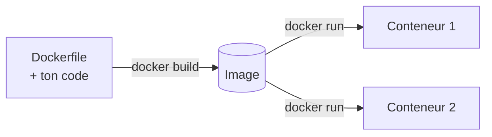

Jusqu'ici tu as utilisé des images toutes faites. Un **Dockerfile** est la recette pour fabriquer la *tienne* : chaque instruction ajoute une **couche** à l'image.



## Les instructions essentielles

| Instruction | Rôle |
| --- | --- |
| `FROM` | Image de départ (ex. `python:3.13-slim`). Toujours la première. |
| `WORKDIR` | Dossier de travail dans l'image (créé s'il n'existe pas). |
| `COPY` | Copie des fichiers de ton projet vers l'image. |
| `RUN` | Exécute une commande **à la construction** (ex. installer les dépendances). |
| `EXPOSE` | Documente le port d'écoute. Ne publie rien : c'est `-p` qui le fait. |
| `CMD` | Commande lancée **au démarrage** du conteneur. |

## Un exemple complet

L'application Flask du projet (`app.py` + `requirements.txt`) est déjà dans le dossier du labo, avec un dossier `wheels/` qui contient Flask et ses dépendances. Voici son Dockerfile :

```dockerfile file=Dockerfile
FROM python:3.13-slim
WORKDIR /app
COPY requirements.txt .
COPY wheels/ wheels/
RUN pip install --no-index --find-links=wheels -r requirements.txt
COPY . .
EXPOSE 5000
CMD ["python", "app.py"]
```

:::info Pourquoi --no-index et --find-links ?
D'habitude, un simple `RUN pip install -r requirements.txt` télécharge les paquets depuis Internet (PyPI). L'environnement du labo n'a pas accès à Internet : les paquets sont fournis dans le dossier `wheels/`, et `--no-index --find-links=wheels` dit à `pip` de les prendre là. C'est aussi la méthode des builds sur des réseaux isolés d'Internet.
:::

## Construire et lancer

```shell run
docker build -t demo-app .
docker run -d --name app -p 5000:5000 demo-app
curl localhost:5000
```

`-t demo-app` donne un nom à l'image et le `.` final indique le **contexte de build** : le dossier courant.

## Les couches et le cache

Chaque instruction produit une couche. Docker **réutilise** les couches inchangées : c'est ce qui rend les rebuilds si rapides.


:::tip L'ordre compte
Une couche invalidée invalide **toutes les suivantes**. En copiant `requirements.txt` *avant* le reste du code, l'installation des dépendances n'est refaite que si elles changent. Modifie `app.py` et reconstruis : tu verras `CACHED` devant les étapes situées avant la modification (`COPY requirements.txt`, `COPY wheels/` et `RUN pip install`), alors que `COPY . .` et la suite sont refaits.
:::

:::info CMD sous forme de liste
Écris `CMD ["python", "app.py"]` (forme *exec*) plutôt que `CMD python app.py` : le programme devient le processus principal du conteneur et reçoit directement les signaux de `docker stop`.
:::

:::warning RUN ≠ CMD
`RUN` s'exécute à la **construction** de l'image (il laisse une couche). `CMD` s'exécute au **démarrage** du conteneur. Confondre les deux est l'erreur n°1.
:::

## À retenir

- Un Dockerfile = une recette ; `docker build -t nom .` fabrique l'image.
- Mets ce qui change rarement en premier (dépendances), ce qui change souvent en dernier (code).
- `EXPOSE` documente, `-p` publie.

## Entraîne-toi

:::lab
engine: real
intro: |
  Le projet contient `app.py`, `requirements.txt` et le dossier `wheels/` (Flask et ses dépendances). Écris le Dockerfile de la leçon avec `nano Dockerfile` (ou dans VS Code), puis construis ton image.
files:
  app.py: |
    from flask import Flask

    app = Flask(__name__)


    @app.route("/")
    def hello():
        return "Bonjour depuis Mentor !"


    if __name__ == "__main__":
        app.run(host="0.0.0.0", port=5000)
  requirements.txt: |
    flask==3.0.3
commands:
  - mentor-docker sans-registre
  - cp -r /opt/mentor/wheels wheels
steps:
  - text: 'Crée un fichier `Dockerfile` qui commence par `FROM`'
    hint: "Ouvre l'éditeur avec `nano Dockerfile`, recopie le Dockerfile de la leçon, puis enregistre (Ctrl+O, Entrée) et quitte (Ctrl+X)."
    checks:
      - env-file-contains: [Dockerfile, '^FROM ']
    solution:
      - write:
          Dockerfile: |
            FROM python:3.13-slim
            WORKDIR /app
            COPY requirements.txt .
            COPY wheels/ wheels/
            RUN pip install --no-index --find-links=wheels -r requirements.txt
            COPY . .
            EXPOSE 5000
            CMD ["python", "app.py"]
  - text: "Construis l'image : `docker build -t demo-app .`"
    hint: "`docker build` avec `-t` pour le nom de l'image, et un point final : le contexte de build est le dossier courant."
    checks:
      - command-succeeds: 'docker image inspect demo-app'
    solution:
      - docker build -t demo-app .
  - text: 'Lance-la : détachée, nommée `app`, port `5000`'
    hint: "C'est un `docker run` comme celui de nginx, mais avec ton image : le port 5000 est celui d'écoute de Flask."
    checks:
      - output-contains: ['docker inspect -f "{{.State.Running}}" app', '^true$']
      - output-contains: ['docker port app 5000', ':5000$']
    solution:
      - 'docker run -d --name app -p 5000:5000 demo-app'
  - text: 'Interroge ton application avec `curl localhost:5000`, puis garde sa réponse : `curl localhost:5000 > reponse.txt`'
    hint: "Même principe que pour nginx : le port publié côté machine. Si `curl` échoue, laisse une seconde à Flask pour démarrer et recommence."
    after: [3]
    checks:
      - env-file-contains: [reponse.txt, 'Bonjour']
    solution:
      - 'curl localhost:5000'
      - 'curl localhost:5000 > reponse.txt'
  - text: 'Dans `app.py`, remplace « Bonjour » par « Salut », puis reconstruis l''image : observe les `CACHED`'
    hint: "Édite `app.py` avec `nano app.py` (ou VS Code), puis refais exactement le même `docker build` qu'avant. Le conteneur `app` déjà lancé garde l'ancienne image : c'est normal."
    after: [2]
    checks:
      - env-file-contains: [app.py, 'Salut']
      - output-contains: ['docker run --rm demo-app cat app.py', 'Salut']
    solution:
      - "sed -i 's/Bonjour/Salut/' app.py"
      - docker build -t demo-app .
:::

## Vérifie tes acquis

:::quiz
Quelle est la différence entre RUN et CMD ?

- [ ] Aucune
- [x] RUN s'exécute à la construction de l'image ; CMD au démarrage du conteneur
- [ ] CMD s'exécute à la construction ; RUN au démarrage
- [ ] RUN est réservé à pip

> RUN produit une couche de l'image (ex. dépendances installées). CMD définit ce qui est lancé quand on démarre un conteneur.
:::

:::quiz
Pourquoi copier requirements.txt avant le reste du code ?

- [ ] Parce que pip refuse de s'exécuter avant la copie du reste du code
- [x] Pour profiter du cache : les dépendances ne sont réinstallées que si requirements.txt change
- [ ] Pour réduire la taille de l'image
- [ ] Pour que l'image finale soit plus petite

> Une couche invalidée invalide toutes les suivantes. Mieux vaut mettre ce qui change rarement en premier.
:::

:::quiz
EXPOSE 5000 rend-il le port accessible depuis ta machine ?

- [ ] Oui, automatiquement
- [x] Non : il documente le port ; il faut publier avec -p
- [ ] Oui, mais seulement en local
- [ ] Oui, dès que le conteneur est lancé avec -d

> EXPOSE est une indication. C'est -p (ou ports: dans Compose) qui crée la redirection.
:::
