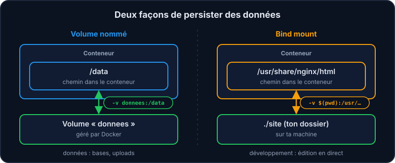
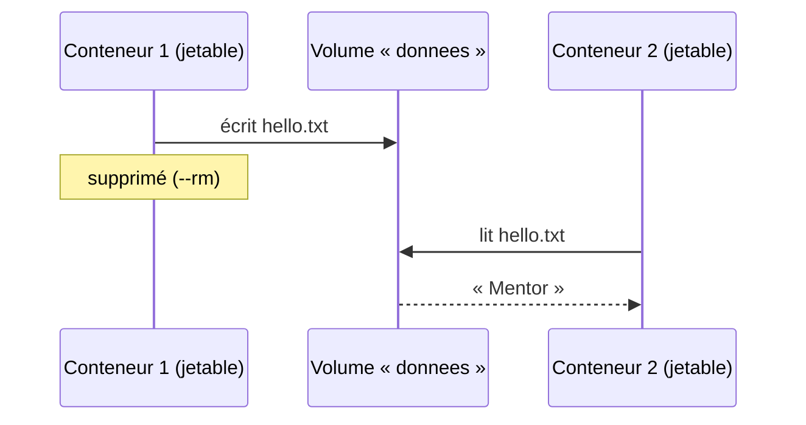

Le système de fichiers d'un conteneur est **éphémère** : supprime le conteneur, tu perds tout ce qu'il contenait. Pour une base de données, c'est un problème ! Docker propose deux mécanismes.

:::cards
### Volume nommé

Géré par Docker. `-v donnees:/data`. Idéal pour les **données** (bases, uploads) : indépendant du dossier de ton projet.

### Bind mount

Un dossier de *ta machine* monté dans le conteneur. `-v $(pwd):/app`. Idéal en **développement** : tu modifies, le conteneur voit tout de suite.
:::



## Un volume qui survit aux conteneurs

```shell run
docker volume create donnees
docker run --rm -v donnees:/data alpine sh -c "echo Mentor > /data/hello.txt"
docker run --rm -v donnees:/data alpine cat /data/hello.txt
```

Les deux conteneurs ont été supprimés (`--rm`), mais le fichier est toujours là : il vit dans le volume.



## Un bind mount pour développer

```shell run
docker run -d --name site -p 8081:80 -v $(pwd):/usr/share/nginx/html nginx
curl localhost:8081
```

nginx sert le contenu de *ton* dossier. Modifie `index.html` dans le labo puis refais un `curl` : pas besoin de reconstruire quoi que ce soit.

:::info Sous Windows
`$(pwd)` fonctionne dans Bash et Zsh. Dans PowerShell, utilise `${PWD}` ; dans l'ancien `cmd`, `%cd%`.
:::

:::tip Lecture seule
Ajoute `:ro` (*read-only*) pour que le conteneur ne puisse pas modifier tes fichiers : `-v $(pwd):/usr/share/nginx/html:ro`.
:::

:::info Dans les projets de l'équipe
Le `docker-compose.yml` de Vitrine monte à la fois du code en bind mount (pour le développement) et des volumes nommés (`staticfiles`, `mediafiles`) partagés entre l'application et nginx.
:::

## Lequel choisir ?

| Besoin | Mécanisme |
| --- | --- |
| Données d'une base (PostgreSQL) | Volume nommé |
| Fichiers envoyés par les utilisateur·rice·s | Volume nommé |
| Code source en cours de développement | Bind mount |
| Fichier de configuration en lecture seule | Bind mount `:ro` |

## À retenir

- Sans volume, tout ce qui est écrit dans un conteneur disparaît avec lui.
- Volume nommé pour les données, bind mount pour le développement.

## Entraîne-toi

:::lab
engine: real
intro: |
  Prouve que les données survivent à la suppression des conteneurs, puis sers ta propre page avec nginx.
files:
  index.html: |
    <h1>Mon site Mentor</h1>
steps:
  - text: 'Crée le volume `donnees`'
    hint: "Le sous-ensemble `volume` de la CLI a une action `create`."
    checks:
      - command-succeeds: 'docker volume inspect donnees'
    solution:
      - docker volume create donnees
  - text: 'Écris `hello.txt` dans le volume depuis un conteneur `alpine` jetable'
    hint: "`-v nom-du-volume:/data` monte le volume ; la commande `sh -c \"…\"` écrit un fichier dans `/data` avec `echo … > fichier`."
    checks:
      - command-succeeds: 'docker volume inspect donnees > /dev/null && docker run --rm -v donnees:/data:ro alpine test -s /data/hello.txt'
    solution:
      - 'docker run --rm -v donnees:/data alpine sh -c "echo Mentor > /data/hello.txt"'
  - text: 'Relis-le depuis un *autre* conteneur avec `cat`, en gardant ce qu''il affiche dans `lecture.txt` (termine la commande par `> lecture.txt`)'
    hint: "Même montage `-v`, mais cette fois la commande lit le fichier au lieu de l'écrire. Le `> lecture.txt` final est interprété par ton terminal, pas par le conteneur."
    after: [2]
    checks:
      - env-file-contains: [lecture.txt, '\S']
      - command-succeeds: 'docker volume inspect donnees > /dev/null && test "$(docker run --rm -v donnees:/data:ro alpine cat /data/hello.txt)" = "$(cat lecture.txt)"'
    solution:
      - 'docker run --rm -v donnees:/data alpine cat /data/hello.txt'
      - 'docker run --rm -v donnees:/data alpine cat /data/hello.txt > lecture.txt'
  - text: 'Sers ton dossier avec nginx (conteneur `site`, bind mount) sur le port `8081`'
    hint: "Le bind mount est un `-v` dont la source est un chemin de ta machine : `$(pwd)` désigne le dossier courant. La destination est le dossier que sert nginx : `/usr/share/nginx/html`."
    checks:
      - output-contains: ['docker inspect -f "{{.State.Running}}" site', '^true$']
      - output-contains: ['docker inspect -f "{{range .Mounts}}{{.Type}}:{{.Destination}} {{end}}" site', 'bind:/usr/share/nginx/html( |$)']
      - output-contains: ['docker port site 80', ':8081$']
    solution:
      - 'docker run -d --name site -p 8081:80 -v $(pwd):/usr/share/nginx/html nginx'
  - text: 'Modifie le titre dans `index.html` puis vérifie avec `curl localhost:8081` : le changement est instantané'
    hint: "Modifie `index.html` avec `nano index.html` (ou VS Code), puis refais le `curl` : aucun rebuild nécessaire."
    after: [4]
    checks:
      - command-succeeds: 'page=$(curl -fs localhost:8081) && test -n "$page" && ! printf "%s" "$page" | grep -q "Mon site Mentor"'
    solution:
      - "echo \"<h1>Bonjour l'équipe</h1>\" > index.html"
      - 'curl localhost:8081'
:::

## Vérifie tes acquis

:::quiz
Que devient le contenu d'un conteneur quand on le supprime (sans volume) ?

- [ ] Il est conservé dans l'image
- [x] Il est perdu
- [ ] Il est copié dans l'image pour le prochain conteneur
- [ ] Il passe dans le registry

> La couche d'écriture du conteneur est supprimée avec lui. D'où l'intérêt des volumes pour les données importantes.
:::

:::quiz
Quel mécanisme choisir pour les données d'une base PostgreSQL ?

- [x] Un volume nommé
- [ ] Rien : l'image postgres embarque déjà les données
- [ ] Un bind mount vers /tmp
- [ ] Une variable d'environnement

> Un volume nommé est géré par Docker, indépendant de l'arborescence de ton projet et facile à sauvegarder. Un bind mount dépend de la machine (chemins, droits) : moins adapté à des données de production.
:::

:::quiz
À quoi sert un bind mount en développement ?

- [ ] À rendre l'image plus légère
- [x] À partager un dossier de ta machine avec le conteneur : tes modifications sont visibles immédiatement
- [ ] À isoler le conteneur de ta machine
- [ ] À sauvegarder le conteneur

> Plus besoin de reconstruire l'image à chaque modification du code.
:::
