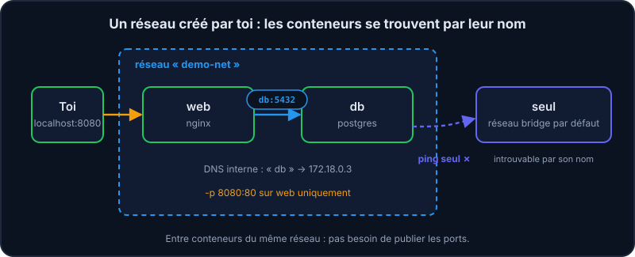
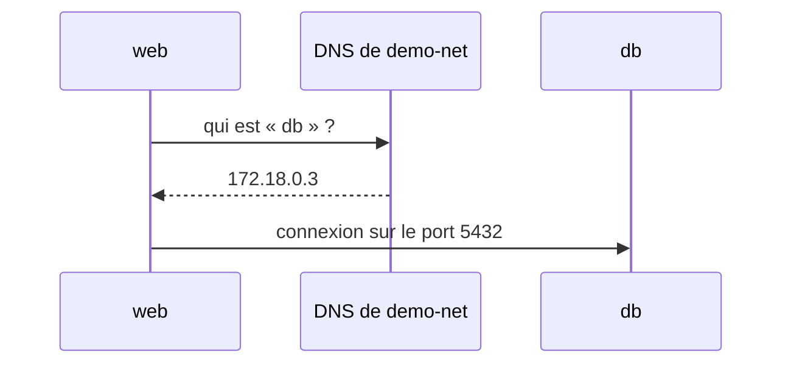

Une application web a presque toujours besoin d'une base de données. Chacune dans son conteneur… comment se trouvent-elles ? Grâce aux **réseaux Docker**.

## Le réseau par défaut ne suffit pas

Sur le réseau `bridge` par défaut, les conteneurs ne se retrouvent pas par leur nom. Sur un réseau **créé par toi**, Docker fournit un DNS interne : un conteneur est joignable par son *nom*.



```shell run
docker network create demo-net
docker run -d --name db --network demo-net -e POSTGRES_PASSWORD=pw postgres:16-alpine
docker run -d --name web --network demo-net -p 8080:80 nginx
docker exec web ping db
```



:::info Pas d'adresse IP à connaître
Dans ton application, l'hôte de la base devient simplement `db` : `postgres://user:pw@db:5432/app`. Si le conteneur est recréé avec une autre IP, rien à changer.
:::

## Ports publiés vs ports internes

- **Entre conteneurs d'un même réseau** : pas besoin de `-p`. `web` atteint `db:5432` directement.
- **Depuis ta machine** : il faut publier le port avec `-p`.
- **Bonne pratique** : ne publie *pas* le port de ta base de données si seule l'application l'utilise.

```shell run
docker network ls
docker network inspect demo-net
```

:::info ping dans les vraies images
Les images officielles minimalistes (nginx, postgres…) n'incluent pas toujours `ping`. Le simulateur l'a installé pour illustrer la résolution de noms ; en vrai, tu peux aussi tester avec `curl http://db:5432` ou `nslookup db` selon ce qui est disponible.
:::

:::warning Un conteneur isolé
Un conteneur lancé sans `--network` est sur le réseau `bridge` : `ping seul` depuis `web` échoue (*bad address*). C'est voulu : les applications sont **isolées** les unes des autres.
:::

## À retenir

- Crée un réseau par application (`docker network create`).
- Le **nom du conteneur** est son nom d'hôte sur ce réseau.
- Publier un port sert à ouvrir vers l'extérieur, pas à communiquer entre conteneurs.

## Entraîne-toi

:::lab
intro: |
  Crée un réseau, y connecte une base et un serveur web, puis vérifie qu'ils se voient — et que les autres non.
steps:
  - text: 'Crée le réseau `demo-net`'
    hint: "Le sous-ensemble `network` de la CLI a une action `create`, suivie du nom du réseau."
    checks:
      - network-exists: demo-net
    solution:
      - docker network create demo-net
  - text: 'Lance `db` (postgres:16-alpine, mot de passe) sur ce réseau'
    hint: "Combine ce que tu connais : `-d`, `--name`, `-e`… et la nouvelle option `--network` suivie du nom du réseau."
    checks:
      - container-running: db
      - container-network: [db, demo-net]
    solution:
      - 'docker run -d --name db --network demo-net -e POSTGRES_PASSWORD=pw postgres:16-alpine'
  - text: 'Lance `web` (nginx, port 8080) sur le même réseau'
    hint: "Comme `db`, sur le même réseau ; celui-ci publie en plus un port (`-p`)."
    checks:
      - container-running: web
      - container-network: [web, demo-net]
    solution:
      - 'docker run -d --name web --network demo-net -p 8080:80 nginx'
  - text: 'Depuis `web`, joins `db` par son nom : `docker exec web ping db`'
    hint: "Exécute `ping` *dans* `web`, avec pour cible le nom du conteneur `db`."
    after: [3]
    checks:
      - command: ^docker exec web ping db
    solution:
      - docker exec web ping db
  - text: 'Lance un conteneur `seul` sur le réseau par défaut et constate que `web` ne le trouve pas'
    hint: "Lance un conteneur sans `--network`, puis refais le `ping` depuis `web` vers ce nouveau nom."
    checks:
      - container-exists: seul
      - command: ^docker exec web ping seul
    solution:
      - docker run -d --name seul nginx
      - docker exec web ping seul
:::

## Vérifie tes acquis

:::quiz
Comment un conteneur joint-il un autre conteneur sur un réseau créé par l'utilisateur ?

- [ ] Par son adresse IP, obligatoirement
- [x] Par son nom, grâce au DNS interne de Docker
- [ ] Par un port publié avec -p
- [ ] Il ne peut pas

> Le nom du conteneur (ou, avec Compose, du service) fait office de nom d'hôte.
:::

:::quiz
Faut-il publier le port 5432 de la base pour que l'application la contacte ?

- [ ] Oui, toujours
- [x] Non, si les deux sont sur le même réseau Docker
- [ ] Oui, avec -p 5432:80
- [ ] Non, c'est impossible

> Publier un port sert à l'exposer à ta machine ; entre conteneurs d'un même réseau, c'est inutile (et moins sûr).
:::

:::quiz
Pourquoi créer son propre réseau plutôt que d'utiliser bridge ?

- [x] Pour avoir un DNS par nom de conteneur et isoler les applications entre elles
- [ ] Pour que les conteneurs démarrent plus vite
- [ ] Parce que bridge ne permet pas de lancer plus de deux conteneurs
- [ ] Pour que les conteneurs utilisent moins de mémoire

> Résolution des noms + isolation : seuls les conteneurs du réseau se voient.
:::
