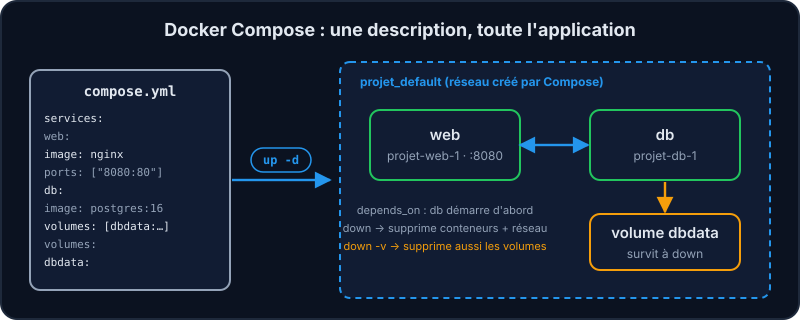
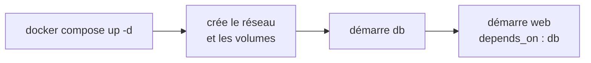

Taper cinq `docker run` avec dix options chacun ? Non merci. **Docker Compose** décrit toute l'application dans un fichier versionné avec ton code, et la démarre avec une seule commande. C'est exactement ce qu'utilisent les projets de l'équipe : `docker-compose.yml` en local, `compose-infra.yaml` en production.



## Le fichier compose.yml

```yaml file=compose.yml
services:
  web:
    image: nginx
    ports:
      - "8080:80"
    depends_on:
      - db
  db:
    image: postgres:16-alpine
    volumes:
      - dbdata:/var/lib/postgresql/data

volumes:
  dbdata:
```

- **`services`** : un bloc par conteneur. Le nom du service est aussi son nom sur le réseau (`db`).
- **`ports`** : les ports publiés (comme `-p`).
- **`depends_on`** : l'ordre de démarrage. Attention, il n'attend **pas** que `db` soit prête à répondre ; pour cela on ajoute un `healthcheck` et `condition: service_healthy`. Attention, il n'attend **pas** que `db` soit prête à répondre ; pour cela on ajoute un `healthcheck` et `condition: service_healthy`.
- **`volumes`** (en bas) : les volumes nommés utilisés par les services.
- Compose crée automatiquement un **réseau dédié** au projet : tout le monde se voit par son nom de service.



## Les commandes

```shell run
docker compose up -d
docker compose ps
docker compose logs db
docker compose down
```

:::warning down et les volumes
`docker compose down` supprime conteneurs et réseau, **mais pas les volumes** : tes données restent. `down -v` supprime aussi les volumes (à utiliser en connaissance de cause !).
:::

:::tip Les secrets hors du YAML
Pour une valeur sensible (mot de passe), évite de l'écrire en dur dans le fichier versionné : utilise un fichier `.env` (non commité) et `${POSTGRES_PASSWORD}`. Le `docker-compose.yml` de Vitrine lit ainsi son `.env` (`env_file`) et prévoit des valeurs par défaut du type `${DB_USER:-postgresql}`.
:::

:::info Le même principe en production
`compose-infra.yaml` de Vitrine décrit le déploiement réel : nginx derrière Traefik, l'application, ses volumes et ses réseaux. Les valeurs non sensibles viennent d'un fichier `infra.env` ; les secrets (clé secrète, mots de passe) sont fournis par l'infrastructure, jamais écrits dans le dépôt.
:::

## À retenir

- `compose.yml` = infrastructure décrite en code, partagée par toute l'équipe.
- `up -d` démarre (et recrée ce qui a changé), `ps`/`logs` observent, `down` démonte.

## Entraîne-toi

:::lab
intro: |
  Un `compose.yml` est fourni… mais il y manque quelque chose pour que la base démarre. À toi de le découvrir.
files:
  compose.yml: |
    services:
      web:
        image: nginx
        ports:
          - "8080:80"
        depends_on:
          - db
      db:
        image: postgres:16-alpine
        volumes:
          - dbdata:/var/lib/postgresql/data

    volumes:
      dbdata:
steps:
  - text: 'Démarre la pile : `docker compose up -d`'
    hint: "Lis la section « Les commandes » : le `-d` fonctionne comme pour `docker run`."
    checks:
      - compose-containers: 2
    solution:
      - docker compose up -d
  - text: "Regarde l'état avec `docker compose ps` : un service est « Exited » !"
    hint: "Le service qui n'est pas « Up » est celui dont tu dois lire les logs (`docker compose logs NOM-DU-SERVICE`)."
    after: [1]
    checks:
      - command: ^docker compose ps
    solution:
      - docker compose ps
      - docker compose logs db
  - text: 'Lis les logs de `db` pour comprendre, puis ajoute `POSTGRES_PASSWORD` dans `compose.yml` (section `environment` de `db`)'
    hint: 'Sous « db: », ajoute : environment: puis POSTGRES_PASSWORD: secret (indentation de 4 espaces pour environment, 6 pour la variable). Tu peux remplacer le fichier par celui de la leçon.'
    checks:
      - compose-variable: [db, POSTGRES_PASSWORD]
    solution:
      - write:
          compose.yml: |
            services:
              web:
                image: nginx
                ports:
                  - "8080:80"
                depends_on:
                  - db
              db:
                image: postgres:16-alpine
                environment:
                  POSTGRES_PASSWORD: secret
                volumes:
                  - dbdata:/var/lib/postgresql/data

            volumes:
              dbdata:
  - text: 'Relance `docker compose up -d` : Compose recrée uniquement ce qui a changé'
    hint: "Même commande qu'à l'étape 1 : Compose ne recrée que le service dont la configuration a changé."
    after: [3]
    checks:
      - compose-running: 2
    solution:
      - docker compose up -d
  - text: 'Vérifie que le web répond : `curl localhost:8080`'
    hint: "Le port publié par `web` dans le `compose.yml`."
    after: [4]
    checks:
      - command: '^curl .*8080'
    solution:
      - 'curl localhost:8080'
  - text: 'Démonte tout, volumes compris : `docker compose down -v`'
    hint: "`down` démonte tout ; le drapeau `-v` supprime aussi les volumes nommés."
    after: [4]
    checks:
      - compose-empty: true
      - volume-absent: projet_dbdata
    solution:
      - docker compose down -v
:::

## Vérifie tes acquis

:::quiz
Quel est l'intérêt principal de Docker Compose ?

- [ ] Il remplace le démon Docker par un orchestrateur
- [x] Il décrit une application multi-conteneurs dans un fichier versionné et la lance avec une seule commande
- [ ] Il rend les conteneurs plus rapides
- [ ] Il sert uniquement à construire des images

> Infrastructure as code : l'environnement complet est reproductible par toute l'équipe.
:::

:::quiz
Que fait docker compose down (sans -v) ?

- [x] Supprime conteneurs et réseau, mais conserve les volumes
- [ ] Supprime tout, volumes compris
- [ ] Arrête seulement les conteneurs, sans les supprimer (c'est le rôle de `stop`), sans les supprimer (c'est le rôle de `stop`)
- [ ] Supprime les images

> Les volumes sont conservés par défaut pour ne pas perdre tes données par mégarde.
:::

:::quiz
Comment le service web joint-il le service db avec Compose ?

- [ ] Par l'adresse IP, qu'il faut écrire dans le compose.yml
- [x] Par le nom du service (db) sur le réseau créé par Compose
- [ ] Il faut publier le port de db
- [ ] Il faut déclarer un lien `links:` entre les deux services

> Compose crée un réseau projet avec DNS interne : le nom du service est le nom d'hôte.
:::
