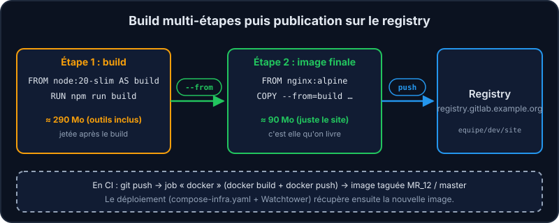
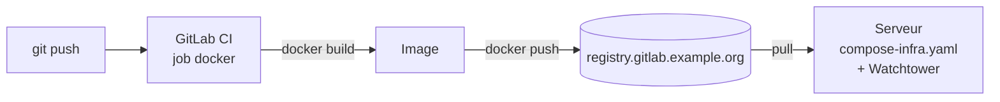

Une image qui marche sur ton poste n'est pas forcément prête pour la production : trop lourde, trop de secrets, aucune traçabilité. Voici les pratiques qui font la différence.

## 1. Les builds multi-étapes

Pour *construire* un site, il faut Node.js et ses dépendances (≈ 290 Mo, même dans sa variante allégée `slim`). Pour le *servir*, un simple nginx suffit (≈ 90 Mo). Avec un Dockerfile multi-étapes, la première étape construit, la seconde ne garde que le résultat.



```dockerfile file=Dockerfile
FROM node:20-slim AS build
WORKDIR /app
COPY package.json .
COPY index.html .
RUN npm run build

FROM nginx:alpine
COPY --from=build /app/index.html /usr/share/nginx/html/index.html
```

## 2. Publier sur un registry

Dans l'équipe, la CI GitLab construit l'image à chaque push et la publie dans le registry du projet ; sur le serveur, un outil comme *Watchtower* (repérable aux labels `com.centurylinklabs.watchtower.enable` des fichiers `compose-infra.yaml`) détecte la nouvelle image et met à jour le conteneur. À la main, ça donne :

```shell run
docker tag site:leger localhost:5000/equipe/site:master
docker login localhost:5000
docker push localhost:5000/equipe/site:master
```

Dans cet environnement, un registry local (`localhost:5000`, identifiant `apprenant`, mot de passe `mentor`) joue le rôle de celui de l'équipe : le labo le démarre pour toi (à la main : `mentor-docker registre`). Avec le GitLab de l'équipe, le nom de l'image serait `registry.gitlab.example.org/equipe/site:master`, et tu te connecterais avec `docker login registry.gitlab.example.org`.



Extrait (simplifié) de la CI de Vitrine : le vrai job ajoute `--cache-from` et un `-f` vers son Dockerfile.

```yaml
docker:
  stage: build
  image: docker:latest
  before_script:
    - docker login -u "$CI_REGISTRY_USER" -p "$CI_REGISTRY_PASSWORD" $CI_REGISTRY
  script:
    - docker build --tag $CI_REGISTRY_IMAGE:$DOCKER_TAG .
    - docker push $CI_REGISTRY_IMAGE:$DOCKER_TAG
  services:
    - docker:dind
```

## 3. Les réflexes de sécurité et de propreté

:::cards
### Utilisateur non-root

Crée un utilisateur dédié puis ajoute `USER app` (ex. `RUN useradd -r app`) : si l'application est compromise, l'attaquant n'est pas root dans le conteneur. L'image Dockerfile de Vitrine fait exactement ça (utilisateur `django`).

### .dockerignore

Exclus `.git`, `node_modules`, `.env`… du contexte de build : plus rapide, et aucun secret dans l'image.

### Versions épinglées

`python:3.13-slim` plutôt que `python:latest` : des builds reproductibles. Même `nginx:alpine` évolue avec le temps : épingle la version précise (`nginx:1.27-alpine`) pour un déploiement critique.

### Secrets hors de l'image

Jamais de mot de passe dans le Dockerfile : variables d'environnement ou secrets au runtime.
:::

:::danger Les couches sont lisibles
Les couches d'une image sont **lisibles par tous ceux qui l'ont**. Un `COPY .env` suivi d'un `RUN rm .env` laisse le secret dans la couche précédente ! Un secret publié par erreur doit être considéré comme compromis : révoque-le.
:::

## À retenir

- Multi-étapes : on livre le résultat, pas les outils de build.
- Tag + login + push, de préférence automatisés par la CI.
- Pas de root, pas de secret dans l'image, des versions précises.

## Entraîne-toi

:::lab
engine: real
intro: |
  Compare une image « naïve » et une image multi-étapes, puis publie la plus légère. Le registry GitLab de l'équipe (`registry.gitlab.example.org`) est remplacé ici par un registry local, `localhost:5000` : identifiant `apprenant`, mot de passe `mentor`.
files:
  package.json: |
    { "name": "site", "scripts": { "build": "echo build" } }
  index.html: |
    <h1>Site du club</h1>
  Dockerfile: |
    FROM node:20-slim AS build
    WORKDIR /app
    COPY package.json .
    COPY index.html .
    RUN npm run build

    FROM nginx:alpine
    COPY --from=build /app/index.html /usr/share/nginx/html/index.html
  Dockerfile.single: |
    FROM node:20-slim
    WORKDIR /app
    COPY . .
    RUN npm run build
    CMD ["npx", "serve", "."]
commands:
  - mentor-docker registre
steps:
  - text: "Construis l'image naïve : `docker build -t site:lourd -f Dockerfile.single .`"
    hint: "`-f` désigne le fichier de recette à utiliser (ici `Dockerfile.single`), `-t` donne le nom et l'étiquette `lourd`."
    checks:
      - command-succeeds: 'docker image inspect site:lourd'
    solution:
      - 'docker build -t site:lourd -f Dockerfile.single .'
  - text: "Construis l'image multi-étapes : `docker build -t site:leger .`"
    hint: "Cette fois le fichier par défaut (`Dockerfile`, multi-étapes) suffit : seul le tag change."
    checks:
      - command-succeeds: 'docker image inspect site:leger'
    solution:
      - 'docker build -t site:leger .'
  - text: 'Compare les tailles avec `docker images site`, puis garde le tableau : `docker images site > tailles.txt`'
    hint: "Compare la colonne DISK USAGE (la place occupée sur le disque) des deux étiquettes `site`."
    after: [1, 2]
    checks:
      - env-file-contains: [tailles.txt, '\bsite[:\s]+lourd\b']
      - env-file-contains: [tailles.txt, '\bsite[:\s]+leger\b']
    solution:
      - docker images site
      - docker images site > tailles.txt
  - text: "Étiquette l'image légère pour le registry : `docker tag site:leger localhost:5000/equipe/site:master`"
    hint: "`docker tag SOURCE DESTINATION` : la destination commence par le nom du registry."
    checks:
      - command-succeeds: 'docker image inspect localhost:5000/equipe/site:master'
    solution:
      - 'docker tag site:leger localhost:5000/equipe/site:master'
  - text: 'Connecte-toi : `docker login localhost:5000` (identifiant `apprenant`, mot de passe `mentor`)'
    hint: "Le nom du registry est celui qui commence l'étiquette de l'étape précédente. Le mot de passe ne s'affiche pas pendant que tu le tapes."
    checks:
      - command-succeeds: 'grep -q "localhost:5000" "$HOME/.docker/config.json"'
    solution:
      - 'echo mentor | docker login localhost:5000 -u apprenant --password-stdin'
  - text: "Publie l'image : `docker push`"
    hint: "Pousse l'étiquette complète créée à l'étape 4."
    checks:
      - output-contains: ['curl -fs -u apprenant:mentor http://localhost:5000/v2/equipe/site/tags/list', '"master"']
    solution:
      - 'docker push localhost:5000/equipe/site:master'
:::

## Vérifie tes acquis

:::quiz
Quel est l'intérêt d'un build multi-étapes ?

- [ ] Lancer plusieurs conteneurs en parallèle depuis un seul Dockerfile
- [x] Ne garder dans l'image finale que le nécessaire : image plus légère et plus sûre
- [ ] Chiffrer les couches de l'image
- [ ] Éviter d'écrire un Dockerfile

> Les outils de build (compilateurs, node_modules…) restent dans l'étape intermédiaire et ne sont pas livrés.
:::

:::quiz
Tu ajoutes COPY .env puis RUN rm .env dans un Dockerfile. Le secret est-il protégé ?

- [ ] Oui, il est supprimé
- [x] Non : il reste lisible dans la couche créée par COPY
- [ ] Oui, si on utilise --rm
- [ ] Oui, grâce à .dockerignore

> Chaque couche est conservée dans l'image. Ne copie jamais de secret : fournis-le au démarrage.
:::

:::quiz
Pourquoi préférer python:3.13-slim à python:latest ?

- [x] Pour avoir des builds reproductibles et une image plus petite
- [ ] Parce que latest n'existe pas
- [ ] Pour utiliser moins de CPU
- [ ] Parce que slim est plus récent

> latest change au fil du temps : ton build d'aujourd'hui pourrait casser demain.
:::

:::quiz
Où la CI de l'équipe publie-t-elle les images construites ?

- [ ] Sur le Docker Hub public
- [x] Dans le registry GitLab du projet (registry.example.org/equipe/…)
- [ ] Dans un dossier du serveur, copié à la main à chaque déploiement
- [ ] Dans le dépôt Git, à côté du code

> Chaque projet GitLab dispose de son registry d'images, utilisé par les jobs et par le déploiement.
:::
